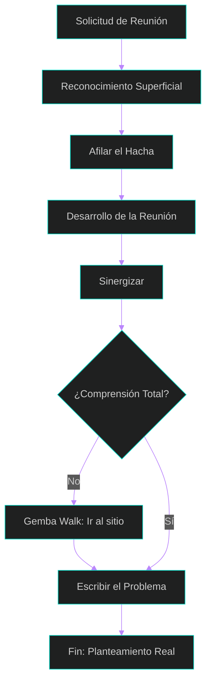

# 1: Comprendiendo el Problema del Cliente - El Método Detrás del Análisis

¡Bienvenidos a la primera lección! Antes de aprender a escribir historias de usuario o definir un MVP, debemos entender una verdad fundamental: el análisis de sistemas no se trata de computadoras, se trata de **personas y sus problemas**.

Para ser un analista que gestiona valor, no puedes ser un simple "tomador de pedidos". Necesitas un **método**: un modo ordenado y sistemático de proceder para llegar a un resultado determinado.

## La Metodología de la Comprensión
Entender al usuario no es un evento fortuito, es un flujo de trabajo que asegura que no entreguemos "soluciones a medias".

*Referencia Visual: Figura: Flujograma del Método de Comprensión, pág. 5, presentación: Entiendo al Usuario.*

### 1. Preparación: Afilar el Hacha
Basado en los principios de Stephen Covey, antes de sentarte con el cliente, debes **"Afilar el hacha"**. Esto significa:
*   **Investigación Previa:** No llegues en blanco. Investiga de manera general la temática y a tu cliente antes de la reunión.
*   **Mejora Continua:** Prepárate física, mental y emocionalmente para evitar caer en el "Síndrome del Impostor" o en actitudes narcisistas que bloqueen la comunicación.

### 2. La Reunión: Terreno Común y Metáforas
El objetivo de la primera reunión es generar **Confianza, Seguridad y Confort**.
*   **Terreno Común:** Se logra conociendo la temática del cliente. Si hablas su "idioma", la comunicación fluye.
*   **El Poder de las Metáforas:** Utiliza analogías adecuadas al contexto del cliente para explicar conceptos complejos de software. Una buena metáfora puede iluminar un problema oscuro.

### 3. Sinergia: El Todo es más que las Partes
La sinergia ocurre cuando la comunicación sube de nivel. No buscamos una comunicación "Defensiva" (donde alguien pierde) ni meramente "Respetuosa" (transaccional), sino una **Comunicación Sinérgica** donde el resultado es superior a lo que cada parte imaginó por separado.

*Referencia Visual: Figura: Niveles de la Comunicación, pág. 17, presentación: Entiendo al Usuario.*

### 4. ¿No entiendes el problema? Ve al "Gemba"
Si después de la reunión la comprensión no es total, aplica la filosofía Lean: **Genchi Genbutsu**.
*   **Ir al sitio:** Trabajar en la línea de producción o en la oficina del cliente te dará la "materia prima" real que ninguna reunión puede darte.
*   **Gemba Walk:** Observa el proceso en vivo, ahí es donde se esconden los síntomas y las verdaderas causas raíz.

### 5. Definición: Escribir el Problema
Siguiendo a Sampieri, el paso final no es programar, sino escribir. Un problema bien planteado debe incluir:
1.  **El problema real:** Descripción de síntomas y consecuencias.
2.  **Objetivos:** Qué debe cumplir la solución.
3.  **Preguntas de investigación:** Qué respuestas debe dar el sistema.

---

## 💡 Puntos Importantes de esta Lección
*   **No asumas:** Usa la técnica de los *5 Whys* (5 Porqués) para llegar al fondo de la necesidad.
*   **Sinergia:** La integridad de la temática nace de revisar todas las aristas y efectos secundarios con el equipo.
*   **Simplicidad:** Al final, el planteamiento del problema debe ser simple y claro.

## 📚 Bibliografía sugerida
*   **Covey, S.:** *Los 7 Hábitos de la Gente Altamente Efectiva.*
*   **McConnell, S.:** *Code Complete* (El poder de las metáforas).
*   **Liker, J.:** *The Toyota Way* (Gemba y Genchi Genbutsu).
*   **Hernández Sampieri, R.:** *Metodología de la Investigación.*

---

[⬅️ Volver al índice de la unidad](./index.md)