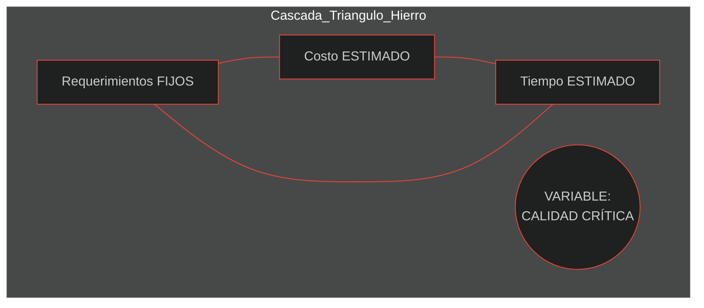
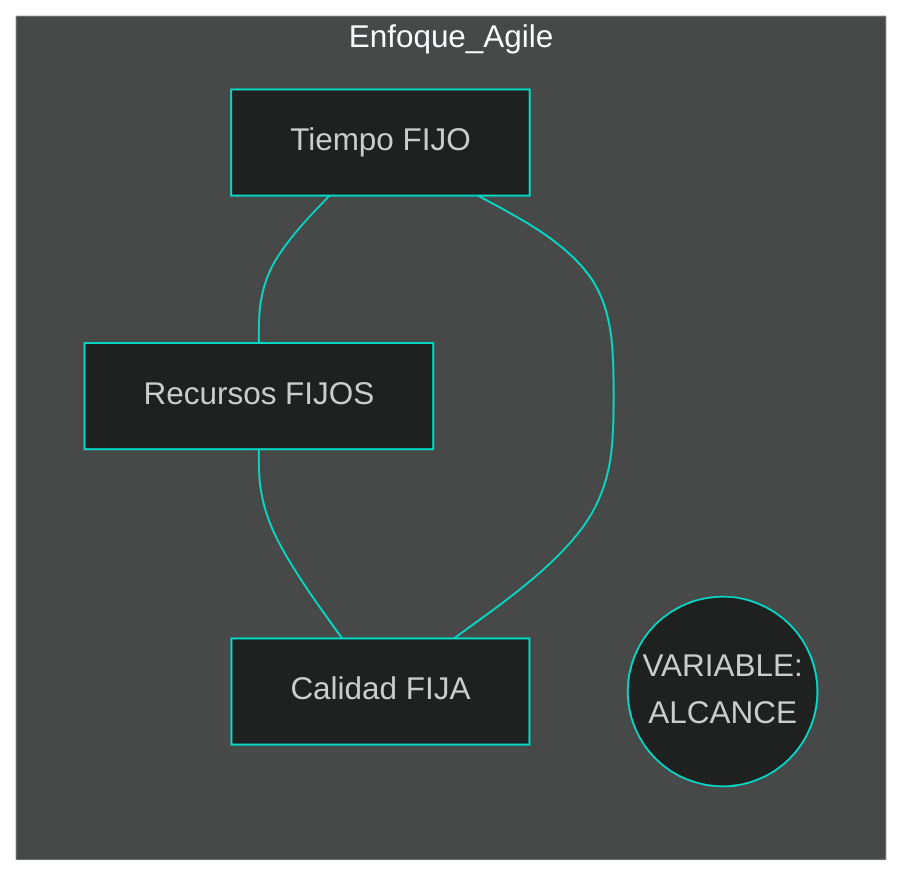
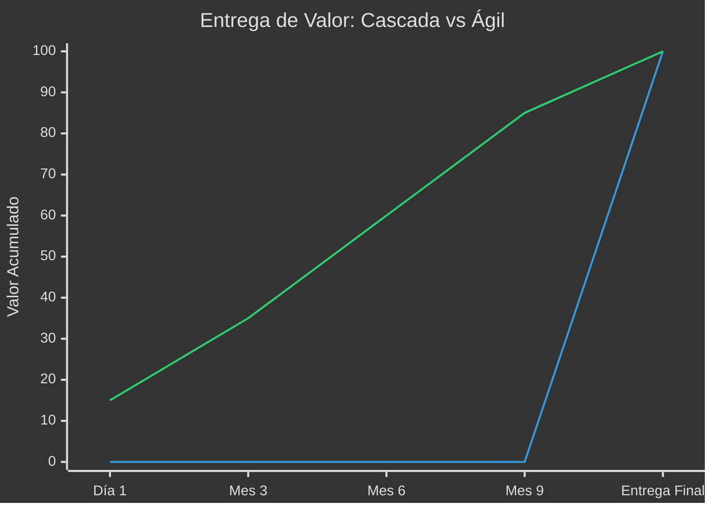

# 2: Cascada vs. Ágil: ¿Por qué el mundo cambió de opinión?

En las décadas pasadas, la industria del software intentó copiar los modelos de la ingeniería civil para construir sistemas. Esto nos llevó al **modelo de Cascada**, un proceso secuencial donde no puedes avanzar a la siguiente etapa sin haber terminado la anterior.

## 1. El Modelo de Cascada y la "Trampa del Triángulo de Hierro"
En el modelo tradicional, el desarrollo ocurre en etapas rígidas: 

**Requerimientos → Diseño → Implementación (Código) → Verificación (Pruebas) → Despliegue**.



El gran problema de este modelo es lo que llamamos el **Triángulo de Hierro**:
*   **Alcance Fijo:** Se asume que podemos conocer todos los requerimientos "por adelantado".
*   **Costo y Tiempo Fijos:** Una vez "conocidos" los requisitos, se estima cuánto costará y cuánto tardará.

**¿Cuál es el resultado?** Como el alcance, el tiempo y el costo están bloqueados, la única variable que los equipos pueden ajustar cuando hay problemas es la **Calidad**, lo cual suele terminar en desastre.



---

## 2. El Enfoque Ágil: El Ciclo Virtuoso
Ágil le da la vuelta al triángulo. En lugar de intentar predecir el futuro a un año, fijamos el **Tiempo** (Sprints de 2 semanas) y los **Recursos**, y dejamos que el **Alcance sea variable**.

Esto crea un **Ciclo Virtuoso**:
1. Fijamos la calidad.
2. Entregamos un pequeño incremento de valor en un tiempo fijo (*Timebox*).
3. Repetimos y ajustamos.



---

## 3. La Diferencia en el Retorno de Inversión (ROI)
¿Por qué las empresas prefieren Ágil? Por una razón económica simple: **"Concept to Cash"** (Del concepto al efectivo).

*   **En Cascada:** La inversión (costo) empieza en el día 1, pero el retorno de inversión es **cero** hasta que se entrega todo el proyecto al final.
*   **En Ágil:** El retorno de inversión comienza con el primer incremento funcional (**MVP**). El cliente empieza a recibir valor y a generar ganancias mucho antes.

*(Nota: La línea que sube al final representa Cascada; la línea ascendente gradual representa Ágil).*



---

## 💡 Puntos Importantes para el Analista
*   **El cambio es bienvenido:** En Cascada, el cambio de requerimientos se ve como un error; en Ágil, el cambio es el resultado del **aprendizaje**.
*   **Entregas Pequeñas:** Los lotes grandes causan retrasos; los lotes pequeños aumentan la velocidad y la calidad.
*   **Feedback Rápido:** En Ágil, el cliente ve el avance cada dos semanas, lo que permite corregir el rumbo rápidamente.

**Conclusión:** Nuestra misión no es escribir documentos perfectos, sino facilitar la entrega de Historias de Usuario que aporten valor real desde el primer Sprint.

---

## 📚 Bibliografía para esta lección
*   **Leffingwell, D.:** *Agile Software Requirements* (Capítulo 1: A Brief History).
*   **Patton, J.:** *User Story Mapping* (Capítulo 9: The Card is Just the Beginning).
*   **Scrum Guide:** (Roles y Sprints).

---

[⬅️ Volver al índice de la unidad](./index.md)