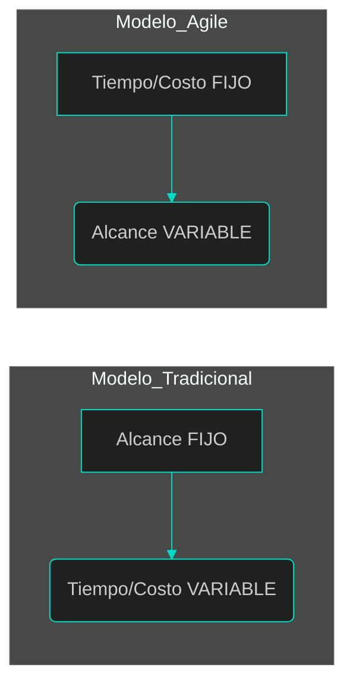
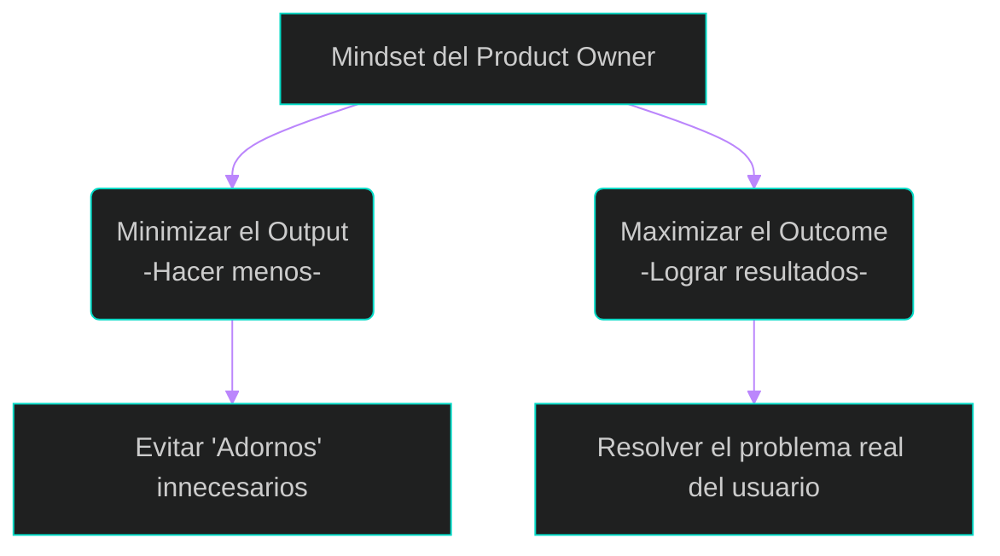
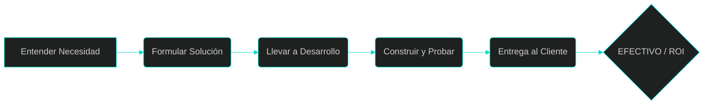
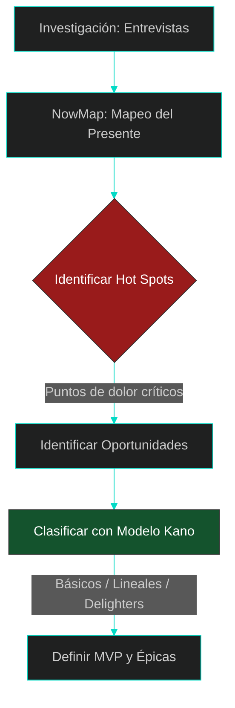

# 3. El Nuevo Rol: De Analista a Product Owner (PO)

En esta lección, exploraremos qué significa trabajar en un entorno ágil y cómo el analista tradicional evoluciona para convertirse en el **Product Owner (PO)**, el estratega encargado de maximizar el valor del producto.

## 1. ¿Qué es realmente un Entorno Ágil?
Antes de hablar de roles, debemos entender el tablero de juego. 
Agile no es "hacer las cosas más rápido", es **entregar valor en lotes pequeños**.

En el modelo tradicional (Cascada), el alcance es fijo y el tiempo es variable. En Agile, invertimos el triángulo: el **Tiempo** y los **Recursos** son fijos (iteraciones de 2 a 4 semanas), mientras que el **Alcance** es lo que fluye y se ajusta según el aprendizaje.



---

## 2. Los Actores del Ecosistema Ágil
En el marco de trabajo Scrum (el más utilizado en la industria), existen tres roles fundamentales que eliminan los "silos" de las empresas antiguas:

*   **Scrum Master:** El facilitador que elimina impedimentos y asegura que el equipo siga las reglas de agilidad.
*   **Equipo de Desarrollo (DevOps/Arquitectos de Software/Developers/Testers/Dbas):** Profesionales multidisciplinarios que construyen y prueban el software en cada iteración.
*   **Product Owner (El Analista de Valor):** Es el responsable de **qué** se construye y **por qué**.



---

## 3. El Rol del Product Owner: Gestionar Valor, no Documentos
El analista moderno ya no se mide por cuántas páginas de requerimientos escribe, sino por el **Retorno de Inversión (ROI)** que genera. 
Su labor es ser el puente entre los interesados (*stakeholders*) y el equipo técnico.

### Responsabilidades Clave del PO:
1.  **Definir la Visión:** Tener claro hacia dónde va el producto.
2.  **Priorizar el Backlog:** Decidir qué es lo más valioso para construir ahora y qué puede esperar.
3.  **Maximizar el "Outcome" sobre el "Output":** El *Output* es lo que programamos; el *Outcome* es el beneficio real que el usuario obtiene (ej: ahorrar tiempo).
4.  **Aceptar Historias de Usuario:** Es el único con autoridad para decir "esto está terminado" según los criterios de aceptación.

### La Metáfora del Doctor vs. El Mesero
Jeff Patton nos da una lección vital: Un mal PO actúa como un **mesero** (toma pedidos y los entrega sin cuestionar). Un excelente PO actúa como un **doctor** (escucha los síntomas, diagnostica la raíz y receta la solución mínima necesaria).

---

## 4. Tabla Comparativa: La Transición del Rol
Esta tabla resume el cambio de mentalidad (*mindset*) necesario para esta transición:

| Característica | Analista Tradicional | Product Owner (Ágil) |
| :--- | :--- | :--- |
| **Enfoque** | Documentación exhaustiva. | Gestión de valor y ROI. |
| **Requerimientos** | Congelados al inicio (BUFD). | Evolutivos y negociables. |
| **Relación con Cliente** | Basada en contratos y firmas. | Colaboración constante. |
| **Comunicación** | Documentos enviados por correo. | Conversaciones y entendimiento compartido. |



---

## 💡 Puntos Importantes para recordar
*   **ROI Temprano:** En Agile, el retorno de inversión comienza con la primera entrega funcional, no al final del proyecto.
*   **Entendimiento Compartido:** El PO no escribe historias para "mandar", sino para generar una conversación donde todos entiendan lo mismo.
*   **Decisión:** Un PO debe ser capaz de decir "NO" a funcionalidades que no aportan valor estratégico.

---

## 5. El Maletín de Herramientas del Analista (Discovery Toolkit)
Para ser un "Doctor" del negocio, el PO debe dominar técnicas de **Discovery**. 
El objetivo no es documentar por documentar, sino reducir la incertidumbre y entender cómo fluye el valor desde que nace una idea hasta que el cliente paga por ella (*Concept to Cash*).

### 1. Recopilación de Información: La Entrevista Libre de Contexto
Antes de diseñar pantallas, el PO debe entender el problema sin prejuicios. 
Una herramienta poderosa es la **Entrevista Libre de Contexto**, diseñada para escuchar al usuario antes de proponer una solución.

*   **¿Qué preguntar?:** "¿Quién es el usuario realmente?", "¿Qué problemas interfieren con su éxito?", "¿Dónde más se puede encontrar una solución?", etc etx.
*   **El momento de la verdad:** Se deben tomar notas a mano, permitiendo que el usuario se desahogue sobre sus "horrores" actuales; ahí reside la materia prima del requerimiento.



**OBS aqui se recopilan documentos y validan que los documentos esten actualizados con el usuario**

### 2. Visualizando el Flujo: Value Stream Mapping (Cadena de Valor)
Inspirado en la filosofía Lean, el PO debe ver el proceso como una cadena completa. El **Value Stream Map** nos ayuda a identificar dónde hay desperdicios o retrasos innecesarios.



### 3. Entendiendo el "Hoy": Journey Mapping y "Now Maps"
Jeff Patton sugiere que, para mejorar algo, primero debemos mapear cómo se hace hoy, con todas sus fallas. Estos se llaman **"Now Maps"** o mapas del presente.

*   **Hot Spots (Puntos de Dolor):** Al mapear el proceso actual, el PO coloca marcas (stickies de colores) donde el usuario sufre más.
*   **Genchi Genbutsu:** No basta con que te lo cuenten; el PO debe ir al sitio real (**Gemba**) para observar estos puntos de dolor en vivo.



En esta imagen se observa un flujo horizontal del producto actual. Debajo de ciertos pasos del proceso, se acumulan notas adhesivas que representan "Pains" (dolores). 
El área con mayor acumulación de notas se encierra en un círculo naranja y se etiqueta como un Hot Spot, indicando que es ahí donde el analista debe enfocar su solución [17, pág. 115].

### 4. Clasificación de la Oportunidad: Opportunity Canvas
Una vez recopilada la información, el PO necesita una forma de clasificarla para decidir si vale la pena invertir recursos. El **Opportunity Canvas** organiza la información de forma espacial.

| Sección del Canvas | Propósito |
| :--- | :--- |
| **Problemas** | Qué problemas tienen los usuarios hoy. |
| **Soluciones Actuales** | Cómo resuelven su necesidad hoy (manual o con competencia). |
| **Valor para el Usuario** | Qué podrán hacer de forma diferente con nuestra solución. |
| **Métricas de Negocio** | Cómo mediremos el éxito del producto. |





El Opportunity Canvas es un tablero dividido en 9 secciones numeradas que organiza la información de forma espacial para que el equipo pueda ver relaciones y dependencias.

**El flujo de lectura:**

**De izquierda a derecha:** vas del "Ahora" (problemas actuales) al "Después" (resultados esperados).
**De arriba hacia abajo:** Te mueves desde las necesidades del usuario hacia las necesidades del negocio.

### Las 9 piezas del rompecabezas (Secciones del Canvas):

**1. Problemas o Soluciones:** Identifica qué ideas tienes o qué problemas detectaste.
**2. Usuarios y Clientes:** Define específicamente para quién estamos construyendo (no es para "todos").
**3. Soluciones Hoy:** ¿Cómo sobrevive el usuario actualmente? (competencia o procesos manuales).
**4. Valor para el Usuario:** ¿Qué podrá hacer el usuario de forma diferente una vez que tenga el sistema?.
**5. Métricas de Usuario:** ¿Qué comportamientos podemos medir para saber si lo están usando?.
**6. Estrategia de Adopción:** ¿Cómo van a descubrir los usuarios esta nueva funcionalidad?.
**7. Problema de Negocio:** ¿Qué problema le resuelve a nuestra empresa construir esto?.
**8. Métricas de Negocio:** ¿Cómo se verá reflejado el éxito en los ingresos o la eficiencia de la Empresa?.
**9. Presupuesto:** ¿Cuánto dinero o tiempo estamos dispuestos a invertir en descubrir y construir esto?.

### 5. Clasificación Técnica: El Modelo Kano
No todas las peticiones del cliente tienen el mismo peso. El PO puede clasificar los requerimientos según el **Modelo Kano** para priorizar:

1.  **Básicos (Must-have):** Si no están, el producto no sirve (ej: login seguro).
2.  **Lineales:** Entre más invertimos, más satisfacción hay (ej: rapidez de carga).
3.  **Exciters (Delighters):** Funcionalidades que el usuario no esperaba pero que lo enamoran.



El diagrama muestra dos ejes: el horizontal mide qué tan presente está la funcionalidad (desde "Ausente" hasta "Mejorada") y el vertical mide la satisfacción del cliente. 
Se ven tres curvas clave:
**Basic Features (Must-be):** La satisfacción nunca sube mucho, pero si faltan, la insatisfacción es total.
**Linear Performance:** A más inversión, más satisfacción.
**Exciters and Delighters:** Con poca inversión inicial se logra una satisfacción muy alta porque son sorpresas positivas para el usuario [1, pág. 270].

---

## 💡 Puntos Importantes a Recordar
*   **No asumas, valida:** Cada idea en el maletín es una hipótesis hasta que se prueba con el usuario.
*   **Minimiza el desperdicio:** Si una herramienta te dice que una idea no dará ROI, ten el valor de descartarla (*"Trash it"*).
*   **Usa palabras y dibujos:** Las herramientas visuales (mapas, canvas) construyen **Entendimiento Compartido** mejor que cualquier documento de texto.

---

## 📚 Bibliografía de la Lección
*   **Leffingwell, D. (2011):** *Agile Software Requirements*. Capítulo 1 (Sección: Adaptive Processes) y Capítulo 11 (Sección: Responsibilities of the Product Owner).
*   **Patton, J. (2014):** *User Story Mapping*. Capítulo: "Read This First" y Capítulo: "Rock Breakers".
*   **Sorto, C. (2026):** *Presentación: Entiendo al Usuario*.

---

[⬅️ Volver al índice de la unidad](./index.md)