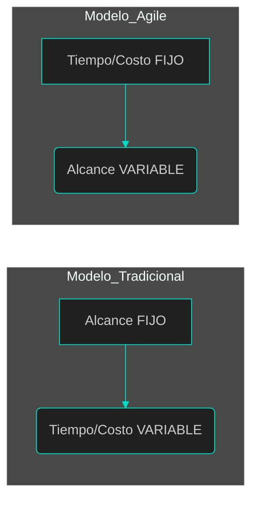
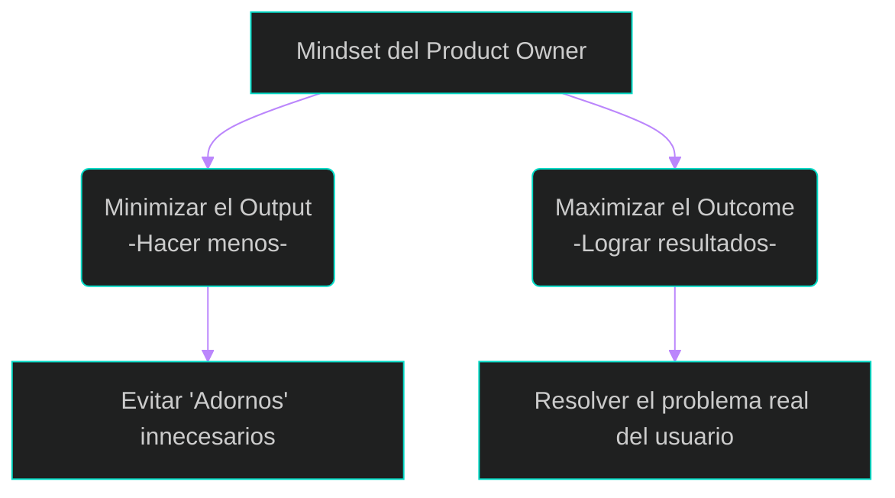

# 3. El Nuevo Rol: De Analista a Product Owner (PO)

En esta lección, exploraremos qué significa trabajar en un entorno ágil y cómo el analista tradicional evoluciona para convertirse en el **Product Owner (PO)**, el estratega encargado de maximizar el valor del producto.

## 1. ¿Qué es realmente un Entorno Ágil?
Antes de hablar de roles, debemos entender el tablero de juego. 
Agile no es "hacer las cosas más rápido", es **entregar valor en lotes pequeños**.

En el modelo tradicional (Cascada), el alcance es fijo y el tiempo es variable. En Agile, invertimos el triángulo: el **Tiempo** y los **Recursos** son fijos (iteraciones de 2 a 4 semanas), mientras que el **Alcance** es lo que fluye y se ajusta según el aprendizaje.



---

## 2. Los Actores del Ecosistema Ágil
En el marco de trabajo Scrum (el más utilizado en la industria), existen tres roles fundamentales que eliminan los "silos" de las empresas antiguas:

*   **Scrum Master:** El facilitador que elimina impedimentos y asegura que el equipo siga las reglas de agilidad.
*   **Equipo de Desarrollo (DevOps/Arquitectos de Software/Developers/Testers/Dbas):** Profesionales multidisciplinarios que construyen y prueban el software en cada iteración.
*   **Product Owner (El Analista de Valor):** Es el responsable de **qué** se construye y **por qué**.



---

## 3. El Rol del Product Owner: Gestionar Valor, no Documentos
El analista moderno ya no se mide por cuántas páginas de requerimientos escribe, sino por el **Retorno de Inversión (ROI)** que genera. 
Su labor es ser el puente entre los interesados (*stakeholders*) y el equipo técnico.

### Responsabilidades Clave del PO:
1.  **Definir la Visión:** Tener claro hacia dónde va el producto.
2.  **Priorizar el Backlog:** Decidir qué es lo más valioso para construir ahora y qué puede esperar.
3.  **Maximizar el "Outcome" sobre el "Output":** El *Output* es lo que programamos; el *Outcome* es el beneficio real que el usuario obtiene (ej: ahorrar tiempo).
4.  **Aceptar Historias de Usuario:** Es el único con autoridad para decir "esto está terminado" según los criterios de aceptación.

### La Metáfora del Doctor vs. El Mesero
Jeff Patton nos da una lección vital: Un mal PO actúa como un **mesero** (toma pedidos y los entrega sin cuestionar). Un excelente PO actúa como un **doctor** (escucha los síntomas, diagnostica la raíz y receta la solución mínima necesaria).

---

## 4. Tabla Comparativa: La Transición del Rol
Esta tabla resume el cambio de mentalidad (*mindset*) necesario para esta transición:

| Característica | Analista Tradicional | Product Owner (Ágil) |
| :--- | :--- | :--- |
| **Enfoque** | Documentación exhaustiva. | Gestión de valor y ROI. |
| **Requerimientos** | Congelados al inicio (BUFD). | Evolutivos y negociables. |
| **Relación con Cliente** | Basada en contratos y firmas. | Colaboración constante. |
| **Comunicación** | Documentos enviados por correo. | Conversaciones y entendimiento compartido. |



---

## 💡 Puntos Importantes para recordar
*   **ROI Temprano:** En Agile, el retorno de inversión comienza con la primera entrega funcional, no al final del proyecto.
*   **Entendimiento Compartido:** El PO no escribe historias para "mandar", sino para generar una conversación donde todos entiendan lo mismo.
*   **Decisión:** Un PO debe ser capaz de decir "NO" a funcionalidades que no aportan valor estratégico.

---

## 📚 Bibliografía de la Lección
*   **Leffingwell, D. (2011):** *Agile Software Requirements*. Capítulo 1 (Sección: Adaptive Processes) y Capítulo 11 (Sección: Responsibilities of the Product Owner).
*   **Patton, J. (2014):** *User Story Mapping*. Capítulo: "Read This First" y Capítulo: "Rock Breakers".
*   **Sorto, C. (2026):** *Presentación: Entiendo al Usuario*.

---

[⬅️ Volver al índice de la unidad](./index.md)