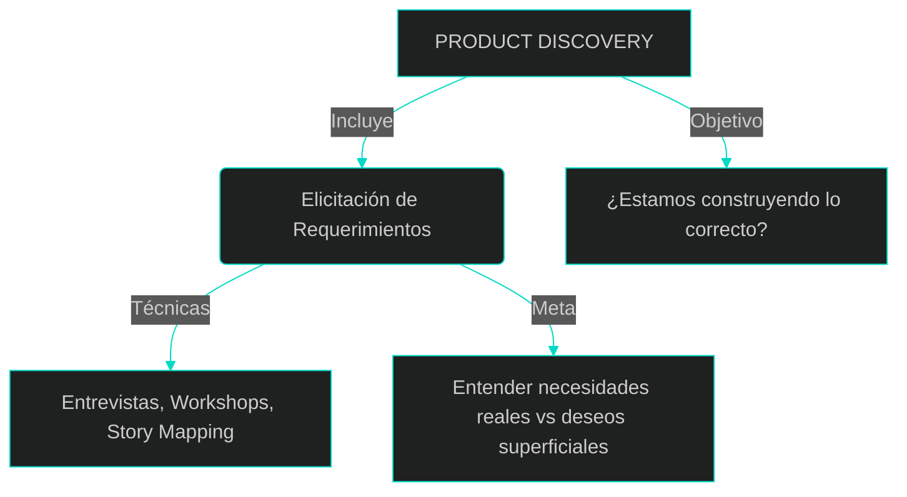
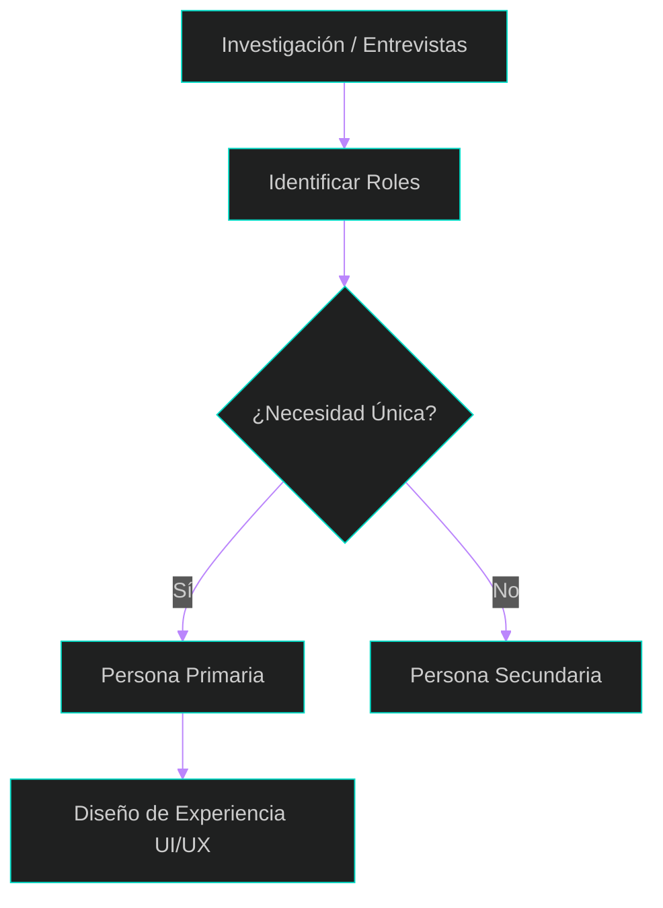
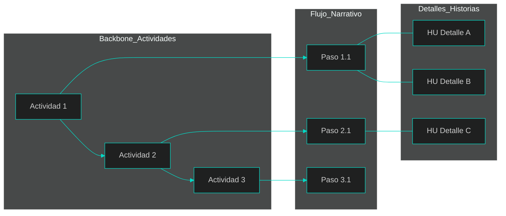

# 4. Discovery y Elicitación Ágil: ¿Qué construir?

Muchos proyectos de software fracasan no por una mala programación, sino porque el equipo construyó exactamente lo que el cliente pidió, pero resulta que eso no era lo que el usuario necesitaba. En el mundo ágil, el **Product Discovery** es el proceso de aprender qué es valioso, usable y factible antes de escribir una sola línea de código.

## ¿Qué es Discovery y Elicitación?
Antes de profundizar en las técnicas, debemos hablar el mismo idioma. En el mundo de la agilidad, no solo "tomamos requerimientos", sino que exploramos un territorio desconocido para asegurar el éxito del producto.

### 1. Product Discovery (Descubrimiento de Producto)
El Discovery es el proceso de aprender qué es valioso, usable y factible antes de escribir una sola línea de código.
*   **El Enfoque:** Se centra en identificar oportunidades (de mercado o tecnológicas) y entender los problemas reales del cliente.
*   **La Meta:** Minimizar el riesgo de construir algo que nadie quiera o use. Es un proceso deliberado de investigación para transformar una "idea vaga" en un backlog accionable.

### 2. Elicitación (Elicitation)
Se define como el conjunto de técnicas que el analista utiliza para trabajar con los *stakeholders* (interesados) e identificar y entender sus necesidades y preocupaciones reales.
*   **El Propósito:** Asegurar que se comprendan las necesidades reales subyacentes, en lugar de aceptar deseos superficiales.
*   **La Diferencia:** Mientras el Discovery es la fase estratégica de aprendizaje general, la elicitación es la actividad táctica de "extraer" esa información mediante entrevistas, talleres y observación.

---

## Relación entre ambos: El "Qué" vs. el "Cómo lo extraemos"
Podemos ver el Discovery como el contenedor o la fase estratégica, y la Elicitación como la herramienta técnica dentro de esa fase.



> **Punto clave:** El Discovery es trabajo de "romper rocas" (moverse de lo vago a lo específico), y la Elicitación es la forma en que picamos esas rocas hablando con las personas correctas.

---

## 3. El mito de los Requerimientos vs. El Entendimiento Compartido
Jeff Patton nos enseña una lección vital: **"Los documentos compartidos no son entendimiento compartido"**. El objetivo de la elicitación ágil no es generar un documento de 100 páginas, sino crear una imagen mental idéntica en todo el equipo.

*   **El problema:** Dos personas pueden leer la misma frase y estar de acuerdo, pero estar imaginando soluciones totalmente distintas.
*   **La solución:** Usar palabras, dibujos y modelos físicos para externalizar las ideas y corregir la visión del equipo en tiempo real.



---

## 4. User Personas: Poniéndole rostro a la necesidad
Para no construir para "nadie", utilizamos **User Personas**. Una Persona es un perfil de usuario ficticio, basado en datos reales, que nos ayuda a empatizar.

*   **Personas Primarias:** Usuarios cuyas necesidades requieren una interfaz diseñada exclusivamente para ellos.
*   **Personas Secundarias:** Usuarios que pueden usar la interfaz diseñada para la persona primaria, aunque tengan metas distintas.



---

## 5. User Story Mapping: Visualizando el Viaje del Usuario
El **User Story Map** es la herramienta reina de la elicitación. En lugar de una lista plana, creamos un mapa bidimensional que cuenta una historia.

### Estructura del Mapa:
1.  **El Backbone (La Columna Vertebral):** Actividades de alto nivel que el usuario realiza (ej. "Comprar un producto").
2.  **El Flujo Narrativo:** Los pasos específicos que siguen a cada actividad (ej. "Buscar ítem", "Pagar").
3.  **El Cuerpo (Los Detalles):** Debajo de cada paso, colocamos las Historias de Usuario detalladas y variaciones.



---

## 6. ¿Cómo saber qué priorizar?
Jeff Patton revela el secreto: **No priorices funcionalidades, prioriza resultados (*Outcomes*)**. Primero decidimos a qué usuario queremos ayudar y qué problema resolver hoy.

## 💡 Puntos Importantes para recordar
*   **Talk and Doc:** Escribe en notas adhesivas mientras hablas para que las ideas no se "evaporen".
*   **Externaliza:** Mueve las tarjetas en la pared para que el equipo "vea y toque" el flujo de valor.
*   **Enfoque en el Usuario:** Siempre pregunta "¿Cómo cambia el mundo del usuario con esta funcionalidad?".

---

## 📚 Bibliografía de la Lección
*   **Patton, J. (2014):** *User Story Mapping*. Capítulos 1, 6 y 14.
*   **Leffingwell, D. (2011):** *Agile Software Requirements*. Capítulo 7.

---

[⬅️ Volver al índice de la unidad](./index.md)