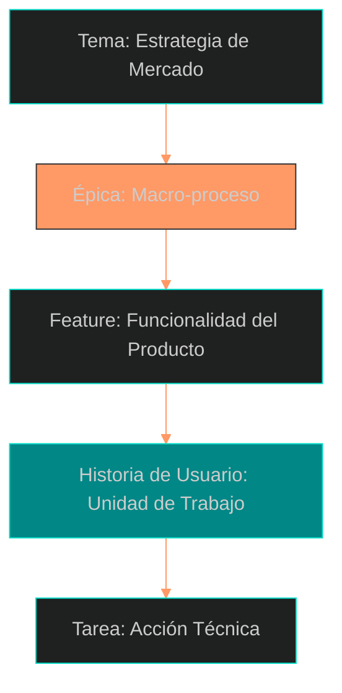
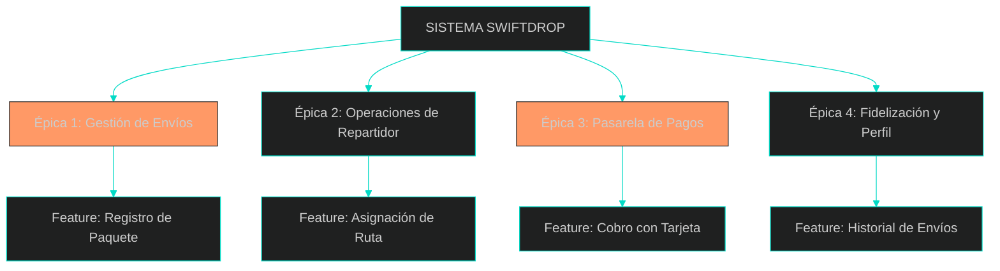
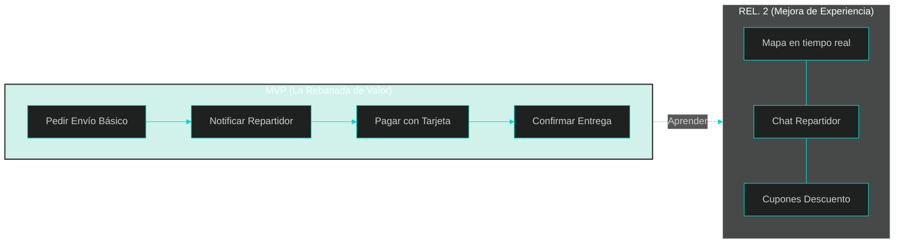
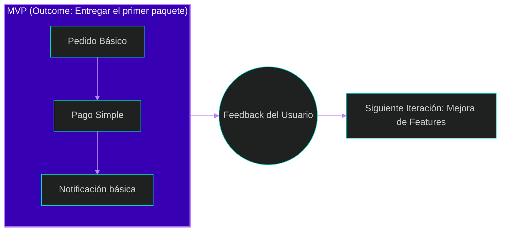

# 5. Épicas y el MVP: El Arte de "Romper Rocas"

En el desarrollo ágil, las ideas suelen llegar como grandes bloques de granito. Si intentamos cargar con toda la roca a la vez, el equipo se detendrá. Nuestra labor como analistas es hacer **"Rock Breaking"** (romper rocas): movernos desde una idea vaga y gigante hacia algo pequeño y específico que podamos construir.

## 1. ¿Qué es una Épica? (Nuestras grandes rocas)
Una **Épica** es simplemente una Historia de Usuario que es demasiado grande para caber en un solo Sprint. Representa una necesidad del cliente a muy alto nivel y requiere ser descompuesta en piezas más pequeñas llamadas **Funcionalidades (Features)** y luego en **Historias de Usuario** atómicas.

En nuestro sistema **SwiftDrop**, una Épica podría ser: *"Gestión de Entregas en Tiempo Real"*. Es imposible programar todo eso en dos semanas.

### Jerarquía de los Requerimientos Ágiles:



---

## 2. El MVP: Producto Mínimo Viable
El término MVP es a menudo malentendido. No es "el producto más feo que podamos lanzar". Jeff Patton lo define como la **versión más pequeña de un producto que logra un resultado deseado** para un usuario específico.

*   **No es un coche sin ruedas:** No entregamos primero una llanta, luego el motor y al final el chasis (el usuario no puede viajar con una llanta).
*   **Es un monopatín:** Si el objetivo es moverse, entregamos un monopatín. No es un coche, pero cumple el **Outcome** (resultado) de trasladar al usuario mientras aprendemos cómo construir el coche.





---

## 3. Épicas y el MVP: Estrategia de Slicing en SwiftDrop
En el análisis ágil, siguiendo la filosofía de Jeff Patton, si el objetivo es la movilidad, entregamos un monopatín primero: algo que ruede y nos permita aprender mientras llegamos al diseño final del coche.

### 3.1. Descomponiendo el Sistema en Épicas
Para **SwiftDrop**, hemos identificado cuatro grandes áreas o Épicas:

### 3.2. Identificando el MVP: ¿Qué entra en el "Slice"?
El secreto es **Minimizar el Output y Maximizar el Outcome**. Todo lo que no contribuya directamente al objetivo del "Cliente Urgente" es *Gold-plating* (adorno) y queda fuera del MVP.

| Épica | Feature (Funcionalidad) | ¿Entra en MVP? | Justificación de Valor (Outcome) |
| :--- | :--- | :---: | :--- |
| **G. de Envíos** | Formulario básico de entrega | **SÍ** | Es el *Walking Skeleton*; sin esto no hay negocio. |
| **G. de Envíos** | Programación de envíos futuros | **NO** | Es útil, pero el cliente "Urgente" lo necesita ahora. |
| **Operaciones** | Notificación simple al repartidor | **SÍ** | Permite cerrar el ciclo de recolección de inmediato. |
| **Operaciones** | Asignación por IA de ruta óptima | **NO** | En el MVP, la asignación puede ser manual o simple. |
| **Pagos** | Integración con Stripe (Tarjeta) | **SÍ** | Genera ROI (Retorno de Inversión) desde el día 1. |
| **Pagos** | Propinas digitales y cupones | **NO** | Es un "excitante" (Modelo Kano), pero no esencial hoy. |
| **Engagement** | Subir foto de perfil y bio | **NO** | No ayuda a que el paquete llegue más rápido. |
| **Engagement** | Calificación básica del servicio | **SÍ** | Es vital para medir la calidad y aprender del usuario. |

### 3.3. Visualizando la Estrategia con el Story Map
Imagina que estiramos una cinta azul sobre nuestra pared de notas adhesivas. Todo lo que queda arriba de la cinta es nuestro MVP (la solución mínima viable).



### 3.4. Diálogo de Priorización (La Conversación del Analista)
*   **Gerente de Marketing:** *"Necesitamos que el cliente pueda subir su foto de perfil antes de lanzar"*.
*   **Analista (PO):** *"Nuestra meta hoy es el Cliente Urgente. Si un abogado necesita enviar una escritura en 30 minutos, no le importa su foto; le importa que el repartidor acepte el viaje y pueda pagar rápido. La foto es un 'Linear Feature'; el pago es un 'Must-have'. Vamos a afilar el hacha en lo esencial para salir en 2 semanas"*.

---

## 4. La Estrategia "Mona Lisa" para el desarrollo
Para planificar el MVP de **SwiftDrop**, usaremos la **Estrategia Mona Lisa**: en lugar de pintar perfectamente un ojo y dejar el resto en blanco, hacemos un boceto de toda la cara.

1.  **Opening Game (Boceto):** Creamos el flujo de punta a punta básico (*Functional Walking Skeleton*).
2.  **Midgame (Colores):** Agregamos validaciones, fotos de paquetes y seguimiento en el mapa.
3.  **Endgame (Detalles):** Pulimos la interfaz, agregamos propinas digitales y reportes.

---

## 💡 Puntos Importantes para recordar
*   **La Analogía de los Asteroides:** No intentes romper todas las épicas hoy. Solo "dispara" a las rocas que van a entrar en el MVP para no llenar tu backlog de "basura espacial".
*   **Minimiza el Output, Maximiza el Outcome:** El éxito no es entregar 50 funcionalidades, sino que el usuario logre su meta con el mínimo software posible.
*   **Las Épicas se rompen con conversación:** No definas cada detalle al inicio; espera a que la "roca" esté cerca de ser trabajada.
*   **El MVP es una hipótesis:** Hasta que el usuario no usa el sistema para un envío real, no sabemos si nuestra solución es realmente viable.

---

## 📚 Bibliografía de la Lección
*   **Patton, J. (2014):** *User Story Mapping*. Capítulos 2, 3 y 11.
*   **Leffingwell, D. (2011):** *Agile Software Requirements*. Capítulos 5 y 13.

---

[⬅️ Volver al índice de la unidad](./index.md)