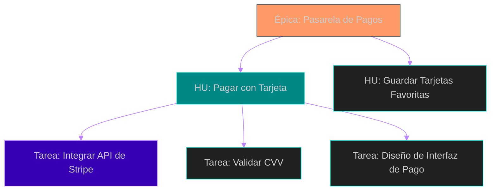
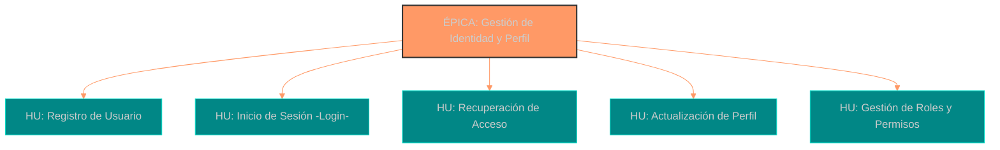
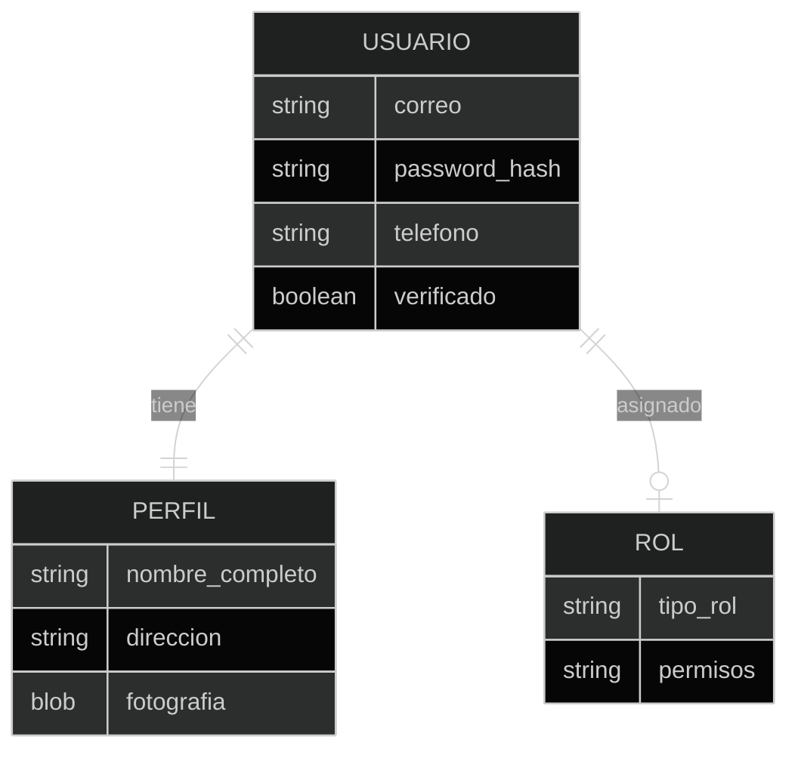
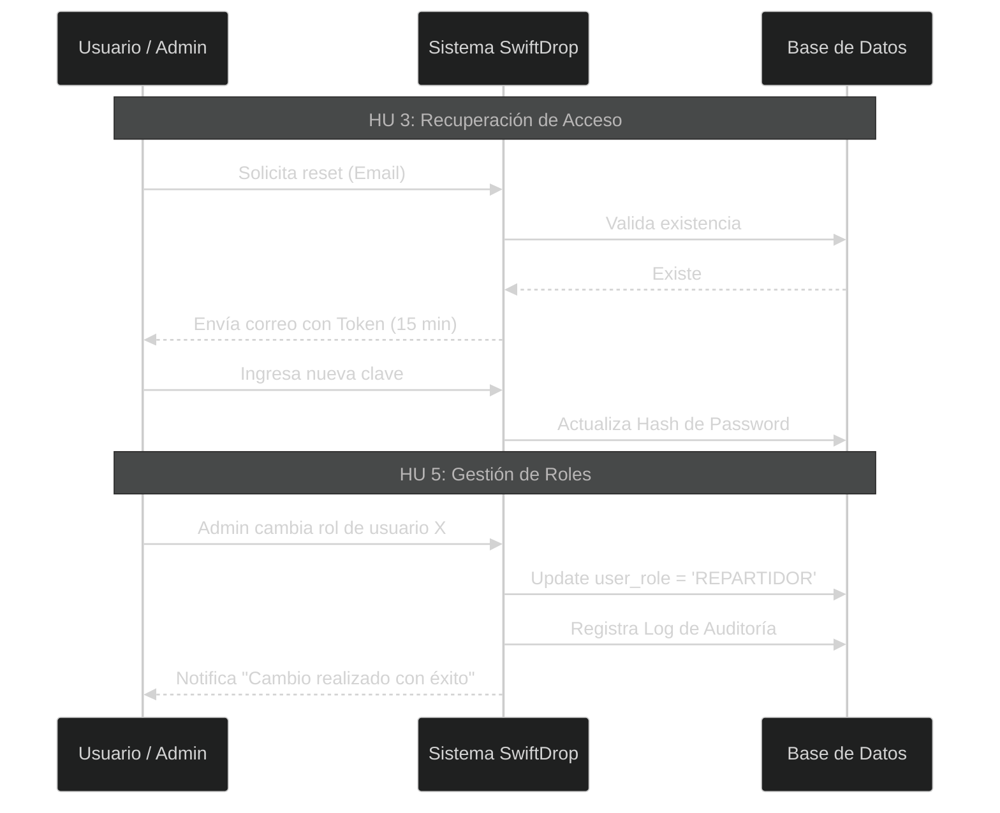

# 6. Historias de Usuario e INVEST: Nuestra Unidad de Valor

Una **Historia de Usuario (HU)** es una descripción breve y simple de una funcionalidad contada desde la perspectiva de la persona que desea esa nueva capacidad.

## 1. El Formato Estándar (User Voice)
Para mantener el enfoque en el valor humano, utilizamos una plantilla que nos obliga a pensar en **quién**, **qué** y **por qué**:

> **"Como [rol], quiero [acción], para [beneficio]"**

### Ejemplo en SwiftDrop:
*   **Mal requerimiento:** *"El sistema debe tener integración con Google Maps"* (Enfoque técnico/Output).
*   **Buena HU:** *"Como Cliente Urgente, quiero ver la ubicación en vivo del repartidor en un mapa, para reducir mi ansiedad y saber exactamente cuándo llegará mi paquete"*.

### Criterio de Aceptación
Una Historia de Usuario sin criterios claros es solo una intención. Para que sea Testeable (la T de INVEST), debemos especificar los datos y reglas. 

**HU 1: Registro de Usuarios (Input & Validation)**
- **Voz del Usuario:** "Como Usuario Nuevo, quiero registrarme con mis datos básicos, para tener una identidad en SwiftDrop".
- **Campos Requeridos:** Nombre completo, Correo electrónico (único), Teléfono móvil, Contraseña (mínimo 8 caracteres, 1 número, 1 mayúscula).
- **Criterios de Aceptación:**
    - En el sistema se debe crear una pantalla donde se ingresen los campos requeridos.
    - El sistema debe validar que el correo tenga formato estándar (usuario@dominio.com).
    - No se permite el registro de dos usuarios con el mismo correo o mismo teléfono.
    - Flujo de Verificación: Al dar clic en "Registrar", el sistema debe disparar un código SMS de 6 dígitos. La cuenta se crea en estado "Pendiente" y no puede loguearse hasta que el código sea ingresado correctamente.

---

## 2. El Método de las 3 C’s
Ron Jeffries, pionero de la agilidad, nos dice que una HU no está completa sin estos tres elementos:

1.  **Card (Tarjeta):** El resumen escrito del formato anterior. Sirve como recordatorio de la necesidad.
2.  **Conversation (Conversación):** El momento donde el PO y el Equipo hablan para aclarar dudas. Aquí surge el **entendimiento compartido**.
3.  **Confirmation (Confirmación):** Los Criterios de Aceptación. La lista de verificación para saber que la historia está terminada.



---

## 3. Validando con el Modelo INVEST
No todas las historias son buenas. Para asegurar la calidad, pasamos cada HU por el filtro **INVEST**:

| Sigla | Significado | Descripción para el Analista |
| :---: | :--- | :--- |
| **I** | **Independent** | La historia debe poder desarrollarse sin depender de otras historias complejas. |
| **N** | **Negotiable** | No es un contrato cerrado; el equipo puede sugerir formas más fáciles de lograr el valor. |
| **V** | **Valuable** | Debe entregar un beneficio claro al usuario o al negocio. |
| **E** | **Estimable** | El equipo debe entenderla lo suficiente para saber cuánto esfuerzo requiere. |
| **S** | **Small** | Debe ser lo suficientemente pequeña para terminarse en un solo Sprint (2 semanas). |
| **T** | **Testable** | Debe haber una forma objetiva de probar que funciona (sin palabras vagas como "rápido"). |

---

## 4. Relación de las Historias en SwiftDrop
Las historias no flotan solas; nacen de las Épicas y se desglosan en Tareas técnicas.



## 💡 Puntos clave para recordar
*   **La conversación es reina:** Si escribes la historia y la lanzas por correo sin hablar con el equipo, estás haciendo "cascada" en miniatura.
*   **Criterios de Aceptación:** Son tu mejor defensa. Si un criterio dice *"El sistema debe rechazar tarjetas vencidas"*, el equipo ya tiene un caso de prueba claro.
*   **Picar la piedra:** Si una historia es demasiado grande para estimarla, aplícale el patrón de *splitting* (división) para que sea pequeña.

---

## 5. Desglosando la Épica de Usuarios en SwiftDrop
Como hemos visto, una **Épica** es una historia de usuario tan grande que no cabe en un solo Sprint y requiere ser descompuesta en piezas más pequeñas. A continuación, presentamos la formulación técnica de nuestra épica y su desglose.

### 5.1. Formulación de la Épica
*   **Nombre de la Épica:** Gestión de Identidad y Perfil de Usuario.
*   **Descripción:** Permitir que los diferentes actores de SwiftDrop (Clientes, Repartidores y Administradores) gestionen su ciclo de vida en la plataforma, desde el ingreso seguro hasta la personalización de su identidad digital y control de accesos.

### 5.2. Jerarquía de la Épica
Este diagrama muestra cómo la gran roca de "Gestión de Usuarios" se divide en las historias que el equipo técnico puede estimar y construir.

---

### 5.3. Desglose de Historias de Usuario (Formato Estándar)
Cada historia utiliza el formato de "Como [rol], quiero [acción], para [beneficio]" para asegurar que el equipo entienda quién se beneficia y por qué.

A continuación, presentamos el modelo de datos y el desglose detallado acordado en el **Taller de los Tres Amigos** (PO, Desarrollador y Tester).

#### Modelo de Datos de Identidad

#### HU 1: Registro de Usuarios (Input & Validation)
*   **Voz del Usuario:** *"Como Usuario Nuevo, quiero registrarme con mis datos básicos, para tener una identidad en SwiftDrop"*.
*   **Campos Requeridos:** Nombre completo, Correo electrónico (único), Teléfono móvil, Contraseña (mínimo 8 caracteres, 1 número, 1 mayúscula).
*   **Criterios de Aceptación:**
    *   El sistema debe validar que el correo tenga formato estándar (usuario@dominio.com).
    *   No se permite el registro de dos usuarios con el mismo correo o mismo teléfono.
    *   **Flujo de Verificación:** Al dar clic en "Registrar", el sistema debe disparar un código SMS de 6 dígitos. La cuenta se crea en estado "Pendiente" y no puede loguearse hasta que el código sea ingresado correctamente.

#### HU 2: Inicio de Sesión (Seguridad y Feedback)
*   **Voz del Usuario:** *"Como Usuario Registrado, quiero acceder con mis credenciales, para usar los servicios de la app"*.
*   **Criterios de Aceptación:**
    *   El campo de contraseña debe enmascarar los caracteres (mostrar puntos) por seguridad.
    *   Si las credenciales son incorrectas, mostrar el mensaje genérico: *"Correo o contraseña no válidos"*.
    *   **Bloqueo:** Tras 5 intentos fallidos en un lapso de 10 minutos, la cuenta se bloquea por 30 minutos.

#### HU 3: Recuperación de Acceso (Self-Service)
*   **Voz del Usuario:** *"Como Usuario Registrado, quiero restablecer mi contraseña de forma autónoma, para recuperar el acceso a mi cuenta si olvido mis credenciales"*.
*   **Campos de Entrada:** Correo electrónico institucional.
*   **Criterios de Aceptación:**
    *   **Validación de Existencia:** Si el correo no existe, el sistema debe mostrar un mensaje genérico para evitar la enumeración de usuarios por atacantes.
    *   **Seguridad del Token:** El enlace enviado al correo debe contener un token de un solo uso que expire automáticamente a los 15 minutos.
    *   **Reglas de Nueva Clave:** La nueva contraseña no puede ser igual a las últimas 3 utilizadas.
    *   **Feedback de Éxito:** Tras el cambio exitoso, todas las sesiones activas en otros dispositivos deben cerrarse.

#### HU 4: Modificación de Perfil (Datos y Multimedia)
*   **Voz del Usuario:** *"Como Cliente/Repartidor, quiero actualizar mi información, para que sea fácil reconocerme"*.
*   **Campos Editables:** Fotografía, Dirección de residencia, Teléfono.
*   **Criterios de Aceptación:**
    *   **Carga de Imagen:** El sistema debe aceptar formatos JPG y PNG (Máx 2MB).
    *   **Procesamiento:** Al subir la foto, el sistema debe recortarla automáticamente a un aspect ratio de 1:1.
    *   **Confirmación:** Al guardar cambios, se debe mostrar un "Toast" emergente con el texto: *"Perfil actualizado con éxito"*.

#### HU 5: Gestión de Roles y Permisos (Admin Tool)
*   **Voz del Usuario:** *"Como Administrador, quiero asignar o modificar el rol de un usuario, para garantizar que cada persona acceda solo a las funciones permitidas por su perfil"*.
*   **Interfaz:** Panel con buscador de usuarios y menú desplegable de roles (Cliente, Repartidor, Admin).
*   **Criterios de Aceptación:**
    *   **Acceso Restringido:** El módulo solo debe ser visible si el usuario tiene el permiso `ADMIN_MASTER`.
    *   **Consistencia de Datos:** Al cambiar el rol a "Repartidor", el sistema debe solicitar campos adicionales (Placa del vehículo o identificación).
    *   **Logs de Auditoría:** Cada cambio debe quedar registrado con ID del Admin, ID del usuario, fecha y hora.
    *   **Protección de Último Admin:** No se permite que el último administrador activo se elimine el rol a sí mismo.

#### Flujo de Procesos Técnicos

> **Reflexión para el Analista:**
> Observa que historias como "Asignar Roles" pueden ser vitales para el control interno, pero quizás no son parte del MVP si inicialmente solo lanzamos la app para que los clientes se registren y pidan paquetes básicos. Como Product Owner, tu labor es decidir si esta historia se construye en el Sprint 1 o se queda en el backlog para después.

> **Punto clave:** Una buena HU es como un "Ticket para una conversación". Los detalles técnicos de cómo se encripta la contraseña o cómo se escala la imagen nacen de la charla entre el desarrollador y el analista.

---

## 6. Puntos clave para recordar
*   **La conversación es reina:** Si escribes la historia y la lanzas por correo sin hablar con el equipo, estás haciendo "cascada" en miniatura.
*   **Criterios de Aceptación:** Son tu mejor defensa. Si un criterio dice *"El sistema debe rechazar tarjetas vencidas"*, el equipo ya tiene un caso de prueba claro.
*   **Picar la piedra:** Si una historia es demasiado grande para estimarla, aplícale el patrón de *splitting* (división) para que sea pequeña.

---

## 📚 Bibliografía de la Lección
*   **Leffingwell, D. (2011):** *Agile Software Requirements*. Capítulos 5, 6 y 17.
*   **Patton, J. (2014):** *User Story Mapping*. Capítulos 6, 7, 11 y 14.
*   **Sorto, C. (2026):** *Presentación: Entiendo al Usuario*.

---

[⬅️ Volver al índice de la unidad](./index.md)