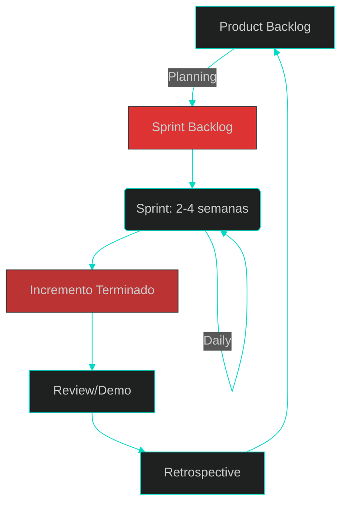
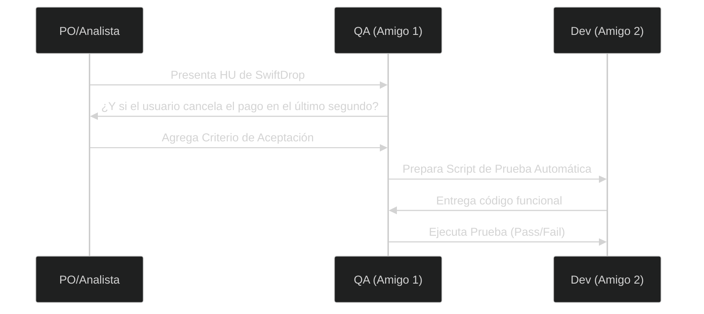
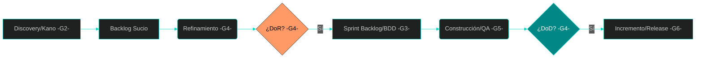

# 📋 TEMAS DE EXPOSICIÓN: El Analista en Entornos Ágiles

**Objetivo:** Investigar y exponer cómo el análisis de sistemas se transforma en agilidad, pasando de la documentación estática a la gestión de valor y calidad continua.

---

## Grupo 1: El Corazón de la Agilidad - Ceremonias y Artefactos
Para entender el cambio de rol del analista, debemos conocer el ritmo del equipo. Scrum no es solo una lista de tareas, es un marco con tiempos y objetos claros.

**Los 3 Artefactos (Los "Objetos"):**
**Product Backlog:** La lista maestra de deseos priorizada por el PO.
**Sprint Backlog:** El compromiso del equipo para las próximas 2-4 semanas.
**Incremento:** El software funcionando y probado (nuestro "monopatín" de SwiftDrop).

**Las 5 Ceremonias (El "Ritmo"):**
**Sprint Planning:** El PO presenta el "qué" y el equipo decide el "cómo".
**Daily Scrum:** 15 minutos para sincronizar y ver bloqueos.
**Backlog Refinement:** El analista y el equipo "pican la roca" de las historias futuras.
**Sprint Review (Demo):** Se muestra el valor al cliente para obtener feedback.
**Sprint Retrospective:** El equipo analiza cómo mejorar su proceso interno.

### La Evolución del Rol - De Analista a Product Owner (PO)
**Enfoque:** El cambio de mentalidad de "hacer software" a "lograr resultados" (*Outcome over Output*).

*   **Diferencias:** Analista Tradicional (alcance fijo) vs. Product Owner (tiempo/recurso fijo).
*   **Responsabilidades del PO:** Maximizar el ROI y gestionar el Outcome.
*   **La Metáfora del Doctor vs. El Mesero:** Diagnóstico de necesidades reales.
*   **Estrategia de Lanzamiento:** MVP vs. Proyecto "Big Bang".

> **Referencia Visual sugerida:** Figura 1-8: *Agile fixes the date and resources and varies the scope*, pág. 17, libro: Agile Software Requirements.

---

## Grupo 2: Discovery y Elicitación Ágil (NFRs como Restricciones)
**Enfoque:** Métodos modernos para descubrir qué construir y entender las limitaciones del sistema.

*   **Técnicas de Discovery:** User Story Mapping, Entrevistas *Context-free* y Workshops.
*   **Entendimiento del Usuario:** Personas y Mapas de Empatía.
*   **Nuevos Conceptos:** Requerimientos No Funcionales (NFRs) vistos como restricciones del Backlog (Seguridad, Desempeño, Escalabilidad).
*   **Clasificación de Valor:** El Modelo Kano (Básicos, Lineales y Exciters).

> **Referencia Visual sugerida:** Figura 17–1: *Nonfunctional requirements as backlog constraints*, pág. 341, libro: Agile Software Requirements.

---

## Grupo 3: Estructuración de Historias de Usuario y BDD
**Enfoque:** Redacción de alta calidad técnica y funcional para evitar ambigüedades.

*   **Unidad de valor:** El formato Connextra (Como/Quiero/Para).
*   **Calidad de la historia:** El modelo INVEST.
*   **Las 3 C’s:** Card, Conversation y Confirmation.
*   **Nuevo Concepto:** BDD (*Behavior Driven Development*) y formato Gherkin (Dado/Cuando/Entonces) para Criterios de Aceptación 100% testeables.

> **Referencia Visual sugerida:** Figura: *CARD -> CONVERSATION -> CONFIRMATION*, pág. 102, libro: User Story Mapping.

---

## Grupo 4: Gestión del Backlog y las "Aduanas" de Calidad (DoR y DoD)
**Enfoque:** El flujo de trabajo del analista para mantener el motor del equipo andando.

*   **Jerarquía de Trabajo:** Temas -> Épicas -> Historias -> Tareas.
*   **Nuevo Concepto:** El Ritual de Refinamiento (*Grooming*): "Picar la roca" para que el equipo no falle en el Sprint Planning.
*   **Nuevo Concepto:** DoR (*Definition of Ready*): ¿Qué necesita una historia para ser construible?
*   **Nuevo Concepto:** DoD (*Definition of Done*): El contrato de calidad final para aceptar un incremento.

> **Referencia Visual sugerida:** Figura 5–5: *Hierarchical view of epics, features, and stories*, pág. 87, libro: Agile Software Requirements.

---

## Grupo 5: Aseguramiento de Calidad (QA) y el Analista
**Enfoque:** Cómo el analista colabora para asegurar que el software realmente funciona.

*   **Shift Left Testing:** Validar desde que se escribe la Historia de Usuario.
*   **Pirámide de Pruebas:** Unitarias, Integración y E2E.
*   **Automatización de Criterios de Aceptación (ATDD).**

En Agile, el QA (Quality Assurance) no entra al final; entra desde que nace la idea. El analista debe trabajar con el QA para asegurar que la historia sea Testeable (la T de INVEST).

El Taller de los Tres Amigos: Para cada historia de SwiftDrop, se reúnen el Analista (Negocio), el Desarrollador (Técnico) y el QA (Pruebas).

* El QA juega al "What-About" (¿Y qué pasa si...?): "¿Qué pasa si el repartidor pierde la señal GPS?", "¿Qué pasa si la tarjeta no tiene fondos?". Esto genera los criterios de aceptación.

* Workflow del QA Ágil: Escribe los casos de prueba mientras el desarrollador escribe el código.
* Shift Left Testing: Probar lo antes posible para reducir el costo del error.
* Herramientas: Además de Jira para el seguimiento, se usan marcos como FIT o FitNesse para automatizar las pruebas de aceptación en lenguaje de negocio.

> **Referencia Visual sugerida:** Figura 10–1: *The agile testing matrix*, pág. 186, libro: Agile Software Requirements.

---

## Grupo 6: Cultura DevOps e Infraestructura para el Analista
**Enfoque:** Entender que el despliegue es parte del análisis de la solución.

*   **Pipeline CI/CD:** De la computadora del programador al cliente.
*   **Ambientes de Trabajo:** La importancia de Local, QA, Staging y Producción.
*   **Gestión de la Deuda Técnica y Refactors en el Backlog.**

> **Referencia Visual sugerida:** Infografía del ciclo infinito de DevOps (Plan -> Code -> Build -> Test -> Release -> Deploy -> Operate -> Monitor).

---

## Resumen del Flujo de Calidad
Este diagrama lo pueden usar todos los grupos para ver cómo encajan sus temas:

---

## 📚 Bibliografía General para Exposiciones
*   **Patton, J. (2014):** *User Story Mapping*.
*   **Leffingwell, D. (2011):** *Agile Software Requirements*.
*   **Schwaber, K. & Sutherland, J. (2020):** *The Scrum Guide*.

---

[⬅️ Volver al índice de la unidad](./index.md)