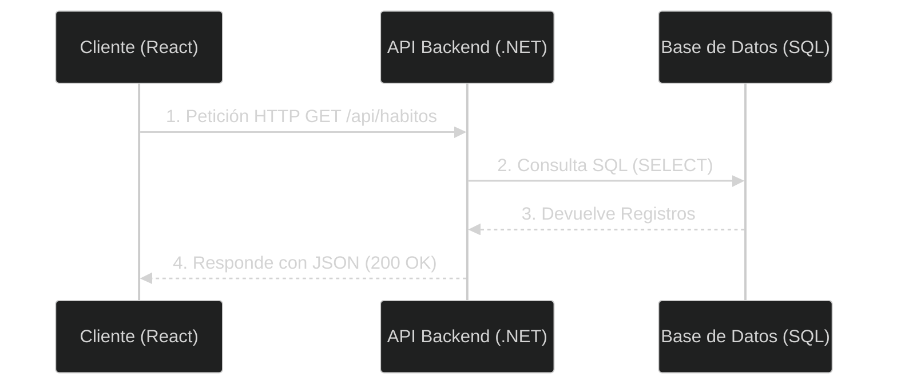

# 🚀 Clase 1: Intro a Web, Cliente-Servidor y Arquitectura API-First

## 📖 Teoría:
El desarrollo web moderno ya no mezcla la vista (HTML) con la lógica de base de datos en un solo lugar. Utilizamos una arquitectura API-First, donde el Backend (C#/.NET) se encarga exclusivamente de las reglas de negocio y los datos, exponiéndolos a través de una API REST. El Frontend (React) actuará como un cliente independiente que consume estos datos. Hoy definimos el alcance de nuestro MVP: un Habit Tracker Gamificado.



## 📚 Lectura:
* **Pro ASP.NET Core 8**, Capítulo 1 y 2.

## 💻 Desarrollo Práctico:

**Inicialización del Repositorio:** Creamos nuestro control de versiones.

```bash
git init
git add .
git commit -m "Inicializando HabitForge MVP"
```

**Revisión del Backlog:** Lectura de las Historias de Usuario (HU-01 a HU-07).

---
[⬅️ Volver al índice de la fase](./index.md)
