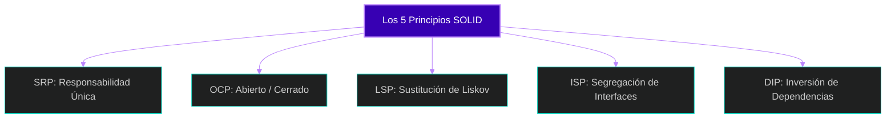

# 🧩 Clase 2: Principios SOLID y Código Limpio

## 📖 Teoría:
Antes de tirar código, debemos entender cómo hacer que este sea mantenible. Los principios **SOLID** son 5 reglas de diseño orientado a objetos. Hoy los conoceremos todos a nivel conceptual, y a lo largo del cuatrimestre, cada vez que apliquemos uno en nuestro proyecto, haremos una pausa para identificarlo.

1.  **S - Single Responsibility Principle (Responsabilidad Única):** Una clase debe tener una, y solo una, razón para cambiar. *(Ej: Un controlador maneja peticiones HTTP, no calcula rachas de hábitos).*
2.  **O - Open/Closed Principle (Abierto/Cerrado):** El software debe estar abierto a la extensión, pero cerrado a la modificación.
3.  **L - Liskov Substitution Principle (Sustitución de Liskov):** Las clases derivadas deben poder sustituir a sus clases base sin romper el sistema.
4.  **I - Interface Segregation Principle (Segregación de Interfaces):** Es mejor tener muchas interfaces pequeñas y específicas que una interfaz gigante y genérica.
5.  **D - Dependency Inversion Principle (Inversión de Dependencias):** Los módulos de alto nivel no deben depender de módulos de bajo nivel. Ambos deben depender de abstracciones (Interfaces).



## 📚 Lectura:
*   **Clean Architecture** (Robert C. Martin), Parte 3: Design Principles.

## 💻 Desarrollo Práctico:
Veamos un ejemplo teórico de **Inversión de Dependencias (DIP)** (lo aplicaremos en código real en las próximas clases). En lugar de que un Controlador instancie directamente su conexión a la base de datos (`new Conexion()`), el framework le "inyecta" esa dependencia.

```csharp
// CONTRATO (Abstracción - La 'D' de SOLID)
public interface IHabitoService {
    string ObtenerMensaje();
}

// IMPLEMENTACIÓN (Detalle)
// Esta clase respeta el SRP (La 'S' de SOLID): Su única responsabilidad es proveer datos de hábitos.
public class HabitoService : IHabitoService {
    public string ObtenerMensaje() => "Motor de Hábitos Iniciado";
}

// En el Program.cs (lo veremos después), inyectamos la dependencia:
// builder.Services.AddScoped<IHabitoService, HabitoService>();
```

---
[⬅️ Volver al índice de la fase](./index.md)
