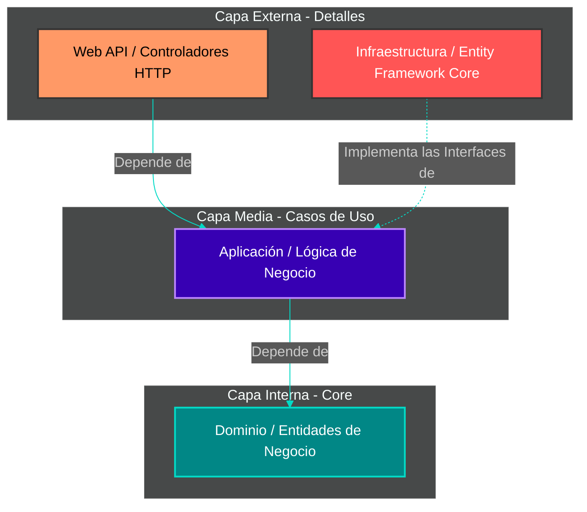

# 🏗️ Clase 3: Setup Backend (.NET) y Clean Architecture

## 📖 Teoría:
¿Por qué dividimos nuestro proyecto en tantas carpetas o bibliotecas? La **Clean Architecture** aísla las reglas de negocio de los detalles técnicos (como la base de datos o el framework web).

La regla de oro es la **Regla de Dependencia**: El código fuente de las capas internas no puede saber absolutamente nada de las capas externas.

*   **Dominio (Capa Interna):** Entidades puras del negocio (Habito, Jugador). No tiene dependencias. No sabe si usamos SQL o TXT.
*   **Aplicación (Capa Media):** Los Casos de Uso (Ej: `RegistrarCheckIn`). Conoce al Dominio, pero no sabe qué base de datos se usa. Define las Interfaces (La 'I' de SOLID) que la Infraestructura debe cumplir.
*   **Infraestructura y API (Capas Externas):** Aquí viven Entity Framework, SQL, y los Controladores REST. La Infraestructura apunta hacia la Aplicación para implementar sus interfaces.


*(Nota en el diagrama: Observen cómo las flechas apuntan hacia el Dominio. El Dominio y la Aplicación nunca apuntan hacia afuera).*

## 📚 Lectura:
*   **Clean Architecture**, Capítulo 22: The Clean Architecture.

## 💻 Desarrollo Práctico:
Creación estricta de la solución respetando la Regla de Dependencia.

```bash
# 1. Crear las capas (Proyectos de Biblioteca de Clases y Web API)
dotnet new classlib -n HabitForge.Domain
dotnet new classlib -n HabitForge.Application
dotnet new classlib -n HabitForge.Infrastructure
dotnet new webapi -n HabitForge.API

# 2. Configurar la Regla de Dependencia (Referencias)
# Application depende de Domain
dotnet add HabitForge.Application/HabitForge.Application.csproj reference HabitForge.Domain/HabitForge.Domain.csproj

# Infrastructure depende de Application (Invierte la dependencia)
dotnet add HabitForge.Infrastructure/HabitForge.Infrastructure.csproj reference HabitForge.Application/HabitForge.Application.csproj

# API depende de Application e Infrastructure (para inyectar dependencias)
dotnet add HabitForge.API/HabitForge.API.csproj reference HabitForge.Application/HabitForge.Application.csproj
dotnet add HabitForge.API/HabitForge.API.csproj reference HabitForge.Infrastructure/HabitForge.Infrastructure.csproj
```

---
[⬅️ Volver al índice de la fase](./index.md)
