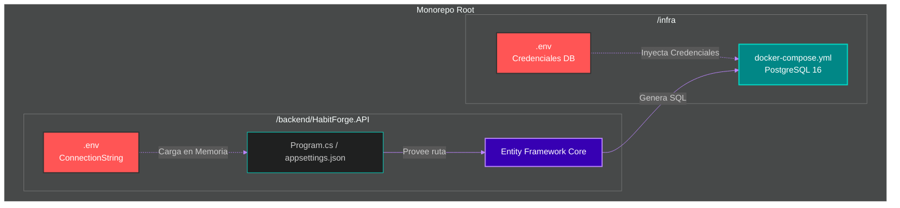

# 🐳 Clase 4: Infraestructura Aislada, Docker, ORM y Variables de Entorno (12-Factor App)

## 📖 Teoría:
En el desarrollo de software bajo arquitecturas modernas (Monorepos), la infraestructura (Bases de datos, cachés, servidores web) se administra de forma independiente al código de la aplicación. Crearemos una carpeta `infra` en la raíz de nuestro repositorio para alojar nuestros contenedores de Docker. Usaremos PostgreSQL 16.

Además, aplicaremos la metodología **12-Factor App** (Factor III: Configuración). Las credenciales nunca se guardan en el código fuente. Tendremos un archivo `.env` en la carpeta `infra` para crear la base de datos, y otro archivo `.env` totalmente independiente dentro de nuestro proyecto de API (`backend/HabitForge.API`) que .NET leerá para conectarse.



## 📚 Lectura: 
*   **Pro ASP.NET Core**, Configuration. Documentación oficial de *12-Factor App* y Docker.

## 💻 Desarrollo Práctico:

**1. Aislamiento de la Infraestructura (`/infra`):**
Desde la raíz de nuestro monorepo, creamos la carpeta de infraestructura y su archivo de secretos. (Recuerda agregar `*.env` al `.gitignore` global).

```bash
# Estando en la raíz del monorepo
mkdir infra
cd infra
```
Creamos el archivo `infra/.env`:

```plaintext
# infra/.env
POSTGRES_USER=admin
POSTGRES_PASSWORD=SuperSecretPassword123!
POSTGRES_DB=HabitForgeDB
```
Creamos el archivo `infra/docker-compose.yml` usando una versión reciente de Postgres:

```yaml
# infra/docker-compose.yml
version: '3.8'
services:
  db-habitforge:
    image: postgres:16-alpine
    container_name: postgres-habitforge
    env_file:
      - .env # Inyecta las variables exclusivas del contenedor
    ports:
      - "5432:5432"
    volumes:
      - postgres_data:/var/lib/postgresql/data

volumes:
  postgres_data:
```
*Comando a ejecutar (dentro de `infra/`):* `docker-compose up -d`

**2. Instalación del ORM y Herramientas de Migración (`/backend/HabitForge.Infrastructure`):**
Para que nuestro código C# pueda comunicarse con la base de datos y gestionar los cambios de esquema (Code-First), necesitamos instalar las librerías del ORM, el proveedor para PostgreSQL y, fundamentalmente, el paquete de Diseño para habilitar las migraciones.

```bash
# Navegamos al proyecto de Infraestructura
cd ../backend/HabitForge.Infrastructure

# 1. Core del ORM
dotnet add package Microsoft.EntityFrameworkCore
# 2. Driver para PostgreSQL
dotnet add package Npgsql.EntityFrameworkCore.PostgreSQL
# 3. Herramientas para ejecutar Migraciones de Base de Datos
dotnet add package Microsoft.EntityFrameworkCore.Design
```

**3. Configuración en la API (`/backend/HabitForge.API`):**
Nuestra API necesita conectarse a la base de datos, pero no debe tener la contraseña quemada en el `appsettings.json`. Usaremos un paquete NuGet para cargar variables de entorno desde un archivo local en desarrollo.

```bash
# Estando en la carpeta backend/HabitForge.API
dotnet add package DotNetEnv
```
Creamos el archivo `backend/HabitForge.API/.env`:

```plaintext
# backend/HabitForge.API/.env
ConnectionStrings__PostgresConnection="Host=localhost;Database=HabitForgeDB;Username=admin;Password=SuperSecretPassword123!"
```
Y en el `backend/HabitForge.API/Program.cs`, indicamos que lea este archivo al arrancar:

```csharp
using DotNetEnv; // Agregar este using

var builder = WebApplication.CreateBuilder(args);

// Cargar variables de entorno desde el archivo .env local
Env.Load();

// El resto de la configuración...
```

**4. La Entidad de Dominio (`backend/HabitForge.Domain/Entities/HabitoGlobal.cs`):**

```csharp
namespace HabitForge.Domain.Entities;

public class HabitoGlobal {
    public int Id { get; set; }
    public string Nombre { get; set; } = string.Empty;
}
```

**5. El Contexto de Base de Datos (`backend/HabitForge.Infrastructure/Data/HabitForgeDbContext.cs`):**
Aquí es donde Entity Framework Core entra en juego. Mapeará nuestra clase C# a la tabla relacional en PostgreSQL.

```csharp
using Microsoft.EntityFrameworkCore;
using HabitForge.Domain.Entities;

namespace HabitForge.Infrastructure.Data;

public class HabitForgeDbContext : DbContext {
    public HabitForgeDbContext(DbContextOptions<HabitForgeDbContext> options) : base(options) { }
    
    public DbSet<HabitoGlobal> HabitosGlobales { get; set; }
}
```

---
[⬅️ Volver al índice de la fase](./index.md)
