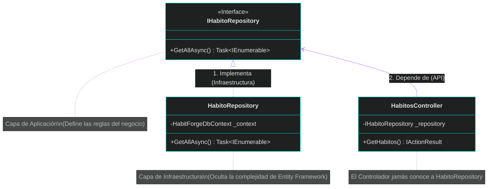

# 🧩 Clase 5: El Patrón Repositorio y la Inversión de Dependencias (DIP)

## 📖 Teoría: Aislamiento de Datos y Contratos

En el análisis y diseño de sistemas, si un Controlador HTTP hace consultas SQL directamente, el sistema se vuelve rígido, difícil de probar y altamente acoplado. Para resolver esto, combinamos dos conceptos magistrales:

*   **El Patrón Repositorio**: Actúa como una colección en memoria de nuestras entidades de Dominio. Oculta por completo la complejidad tecnológica (Entity Framework, SQL, PostgreSQL) del resto del sistema.
*   **Inversión de Dependencias (La 'D' de SOLID)**: La capa de Aplicación (donde viven las reglas) define un Contrato (Interfaz) dictando qué necesita. La capa de Infraestructura Implementa ese contrato. La capa API une a los dos mediante la inyección, de modo que el Controlador trabaja con la abstracción, nunca con la clase concreta.

### Análisis Estructural (Inversión de Dependencias)



## 📚 Lectura: 
*   **Clean Architecture**, Parte 5: Architecture (Interfaces and Boundaries).

## 💻 Desarrollo Práctico:

Vamos a materializar esta arquitectura paso a paso en nuestro monorepo.

**1. El Contrato (La Abstracción en `backend/HabitForge.Application/Interfaces/IHabitoRepository.cs`):**
Esta interfaz pertenece a la Aplicación. Fíjate que no tiene librerías de bases de datos. Solo dice "qué" se puede hacer.

```csharp
using HabitForge.Domain.Entities;

namespace HabitForge.Application.Interfaces;

public interface IHabitoRepository {
    Task<IEnumerable<HabitoGlobal>> GetAllAsync();
}
```

**2. La Implementación (El Detalle en `backend/HabitForge.Infrastructure/Repositories/HabitoRepository.cs`):**
Esta clase sí pertenece a Infraestructura. Conoce a Entity Framework y sabe interactuar con PostgreSQL.

```csharp
using Microsoft.EntityFrameworkCore;
using HabitForge.Application.Interfaces;
using HabitForge.Domain.Entities;
using HabitForge.Infrastructure.Data;

namespace HabitForge.Infrastructure.Repositories;

// Implementamos la interfaz de la capa superior
public class HabitoRepository : IHabitoRepository {
    private readonly HabitForgeDbContext _context;
    
    // El constructor recibe el contexto de EF Core
    public HabitoRepository(HabitForgeDbContext context) {
        _context = context;
    }

    public async Task<IEnumerable<HabitoGlobal>> GetAllAsync() {
        return await _context.HabitosGlobales.ToListAsync(); // Consulta real a BD
    }
}
```

**3. Orquestando la Inyección de Dependencias (`backend/HabitForge.Infrastructure/DependencyInjection.cs`):**
Para que la API sepa qué clase entregar cuando alguien pida un `IHabitoRepository`, debemos registrarlo en el contenedor de dependencias. Como buena práctica de diseño ágil, encapsulamos las inyecciones de Infraestructura en su propia capa.

```csharp
using Microsoft.EntityFrameworkCore;
using Microsoft.Extensions.DependencyInjection;
using HabitForge.Application.Interfaces;
using HabitForge.Infrastructure.Data;
using HabitForge.Infrastructure.Repositories;

namespace HabitForge.Infrastructure;

public static class DependencyInjection {
    public static IServiceCollection AddInfrastructure(this IServiceCollection services, string connectionString) {
        
        // 1. Configuramos el acceso a PostgreSQL
        services.AddDbContext<HabitForgeDbContext>(options =>
            options.UseNpgsql(connectionString));

        // 2. LA INYECCIÓN CLAVE (DIP):
        // "Cada vez que alguien pida la Interfaz, entrégale esta Implementación concreta"
        services.AddScoped<IHabitoRepository, HabitoRepository>();

        return services;
    }
}
```

**4. El Punto de Entrada Limpio (`backend/HabitForge.API/Program.cs`):**
La API solo pasa las variables de entorno y ejecuta la configuración, manteniéndose agnóstica a los detalles de los repositorios.

```csharp
using DotNetEnv;
using HabitForge.Infrastructure;

var builder = WebApplication.CreateBuilder(args);

Env.Load();

var connectionString = Environment.GetEnvironmentVariable("ConnectionStrings__PostgresConnection") 
                       ?? throw new InvalidOperationException("Falta la cadena de conexión.");

// Llamamos al método que inyecta los repositorios y la base de datos
builder.Services.AddInfrastructure(connectionString);

builder.Services.AddControllers();
var app = builder.Build();

app.MapControllers();
app.Run();
```

---
[⬅️ Volver al índice de la fase](./index.md)
