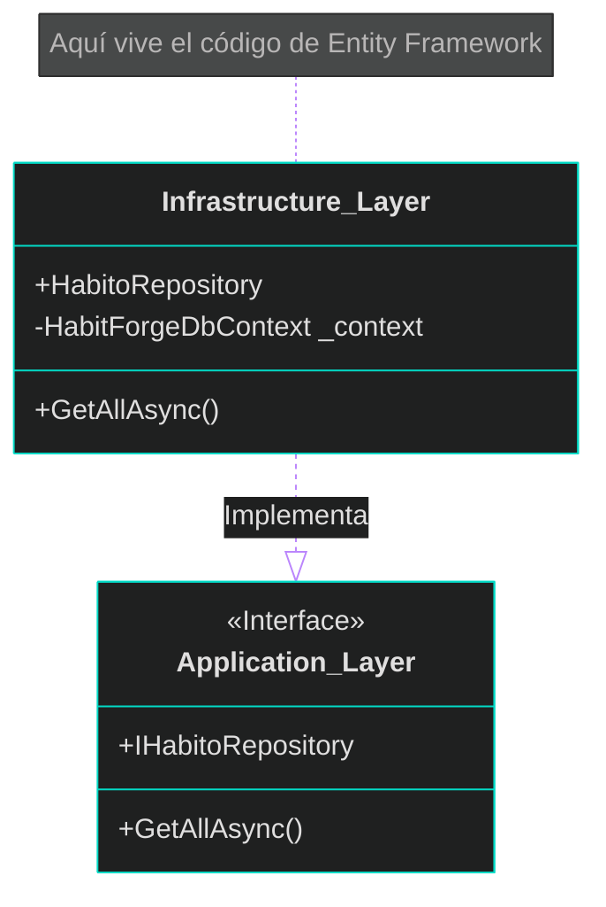

# 🧩 Clase 5: Casos de Uso, Controladores y el Patrón Repositorio

## 📖 Teoría (Respondiendo al "Dónde" arquitectónico):
Para cumplir con el **Principio de Inversión de Dependencias (D)**, debemos aislar la base de datos de nuestra lógica.
*   **¿Dónde se define la Interfaz (El Contrato)?:** Se define en la capa de **Aplicación**. La aplicación dicta *qué* necesita (Ej: "Necesito una lista de hábitos"), pero no le importa *cómo* se obtiene.
*   **¿Dónde se implementa?:** Se implementa en la capa de **Infraestructura**. Aquí escribimos el código real que usa Entity Framework para hablar con Postgres.
*   **¿Dónde se conectan?:** En el archivo `Program.cs` de la **API**, configuramos el inyector de dependencias.



## 💻 Desarrollo Práctico:

**1. El Contrato en Application (`backend/HabitForge.Application/Interfaces/IHabitoRepository.cs`):**
```csharp
using HabitForge.Domain.Entities;

namespace HabitForge.Application.Interfaces;

public interface IHabitoRepository {
    Task<IEnumerable<HabitoGlobal>> GetAllAsync();
}
```

**2. La Implementación en Infrastructure (`backend/HabitForge.Infrastructure/Repositories/HabitoRepository.cs`):**
```csharp
using Microsoft.EntityFrameworkCore;
using HabitForge.Application.Interfaces;
using HabitForge.Domain.Entities;
using HabitForge.Infrastructure.Data;

namespace HabitForge.Infrastructure.Repositories;

public class HabitoRepository : IHabitoRepository {
    private readonly HabitForgeDbContext _context;
    
    public HabitoRepository(HabitForgeDbContext context) {
        _context = context;
    }

    public async Task<IEnumerable<HabitoGlobal>> GetAllAsync() {
        return await _context.HabitosGlobales.ToListAsync();
    }
}
```

**3. Inyectando todo en la API (`backend/HabitForge.API/Program.cs`):**
```csharp
using Microsoft.EntityFrameworkCore;
using HabitForge.Infrastructure.Data;
using HabitForge.Application.Interfaces;
using HabitForge.Infrastructure.Repositories;

var builder = WebApplication.CreateBuilder(args);

// A. Configuramos la conexión a PostgreSQL
builder.Services.AddDbContext<HabitForgeDbContext>(options =>
    options.UseNpgsql(builder.Configuration.GetConnectionString("PostgresConnection")));

// B. Registramos la Inversión de Dependencias (DIP)
// "Cuando alguien pida IHabitoRepository, entrégale un HabitoRepository"
builder.Services.AddScoped<IHabitoRepository, HabitoRepository>();

builder.Services.AddControllers();
var app = builder.Build();
app.MapControllers();
app.Run();
```

---
[⬅️ Volver al índice de la fase](./index.md)
