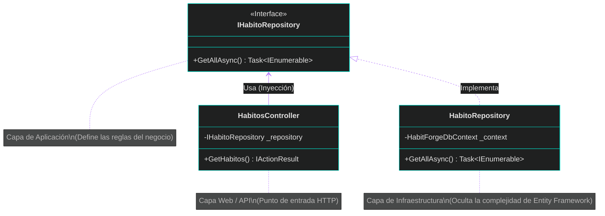
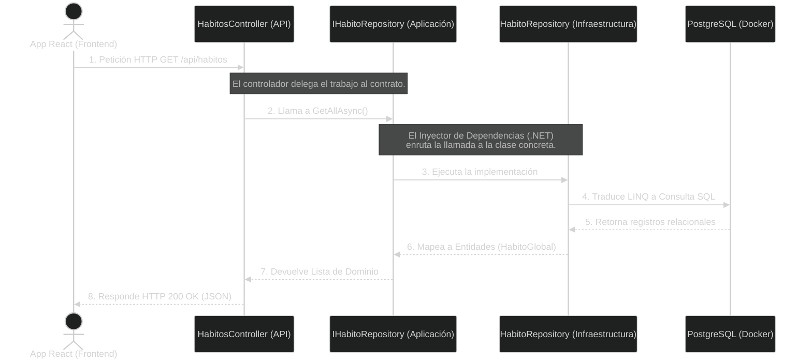

# 🧩 Clase 5: Casos de Uso, Controladores y el Patrón Repositorio

## 📖 Teoría: El "Por Qué" de la Arquitectura

Como ingenieros de software en entornos ágiles, nuestro objetivo es que el código sea testeable y resistente a los cambios. Si mezclamos las consultas de base de datos (SQL/Entity Framework) directamente dentro de nuestros controladores HTTP, violamos el Principio de Responsabilidad Única (SRP) y acoplamos nuestra aplicación a la base de datos.

Para solucionarlo, usamos el **Patrón Repositorio** combinado con la **Inversión de Dependencias** (La 'D' de SOLID).

*   La capa de **Aplicación** define un **Contrato (Interfaz)**. Dicta *qué* necesita hacer el sistema, pero no *cómo*.
*   La capa de **Infraestructura** implementa ese contrato. Contiene la lógica dura de Entity Framework y PostgreSQL.
*   El **Controlador** (Capa API) solo consume la interfaz. Jamás conoce la base de datos.

### Análisis Estructural (Inversión de Dependencias)


*Observa cómo el Controlador y el Repositorio de Infraestructura apuntan hacia la Interfaz. ¡Nadie apunta hacia la base de datos directamente!*

### Ciclo de Vida de una Petición (Flujo Secuencial)



## 📚 Lectura: 
*   **Clean Architecture**, Parte 5: Architecture (Interfaces and Boundaries).

## 💻 Desarrollo Práctico:

Vamos a codificar exactamente lo que acabamos de diagramar, respetando las fronteras de nuestro monorepo.

**1. El Contrato en la Capa de Aplicación (`backend/HabitForge.Application/Interfaces/IHabitoRepository.cs`):**
Esta capa es el "cerebro". Define la regla, pero no instala ningún paquete de base de datos.

```csharp
using HabitForge.Domain.Entities;

namespace HabitForge.Application.Interfaces;

public interface IHabitoRepository {
    Task<IEnumerable<HabitoGlobal>> GetAllAsync();
}
```

**2. La Implementación en la Capa de Infraestructura (`backend/HabitForge.Infrastructure/Repositories/HabitoRepository.cs`):**
Aquí es donde Entity Framework Core hace el trabajo sucio.

```csharp
using Microsoft.EntityFrameworkCore;
using HabitForge.Application.Interfaces;
using HabitForge.Domain.Entities;
using HabitForge.Infrastructure.Data;

namespace HabitForge.Infrastructure.Repositories;

public class HabitoRepository : IHabitoRepository {
    private readonly HabitForgeDbContext _context;
    
    // Inyectamos nuestro DbContext (Base de datos)
    public HabitoRepository(HabitForgeDbContext context) {
        _context = context;
    }

    public async Task<IEnumerable<HabitoGlobal>> GetAllAsync() {
        return await _context.HabitosGlobales.ToListAsync();
    }
}
```

**3. El Enrutamiento de Dependencias (`backend/HabitForge.API/Program.cs`):**
Debemos enseñarle al motor de .NET cómo unir la Interfaz con su Implementación al momento de compilar.

```csharp
using DotNetEnv;
using Microsoft.EntityFrameworkCore;
using HabitForge.Infrastructure.Data;
using HabitForge.Application.Interfaces;
using HabitForge.Infrastructure.Repositories;

var builder = WebApplication.CreateBuilder(args);

Env.Load();

// Configuración de la Base de Datos
builder.Services.AddDbContext<HabitForgeDbContext>(options =>
    options.UseNpgsql(Environment.GetEnvironmentVariable("ConnectionStrings__PostgresConnection")));

// APLICANDO LA INVERSIÓN DE DEPENDENCIAS
// Instrucción: "Cada vez que un Controlador pida un IHabitoRepository, entrégale una nueva instancia de HabitoRepository".
builder.Services.AddScoped<IHabitoRepository, HabitoRepository>();

builder.Services.AddControllers();
var app = builder.Build();

app.MapControllers();
app.Run();
```

---
[⬅️ Volver al índice de la fase](./index.md)
