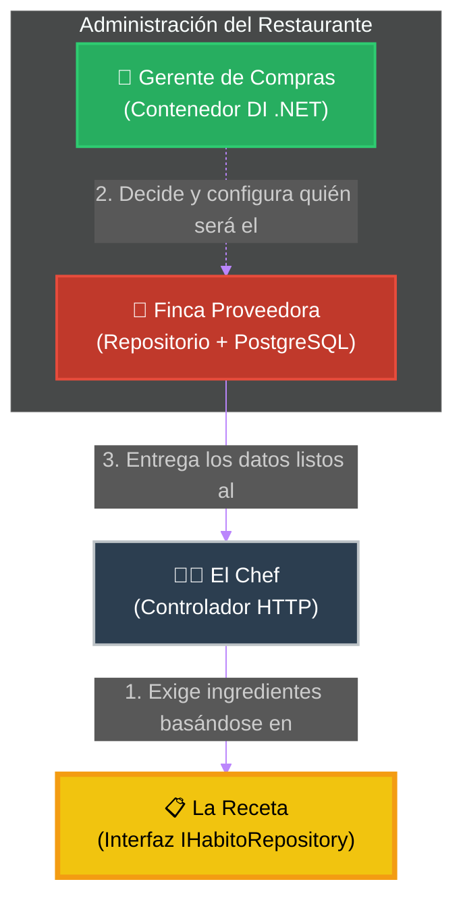
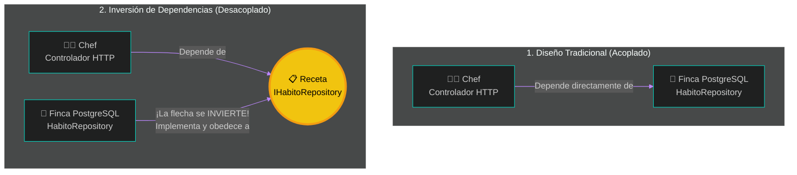

# 🧩 Clase 5: El Patrón Repositorio y la Inversión de Dependencias (DIP)

## 📖 Teoría: Aislamiento de Datos y Contratos

En el análisis y diseño de sistemas, si un Controlador HTTP hace consultas SQL directamente, el sistema se vuelve rígido, difícil de probar y altamente acoplado. Si mañana cambiamos PostgreSQL por Oracle, tendríamos que reescribir toda la aplicación.

Para resolver esto a nivel de ingeniería, combinamos dos conceptos magistrales:

*   **El Patrón Repositorio**: Actúa como una colección en memoria de nuestras entidades de Dominio. Oculta por completo la complejidad tecnológica (Entity Framework, SQL, PostgreSQL) del resto del sistema.
*   **Inversión de Dependencias (La ‘D’ de SOLID)**: Las capas superiores (Aplicación/API) no deben depender de las capas inferiores (Infraestructura/BD), ambas deben depender de Abstracciones (Interfaces).

💡 **Importante: La Analogía del Chef y el Restaurante (Inyección de Dependencias)**
Para entender por qué no debemos conectar la base de datos directamente en el Controlador, imaginemos un restaurante:

*   👨🍳 **El Cliente (El Controlador HTTP)**: Es el Chef del Restaurante. Su único trabajo es recibir la orden (el pedido del cliente), preparar el platillo y entregarlo. Él no va a la finca a matar a la vaca; eso sería ineficiente y lo distraería de cocinar.
*   📋 **El Contrato (La Interfaz IHabitoRepository)**: Es la Receta o Lista de Compras. El Chef dice: "Necesito 5 libras de carne de res de primera". No le importa la marca, ni de qué hacienda viene, solo exige que cumpla con el estándar de su receta.
*   🥩 **El Detalle (La Clase HabitoRepository)**: Es la Finca Proveedora o Carnicería (PostgreSQL, Entity Framework). Es el lugar físico real de donde viene la carne.
*   👔 **El Contenedor de Inyección (El Motor de .NET)**: Es el Gerente de Compras del Restaurante. Su trabajo es leer la receta del Chef, llamar al proveedor, comprar la carne y dejársela al Chef en la mesa de la cocina antes de que empiece a trabajar.

**¿Cuál es la ventaja arquitectónica de esto?**
Si mañana la "Finca PostgreSQL" quiebra o sube sus precios, el Gerente de Compras simplemente firma un nuevo contrato con la "Finca SQL Server". El Chef jamás se entera del cambio. Él sigue recibiendo su carne y cocinando exactamente igual, porque su código depende de la receta (abstracción), no del proveedor (implementación concreta).



🤔 **¿Por qué se llama "Inversión" de Dependencias?**
Para entender el nombre, debemos mirar cómo se programaba hace 10 años y cómo lo hacemos hoy con Clean Architecture. La clave está en la dirección hacia donde apunta la dependencia (quién necesita a quién).

*   **El Modelo Tradicional (Acoplamiento Fuerte):**
    Históricamente, el flujo iba de "arriba hacia abajo". La Capa Superior (El Controlador) instanciaba directamente a la Capa Inferior (La Base de Datos).
    *En nuestro restaurante:* El Chef llamaba directamente a la Finca. Si la finca quebraba, el Chef dejaba de trabajar. El Jefe dependía del proveedor.

*   **El Modelo Invertido (SOLID):**
    Al introducir la Interfaz (La Receta) en la capa del Controlador, rompemos esa línea directa. Ahora obligamos a que ocurra una inversión en la dirección de la dependencia:
    1.  El Chef (Capa Superior) depende únicamente de su Receta (Interfaz).
    2.  La Finca (Capa Inferior) ahora también depende de la Receta. Tiene que adaptar sus procesos para entregar la carne exactamente como la pide el contrato del restaurante.
    
    ¡Hemos invertido la dependencia! La tecnología de la base de datos ahora obedece a las reglas del negocio, en lugar de que el negocio esté amarrado a una base de datos específica.



## 📚 Lectura:
*   **Clean Architecture** (Robert C. Martin), Parte 5: Architecture (Interfaces and Boundaries).

## 💻 Desarrollo Práctico:
Vamos a materializar esta arquitectura paso a paso en nuestro monorepo, construyendo la receta, la finca proveedora y llamando al gerente de compras.

**1. El Contrato (La Receta del Chef)**
*(Ubicación: `backend/HabitForge.Application/Interfaces/IHabitoRepository.cs`)*
Esta interfaz pertenece a la Aplicación. Fíjate que no tiene librerías de bases de datos. Solo dice “qué” se puede hacer, es nuestro estándar.

```csharp
using HabitForge.Domain.Entities;

namespace HabitForge.Application.Interfaces;

public interface IHabitoRepository {
    Task<IEnumerable<HabitoGlobal>> GetAllAsync();
}
```

**2. La Implementación (La Finca que hace el trabajo)**
*(Ubicación: `backend/HabitForge.Infrastructure/Repositories/HabitoRepository.cs`)*
Esta clase sí pertenece a Infraestructura. Conoce a Entity Framework y sabe interactuar con PostgreSQL.

```csharp
using Microsoft.EntityFrameworkCore;
using HabitForge.Application.Interfaces;
using HabitForge.Domain.Entities;
using HabitForge.Infrastructure.Data;

namespace HabitForge.Infrastructure.Repositories;

// Implementamos la interfaz (La finca obedece a la receta)
public class HabitoRepository : IHabitoRepository {
    private readonly HabitForgeDbContext _context;
    
    // El constructor recibe el contexto de EF Core
    public HabitoRepository(HabitForgeDbContext context) {
        _context = context;
    }

    public async Task<IEnumerable<HabitoGlobal>> GetAllAsync() {
        return await _context.HabitosGlobales.ToListAsync(); // Consulta real a BD (Magia SQL)
    }
}
```

**3. Orquestando la Inyección de Dependencias (El Gerente de Compras)**
*(Ubicación: `backend/HabitForge.Infrastructure/DependencyInjection.cs`)*
Para que la API sepa qué clase entregar cuando alguien pida un `IHabitoRepository`, debemos registrarlo en el contenedor de dependencias de .NET. Como buena práctica de diseño ágil, encapsulamos las inyecciones de Infraestructura en su propia capa.

```csharp
using Microsoft.EntityFrameworkCore;
using Microsoft.Extensions.DependencyInjection;
using HabitForge.Application.Interfaces;
using HabitForge.Infrastructure.Data;
using HabitForge.Infrastructure.Repositories;

namespace HabitForge.Infrastructure;

public static class DependencyInjection {
    public static IServiceCollection AddInfrastructure(this IServiceCollection services, string connectionString) {
        
        // 1. Configuramos el acceso a PostgreSQL
        services.AddDbContext<HabitForgeDbContext>(options =>
            options.UseNpgsql(connectionString));

        // 2. LA INYECCIÓN CLAVE (El contrato firmado por el Gerente):
        // "Cada vez que un Chef (Controlador) pida la Receta (IHabitoRepository), 
        // entrégale los datos de la Finca PostgreSQL (HabitoRepository)"
        services.AddScoped<IHabitoRepository, HabitoRepository>();

        return services;
    }
}
```

**4. El Punto de Entrada Limpio**
*(Ubicación: `backend/HabitForge.API/Program.cs`)*
La API solo pasa las variables de entorno y ejecuta la configuración, manteniéndose agnóstica a los detalles de los repositorios.

```csharp
using DotNetEnv;
using HabitForge.Infrastructure;

var builder = WebApplication.CreateBuilder(args);
Env.Load();

var connectionString = Environment.GetEnvironmentVariable("ConnectionStrings__PostgresConnection") 
                       ?? throw new InvalidOperationException("Falta la cadena de conexión.");

// Llamamos al método que inyecta los repositorios y la base de datos
builder.Services.AddInfrastructure(connectionString);

builder.Services.AddControllers();

var app = builder.Build();

app.MapControllers();
app.Run();
```

---
[⬅️ Volver al índice de la fase](./index.md)
