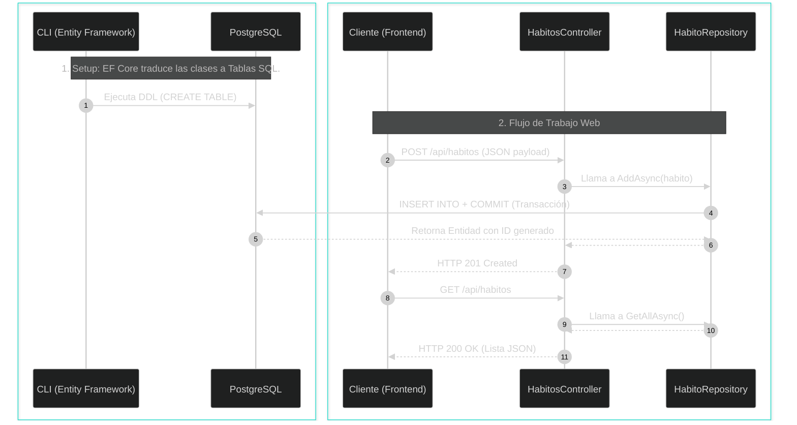

# 🌐 Clase 6: Migraciones Code-First, Protocolo HTTP y Controladores REST

## 📖 Teoría: Versionado de BD y Comunicación Cliente-Servidor

En el análisis y diseño de sistemas ágiles, la base de datos evoluciona iterativamente junto con el código. Atrás quedaron los días de pasar scripts SQL manuales. Como expertos en bases de datos relacionales, utilizamos el enfoque **Code-First con Migraciones**. Una migración es el "Git de la base de datos": lee nuestras entidades en C#, calcula la diferencia con el esquema actual y genera el código SQL para crear o modificar las tablas (DDL) de forma segura y versionada.

Una vez que la tabla existe, necesitamos exponerla a la web. Para ello creamos un **Controlador RESTful**. El controlador actúa como la capa de presentación de nuestra API: recibe la petición HTTP (React), delega las reglas de negocio al Repositorio (Capa de Aplicación) y devuelve un Código de Estado (Status Code).

### Flujo Secuencial: De la Petición a la Base de Datos



## 📚 Lectura: 
*   **Pro ASP.NET Core**, RESTful Web Services & Entity Framework Migrations.

## 💻 Desarrollo Práctico:

Vamos a dividir la práctica en dos grandes pasos: preparar la infraestructura de datos y luego exponerla a la web.

### Paso A: Generación y Ejecución de Migraciones
Como estamos usando Clean Architecture, el contexto de la base de datos vive en Infrastructure, pero las variables de entorno y el arranque están en la API. Debemos indicarle esto a la CLI de .NET.

```bash
# 1. Asegúrate de que el contenedor de PostgreSQL esté corriendo
# (Si no lo está, ve a /infra y ejecuta: docker-compose up -d)

# 2. Navega a la raíz de tu backend
cd backend

# 3. Crea la migración inicial (El plano arquitectónico de la BD)
dotnet ef migrations add InitialCreate --project HabitForge.Infrastructure --startup-project HabitForge.API

# 4. Aplica la migración a la base de datos (Ejecuta el SQL)
dotnet ef database update --project HabitForge.Infrastructure --startup-project HabitForge.API
```
Si inspeccionas PostgreSQL ahora, verás que la tabla `HabitosGlobales` ha sido creada respetando la normalización relacional.

### Paso B: Ampliación del Contrato y Creación del Controlador
Para probar los verbos `GET` y `POST`, necesitamos enseñarle a nuestro Repositorio cómo guardar datos.

**1. Actualizamos el Contrato (`backend/HabitForge.Application/Interfaces/IHabitoRepository.cs`):**

```csharp
using HabitForge.Domain.Entities;

namespace HabitForge.Application.Interfaces;

public interface IHabitoRepository {
    Task<IEnumerable<HabitoGlobal>> GetAllAsync();
    Task<HabitoGlobal> AddAsync(HabitoGlobal habito); // Agregamos el contrato para el POST
}
```

**2. Implementamos la Transacción SQL (`backend/HabitForge.Infrastructure/Repositories/HabitoRepository.cs`):**

```csharp
    // ... código anterior (constructor y GetAllAsync) ...

    public async Task<HabitoGlobal> AddAsync(HabitoGlobal habito) {
        await _context.HabitosGlobales.AddAsync(habito);
        
        // SaveChangesAsync envuelve la operación en una transacción SQL (COMMIT)
        await _context.SaveChangesAsync(); 
        
        return habito;
    }
}
```

**3. Construcción del Controlador RESTful (`backend/HabitForge.API/Controllers/HabitosController.cs`):**
Respetando el Principio de Responsabilidad Única (SRP), este controlador solo enruta tráfico, no sabe nada de cadenas de conexión ni de Entity Framework.

```csharp
using Microsoft.AspNetCore.Mvc;
using HabitForge.Application.Interfaces;
using HabitForge.Domain.Entities;

namespace HabitForge.API.Controllers;

[ApiController]
[Route("api/[controller]")]
public class HabitosController : ControllerBase {
    private readonly IHabitoRepository _repository;

    // El motor de inyección de .NET nos entrega la implementación concreta aquí
    public HabitosController(IHabitoRepository repository) {
        _repository = repository; 
    }

    // VERBO GET: Solicitar lectura de datos
    [HttpGet]
    public async Task<IActionResult> GetHabitos() {
        var habitos = await _repository.GetAllAsync();
        return Ok(habitos); // HTTP 200 OK
    }

    // VERBO POST: Solicitar creación de un recurso
    [HttpPost]
    public async Task<IActionResult> CrearHabito([FromBody] HabitoGlobal habito) {
        if (string.IsNullOrWhiteSpace(habito.Nombre)) {
            return BadRequest("El nombre del hábito es obligatorio."); // HTTP 400 Bad Request
        }

        var nuevoHabito = await _repository.AddAsync(habito);
        
        // Retorna HTTP 201 Created y especifica la ruta para consultar el recurso recién creado
        return CreatedAtAction(nameof(GetHabitos), new { id = nuevoHabito.Id }, nuevoHabito);
    }
}
```

---
[⬅️ Volver al índice de la fase](./index.md)
