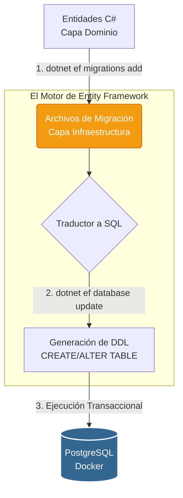

# 🌐 Clase 6: Migraciones Code-First, Protocolo HTTP y Controladores REST

## 📖 Teoría: Versionado de BD y Comunicación Cliente-Servidor

En el análisis y diseño de sistemas ágiles, la base de datos evoluciona iterativamente junto con el código. Atrás quedaron los días de pasar scripts SQL manuales. Como expertos en bases de datos relacionales, utilizamos el enfoque **Code-First con Migraciones**. Una migración es el "Git de la base de datos": lee nuestras entidades en C#, calcula la diferencia con el esquema actual y genera el código SQL para crear o modificar las tablas (DDL) de forma segura y versionada.

Una vez que la tabla existe, necesitamos exponerla a la web. Para ello creamos un **Controlador RESTful**. El controlador actúa como la capa de presentación de nuestra API: recibe la petición HTTP (React), delega las reglas de negocio al Repositorio (Capa de Aplicación) y devuelve un Código de Estado (Status Code).

### Flujo Arquitectónico: El Viaje de la Migración



## 📚 Lectura: 
*   **Pro ASP.NET Core**, RESTful Web Services & Entity Framework Migrations.

## 💻 Desarrollo Práctico:

Vamos a dividir la práctica en dos grandes pasos: preparar la infraestructura de datos y luego exponerla a la web.

### Paso A: Generación y Ejecución de Migraciones
Como estamos usando Clean Architecture, el contexto de la base de datos vive en Infrastructure, pero las variables de entorno y el arranque están en la API. Debemos indicarle esto a la CLI de .NET.

```bash
# 0. Agregamos la herramienta de diseño al proyecto de arranque
dotnet add HabitForge.API/HabitForge.API.csproj package Microsoft.EntityFrameworkCore.Design

# 1. Asegúrate de que el contenedor de PostgreSQL esté corriendo
# (Si no lo está, ve a la raíz y ejecuta: docker compose up -d)

# 2. Navega a la raíz de tu backend
cd backend

# 3. Crear un manifiesto de herramientas local (creará una carpeta oculta .config)
dotnet new tool-manifest

# 4. Instalar la herramienta CLI de Entity Framework anclada a este proyecto
dotnet tool install dotnet-ef

# 5. Crea la migración inicial (Genera la clase C# que representa el cambio)
dotnet ef migrations add InitialCreate --project HabitForge.Infrastructure --startup-project HabitForge.API

# 6. Aplica la migración a la base de datos (Convierte C# a SQL y lo ejecuta en Postgres)
dotnet ef database update --project HabitForge.Infrastructure --startup-project HabitForge.API
```
Si inspeccionas PostgreSQL ahora, verás que la tabla `HabitosGlobales` ha sido creada respetando la normalización relacional.

### Paso B: Ampliación del Contrato y Creación del Controlador
Para probar los verbos `GET` y `POST`, necesitamos enseñarle a nuestro Repositorio cómo guardar datos.

**1. Actualizamos el Contrato (`backend/HabitForge.Application/Interfaces/IHabitoRepository.cs`):**

```csharp
using HabitForge.Domain.Entities;

namespace HabitForge.Application.Interfaces;

public interface IHabitoRepository {
    Task<IEnumerable<HabitoGlobal>> GetAllAsync();
    Task<HabitoGlobal> AddAsync(HabitoGlobal habito); // Agregamos el contrato para el POST
}
```

**2. Implementamos la Transacción SQL (`backend/HabitForge.Infrastructure/Repositories/HabitoRepository.cs`):**

```csharp
    // ... código anterior (constructor y GetAllAsync) ...

    public async Task<HabitoGlobal> AddAsync(HabitoGlobal habito) {
        await _context.HabitosGlobales.AddAsync(habito);
        
        // SaveChangesAsync envuelve la operación en una transacción SQL (COMMIT)
        await _context.SaveChangesAsync(); 
        
        return habito;
    }
}
```

💡 **Importante: ¿Qué es la Inyección de Dependencias (DI)?**
Antes de crear el controlador, debemos entender cómo obtiene acceso a los datos. En programación tradicional, un controlador haría esto: `var repo = new HabitoRepository();`. Esto viola el Principio de Inversión de Dependencias (SOLID) porque "acopla" fuertemente el código.
En .NET, usamos un Contenedor de DI:

*   **El Registro (El Enchufe):** Le decimos al sistema: "Cuando alguien pida `IHabitoRepository`, entrégale `HabitoRepository`".
*   **La Inyección (El Electrodoméstico):** El Controlador solo pide la interfaz en su constructor. .NET detecta esta petición y le inyecta la clase mágicamente al arrancar.

**3. Construcción del Controlador RESTful (`backend/HabitForge.API/Controllers/HabitosController.cs`):**

Antes de programar nuestro controlador, es vital entender la anatomía de la web que implementaremos aquí.

**¿Qué es un Controlador?**
Imaginen el Controlador como el "Recepcionista" de un hotel (nuestra API). Su único trabajo es escuchar quién llega (petición HTTP), revisar qué necesita, delegar el trabajo al departamento correcto (Capa de Aplicación) y entregar la respuesta al cliente. ¡El recepcionista NO cocina ni limpia habitaciones! Por eso, un Controlador jamás debe tener reglas de negocio ni escribir SQL, respetando el Principio de Responsabilidad Única (SRP).

**Los Verbos HTTP (La Intención):**
*   **GET:** "Dame información" (Solo lectura).
*   **POST:** "Toma esta información y crea algo nuevo" (Insertar).
*   **PUT / PATCH:** "Actualiza este recurso" (Modificar).
*   **DELETE:** "Elimina este recurso" (Borrar).

**Códigos de Estado (Status Codes - La Respuesta):**
*   🟢 **200 OK:** Todo salió perfecto (Ideal para devoluciones de GET, PUT o DELETE).
*   🟢 **201 Created:** El recurso se creó exitosamente (Exclusivo para POST).
*   🟡 **400 Bad Request:** El cliente (React) envió datos vacíos o incorrectos.
*   🟡 **404 Not Found:** El recurso solicitado no existe en el servidor.
*   🔴 **500 Internal Server Error:** El código falló (Excepción). Como desarrolladores, nuestro trabajo es atrapar los errores antes de que el servidor colapse y devuelva un 500.

Ahora sí, construyamos nuestro código:

```csharp
using Microsoft.AspNetCore.Mvc;
using HabitForge.Application.Interfaces;
using HabitForge.Domain.Entities;

namespace HabitForge.API.Controllers;

[ApiController]
[Route("api/[controller]")] // Define la ruta: http://localhost:puerto/api/habitos
public class HabitosController : ControllerBase {
    private readonly IHabitoRepository _repository;

    // Inyección de Dependencias en acción
    public HabitosController(IHabitoRepository repository) {
        _repository = repository; 
    }

    // VERBO GET: Solicitar lectura de datos
    [HttpGet]
    public async Task<IActionResult> GetHabitos() {
        var habitos = await _repository.GetAllAsync();
        return Ok(habitos); // HTTP 200 OK
    }

    // VERBO POST: Solicitar creación de un recurso
    [HttpPost]
    public async Task<IActionResult> CrearHabito([FromBody] HabitoGlobal habito) {
        if (string.IsNullOrWhiteSpace(habito.Nombre)) {
            return BadRequest("El nombre del hábito es obligatorio."); // HTTP 400 Bad Request
        }

        var nuevoHabito = await _repository.AddAsync(habito);
        
        // HTTP 201 Created: Devuelve el recurso recién creado por cortesía RESTful
        return CreatedAtAction(nameof(GetHabitos), new { id = nuevoHabito.Id }, nuevoHabito);
    }
}
```

---
[⬅️ Volver al índice de la fase](./index.md)
