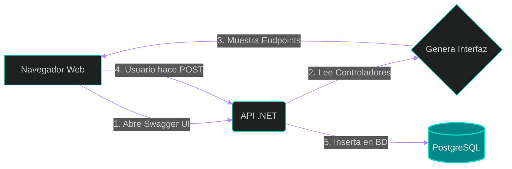

# 📜 Clase 7: Pruebas de API, Documentación (Swagger) y Flujo Completo

## 📖 Teoría: OpenAPI y Pruebas Unitarias Manuales

En un entorno ágil, el equipo de Frontend (React) no puede estar bloqueado esperando a que el equipo de Backend desarrolle un panel visual. Las APIs modernas deben ser autodocumentadas.

Para esto utilizamos el estándar **OpenAPI** (anteriormente conocido como Swagger). Swagger lee nuestro código en C#, detecta nuestros Controladores, Verbos y Rutas, y genera automáticamente una interfaz web interactiva. Desde allí, como ingenieros o QA, podemos enviar peticiones HTTP reales a la base de datos sin escribir una sola línea de código en el cliente.

### Análisis del Flujo de Pruebas



## 📚 Lectura: 
*   **Pro ASP.NET Core**, Advanced RESTful Web Services (OpenAPI & Swagger).

## 💻 Desarrollo Práctico:

Afortunadamente, al crear nuestro proyecto Web API en versiones modernas de .NET, la inyección de Swagger ya viene configurada por defecto en nuestro `Program.cs`. Ahora vamos a levantar el servidor y probar la obra maestra que construimos en las Clases 4, 5 y 6.

**1. Ejecutar el Servidor API:**
Navega a la carpeta de tu API y arranca la aplicación usando el perfil de desarrollo HTTP.

```bash
# Navegar a la API
cd backend/HabitForge.API

# Ejecutar el servidor
dotnet run
```
La terminal te indicará en qué puerto está escuchando la aplicación (generalmente `http://localhost:5000` o similar).

**2. Acceder a la Interfaz de Swagger:**
Abre tu navegador de internet y navega a la URL que te dio la terminal agregando `/swagger` al final:
`http://localhost:xxxx/swagger`

**3. Prueba de Flujo Completo (Laboratorio E2E del Backend):**

**Paso 1: POST (Crear un Hábito)**
1. Despliega el endpoint `POST /api/habitos` en Swagger.
2. Haz clic en **"Try it out"** (Probar).
3. En el cuerpo de la petición (JSON), envía un objeto como este:

```json
{
  "nombre": "Leer 20 páginas"
}
```
4. Haz clic en **"Execute"**. Si todo está bien arquitectado, verás un Status Code `201 Created`. ¡El registro ya está en PostgreSQL!

**Paso 2: GET (Leer los Hábitos)**
1. Despliega el endpoint `GET /api/habitos`.
2. Haz clic en **"Try it out"** y luego en **"Execute"**.
3. Verás un Status Code `200 OK` y un arreglo JSON devolviendo el hábito que acabas de crear, con su Id autogenerado por la base de datos.

---
[⬅️ Volver al índice de la fase](./index.md)
