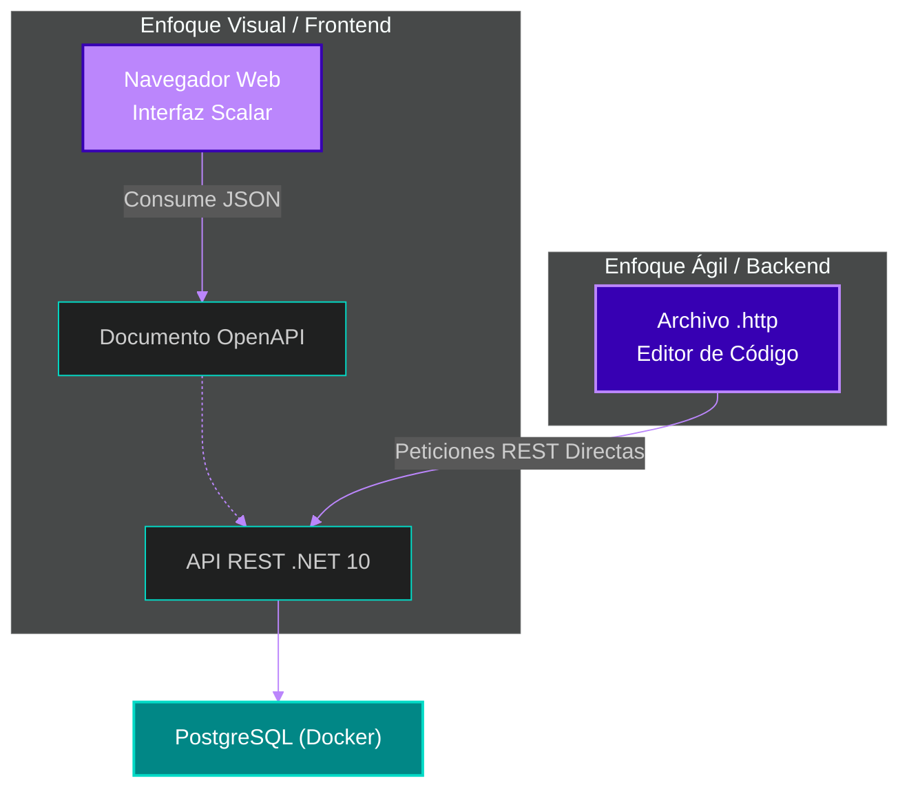

# 📜 Clase 7: Documentación (OpenAPI, Scalar) y Pruebas Ágiles (REST Client)

## 📖 Teoría: La Evolución del Testing en APIs RESTful

En el análisis y diseño de sistemas bajo metodologías ágiles, la documentación no es una fase al final del proyecto, sino un ente vivo que evoluciona con el código. Un equipo de Frontend (React) o de QA no puede estar bloqueado esperando a que el Backend termine su trabajo. Las APIs deben ser autodocumentadas y auto-ejecutables.

En el ecosistema de .NET 10, abordamos el testing y la documentación desde dos frentes profesionales:

*   **Enfoque Visual (Para QA, POs y Presentaciones):** Históricamente la industria usó "Swagger". Hoy, el estándar es generar la especificación nativa OpenAPI y consumirla mediante **Scalar**, una interfaz gráfica (UI) de vanguardia, interactiva y limpia, accesible desde el navegador.
*   **Enfoque Ágil e Integrado (Para Ingenieros Backend):** En lugar de depender de herramientas externas como Postman, utilizamos **archivos `.http`**. Estos archivos de texto plano viven dentro del repositorio de código, se versionan en Git y permiten ejecutar peticiones directas a la base de datos PostgreSQL sin salir del IDE.

### Arquitectura de Pruebas Duales



## 📚 Lectura: 
*   Documentación oficial de **Scalar** para ASP.NET Core y REST Client (Archivos `.http`).

## 💻 Desarrollo Práctico:

Vamos a configurar ambas estrategias de prueba en nuestro Monorepo para interactuar con la base de datos.

### Parte 1: Configuración Visual con Scalar

**1. Instalación del Paquete (Terminal):**
Navegamos a la carpeta de nuestra API e instalamos el paquete moderno de Scalar para integrarlo con OpenAPI.

```bash
cd backend/HabitForge.API
dotnet add package Scalar.AspNetCore
```

**2. Inyección en el Arranque (`HabitForge.API/Program.cs`):**
Actualizamos nuestro orquestador principal para que genere la documentación visual.

```csharp
using DotNetEnv;
using HabitForge.Infrastructure;
using Scalar.AspNetCore; // 1. Importamos Scalar

var builder = WebApplication.CreateBuilder(args);

Env.Load();
var connectionString = Environment.GetEnvironmentVariable("ConnectionStrings__PostgresConnection") 
                       ?? throw new InvalidOperationException("Falta la cadena de conexión.");

builder.Services.AddInfrastructure(connectionString);
builder.Services.AddControllers();

// 2. Generación nativa de OpenAPI (viene por defecto en .NET 10)
builder.Services.AddOpenApi(); 

var app = builder.Build();

if (app.Environment.IsDevelopment())
{
    // 3. Genera el documento JSON con el contrato de la API
    app.MapOpenApi();
    
    // 4. Levanta la interfaz gráfica moderna consumiendo ese JSON
    app.MapScalarApiReference(); 
}

app.MapControllers();
app.Run();
```

**3. Prueba Visual:**
Ejecuta el comando `dotnet run` en la terminal. Abre tu navegador y navega a `http://localhost:xxxx/scalar/v1` (reemplaza `xxxx` por el puerto de tu terminal). Verás un panel profesional donde puedes desplegar los endpoints y enviar datos de prueba.

### Parte 2: Pruebas Ágiles Integradas en el IDE
Para la velocidad de desarrollo del día a día, configuraremos nuestra suite de pruebas versionable.

**1. Adaptación del Archivo de Pruebas:**
En la raíz del proyecto `HabitForge.API`, el template generó un archivo llamado `HabitForge.API.http`. Ábrelo, borra todo el contenido (para evitar conflictos de variables de entorno en los distintos editores de código) y reemplázalo con nuestro dominio estricto:

```http
### 1. Obtener todos los hábitos (Prueba del Verbo GET)
# Nota: Cambia el puerto 5157 por el puerto real que te arroje la terminal
GET http://localhost:5157/api/habitos
Accept: application/json

### 2. Crear un nuevo hábito (Prueba del Verbo POST)
POST http://localhost:5157/api/habitos
Content-Type: application/json

{
  "nombre": "Estudiar Arquitectura Limpia y Event Sourcing"
}
```

**2. Ejecución desde el IDE:**
Si utilizas tu editor de código preferido, verás un botón de "Ejecutar Petición" (Send Request o el ícono de "Play") flotando junto a cada bloque de código HTTP.
Al hacer clic, el IDE ejecutará la llamada a la red, la API la procesará con Entity Framework, la insertará en PostgreSQL, y verás la respuesta de la base de datos aparecer directamente al costado de tu código.

---
[⬅️ Volver al índice de la fase](./index.md)
