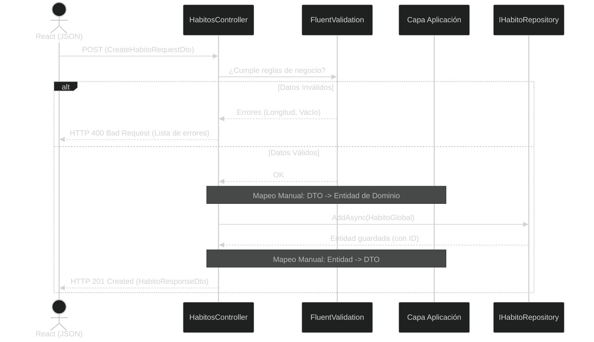

# 🛡️ Clase 8: Refactorización Ágil, DTOs, FluentValidation y Vertical Slicing

## 📖 Teoría: Seguridad de Fronteras y Organización por Funcionalidades

En el desarrollo de software empresarial, exponer nuestras Entidades de Dominio (las clases que mapea Entity Framework) directamente a los Controladores web es considerado un antipatrón crítico.

*   **Vulnerabilidad de Over-posting:** Si a futuro agregamos propiedades sensibles a nuestra entidad `HabitoGlobal` (como `bool AprobadoPorAdmin`), un usuario malicioso podría enviar ese campo en su JSON y la base de datos lo guardaría automáticamente.
*   **DTOs (Data Transfer Objects):** Son objetos planos, sin comportamiento, que actúan como "contratos de comunicación" entre el cliente (React) y nuestra API. Son un escudo protector. Solo exponen y reciben estrictamente lo que la funcionalidad requiere.
*   **Vertical Slicing en Aplicación:** En lugar de tener carpetas gigantes de "Todos los DTOs" y "Todos los Validadores", empezaremos a organizar nuestra capa de Aplicación por Funcionalidades (Features). Todo lo relacionado a un "Hábito" vivirá en su propia "rebanada" vertical.
*   **Validación Profesional:** Abandonaremos las validaciones manuales con `if` en los controladores y utilizaremos **FluentValidation**, el estándar de la industria en .NET para reglas de negocio limpias y testeables.

### Análisis del Flujo Seguro (El Escudo DTO)



## 📚 Lectura: 
*   Patrón DTO (Fowler), Documentación oficial de FluentValidation.

## 💻 Desarrollo Práctico:

Vamos a refactorizar nuestro código actual aplicando estas defensas perimetrales y organizando nuestra capa cerebral.

### Paso 1: Instalación de Librerías (Capa de Aplicación)
Como las reglas de validación y los contratos de entrada/salida son reglas de negocio, estas librerías se instalan en el proyecto de Aplicación, no en la API.

```bash
# Navegamos al proyecto de Aplicación
cd backend/HabitForge.Application

# Instalamos FluentValidation con soporte para Inyección de Dependencias
dotnet add package FluentValidation.DependencyInjectionExtensions
```

### Paso 2: Vertical Slicing (Creación de los Contratos)
Vamos a crear una estructura de carpetas orientada a la característica (Feature) de "Hábitos".

Crea la siguiente ruta de carpetas: `HabitForge.Application/Features/Habitos/DTOs/`

**A. El DTO de Salida (`HabitoResponseDto.cs`):** Lo que le enviamos al frontend.

```csharp
namespace HabitForge.Application.Features.Habitos.DTOs;

public class HabitoResponseDto {
    public int Id { get; set; }
    public string Nombre { get; set; } = string.Empty;
}
```

**B. El DTO de Entrada (`CreateHabitoRequestDto.cs`):** Lo que permitimos que el usuario nos envíe. Observa que NO tiene Id, porque el ID lo genera la base de datos. ¡Esto previene el Over-posting!

```csharp
namespace HabitForge.Application.Features.Habitos.DTOs;

public class CreateHabitoRequestDto {
    public string Nombre { get; set; } = string.Empty;
}
```

### Paso 3: Reglas de Negocio con FluentValidation
Crea la carpeta `HabitForge.Application/Features/Habitos/Validators/` y añade nuestro validador.

**El Validador (`CreateHabitoValidator.cs`):**

```csharp
using FluentValidation;
using HabitForge.Application.Features.Habitos.DTOs;

namespace HabitForge.Application.Features.Habitos.Validators;

public class CreateHabitoValidator : AbstractValidator<CreateHabitoRequestDto> {
    public CreateHabitoValidator() {
        RuleFor(x => x.Nombre)
            .NotEmpty().WithMessage("El nombre del hábito no puede estar vacío.")
            .MinimumLength(3).WithMessage("El hábito debe tener al menos 3 caracteres.")
            .MaximumLength(100).WithMessage("El hábito es demasiado largo.");
    }
}
```

### Paso 4: Inyección de Dependencias Limpia (Aplicación)
Igual que hicimos en Infraestructura, encapsulamos las inyecciones de la capa de Aplicación. Crea `HabitForge.Application/DependencyInjection.cs`:

```csharp
using FluentValidation;
using Microsoft.Extensions.DependencyInjection;

namespace HabitForge.Application;

public static class DependencyInjection {
    public static IServiceCollection AddApplication(this IServiceCollection services) {
        
        // Escanea y registra todos los validadores que existan en esta capa automáticamente
        services.AddValidatorsFromAssembly(typeof(DependencyInjection).Assembly);
        
        return services;
    }
}
```

> No olvides ir a `HabitForge.API/Program.cs` y agregar `builder.Services.AddApplication();` justo arriba de donde inyectaste la infraestructura.

### Paso 5: El Controlador Blindado (Refactor Final)
Ahora editamos `HabitForge.API/Controllers/HabitosController.cs`. Ya no recibe entidades de dominio, recibe DTOs; los valida, los mapea y los guarda.

```csharp
using FluentValidation;
using Microsoft.AspNetCore.Mvc;
using HabitForge.Application.Interfaces;
using HabitForge.Domain.Entities;
using HabitForge.Application.Features.Habitos.DTOs;

namespace HabitForge.API.Controllers;

[ApiController]
[Route("api/[controller]")]
public class HabitosController : ControllerBase {
    private readonly IHabitoRepository _repository;
    private readonly IValidator<CreateHabitoRequestDto> _validator;

    public HabitosController(IHabitoRepository repository, IValidator<CreateHabitoRequestDto> validator) {
        _repository = repository;
        _validator = validator;
    }

    [HttpGet]
    public async Task<IActionResult> GetHabitos() {
        var habitos = await _repository.GetAllAsync();
        
        // Mapeo Manual: Entidad -> DTO
        var response = habitos.Select(h => new HabitoResponseDto {
            Id = h.Id,
            Nombre = h.Nombre
        });

        return Ok(response);
    }

    [HttpPost]
    public async Task<IActionResult> CrearHabito([FromBody] CreateHabitoRequestDto request) {
        // 1. Ejecutar FluentValidation
        var validationResult = await _validator.ValidateAsync(request);
        if (!validationResult.IsValid) {
            return BadRequest(validationResult.Errors); // HTTP 400 automático con detalles
        }

        // 2. Mapeo Manual: DTO -> Entidad (Solo transferimos lo permitido)
        var nuevoHabito = new HabitoGlobal {
            Nombre = request.Nombre
        };

        // 3. Persistencia
        var habitoCreado = await _repository.AddAsync(nuevoHabito);
        
        // 4. Mapeo de Retorno
        var response = new HabitoResponseDto {
            Id = habitoCreado.Id,
            Nombre = habitoCreado.Nombre
        };

        return CreatedAtAction(nameof(GetHabitos), new { id = response.Id }, response);
    }
}
```

---
[⬅️ Volver al índice de la fase](./index.md)
