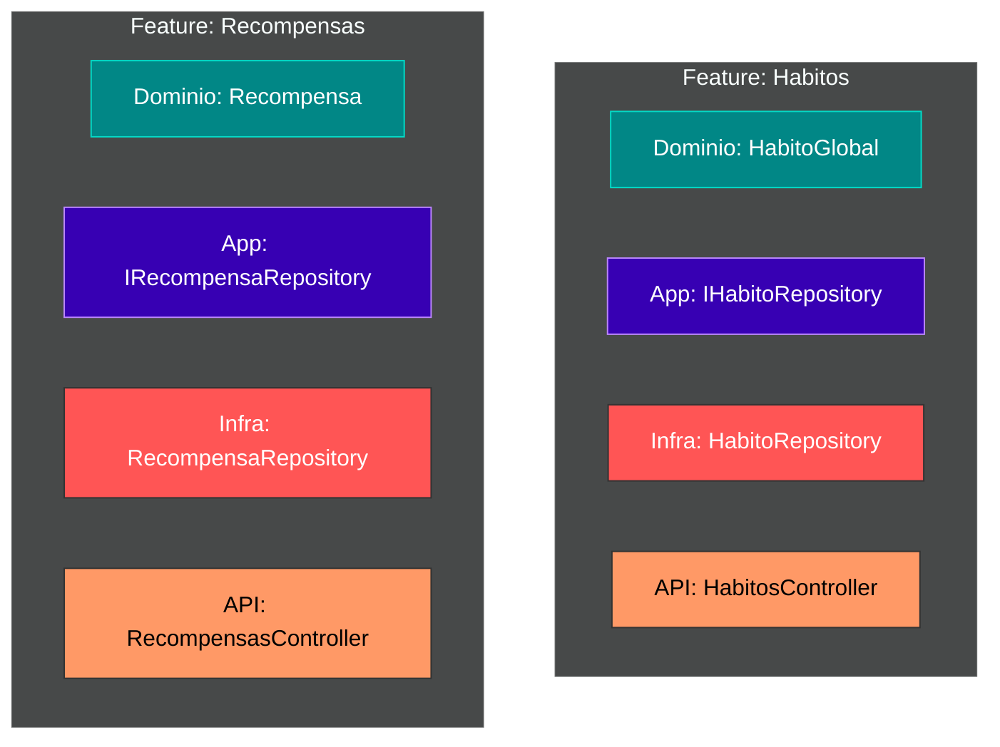

# 🔪 Clase 8: Evolución a Vertical Slicing

## 📖 Teoría:
Hasta ahora, hemos separado nuestro código por "capas técnicas" (Proyectos físicos para Domain, Application, Infrastructure). A medida que el MVP crezca, buscar archivos se volverá tedioso. 
El **Vertical Slicing** (Corte Vertical) organiza el código internamente por **Funcionalidad (Feature)**. Aunque seguimos respetando las reglas de dependencia de la *Clean Architecture*, agrupamos conceptualmente todo lo relacionado a un módulo.

*Beneficio:* Cuando pasemos a React en la Fase 3, nuestra estructura de carpetas será idéntica (`frontend/src/features/habitos`, `frontend/src/features/recompensas`).

## 💻 Desarrollo Práctico:
Los estudiantes reorganizarán el árbol de carpetas de sus proyectos físicos para reflejar estos módulos, asegurándose de que los *namespaces* se actualicen correctamente y el código siga compilando.

---
[⬅️ Volver al índice de la fase](./index.md)
