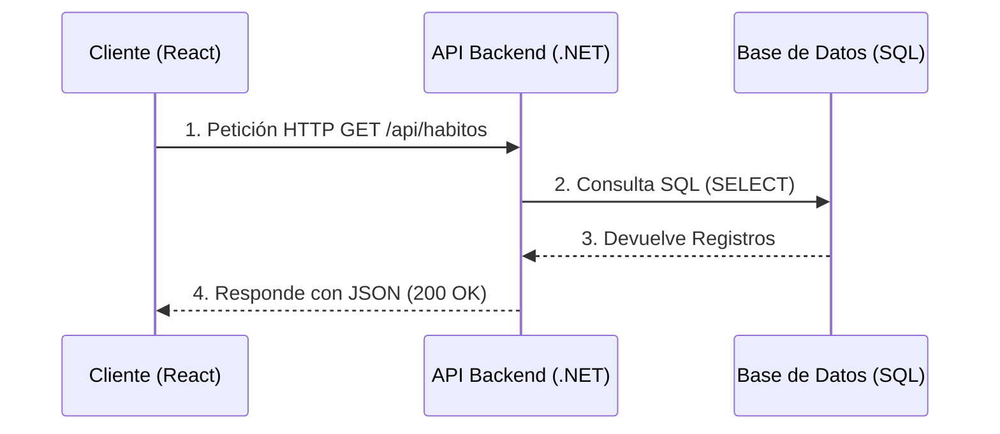
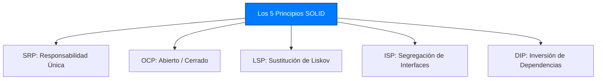
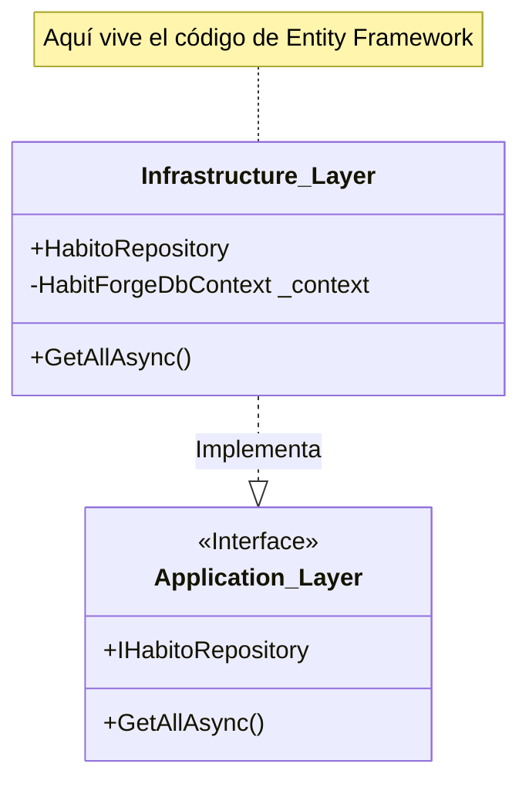
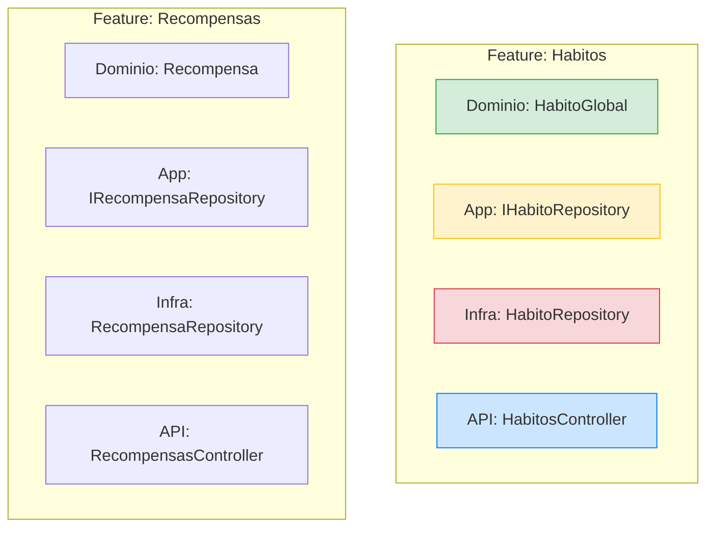

# 🚀 Proyecto Integrador: HabitForge (Habit Tracker Gamificado)

## 📌 1. Visión Global y Enunciado del Proyecto
**HabitForge** es una plataforma web gamificada diseñada para fomentar la disciplina y la construcción de rutinas positivas. A diferencia de un simple "To-Do List", el sistema recompensa la constancia: los usuarios registran sus hábitos diarios, acumulan "rachas" (días consecutivos) y desbloquean recompensas o cupones de forma automática al alcanzar metas configuradas por los administradores del sistema.

### Objetivo Académico
Este proyecto servirá como vehículo para aplicar de forma transversal los conceptos de Ingeniería de Software a lo largo del cuatrimestre. Su desarrollo exige la implementación de:
*   **Backend:** Arquitectura Limpia (*Clean Architecture*) y *Vertical Slicing* utilizando C# y .NET 9+.
*   **Frontend:** Interfaz de usuario reactiva, tipada y estructurada por funcionalidades (*Feature-Sliced Design*) utilizando React y TypeScript.
*   **Base de Datos:** Diseño relacional normalizado (3NF), integridad referencial y transacciones.
*   **Seguridad:** Control de Acceso Basado en Roles (RBAC) mediante JSON Web Tokens (JWT).

---

## 🎯 2. Definición del Producto Mínimo Viable (MVP)
Para garantizar la entrega funcional en un ciclo de desarrollo ágil de 10 semanas (30 sesiones), el alcance del proyecto se limita al MVP bajo las siguientes restricciones:

*   **Catálogo Centralizado:** Los usuarios no crearán sus propios hábitos personalizados. El sistema funcionará con un catálogo global de hábitos predefinidos por el administrador (Ej. "Leer 20 minutos", "Hacer ejercicio").
*   **Dos Roles de Seguridad:** 
    *   `Jugador`: Interactúa con el sistema marcando hábitos y ganando cupones.
    *   `GameMaster`: Administra el catálogo de recompensas y monitoriza el sistema.
*   **Motor de Rachas:** El cálculo de la consecución de metas (ej. "20 días seguidos") se ejecutará del lado del servidor (API) en el momento del registro (*Check-in*), garantizando la seguridad de la regla de negocio.
*   **Fuera de Alcance (MVP):** Integraciones con pasarelas de pago, notificaciones push en tiempo real y recuperación de contraseñas por correo electrónico.

---

## 📚 3. Épicas del Sistema (Epics)
Las funcionalidades de alto nivel se dividen en las siguientes 4 Épicas para facilitar su distribución en los *Sprints*.

*   **Épica 1: Identidad y Seguridad (IAM)**
    *   Todo lo relacionado con el registro de usuarios, autenticación, generación de tokens JWT y validación de roles (`Jugador` vs `GameMaster`).
*   **Épica 2: Motor de Hábitos (Core Tracking)**
    *   Visualización del catálogo de hábitos disponibles y el registro transaccional diario (*Check-in*) de cada usuario, validando que no existan registros duplicados en un mismo día.
*   **Épica 3: Gamificación y Recompensas**
    *   El motor algorítmico en el backend que calcula las rachas y la interfaz del usuario para visualizar su progreso y los cupones/códigos QR desbloqueados.
*   **Épica 4: Consola de Administración (Backoffice)**
    *   Panel de control exclusivo para el rol `GameMaster` que permite gestionar el inventario de recompensas (CRUD) y establecer las reglas de canje.

---

## 📝 4. Historias de Usuario (User Stories - HUs)

A continuación, el *Product Backlog* priorizado. Cada historia debe cumplir con sus Criterios de Aceptación (DoD - *Definition of Done*) para darse por terminada en el *Sprint Review*.

### Épica 1: Identidad y Seguridad
*   **HU-01: Registro de Usuarios**
    *   *Como* visitante, *quiero* registrarme con mi nombre, email y contraseña, *para* crear mi cuenta de Jugador.
    *   *Criterios de Aceptación:* Contraseña encriptada (Hash). Email único en la base de datos.
*   **HU-02: Inicio de Sesión (Login)**
    *   *Como* usuario registrado, *quiero* iniciar sesión con mis credenciales, *para* obtener acceso seguro al sistema.
    *   *Criterios de Aceptación:* El backend debe devolver un JWT firmado que incluya el `Rol` del usuario en sus *Claims*. El frontend debe proteger las rutas privadas.

### Épica 2: Motor de Hábitos
*   **HU-03: Visualización de Hábitos**
    *   *Como* Jugador, *quiero* ver una lista de los hábitos globales disponibles en mi panel (*Dashboard*), *para* saber qué rutinas puedo cumplir hoy.
    *   *Criterios de Aceptación:* La UI en React debe consumir el *endpoint* de la API y renderizar tarjetas.
*   **HU-04: Registro Diario (*Check-in*)**
    *   *Como* Jugador, *quiero* presionar un botón de "Completado" en un hábito específico, *para* registrar mi cumplimiento del día.
    *   *Criterios de Aceptación:* El sistema no debe permitir marcar el mismo hábito dos veces en la misma fecha (restricción en la base de datos y validación en API). La UI debe deshabilitar el botón tras el registro exitoso.

### Épica 3: Gamificación y Recompensas
*   **HU-05: Cálculo de Rachas (Regla de Negocio Core)**
    *   *Como* Sistema, *quiero* evaluar el historial del jugador tras cada *check-in*, *para* determinar si ha alcanzado la racha necesaria (Ej. 20 días continuos) y generarle un cupón automáticamente si cumple la meta.
    *   *Criterios de Aceptación:* Lógica implementada en la capa de Aplicación (*Clean Architecture*). Ejecución transaccional (guarda el registro y genera el cupón en el mismo bloque).
*   **HU-06: Billetera de Cupones**
    *   *Como* Jugador, *quiero* acceder a una sección de "Mis Premios" en la plataforma, *para* ver los códigos generados que puedo canjear en la vida real.
    *   *Criterios de Aceptación:* UI separada en React. Solo muestra los registros asociados al ID del usuario autenticado.

### Épica 4: Consola de Administración
*   **HU-07: Gestión de Recompensas (CRUD)**
    *   *Como* GameMaster, *quiero* una pantalla protegida donde pueda crear, leer, editar y eliminar recompensas (indicando título, racha requerida y stock), *para* mantener dinámico el juego.
    *   *Criterios de Aceptación:* La ruta en React debe expulsar a quien no sea GameMaster. El controlador de .NET debe rechazar peticiones HTTP (403 Forbidden) si el JWT no posee el rol adecuado.

***

# 📘 Fase 1: Arquitectura Limpia, Datos y API Core

Bienvenido a la Fase 1 del proyecto **HabitForge**. Durante estas semanas, sentaremos las bases de nuestro backend utilizando C# y .NET (utilizando la versión estable más reciente, .NET 9+). Pasaremos de conceptos fundamentales a una arquitectura empresarial moderna basada en un enfoque de Monorepo.

---

## 🚀 Clase 1: Intro a Web, Cliente-Servidor y Arquitectura API-First

📖 **Teoría:**
El desarrollo web moderno ya no mezcla la vista (HTML) con la lógica de base de datos en un solo lugar. Utilizamos una arquitectura **API-First**, donde el Backend (C#/.NET) se encarga exclusivamente de las reglas de negocio y los datos, exponiéndolos a través de una API REST. El Frontend (React) actuará como un cliente independiente que consume estos datos. Hoy definimos el alcance de nuestro MVP: un Habit Tracker Gamificado y estructuramos nuestro espacio de trabajo como un **Monorepo**.



📚 **Lectura:** *Pro ASP.NET Core 8*, Capítulo 1 y 2.

💻 **Desarrollo Práctico:**
1.  **Inicialización del Monorepo:** Creamos nuestro control de versiones y las carpetas principales. Un monorepo nos permite tener el backend y el frontend en el mismo repositorio, facilitando la gestión ágil del proyecto completo.
    ```bash
    git init
    # Estructura del Monorepo
    mkdir HabitForge
    cd HabitForge
    mkdir backend
    mkdir frontend
    
    # Creamos un README general
    echo "# HabitForge Monorepo" > README.md
    
    git add .
    git commit -m "Inicializando HabitForge Monorepo (Backend/Frontend)"
    ```
2.  **Revisión del Backlog:** Lectura de las Historias de Usuario (HU-01 a HU-07).

---

## 🧩 Clase 2: Principios SOLID y Código Limpio

📖 **Teoría:**
Antes de tirar código, debemos entender cómo hacer que este sea mantenible. Los principios **SOLID** son 5 reglas de diseño orientado a objetos. Hoy los conoceremos todos a nivel conceptual, y a lo largo del cuatrimestre, cada vez que apliquemos uno en nuestro proyecto, haremos una pausa para identificarlo.

1.  **S - Single Responsibility Principle (Responsabilidad Única):** Una clase debe tener una, y solo una, razón para cambiar. *(Ej: Un controlador maneja peticiones HTTP, no calcula rachas de hábitos).*
2.  **O - Open/Closed Principle (Abierto/Cerrado):** El software debe estar abierto a la extensión, pero cerrado a la modificación.
3.  **L - Liskov Substitution Principle (Sustitución de Liskov):** Las clases derivadas deben poder sustituir a sus clases base sin romper el sistema.
4.  **I - Interface Segregation Principle (Segregación de Interfaces):** Es mejor tener muchas interfaces pequeñas y específicas que una interfaz gigante y genérica.
5.  **D - Dependency Inversion Principle (Inversión de Dependencias):** Los módulos de alto nivel no deben depender de módulos de bajo nivel. Ambos deben depender de abstracciones (Interfaces).



📚 **Lectura:** *Clean Architecture* (Robert C. Martin), Parte 3: Design Principles.

💻 **Desarrollo Práctico:**
Veamos un ejemplo teórico de **Inversión de Dependencias (DIP)** (lo aplicaremos en código real en las próximas clases). En lugar de que un Controlador instancie directamente su conexión a la base de datos (`new Conexion()`), el framework le "inyecta" esa dependencia.

```csharp
// CONTRATO (Abstracción - La 'D' de SOLID)
public interface IHabitoService {
    string ObtenerMensaje();
}

// IMPLEMENTACIÓN (Detalle)
// Esta clase respeta el SRP (La 'S' de SOLID): Su única responsabilidad es proveer datos de hábitos.
public class HabitoService : IHabitoService {
    public string ObtenerMensaje() => "Motor de Hábitos Iniciado";
}

// En el Program.cs (lo veremos después), inyectamos la dependencia:
// builder.Services.AddScoped<IHabitoService, HabitoService>();
```

---

## 🏗️ Clase 3: Setup Backend (.NET) y Clean Architecture en el Monorepo

📖 **Teoría:**
¿Por qué dividimos nuestro proyecto en tantas carpetas o bibliotecas? La **Clean Architecture** aísla las reglas de negocio de los detalles técnicos (como la base de datos o el framework web). 

La regla de oro es la **Regla de Dependencia**: *El código fuente de las capas internas no puede saber absolutamente nada de las capas externas.*

*   **Dominio (Capa Interna):** Entidades puras del negocio (`Habito`, `Jugador`). No tiene dependencias. No sabe si usamos SQL o TXT.
*   **Aplicación (Capa Media):** Los Casos de Uso (Ej: *RegistrarCheckIn*). Conoce al Dominio, pero no sabe qué base de datos se usa. Define las *Interfaces* (La 'I' de SOLID) que la Infraestructura debe cumplir.
*   **Infraestructura y API (Capas Externas):** Aquí viven Entity Framework, SQL, y los Controladores REST. La Infraestructura apunta hacia la Aplicación para implementar sus interfaces.

```mermaid
graph TD
    subgraph Capa Externa (Detalles)
        API[Web API / Controladores HTTP]
        INFRA[Infraestructura / Entity Framework Core]
    end
    
    subgraph Capa Media (Casos de Uso)
        APP[Aplicación / Lógica de Negocio]
    end
    
    subgraph Capa Interna (Core)
        DOM[Dominio / Entidades de Negocio]
    end

    API -->|Depende de| APP
    INFRA -.->|Implementa las Interfaces de| APP
    APP -->|Depende de| DOM

    style DOM fill:#d4edda,stroke:#28a745,stroke-width:2px
    style APP fill:#fff3cd,stroke:#ffc107,stroke-width:2px
    style API fill:#cce5ff,stroke:#007bff,stroke-width:2px
    style INFRA fill:#f8d7da,stroke:#dc3545,stroke-width:2px
```
*(Nota en el diagrama: Observen cómo las flechas apuntan hacia el Dominio. El Dominio y la Aplicación nunca apuntan hacia afuera).*

📚 **Lectura:** *Clean Architecture*, Capítulo 22: The Clean Architecture.

💻 **Desarrollo Práctico:**
Creación estricta de la solución, sus proyectos y la configuración de las referencias dentro de nuestra carpeta `backend` para respetar la Regla de Dependencia, utilizando la CLI de .NET.

```bash
# Navegamos a la carpeta del backend
cd backend

# 1. Crear la Solución (El contenedor principal)
dotnet new sln -n HabitForge

# 2. Crear los proyectos individuales (Las Capas)
dotnet new classlib -n HabitForge.Domain
dotnet new classlib -n HabitForge.Application
dotnet new classlib -n HabitForge.Infrastructure
dotnet new webapi -n HabitForge.API

# 3. Agregar los proyectos a la Solución
# Esto permite que el IDE compile todos los proyectos juntos
dotnet sln add HabitForge.Domain/HabitForge.Domain.csproj
dotnet sln add HabitForge.Application/HabitForge.Application.csproj
dotnet sln add HabitForge.Infrastructure/HabitForge.Infrastructure.csproj
dotnet sln add HabitForge.API/HabitForge.API.csproj

# 4. Configurar la Regla de Dependencia (Referencias entre proyectos)

# Application depende de Domain
dotnet add HabitForge.Application/HabitForge.Application.csproj reference HabitForge.Domain/HabitForge.Domain.csproj

# Infrastructure depende de Application (Invierte la dependencia de BD)
dotnet add HabitForge.Infrastructure/HabitForge.Infrastructure.csproj reference HabitForge.Application/HabitForge.Application.csproj

# API depende de Application e Infrastructure (para poder inyectar las dependencias en el arranque)
dotnet add HabitForge.API/HabitForge.API.csproj reference HabitForge.Application/HabitForge.Application.csproj
dotnet add HabitForge.API/HabitForge.API.csproj reference HabitForge.Infrastructure/HabitForge.Infrastructure.csproj
```

---

## 🐳 Clase 4: Base de Datos con Docker, ORM y Variables de Entorno (12-Factor App)

📖 **Teoría:**
En el desarrollo moderno, aplicamos la metodología **12-Factor App**. El factor número 3 dicta que **toda la configuración que varía entre entornos (como las contraseñas de la base de datos) debe guardarse en Variables de Entorno**, nunca en el código fuente. 

Hoy levantaremos una instancia de **PostgreSQL** usando **Docker**, pero inyectaremos las credenciales dinámicamente. Luego, usaremos Entity Framework Core (ORM) en nuestra capa de **Infraestructura** para conectarnos a ella, leyendo la cadena de conexión desde el entorno del sistema operativo y no desde un texto estático.

```mermaid
graph TD
    ENV[.env (Variables de Entorno) <br/> Ignorado por Git]
    
    subgraph Docker
        DB[(PostgreSQL)]
    end
    
    subgraph API .NET
        APP[appsettings.json <br/> Configuración Base]
        EF[Entity Framework Core]
    end
    
    ENV -.->|Inyecta Credenciales| DB
    ENV -.->|Sobrescribe ConnectionString| APP
    APP -->|Provee ruta| EF
    EF -->|Genera SQL| DB
    
    style ENV fill:#f8d7da,stroke:#dc3545,stroke-width:2px
    style DB fill:#336791,stroke:#fff,stroke-width:2px,color:#fff
    style EF fill:#68217A,stroke:#fff,stroke-width:2px,color:#fff
```

📚 **Lectura:** *Pro ASP.NET Core 8*, Using Entity Framework Core & Configuration. Documentación oficial de la metodología *12-Factor App*.

💻 **Desarrollo Práctico:**

**1. El Archivo de Secretos (`.env`) y la Seguridad:**
En la raíz de la carpeta `backend`, creamos un archivo llamado `.env`. **¡Regla de oro:** Este archivo DEBE ser agregado inmediatamente a `.gitignore` para no subirlo al repositorio!
```text
# backend/.env
POSTGRES_USER=admin
POSTGRES_PASSWORD=SuperSecretPassword123!
POSTGRES_DB=HabitForgeDB

# Variable de entorno que ASP.NET Core leerá automáticamente:
ConnectionStrings__PostgresConnection="Host=localhost;Database=HabitForgeDB;Username=admin;Password=SuperSecretPassword123!"
```

**2. Levantando PostgreSQL con Docker Compose:**
Creamos nuestro `docker-compose.yml` en la carpeta `backend` para que lea las variables de entorno en lugar de tener las contraseñas quemadas.
```yaml
# backend/docker-compose.yml
version: '3.8'
services:
  db-habitforge:
    image: postgres:15-alpine
    container_name: postgres-habitforge
    env_file:
      - .env # Inyecta las variables de entorno aquí
    ports:
      - "5432:5432"
    volumes:
      - postgres_data:/var/lib/postgresql/data

volumes:
  postgres_data:
```
*Comando a ejecutar (asegúrate de estar en `backend/`):* `docker-compose up -d`

**3. Configurando la API en .NET (`backend/HabitForge.API/appsettings.json`):**
En .NET, el `appsettings.json` debe tener solo valores de referencia o para desarrollo local no sensible. Durante la compilación y despliegue (CI/CD), .NET es lo suficientemente inteligente para sobrescribir este valor si encuentra una variable de entorno en el sistema operativo llamada `ConnectionStrings__PostgresConnection` (nota el doble guion bajo).
```json
{
  "ConnectionStrings": {
    "PostgresConnection": "Host=localhost;Database=HabitForgeDB;Username=developer;Password=REEMPLAZAR_EN_PRODUCCION"
  }
}
```

**4. La Entidad de Dominio (`backend/HabitForge.Domain/Entities/HabitoGlobal.cs`):**
```csharp
namespace HabitForge.Domain.Entities;

public class HabitoGlobal {
    public int Id { get; set; }
    public string Nombre { get; set; } = string.Empty;
}
```

**5. El Contexto de Base de Datos (`backend/HabitForge.Infrastructure/Data/HabitForgeDbContext.cs`):**
Entity Framework se encargará de mapear nuestra clase C# a una tabla real en PostgreSQL.
```csharp
using Microsoft.EntityFrameworkCore;
using HabitForge.Domain.Entities;

namespace HabitForge.Infrastructure.Data;

public class HabitForgeDbContext : DbContext {
    public HabitForgeDbContext(DbContextOptions<HabitForgeDbContext> options) : base(options) { }
    
    public DbSet<HabitoGlobal> HabitosGlobales { get; set; }
}
```

---

## 🧩 Clase 5: Casos de Uso, Controladores y el Patrón Repositorio

📖 **Teoría (Respondiendo al "Dónde" arquitectónico):**
Para cumplir con el **Principio de Inversión de Dependencias (D)**, debemos aislar la base de datos de nuestra lógica.
*   **¿Dónde se define la Interfaz (El Contrato)?:** Se define en la capa de **Aplicación**. La aplicación dicta *qué* necesita (Ej: "Necesito una lista de hábitos"), pero no le importa *cómo* se obtiene.
*   **¿Dónde se implementa?:** Se implementa en la capa de **Infraestructura**. Aquí escribimos el código real que usa Entity Framework para hablar con Postgres.
*   **¿Dónde se conectan?:** En el archivo `Program.cs` de la **API**, configuramos el inyector de dependencias.



💻 **Desarrollo Práctico:**

**1. El Contrato en Application (`backend/HabitForge.Application/Interfaces/IHabitoRepository.cs`):**
```csharp
using HabitForge.Domain.Entities;

namespace HabitForge.Application.Interfaces;

public interface IHabitoRepository {
    Task<IEnumerable<HabitoGlobal>> GetAllAsync();
}
```

**2. La Implementación en Infrastructure (`backend/HabitForge.Infrastructure/Repositories/HabitoRepository.cs`):**
```csharp
using Microsoft.EntityFrameworkCore;
using HabitForge.Application.Interfaces;
using HabitForge.Domain.Entities;
using HabitForge.Infrastructure.Data;

namespace HabitForge.Infrastructure.Repositories;

public class HabitoRepository : IHabitoRepository {
    private readonly HabitForgeDbContext _context;
    
    public HabitoRepository(HabitForgeDbContext context) {
        _context = context;
    }

    public async Task<IEnumerable<HabitoGlobal>> GetAllAsync() {
        return await _context.HabitosGlobales.ToListAsync();
    }
}
```

**3. Inyectando todo en la API (`backend/HabitForge.API/Program.cs`):**
```csharp
using Microsoft.EntityFrameworkCore;
using HabitForge.Infrastructure.Data;
using HabitForge.Application.Interfaces;
using HabitForge.Infrastructure.Repositories;

var builder = WebApplication.CreateBuilder(args);

// A. Configuramos la conexión a PostgreSQL
builder.Services.AddDbContext<HabitForgeDbContext>(options =>
    options.UseNpgsql(builder.Configuration.GetConnectionString("PostgresConnection")));

// B. Registramos la Inversión de Dependencias (DIP)
// "Cuando alguien pida IHabitoRepository, entrégale un HabitoRepository"
builder.Services.AddScoped<IHabitoRepository, HabitoRepository>();

builder.Services.AddControllers();
var app = builder.Build();
app.MapControllers();
app.Run();
```

---

## 🌐 Clase 6: Protocolo HTTP (Verbos y Status Codes)

📖 **Teoría:**
El Controlador (en la capa de API) es el punto de entrada de nuestro sistema. Su **única responsabilidad (SRP)** es recibir peticiones HTTP, llamar al contrato de Aplicación (`IHabitoRepository`) y devolver el código de estado HTTP adecuado (200 OK, 404 Not Found).

📚 **Lectura:** *Pro ASP.NET Core 8*, RESTful Web Services.

💻 **Desarrollo Práctico:**
Creación del Controlador (`backend/HabitForge.API/Controllers/HabitosController.cs`):
```csharp
using Microsoft.AspNetCore.Mvc;
using HabitForge.Application.Interfaces;

namespace HabitForge.API.Controllers;

[ApiController]
[Route("api/[controller]")]
public class HabitosController : ControllerBase {
    private readonly IHabitoRepository _repository;

    // El framework inyecta la dependencia aquí automáticamente
    public HabitosController(IHabitoRepository repository) {
        _repository = repository;
    }

    [HttpGet]
    public async Task<IActionResult> GetHabitos() {
        var habitos = await _repository.GetAllAsync();
        return Ok(habitos); // HTTP 200
    }
}
```

---

## 📜 Clase 7: Pruebas de API y Documentación (Swagger)

📖 **Teoría:**
En un entorno ágil, el equipo de Frontend (React) no puede esperar a que el Backend desarrolle un panel visual para saber cómo consumir la API. Integramos Swagger (OpenAPI) para auto-documentar nuestros *endpoints* y permitir pruebas directas desde el navegador.

📚 **Lectura:** *Pro ASP.NET Core 8*, Advanced RESTful Web Services.

💻 **Desarrollo Práctico:**
Habilitando Swagger en `backend/HabitForge.API/Program.cs`.
```csharp
// Antes de var app = builder.Build();
builder.Services.AddEndpointsApiExplorer();
builder.Services.AddSwaggerGen();

// Después de var app = builder.Build();
if (app.Environment.IsDevelopment()) {
    app.UseSwagger();
    app.UseSwaggerUI(); 
}
// Ejecutar el proyecto y navegar a https://localhost:puerto/swagger
```

---

## 🔪 Clase 8: Evolución a Vertical Slicing

📖 **Teoría:**
Hasta ahora, hemos separado nuestro código por "capas técnicas" (Proyectos físicos para Domain, Application, Infrastructure). A medida que el MVP crezca, buscar archivos se volverá tedioso. 
El **Vertical Slicing** (Corte Vertical) organiza el código internamente por **Funcionalidad (Feature)**. Aunque seguimos respetando las reglas de dependencia de la *Clean Architecture*, agrupamos conceptualmente todo lo relacionado a un módulo.


*Beneficio:* Cuando pasemos a React en la Fase 3, nuestra estructura de carpetas será idéntica (`frontend/src/features/habitos`, `frontend/src/features/recompensas`).

💻 **Desarrollo Práctico:**
Los estudiantes reorganizarán el árbol de carpetas de sus proyectos físicos para reflejar estos módulos, asegurándose de que los *namespaces* se actualicen correctamente y el código siga compilando.

---

## 🛠️ Clase 9: Laboratorio Back-End (Pre-evaluación)

📖 **Teoría:**
Cierre del primer ciclo ágil. Simulación de un *Sprint Review* técnico. Aplicamos *Peer Review* (revisión de código cruzada entre equipos) para garantizar que los estándares arquitectónicos se están cumpliendo antes de pasar a la seguridad (Tokens JWT).

💻 **Desarrollo Práctico:**
Checklist del equipo para aprobar la Fase 1:
- [ ] La estructura del monorepo (`backend/`, `frontend/`) está definida.
- [ ] `docker-compose up -d` (dentro de `backend/`) levanta Postgres sin errores usando variables del `.env`.
- [ ] Entity Framework aplica la migración inicial (`dotnet ef database update`).
- [ ] La interfaz `IHabitoRepository` vive en la capa correcta y es inyectada mediante `AddScoped`.
- [ ] La API devuelve un JSON 200 OK probado desde Swagger.
- [ ] Ninguna clase del `Domain` tiene referencias (usings) a `Microsoft.EntityFrameworkCore`.
