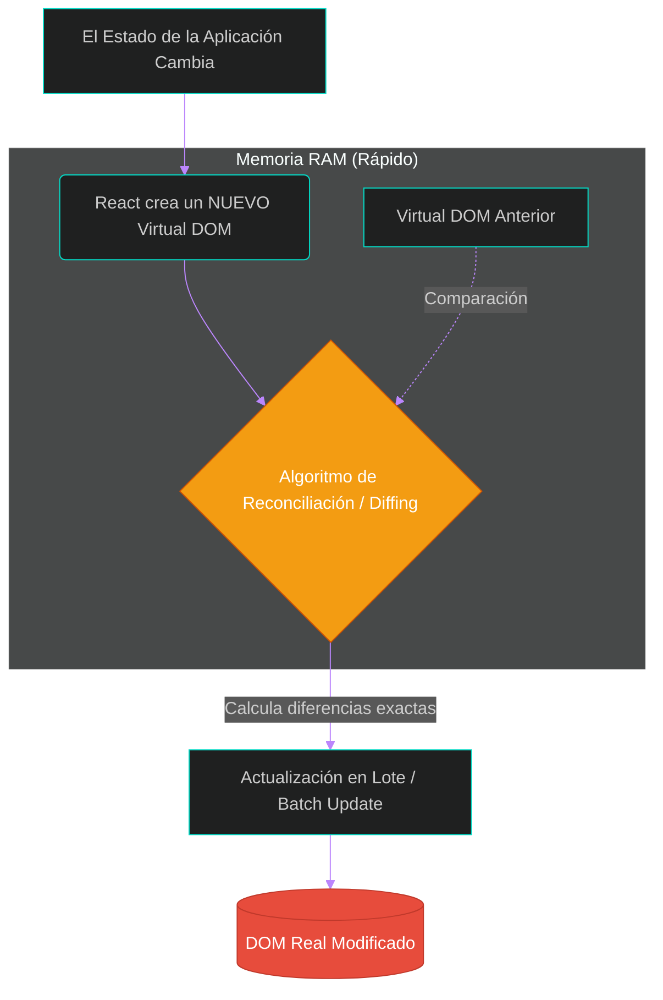

# ⚛️ Clase 10: Desarrollo Frontend Moderno, Virtual DOM y Arquitectura de Proyecto

## 📖 Teoría: Anatomía del Navegador y el Motor de React

En arquitecturas API-First, el servidor (.NET) entrega datos (JSON), y el navegador asume la renderización. Para entender por qué la industria estandarizó React para esta tarea, debemos analizar el problema de rendimiento de los navegadores clásicos.

### 1. El Problema del DOM Real (Document Object Model)
El DOM es la representación en forma de árbol que el navegador construye a partir del HTML. Cada vez que cambiamos un dato mediante JavaScript tradicional (ej. jQuery), el navegador debe recalcular posiciones, colores y repintar la pantalla (procesos llamados Reflow y Repaint). Modificar el DOM directamente es una operación computacionalmente costosa y lenta.

### 2. La Solución: El Virtual DOM y el Proceso de Reconciliación
React intercepta este problema creando un Virtual DOM: una copia exacta, pero ligera y en memoria RAM (sin renderizado gráfico).
Cuando los datos cambian, React actualiza su Virtual DOM. Luego, ejecuta un algoritmo llamado Diffing (comparación) para detectar exactamente qué nodos cambiaron respecto a la versión anterior. Finalmente, aplica una "actualización en lote" (Batch Update) al DOM Real, modificando únicamente lo estrictamente necesario.

#### Flujo Arquitectónico del Virtual DOM



## 💻 Desarrollo Práctico: Inicialización y Análisis Estructural
Vamos a crear el proyecto Frontend que vivirá dentro de nuestro Monorepo, utilizando Vite (el estándar de compilación ágil moderno que reemplaza a Webpack, ofreciendo recarga en milisegundos).

### Paso 1: Verificación del Entorno (Node.js)
Para trabajar con React y Vite, necesitamos que nuestro sistema operativo entienda el ecosistema de JavaScript. En la terminal, verifica que tienes instalado Node.js:

```bash
node -v
npm -v
```

### Paso 2: Scaffolding con Vite, TypeScript y Calidad de Código
Navega a la raíz de tu monorepo (fuera de la carpeta backend) y ejecuta el comando de creación de Vite utilizando el gestor de paquetes optimizado:

```bash
pnpm create vite@latest frontend
```

*(Nota: Vite te hará una serie de preguntas interactivas en la terminal. Responde lo siguiente):*

* **Framework**: Selecciona React.
* **Variant**: Selecciona TypeScript + React Compiler (El nuevo estándar de compilación de React).
* **Linter**: Selecciona ESLint.

> [!NOTE]
> **Nota del Arquitecto (¿Por qué pnpm, TypeScript y ESLint?)**
> 1. **Optimización de Disco (pnpm)**: Usamos pnpm en lugar del tradicional npm por optimización de hardware. npm duplica la pesada carpeta node_modules en cada proyecto. pnpm utiliza enlaces duros (hard links) hacia un almacén global, instalando las librerías una sola vez y ahorrando gigabytes de disco.
> 2. **Contratos Seguros (TypeScript + ESLint)**: En nuestro backend, C# no nos deja compilar si enviamos un String en lugar de un Int. En la web, JavaScript permite esos errores silenciosos. Al combinar TypeScript (tipado estricto) con ESLint (análisis estático), blindamos el Frontend. Si el backend exige un DTO con Id y Nombre, TypeScript nos obligará a enviar exactamente eso, garantizando la consistencia del contrato.
> 3. **React Compiler**: Es una mejora de rendimiento desarrollada por Meta para React 19 que optimiza el proceso de renderizado.

```bash
# Navegamos hacia la nueva carpeta
cd frontend

# Instalamos todas las dependencias del motor con pnpm
pnpm install
```

### Paso 3: Análisis Forense de la Estructura TypeScript
Abre la nueva carpeta frontend en tu IDE. Esta es la radiografía de un proyecto React fuertemente tipado:

* **📁 src/ (Source)**: El corazón de la aplicación.
* **📄 main.tsx**: El Punto de Entrada (Entry Point). Archivo `.tsx` (TypeScript + JSX). Aquí React toma el componente raíz y lo inyecta en el HTML.
* **📄 App.tsx**: El Componente Raíz. Todas las vistas y rutas nacerán como hijos de este archivo.
* **📄 vite-env.d.ts**: Archivo de definiciones de TypeScript. Le enseña al compilador a entender variables de entorno y archivos estáticos de Vite.
* **📄 tsconfig.json / tsconfig.app.json**: El cerebro de TypeScript. Actúa como las reglas de compilación de nuestro Frontend, dictando qué tan estricto será el tipado.
* **📄 index.html**: El lienzo en blanco con nuestro `<div id="root"></div>`.
* **📄 package.json**: El Manifiesto del proyecto (similar al `.csproj` de .NET).
* **📄 pnpm-lock.yaml**: El archivo que congela las versiones exactas de las dependencias, garantizando que el proyecto funcione idéntico en cualquier otra computadora.

### Paso 4: Levantando el Entorno de Desarrollo
Ejecutamos el servidor local de Vite:

```bash
pnpm run dev
```

Al navegar a `http://localhost:5173`, veremos nuestra aplicación corriendo.

---
[⬅️ Volver al índice de la fase](./index.md)
