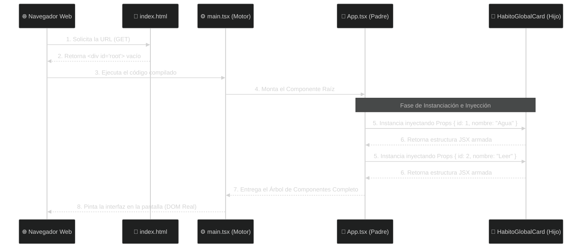

# ⚛️ Clase 11: Componentes Funcionales, JSX y Props

## 📖 Teoría: Interfaces Declarativas y Reutilización

En la ingeniería web tradicional (Vanilla JavaScript o jQuery), programábamos de forma Imperativa: dábamos instrucciones paso a paso al navegador sobre cómo manipular el DOM (`createElement`, `classList.add`, `appendChild`). Esto resultaba en código espagueti difícil de mantener.

React cambia el paradigma hacia la Programación Declarativa: nosotros solo diseñamos "qué" queremos ver en pantalla, y el motor de React se encarga de las manipulaciones complejas del Virtual DOM para hacerlo realidad.

Para lograr esto, React utiliza dos conceptos fundamentales:

*   **Componentes Funcionales:** Son simplemente funciones de JavaScript/TypeScript que retornan una porción de la interfaz de usuario. Al dividir un sistema visual complejo en componentes pequeños (ej. Tarjeta, Botón, Menú), logramos una reutilización extrema.
*   **JSX (JavaScript XML):** Es una extensión de la sintaxis. Parece HTML puro, pero bajo el capó tiene todo el poder lógico de JavaScript. Nos permite escribir la estructura visual y la lógica en un mismo archivo de forma armónica.

### ⚙️ Arquitectura de Ejecución: El Ciclo de Renderizado
Como analistas de sistemas, debemos entender el hilo de ejecución exacto. ¿Qué pasa realmente cuando un usuario entra a nuestra aplicación React?

1.  **La Petición Inicial:** El navegador del usuario solicita la página. El servidor web entrega un archivo `index.html` casi vacío que solo contiene un `<div id="root"></div>`.
2.  **El Punto de Arranque (`main.tsx`):** El navegador descarga el JavaScript compilado. El archivo `main.tsx` toma el control, busca el div vacío y "monta" el motor de React allí.
3.  **El Orquestador (`App.tsx`):** React llama al componente maestro (`App`). Este componente evalúa qué interfaz debe mostrar.
4.  **Instanciación e Inyección (Props):** Al leer el código, `App.tsx` se da cuenta de que necesita dibujar varias Tarjetas del Catálogo. Entonces, instancia (llama a la función) el componente `HabitoGlobalCard` múltiples veces, inyectándole a cada uno parámetros diferentes (las famosas Props).
5.  **El Pintado Final (DOM):** Cada tarjeta procesa sus parámetros y devuelve JSX. React recolecta todo, arma el Virtual DOM y finalmente lo "pinta" en la pantalla.

#### Diagrama de Flujo: Del Navegador a la Pantalla


💡 **Importante: La Analogía de la Plantilla de Diploma (Props)**
Para consolidar cómo los componentes se comunican (Paso 5 del diagrama), usemos la analogía de la oficina de Registro de la UNAH:

*   📄 **El Componente (La Plantilla):** Imagina el diseño base de un Diploma universitario (pergamino, logos, firmas impresas). Ese diseño se programa una sola vez.
*   ✍️ **Las Props (Los Parámetros):** Son los datos específicos de cada estudiante (Nombre, Carrera). Las "Props" (Propiedades) son los parámetros que le pasamos desde afuera a la plantilla para llenarla de información real.
*   🔒 **Inmutabilidad:** En React, las Props son de solo lectura. El componente hijo no puede modificar las props que le enviaron, así como un estudiante no puede alterar su propio diploma impreso.

### 🔬 La Anatomía Arquitectónica de un Componente
Antes de programar, debemos entender que un archivo de componente en React no es texto desordenado. Se divide estrictamente en 4 zonas arquitectónicas:

1.  **La Interfaz (El Contrato TypeScript):** Al igual que creamos DTOs en C#, aquí definimos un `interface`. Es el contrato que dicta exactamente qué datos (Props) exige el componente para funcionar.
2.  **La Firma y Exportación (`export` vs `export default`):** Es la declaración de la función.
    *   Usamos `export function Nombre()` (Exportación Nombrada) para componentes hijos, evitando errores tipográficos al obligar a usar su nombre exacto.
    *   Usamos `export default` para vistas principales (`App.tsx`).
3.  **El Cerebro (Lógica Local):** Es el espacio entre la firma de la función y la palabra `return`. Aquí declaramos variables temporales o funciones auxiliares (ej. qué hacer al hacer clic en un botón).
4.  **El Renderizado (El `return`):** Es la frontera final. Todo lo que esté dentro del `return()` será convertido en JSX y entregado al motor de React para pintarse en pantalla.

## 💻 Desarrollo Práctico: Creación del Componente (Espejo del Catálogo)

Como analizamos en la Unidad 1, nuestro backend expone un catálogo estático (`HabitosGlobales`). En entornos ágiles, el Frontend debe ser un reflejo exacto de las capacidades actuales del servidor. No inventaremos datos (como progreso o usuarios) que el backend aún no gestiona.

Vamos a crear un componente que sea el espejo exacto de nuestra tabla de base de datos.

**1. Limpieza del Entorno Base (`App.tsx`)**
Abre el archivo maestro `src/App.tsx`, borra todo su contenido y déjalo como un lienzo limpio:

```tsx
// src/App.tsx
import './App.css'

function App() {
  // Zona 3: El Cerebro (Vacío por ahora)

  // Zona 4: El Renderizado
  return (
    <main>
      <h1>Catálogo Global de Hábitos</h1>
    </main>
  )
}

export default App
```

**2. Creación del Contrato y el Componente (`HabitoGlobalCard.tsx`)**
Crea una carpeta `components` dentro de `src` para mantener el orden. Luego, crea el archivo `src/components/HabitoGlobalCard.tsx` y observa las 4 zonas en acción:

```tsx
// src/components/HabitoGlobalCard.tsx

// --- ZONA 1: EL CONTRATO (INTERFAZ) ---
// Actúa como un espejo exacto de nuestra tabla PostgreSQL / DTO en C#.
// Nuestra tabla actual solo tiene Id y Nombre.
interface HabitoGlobalProps {
    id: number;
    nombre: string;
}

// --- ZONA 2: LA FIRMA (EXPORTACIÓN NOMBRADA) ---
// Desestructuramos las props cumpliendo el contrato de HabitoGlobalProps
export function HabitoGlobalCard({ id, nombre }: HabitoGlobalProps) {
    
    // --- ZONA 3: EL CEREBRO (LÓGICA) ---
    // (Vacío por los momentos, este componente es puramente presentacional)
    
    // --- ZONA 4: EL RENDERIZADO (JSX) ---
    return (
        <article className="habit-card" style={{ border: '1px solid #ccc', padding: '1rem', margin: '1rem', borderRadius: '8px' }}>
            <small style={{ color: 'gray' }}>ID Catálogo: {id}</small>
            <h3>{nombre}</h3>
            
            {/* 
               En la Unidad 3, cuando tengamos sistema de Usuarios (IAM), 
               este botón llamará a la tabla transaccional para adoptar el hábito.
            */}
            <button disabled style={{ cursor: 'not-allowed' }}>
                Adoptar Hábito (Próximamente)
            </button>
        </article>
    );
}
```

**3. Inyección de Props desde el Padre**
Regresamos a `src/App.tsx`. Importamos nuestra `HabitoGlobalCard` y la instanciamos múltiples veces, inyectándole datos diferentes (Props). Por ahora, en este Sprint, inyectaremos los datos manualmente (Mocking), preparando el terreno para la siguiente clase donde estos datos vendrán directamente de nuestra base de datos.

```tsx
// src/App.tsx
import './App.css'
import { HabitoGlobalCard } from './components/HabitoGlobalCard'

function App() {
  return (
    <main>
      <h1>Catálogo Global de Hábitos</h1>
      <p>Explora los hábitos disponibles en nuestra base de datos.</p>
      
      {/* Reutilización del componente cumpliendo estrictamente el contrato (Id, Nombre) */}
      <section className="habits-container">
        
        <HabitoGlobalCard id={1} nombre="Beber 2 Litros de Agua" />
        <HabitoGlobalCard id={2} nombre="Hacer 30 minutos de ejercicio" />
        <HabitoGlobalCard id={3} nombre="Leer 10 páginas de un libro" />

      </section>
    </main>
  )
}

export default App
```

---
[⬅️ Volver al índice de la fase](./index.md)
