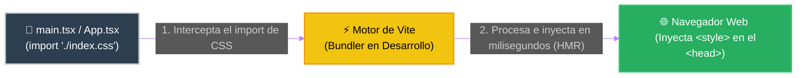
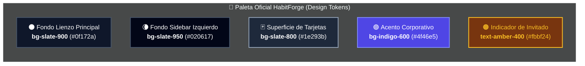

# 🎨 Clase 12: Sistemas de Diseño (Design Systems), Arquitectura CSS y Maquetación Corporativa

## 📖 Teoría: De la Improvisación Visual a la Ingeniería de Interfaces
En la clase anterior logramos renderizar nuestras primeras tarjetas de hábitos (`HabitoGlobalCard`). Sin embargo, notamos dos fenómenos importantes:
* La pantalla tenía un fondo oscuro y textos centrados que nosotros nunca programamos.
* Nuestras tarjetas flotaban sueltas en la pantalla, lejos de parecer una aplicación empresarial real.

En el análisis y diseño de sistemas ágiles, una interfaz gráfica no se construye "a ojo" inventando colores o márgenes en cada archivo. Para construir software escalable, la industria utiliza Sistemas de Diseño (Design Systems) y Frameworks de CSS.

### 1. ¿Qué es un Design System (Sistema de Diseño)?
Un Design System es el conjunto de estándares, reglas visuales y componentes reutilizables que garantizan que toda una aplicación (web y móvil) mantenga una identidad única y coherente, sin importar cuántos desarrolladores trabajen en ella.

💡 **Importante: La Analogía de la Franquicia de Restaurantes**
Imagina que abres una franquicia internacional de restaurantes en Tegucigalpa, San Pedro Sula y Choluteca. No puedes permitir que cada gerente pinte las paredes del color que le guste o compre mesas de distinto tamaño. La casa matriz entrega un Manual de Arquitectura: define el código exacto de la pintura, la iluminación, el uniforme y el plano de distribución de las mesas. En ingeniería de software, ese manual es nuestro Design System.

Un Sistema de Diseño se compone de tres pilares:
* 🎨 **Design Tokens (Átomos):** Los valores indivisibles del diseño: paleta de colores (primario, fondo, alerta), tipografía, espaciados (padding/margin) y radios de borde (border-radius).
* 🧩 **Componentes Base:** Piezas de interfaz estandarizadas (Botones, Tarjetas, Etiquetas) que consumen los Tokens.
* 📐 **Patrones de Layout (Maquetación):** La estructura arquitectónica de la pantalla (ej. dónde va el menú de navegación, cuántas columnas tiene el área de trabajo y cómo se adapta a un teléfono móvil).

### 2. ¿Qué es CSS y cómo lo procesa nuestro proyecto actual?
CSS (Cascading Style Sheets o Hojas de Estilo en Cascada) es el lenguaje estándar del navegador encargado de la capa de presentación. Mientras el HTML/JSX define la estructura semántica (qué es cada elemento), CSS define la geometría y estética mediante el Modelo de Caja (Box Model), el posicionamiento (Flexbox y CSS Grid) y la respuesta a distintos tamaños de pantalla (Media Queries).

**¿Por qué nuestra aplicación ya tenía estilos en la Clase 11 sin un `<link>` en el HTML?**
En el desarrollo web clásico, el archivo `index.html` descargaba manualmente los archivos `.css`. En arquitecturas modernas de Single Page Applications (SPA), el empaquetador (Vite) invierte este control:



Cuando creamos el proyecto, Vite generó automáticamente `src/index.css` y `src/App.css`. Esos archivos contenían reglas básicas para centrar su logotipo de demostración. En un proyecto real de ingeniería, mantener miles de líneas de CSS puro hechas a mano genera colisiones de nombres y código inmanejable; por ello, adoptamos un Framework de CSS.

### 3. Los Tres Grandes del CSS en la Industria
Actualmente, el desarrollo Frontend profesional está dominado por tres grandes enfoques tecnológicos:

| Tecnología | Paradigma | Cómo funciona | Ventajas y Desventajas |
| --- | --- | --- | --- |
| 1. Bootstrap | Basado en Clases de Componentes | Ofrece clases prefabricadas para objetos completos (ej. `class="card"`, `class="btn btn-primary"`). | **Ventaja:** Muy rápido para prototipos clásicos. <br/> **Desventaja:** Todas las aplicaciones lucen idénticas y personalizarlo a fondo requiere sobrescribir sus reglas. |
| 2. Material UI (MUI) | Librería de Componentes React | Oculta el HTML y entrega componentes de React listos con el diseño de Google (ej. `<Card>`, `<Button>`, `<Drawer>`). | **Ventaja:** Acelera el trabajo si no quieres diseñar. <br/> **Desventaja:** Es pesado y oculta la estructura real del DOM, acoplando tu código al estilo visual de Google. |
| 3. Tailwind CSS | Utility-First (Orientado a Utilidades) | Entrega clases atómicas de una sola responsabilidad (ej. `bg-slate-800` para fondo, `p-4` para padding, `rounded-xl` para bordes). | **Ventaja:** Control total sobre el diseño sin salir del archivo `.tsx`, cero código CSS muerto en producción y es el estándar #1 en el ecosistema React actual. |

🏆 **¿Por qué nos decantamos por Tailwind CSS en nuestro curso?**
Como desarrolladores Full-Stack y analistas de sistemas, elegimos Tailwind CSS por tres razones de ingeniería:
1. **Preserva la Semántica Web:** Seguimos escribiendo etiquetas reales (`<aside>`, `<main>`, `<section>`, `<article>`), lo que consolida nuestro dominio del estándar HTML5 dentro de JSX.
2. **Alineación con Componentes de React:** En CSS tradicional, si cambias una clase en un archivo `.css`, corres el riesgo de dañar otra pantalla por accidente. Con Tailwind, los estilos viven encapsulados dentro de tu componente `.tsx` (como `HabitoGlobalCard.tsx`).
3. **Compilación Ultra Optimizada:** El motor de Tailwind escanea nuestros archivos TypeScript y genera un paquete final que contiene únicamente las clases que utilizamos, pesando apenas unos cuantos Kilobytes.

### 4. Diseño del Sistema: Del Mockup (Wireframe) a los Tokens de Color
Antes de instalar Tailwind y escribir código, hagamos el trabajo de Análisis y Diseño. ¿Cómo debe verse HabitForge para ser una aplicación corporativa real tanto en un monitor de oficina como en un teléfono celular?

#### Fase A: El Mockup Estructural (Wireframe en Blanco y Negro)
Definimos el patrón App Shell (Cascarón Corporativo):
* **En Escritorio (Monitor):** Dividimos la pantalla en una Columna Izquierda Fija (Sidebar) de 256px para la navegación entre módulos y el estado del usuario, y un Área de Trabajo Central (Workspace) que ocupa el resto de la pantalla, conteniendo una cabecera de acciones y una rejilla (Grid) de 3 columnas para las tarjetas.
* **En Dispositivos Móviles (Celular):** Ocultamos la barra lateral izquierda, activamos una cabecera superior compacta y apilamos las tarjetas en 1 sola columna vertical para facilitar la lectura táctil.

```text
================================================================================
💻 MOCKUP 1: VISTA CORPORATIVA DE ESCRITORIO (Desktop >= 1024px)
================================================================================
┌──────────────────────┬───────────────────────────────────────────────────────┐
│ [HF] HabitForge      │ Catálogo Global de Hábitos      [+ Nuevo Hábito Global]│
│ ──────────────────── │ Registros maestros desde PostgreSQL                   │
│                      │ ───────────────────────────────────────────────────── │
│ (•) Catálogo Global  │ ┌───────────────┐ ┌───────────────┐ ┌───────────────┐ │
│ ( ) Mis Hábitos (U3) │ │ [ID #1] Global│ │ [ID #2] Global│ │ [ID #3] Global│ │
│ ( ) Estadísticas(U3) │ │               │ │               │ │               │ │
│                      │ │ Beber 2L Agua │ │ Ejercicio 30m │ │ Leer 10 págs  │ │
│                      │ │               │ │               │ │               │ │
│                      │ │ [ 🔒 Adoptar ]│ │ [ 🔒 Adoptar ]│ │ [ 🔒 Adoptar ]│ │
│                      │ └───────────────┘ └───────────────┘ └───────────────┘ │
│ ──────────────────── │                                                       │
│ 👤 Modo: Invitado    │ (Espacio listo para crecer dinámicamente con la BD)   │
│    (Sin sesión JWT)  │                                                       │
└──────────────────────┴───────────────────────────────────────────────────────┘
   Columna Izquierda                    Área Central de Trabajo
  (Sidebar Fijo 256px)                (Workspace Flexible + Grid 3x)


================================================================================
📱 MOCKUP 2: VISTA MÓVIL RESPONSIVA (Smartphone < 640px)
================================================================================
┌────────────────────────────────────┐
│ [HF] HabitForge        [Invitado]  │ <-- Cabecera Móvil Compacta
├────────────────────────────────────┤
│ Catálogo Global de Hábitos         │
│ [+ Nuevo Hábito Global]            │
│ ────────────────────────────────── │
│ ┌────────────────────────────────┐ │
│ │ [ID #1]                 Global │ │
│ │ Beber 2 Litros de Agua         │ │ <-- Grid colapsado a 1 sola columna
│ │ [     🔒 Adoptar Hábito      ] │ │
│ └────────────────────────────────┘ │
│ ┌────────────────────────────────┐ │
│ │ [ID #2]                 Global │ │
│ │ Hacer 30 minutos de ejercicio  │ │
│ │ [     🔒 Adoptar Hábito      ] │ │
│ └────────────────────────────────┘ │
└────────────────────────────────────┘
```

#### Fase B: Aplicación de Color (Nuestros Design Tokens en Tailwind)
Ahora que la estructura de columnas está aprobada, definimos la paleta de colores oficial que aplicaremos sobre nuestro Mockup (Modo Oscuro Corporativo de alto contraste para reducir la fatiga visual):



## 📚 Lectura:
* Refactoring UI (Adam Wathan & Steve Schoger) — Capítulos: Starting from Scratch & Layout and Spacing.

## 💻 Desarrollo Práctico: Implementación del Design System con Tailwind CSS
Vamos a instalar el motor de Tailwind CSS en nuestro proyecto Vite usando `pnpm` y transformaremos nuestros archivos de la Clase 11 en el Layout Corporativo diseñado en nuestro Mockup.

### Paso 1: Instalación y Configuración del Motor de Tailwind
Detén temporalmente el servidor de desarrollo en tu terminal (`Ctrl + C`), asegúrate de estar dentro de la carpeta `frontend` y ejecuta:

```bash
pnpm add tailwindcss @tailwindcss/vite
```

Ahora, abrimos el archivo de configuración del empaquetador (`frontend/vite.config.ts`) y registramos el compilador de Tailwind en la lista de plugins:

```typescript
// frontend/vite.config.ts
import { defineConfig } from 'vite'
import react from '@vitejs/plugin-react'
import tailwindcss from '@tailwindcss/vite'

export default defineConfig({
  plugins: [
    react(),
    tailwindcss(), // Inyecta el motor de diseño en el flujo de compilación de Vite
  ],
})
```

Por último, abrimos `src/index.css`, borramos todo el CSS por defecto que traía Vite y colocamos únicamente la directiva de importación de Tailwind:

```css
/* src/index.css */
@import "tailwindcss";
```

*(Nota: Puedes eliminar el archivo `src/App.css`, ya no lo necesitaremos porque todas las reglas de diseño vivirán en nuestros componentes).*

### Paso 2: Maquetación del Componente Hijo (`HabitoGlobalCard.tsx`)
Abrimos nuestro componente `src/components/HabitoGlobalCard.tsx`. Observa cómo el Contrato (Interfaz) se mantiene intacto respecto a nuestra base de datos PostgreSQL (`id` y `nombre`), pero en la Zona 4 (Renderizado) reemplazamos los estilos improvisados por las clases de nuestro Design System:

```tsx
// src/components/HabitoGlobalCard.tsx

// --- ZONA 1: EL CONTRATO (INTERFAZ) ---
interface HabitoGlobalProps {
    id: number;
    nombre: string;
}

// --- ZONA 2: LA FIRMA ---
export function HabitoGlobalCard({ id, nombre }: HabitoGlobalProps) {
    
    // --- ZONA 3: EL CEREBRO (LÓGICA) ---
    // (Sin lógica adicional por ahora)

    // --- ZONA 4: EL RENDERIZADO (APLICANDO DESIGN TOKENS) ---
    return (
        <article className="bg-slate-800 border border-slate-700 rounded-xl p-5 flex flex-col justify-between hover:border-indigo-500 transition-colors shadow-sm">
            <div>
                {/* Cabecera de la Tarjeta: Badge con ID de Base de Datos */}
                <div className="flex items-center justify-between mb-3">
                    <span className="bg-indigo-500/10 text-indigo-400 text-xs font-semibold px-2.5 py-1 rounded-md border border-indigo-500/20">
                        ID Catálogo #{id}
                    </span>
                    <span className="text-xs text-slate-400 font-medium">Catálogo Base</span>
                </div>
                
                {/* Nombre del Hábito */}
                <h3 className="text-lg font-bold text-white mb-5">
                    {nombre}
                </h3>
            </div>

            {/* Botón de Acción (Se habilitará cuando implementemos Usuarios en la Unidad 3) */}
            <button 
                disabled 
                className="w-full bg-slate-900/80 text-slate-400 text-sm font-medium py-2.5 px-4 rounded-lg cursor-not-allowed border border-slate-700"
            >
                🔒 Adoptar Hábito (Requiere Sesión)
            </button>
        </article>
    );
}
```

### Paso 3: Construcción del Layout Corporativo (`App.tsx`)
Ahora materializamos el Mockup 1 (Escritorio) y el Mockup 2 (Móvil) en `src/App.tsx`.
Presta especial atención a los prefijos responsivos de Tailwind:
* `hidden md:flex`: Le indica al navegador que oculte el menú lateral en celulares (`hidden`), pero que lo muestre como columna fija en pantallas medianas o grandes (`md:flex`).
* `grid-cols-1 sm:grid-cols-2 lg:grid-cols-3`: Crea 1 columna en teléfonos móviles, 2 columnas en tablets (`sm:`) y 3 columnas en monitores de escritorio (`lg:`).

```tsx
// src/App.tsx
import { HabitoGlobalCard } from './components/HabitoGlobalCard'

function App() {
  return (
    <div className="min-h-screen bg-slate-900 text-slate-100 flex flex-col md:flex-row">
      
      {/* =====================================================================
          1. COLUMNA IZQUIERDA: MENÚ CORPORATIVO (SIDEBAR)
          Fijo de 256px (w-64) en Escritorio | Oculto en Celular
         ===================================================================== */}
      <aside className="hidden md:flex md:w-64 md:flex-col bg-slate-950 border-r border-slate-800 justify-between p-5 shrink-0">
        <div>
          {/* Identidad de Marca */}
          <div className="flex items-center gap-3 mb-8 px-2">
            <div className="w-8 h-8 rounded-lg bg-indigo-600 flex items-center justify-center font-bold text-white shadow">
              HF
            </div>
            <span className="text-xl font-bold tracking-tight text-white">HabitForge</span>
          </div>

          {/* Menú de Navegación del Sistema */}
          <nav className="space-y-2">
            <a href="#" className="flex items-center gap-3 px-3 py-2.5 bg-indigo-600/15 text-indigo-400 rounded-lg font-medium text-sm border border-indigo-500/20">
              <span>🌐</span> Catálogo Global
            </a>
            <a href="#" className="flex items-center gap-3 px-3 py-2.5 text-slate-500 rounded-lg font-medium text-sm cursor-not-allowed">
              <span>📈</span> Mis Hábitos (Unidad 3)
            </a>
            <a href="#" className="flex items-center gap-3 px-3 py-2.5 text-slate-500 rounded-lg font-medium text-sm cursor-not-allowed">
              <span>📊</span> Progreso (Unidad 3)
            </a>
          </nav>
        </div>

        {/* Estado de Sesión (Se conectará con JWT en la Unidad 3) */}
        <div className="p-3.5 bg-slate-900 rounded-xl border border-slate-800">
          <p className="text-xs text-slate-400 mb-1">Estado de Seguridad</p>
          <p className="text-sm font-semibold text-amber-400">👤 Modo Invitado</p>
        </div>
      </aside>

      {/* =====================================================================
          2. CABECERA MÓVIL (Visible únicamente en teléfonos celulares: md:hidden)
         ===================================================================== */}
      <header className="md:hidden bg-slate-950 border-b border-slate-800 p-4 flex items-center justify-between">
        <div className="flex items-center gap-2.5">
          <div className="w-7 h-7 rounded-md bg-indigo-600 flex items-center justify-center font-bold text-sm text-white">
            HF
          </div>
          <span className="font-bold text-lg text-white">HabitForge</span>
        </div>
        <span className="text-xs bg-amber-500/10 text-amber-400 px-2.5 py-1 rounded-md border border-amber-500/20 font-medium">
          👤 Invitado
        </span>
      </header>

      {/* =====================================================================
          3. ÁREA CENTRAL DE CONTENIDO (WORKSPACE)
         ===================================================================== */}
      <main className="flex-1 p-6 md:p-10 overflow-y-auto">
        
        {/* Barra Superior de Título y Acción Principal */}
        <div className="flex flex-col sm:flex-row sm:items-center sm:justify-between gap-4 pb-6 mb-8 border-b border-slate-800">
          <div>
            <h1 className="text-2xl md:text-3xl font-bold text-white">Catálogo Global de Hábitos</h1>
            <p className="text-slate-400 text-sm mt-1">
              Explora los hábitos maestros registrados en la tabla <code className="text-indigo-400 font-mono">HabitosGlobales</code>.
            </p>
          </div>

          {/* Botón preparado para el Laboratorio de Integración POST */}
          <button className="bg-indigo-600 hover:bg-indigo-500 text-white font-medium text-sm px-4 py-2.5 rounded-lg transition-colors shadow-sm self-start sm:self-auto cursor-pointer">
            + Nuevo Hábito Global
          </button>
        </div>

        {/* REJILLA RESPONSIVA DE TARJETAS (1 col en Móvil | 2 en Tablet | 3 en Escritorio) */}
        <section className="grid grid-cols-1 sm:grid-cols-2 lg:grid-cols-3 gap-5">
          <HabitoGlobalCard id={1} nombre="Beber 2 Litros de Agua" />
          <HabitoGlobalCard id={2} nombre="Hacer 30 minutos de ejercicio" />
          <HabitoGlobalCard id={3} nombre="Leer 10 páginas de arquitectura de software" />
        </section>

      </main>
    </div>
  )
}

export default App
```

### Paso 4: Verificación Multi-Dispositivo en el Navegador
Vuelve a levantar tu entorno de desarrollo en la terminal:

```bash
pnpm run dev
```

Abre `http://localhost:5173` en tu navegador y realiza la prueba de fuego de todo desarrollador Frontend:
1. En pantalla completa, verifica que el Menú Lateral Izquierdo esté fijo y tus tarjetas se distribuyan en 3 columnas.
2. Presiona F12 (Herramientas de Desarrollador), activa el icono de Dispositivo Móvil (Toggle Device Toolbar) y selecciona un iPhone o Samsung Galaxy. Observa cómo el menú izquierdo desaparece automáticamente, emerge la barra superior móvil y las tarjetas se apilan en 1 sola columna tal como lo planificamos en nuestro Mockup.

---
[⬅️ Volver al índice de la fase](./index.md)
