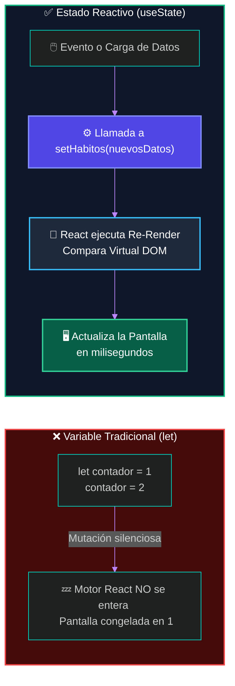
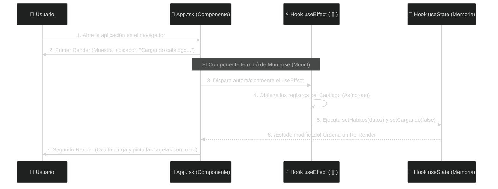

# ⚡ Clase 13: Manejo del Estado Reactivo y Ciclo de Vida (Hooks: useState y useEffect)

## 📖 Teoría: De Interfaces Estáticas a Sistemas Reactivos

En la Clase 12 dejamos lista nuestra maquetación corporativa (App Shell) con Tailwind CSS. Sin embargo, si abrimos `src/App.tsx`, notaremos un problema arquitectónico: nuestras tarjetas `<HabitoGlobalCard/>` están escritas manualmente una por una. Si nuestra tabla `HabitosGlobales` en PostgreSQL tuviera 500 registros, sería absurdo escribir 500 etiquetas en el código.

Además, ¿qué ocurre si los datos tardan 1 segundo en llegar desde el servidor o si el usuario filtra el catálogo en tiempo real? Necesitamos que la pantalla reaccione y se vuelva a pintar sola cuando los datos cambien en la memoria RAM.

### 1. ¿Por qué las variables tradicionales (let) no funcionan para actualizar la pantalla?
Un error clásico al venir de la programación tradicional es intentar guardar los datos en una variable común de TypeScript (`let habitos = [...]`) y modificarla esperando que la pantalla cambie. En React, esto no funciona por dos razones de arquitectura de memoria:

* **Efimeridad de las Funciones (Memoria Stack):** Un Componente Funcional es una simple función. Cuando se ejecuta y llega al `return`, la función termina y todas sus variables locales (`let`) se destruyen de la memoria RAM.
* **Ausencia de Notificación al Virtual DOM:** Si cambias el valor de una variable `let`, el motor de React no se entera. No se dispara el algoritmo de Reconciliación (Diffing) que vimos en la Clase 10, por lo que la pantalla permanece congelada.

### 2. La Solución: ¿Qué es un Hook y cómo funciona `useState`?
Los Hooks (Ganchos) son funciones especiales del motor de React que nos permiten "enganchar" capacidades persistentes de memoria y ciclo de vida dentro de nuestros componentes funcionales.

El más importante es `useState` (Hook de Estado). Permite declarar una variable especial cuya información sobrevive entre renderizados y que, al modificarse mediante su función actualizadora, ordena a React repintar el componente automáticamente.

💡 **Importante: La Analogía de la Pantalla del Aeropuerto (`let` vs `useState`)**
Imagina el panel electrónico de vuelos en el Aeropuerto Internacional de Palmerola:
* 📝 **Variable tradicional (`let`):** Es como si el operador de la torre de control anotara en su libreta de papel personal que el vuelo cambió de puerta. El dato cambió en su bolsillo, pero los pasajeros siguen viendo la pantalla gigante desactualizada.
* 🖥️ **Estado Reactivo (`useState`):** Nos entrega dos elementos en una tupla `[valorActual, funcionActualizadora]`:
  * `valorActual` (La Pantalla Pública): Es el dato de solo lectura que ven los pasajeros en el JSX.
  * `funcionActualizadora` / `set...` (La Consola de Control): Es el único botón autorizado para enviar un nuevo dato a la pantalla y disparar el refresco automático de los monitores.

**Flujo Arquitectónico: El Ciclo Reactivo de `useState`**



### 3. El Ciclo de Vida del Componente y el Hook `useEffect`
Todo componente en React atraviesa un Ciclo de Vida compuesto por tres etapas:
1. **Montaje (Mounting):** El componente nace y se pinta por primera vez en el navegador.
2. **Actualización (Updating):** El componente se vuelve a pintar porque cambió su estado (`useState`) o sus Props.
3. **Desmontaje (Unmounting):** El componente muere y desaparece de la pantalla (ej. cuando el usuario cambia de página).

Para ejecutar lógica automática en momentos específicos de este ciclo (como ir a buscar los registros de `HabitosGlobales` apenas el usuario abre la aplicación), utilizamos el Hook `useEffect` (Efecto Secundario).

**La Regla de Oro del Arreglo de Dependencias (`[]`)**
`useEffect` recibe dos parámetros: una función con el código a ejecutar y un arreglo de dependencias al final:
* `useEffect(() => { ... }, [])`: Con corchetes vacíos, el código se ejecuta una única vez cuando el componente se monta en pantalla. Es el lugar estándar para disparar consultas iniciales a servidores.
* `useEffect(() => { ... }, [busqueda])`: Se ejecuta al montar y cada vez que la variable `busqueda` cambie de valor.



## 📚 Lectura:
* Documentación Oficial de React (react.dev) — Sección: Managing State & Synchronizing with Effects.

## 💻 Desarrollo Práctico: Transformando HabitForge en una Aplicación Reactiva

Vamos a evolucionar el código que construimos en la Clase 12. Eliminaremos las tarjetas estáticas y dotaremos a nuestro `App.tsx` de:
* **Estado tipado para el catálogo (`habitos`):** Un arreglo reactivo que respeta el contrato `Id` y `Nombre`.
* **Estado de carga (`cargando`):** Para mostrar un diseño profesional mientras llegan los datos.
* **Estado de filtrado en vivo (`filtro`):** Para demostrar el poder reactivo de `useState` filtrando tarjetas en tiempo real mientras el usuario escribe.
* **Ciclo de vida (`useEffect`):** Simularemos la latencia de red (1.2 segundos) antes de conectar el cable real hacia .NET en la siguiente clase.

### Paso 1: Exportar el Contrato de Datos (`src/components/HabitoGlobalCard.tsx`)
Abrimos `src/components/HabitoGlobalCard.tsx` y le agregamos la palabra clave `export` a nuestra interfaz `HabitoGlobalProps`. Como buenos arquitectos (Principio DRY - Don't Repeat Yourself), reutilizaremos este mismo contrato en `App.tsx` para tipar nuestro `useState`:

```tsx
// src/components/HabitoGlobalCard.tsx

// --- ZONA 1: EL CONTRATO (INTERFAZ EXPORTADA) ---
// Al exportarla, tanto la tarjeta como el estado en App.tsx comparten el mismo contrato
export interface HabitoGlobalProps {
    id: number;
    nombre: string;
}

// --- ZONA 2: LA FIRMA ---
export function HabitoGlobalCard({ id, nombre }: HabitoGlobalProps) {
    
    // --- ZONA 3: EL CEREBRO (LÓGICA) ---
    // (Presentacional puro)

    // --- ZONA 4: EL RENDERIZADO (APLICANDO DESIGN TOKENS) ---
    return (
        <article className="bg-slate-800 border border-slate-700 rounded-xl p-5 flex flex-col justify-between hover:border-indigo-500 transition-colors shadow-sm">
            <div>
                <div className="flex items-center justify-between mb-3">
                    <span className="bg-indigo-500/10 text-indigo-400 text-xs font-semibold px-2.5 py-1 rounded-md border border-indigo-500/20">
                        ID Catálogo #{id}
                    </span>
                    <span className="text-xs text-slate-400 font-medium">Catálogo Base</span>
                </div>
                
                <h3 className="text-lg font-bold text-white mb-5">
                    {nombre}
                </h3>
            </div>

            <button 
                disabled 
                className="w-full bg-slate-900/80 text-slate-400 text-sm font-medium py-2.5 px-4 rounded-lg cursor-not-allowed border border-slate-700"
            >
                🔒 Adoptar Hábito (Requiere Sesión)
            </button>
        </article>
    );
}
```

### Paso 2: Implementación de `useState`, `useEffect` y Renderizado Dinámico (`src/App.tsx`)
Ahora actualizamos `src/App.tsx`. Observa cómo en la Zona 3 (El Cerebro) conectamos nuestros Hooks y en la Zona 4 (El Renderizado) utilizamos la función `.map()` junto con la propiedad obligatoria `key={habito.id}` para que el Virtual DOM identifique cada tarjeta de forma única:

```tsx
// src/App.tsx
import { useState, useEffect } from 'react'
import { HabitoGlobalCard, type HabitoGlobalProps } from './components/HabitoGlobalCard'

function App() {
  // =========================================================================
  // ZONA 3: EL CEREBRO DEL COMPONENTE (ESTADOS Y CICLO DE VIDA)
  // =========================================================================

  // 1. Estado Reactivo para almacenar los registros de la tabla HabitosGlobales
  const [habitos, setHabitos] = useState<HabitoGlobalProps[]>([])

  // 2. Estado Reactivo para controlar el indicador visual de carga (UX Corporativo)
  const [cargando, setCargando] = useState<boolean>(true)

  // 3. Estado Reactivo para el buscador en tiempo real
  const [busqueda, setBusqueda] = useState<string>('')

  // 4. Efecto Secundario: Se dispara UNA SOLA VEZ ([]) al montar el componente
  useEffect(() => {
    // Simulamos el tiempo de respuesta de la red (1.2 segundos)
    // En la próxima clase, reemplazaremos este temporizador por el llamado HTTP real a .NET
    const temporizador = setTimeout(() => {
      const datosDesdeServidor: HabitoGlobalProps[] = [
        { id: 1, nombre: 'Beber 2 Litros de Agua' },
        { id: 2, nombre: 'Hacer 30 minutos de ejercicio cardiovascular' },
        { id: 3, nombre: 'Leer 10 páginas de arquitectura de software' },
        { id: 4, nombre: 'Practicar algoritmos en C# durante 45 minutos' },
        { id: 5, nombre: 'Dormir 8 horas completas sin pantallas' },
        { id: 6, nombre: 'Documentar avances del sprint en el repositorio' },
      ]

      // Actualizamos los estados (Esto ordena a React repintar la pantalla)
      setHabitos(datosDesdeServidor)
      setCargando(false)
    }, 1200)

    // Función de limpieza (Cleanup) por si el componente se desmonta antes
    return () => clearTimeout(temporizador)
  }, [])

  // Lógica derivada: Filtramos el catálogo en memoria según lo que escriba el usuario
  const habitosFiltrados = habitos.filter((habito) =>
    habito.nombre.toLowerCase().includes(busqueda.toLowerCase())
  )

  // =========================================================================
  // ZONA 4: EL RENDERIZADO DECLARATIVO (APP SHELL + TAILWIND CSS)
  // =========================================================================
  return (
    <div className="min-h-screen bg-slate-900 text-slate-100 flex flex-col md:flex-row">
      
      {/* 1. COLUMNA IZQUIERDA: MENÚ CORPORATIVO (SIDEBAR) */}
      <aside className="hidden md:flex md:w-64 md:flex-col bg-slate-950 border-r border-slate-800 justify-between p-5 shrink-0">
        <div>
          <div className="flex items-center gap-3 mb-8 px-2">
            <div className="w-8 h-8 rounded-lg bg-indigo-600 flex items-center justify-center font-bold text-white shadow">
              HF
            </div>
            <span className="text-xl font-bold tracking-tight text-white">HabitForge</span>
          </div>

          <nav className="space-y-2">
            <a href="#" className="flex items-center justify-between px-3 py-2.5 bg-indigo-600/15 text-indigo-400 rounded-lg font-medium text-sm border border-indigo-500/20">
              <span className="flex items-center gap-3"><span>🌐</span> Catálogo Global</span>
              {/* Contador reactivo conectado al estado */}
              <span className="bg-indigo-500/20 text-indigo-300 text-xs px-2 py-0.5 rounded-full">
                {habitos.length}
              </span>
            </a>
            <a href="#" className="flex items-center gap-3 px-3 py-2.5 text-slate-500 rounded-lg font-medium text-sm cursor-not-allowed">
              <span>📈</span> Mis Hábitos (Unidad 3)
            </a>
            <a href="#" className="flex items-center gap-3 px-3 py-2.5 text-slate-500 rounded-lg font-medium text-sm cursor-not-allowed">
              <span>📊</span> Progreso (Unidad 3)
            </a>
          </nav>
        </div>

        <div className="p-3.5 bg-slate-900 rounded-xl border border-slate-800">
          <p className="text-xs text-slate-400 mb-1">Estado de Seguridad</p>
          <p className="text-sm font-semibold text-amber-400">👤 Modo Invitado</p>
        </div>
      </aside>

      {/* 2. CABECERA MÓVIL */}
      <header className="md:hidden bg-slate-950 border-b border-slate-800 p-4 flex items-center justify-between">
        <div className="flex items-center gap-2.5">
          <div className="w-7 h-7 rounded-md bg-indigo-600 flex items-center justify-center font-bold text-sm text-white">
            HF
          </div>
          <span className="font-bold text-lg text-white">HabitForge</span>
        </div>
        <span className="text-xs bg-amber-500/10 text-amber-400 px-2.5 py-1 rounded-md border border-amber-500/20 font-medium">
          👤 Invitado
        </span>
      </header>

      {/* 3. ÁREA CENTRAL DE CONTENIDO (WORKSPACE) */}
      <main className="flex-1 p-6 md:p-10 overflow-y-auto">
        
        {/* Barra Superior de Título y Acción Principal */}
        <div className="flex flex-col sm:flex-row sm:items-center sm:justify-between gap-4 pb-6 mb-6 border-b border-slate-800">
          <div>
            <h1 className="text-2xl md:text-3xl font-bold text-white">Catálogo Global de Hábitos</h1>
            <p className="text-slate-400 text-sm mt-1">
              Explora los hábitos maestros registrados en la tabla <code className="text-indigo-400 font-mono">HabitosGlobales</code>.
            </p>
          </div>

          <button className="bg-indigo-600 hover:bg-indigo-500 text-white font-medium text-sm px-4 py-2.5 rounded-lg transition-colors shadow-sm self-start sm:self-auto cursor-pointer">
            + Nuevo Hábito Global
          </button>
        </div>

        {/* Barra de Búsqueda Reactiva (Demostración en vivo de useState) */}
        <div className="mb-6 flex flex-col sm:flex-row sm:items-center justify-between gap-4">
          <input
            type="text"
            placeholder="🔍 Filtrar hábitos en el catálogo..."
            value={busqueda}
            onChange={(e) => setBusqueda(e.target.value)}
            className="w-full sm:max-w-md bg-slate-950 border border-slate-800 rounded-lg px-4 py-2.5 text-sm text-white placeholder-slate-500 focus:outline-none focus:border-indigo-500 transition-colors"
          />
          <span className="text-xs text-slate-400">
            Mostrando <strong className="text-white">{habitosFiltrados.length}</strong> de {habitos.length} registros
          </span>
        </div>

        {/* RENDERIZADO CONDICIONAL BASADO EN EL ESTADO DE CARGA */}
        {cargando ? (
          <div className="bg-slate-800/50 border border-slate-800 rounded-xl p-12 text-center">
            <p className="text-indigo-400 font-semibold animate-pulse text-lg">
              ⏳ Sincronizando catálogo de hábitos...
            </p>
            <p className="text-slate-500 text-xs mt-2">
              Ejecutando Hook useEffect de montaje inicial
            </p>
          </div>
        ) : (
          /* REJILLA DINÁMICA: Transformamos el arreglo de datos en componentes usando .map() */
          <section className="grid grid-cols-1 sm:grid-cols-2 lg:grid-cols-3 gap-5">
            {habitosFiltrados.map((habito) => (
              <HabitoGlobalCard 
                key={habito.id} 
                id={habito.id} 
                nombre={habito.nombre} 
              />
            ))}
          </section>
        )}

      </main>
    </div>
  )
}

export default App
```

## 🔬 Análisis de Ingeniería para el Aula (Puntos Clave a Explicar)

**¿Por qué React exige la propiedad `key={habito.id}` dentro del `.map()`?**
No es una prop para nosotros; es un identificador interno para el Algoritmo de Reconciliación (Virtual DOM). Si mañana se elimina el hábito con ID #3, gracias al `key`, React sabe exactamente qué nodo del DOM destruir sin tener que volver a dibujar las otras 5 tarjetas. Regla de oro: Siempre usar la Llave Primaria (`id`) proveniente de la base de datos como `key`.

**El Poder Reactivo en Vivo:**
Cuando los alumnos recarguen el navegador (F5), verán durante 1.2 segundos el estado "⏳ Sincronizando catálogo de hábitos...", y de golpe aparecerán las 6 tarjetas y el contador del menú izquierdo cambiará de 0 a 6. Además, al escribir en el buscador, verán cómo `setBusqueda` filtra las tarjetas instantáneamente sin recargar la página.

---
[⬅️ Volver al índice de la fase](./index.md)
