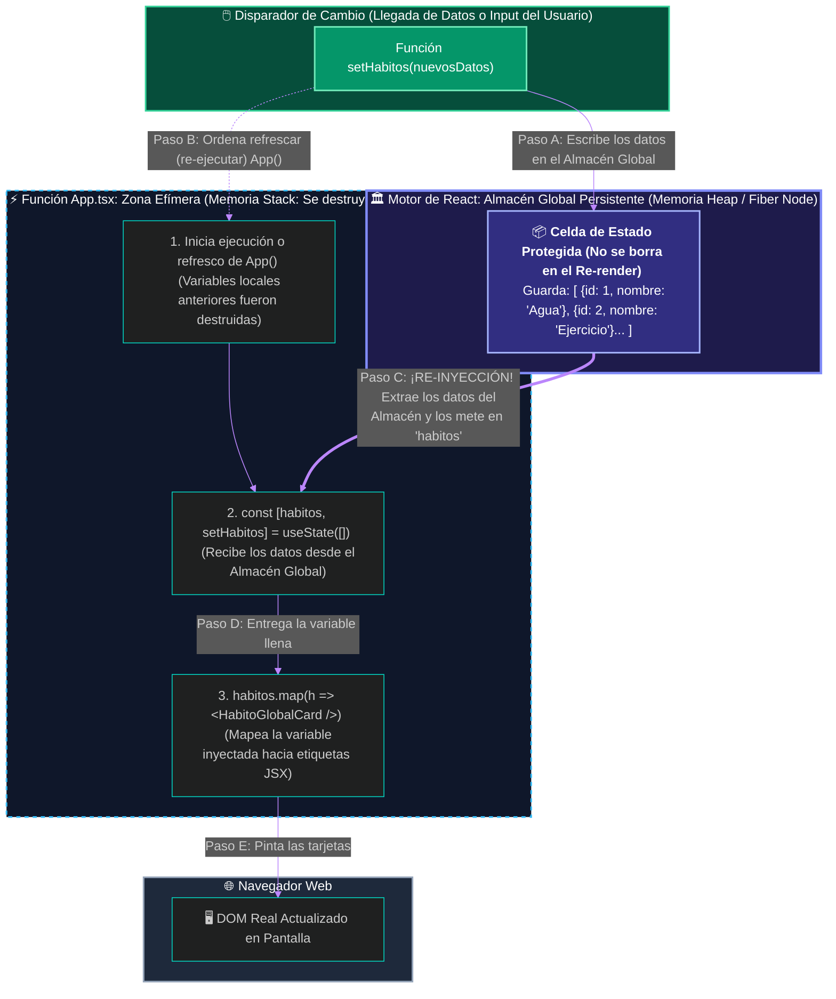
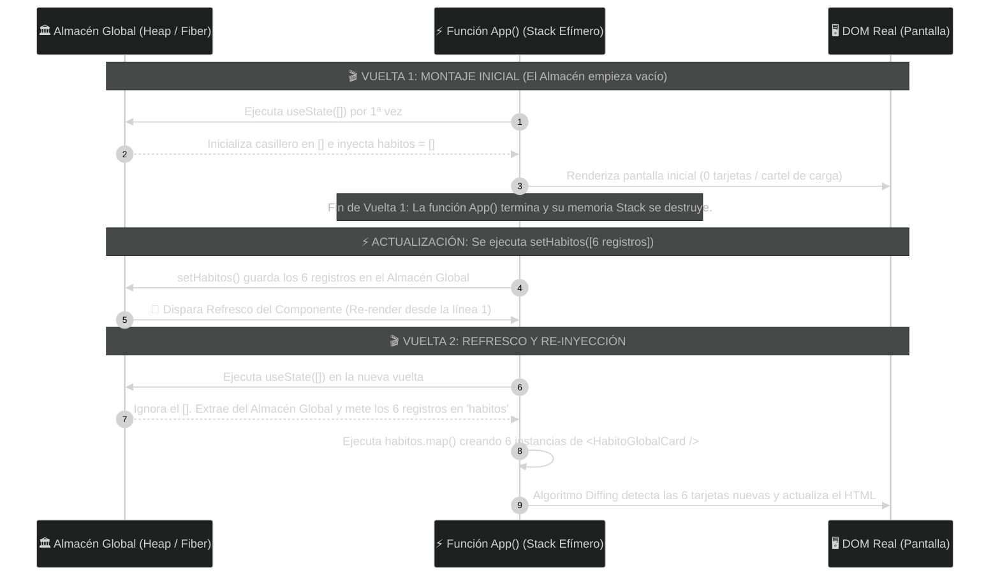

# ⚡ Clase 13: Manejo del Estado Reactivo y Ciclo de Vida (Hooks: useState y useEffect)

## 📖 Teoría: De Interfaces Estáticas a Sistemas Reactivos y Gestión de Memoria

En la Clase 12 dejamos lista nuestra maquetación corporativa (App Shell) con Tailwind CSS. Sin embargo, si analizamos nuestro archivo `src/App.tsx`, notaremos un problema de ingeniería: nuestras tarjetas `<HabitoGlobalCard/>` están escritas manualmente una por una (hardcoded). Si nuestra tabla `HabitosGlobales` en PostgreSQL tuviera 500 registros, sería inviable escribir 500 etiquetas en el código.

Además, en un sistema real los datos tardan milisegundos en viajar desde la base de datos por la red, o cambian cuando el usuario utiliza un buscador. Necesitamos que la pantalla se refresque y redibuje sola cuando los datos cambien. Para comprender cómo React logra esto sin "magia", debemos analizar cómo funciona la memoria RAM cuando se ejecuta un componente.

### 1. El Problema de lo Efímero: ¿Por qué una variable normal (let) pierde sus datos?
En programación tradicional, podríamos pensar en declarar una variable común dentro de `App.tsx` (por ejemplo, `let habitos = []`), llenarla de datos y esperar que la pantalla se actualice. En React, esto falla rotundamente debido a la arquitectura de memoria de las funciones:

* **La Zona Efímera (Memoria Stack):** Un Componente Funcional en React (`function App()`) es simplemente una función de JavaScript/TypeScript. Cada vez que React necesita actualizar o refrescar la vista en pantalla (proceso llamado Re-render), destruye la ejecución anterior y vuelve a ejecutar la función `App()` completa desde la línea 1.
* **Pérdida de Datos:** Todas las variables locales declaradas con `let` viven en la Memoria Stack (Pila de ejecución). Cuando la función llega al `return` y entrega el HTML, la función termina y el recolector de basura borra todas sus variables locales. En el siguiente refresco del componente, `let habitos = []` vuelve a nacer vacía.

### 2. Los 3 Niveles de Persistencia en una Aplicación Full-Stack
Como arquitectos de software y diseñadores de bases de datos, debemos distinguir claramente entre un **Refresco de Componente** (Re-render interno de React) y una **Recarga de Página Completa** (Presionar F5 en el navegador):

| Nivel de Persistencia | Artefacto Técnico | ¿Dónde vive en el Hardware? | ¿Qué pasa cuando el Componente se refresca (Re-render)? | ¿Qué pasa si el usuario presiona F5 (Recarga el navegador)? |
| :--- | :--- | :--- | :--- | :--- |
| **1. Efímero** | Variable local (`let habitos = []`) | Dentro de la función `App()` (Memoria Stack). | 💀 **Muere y se reinicia.** La función vuelve a correr desde cero y olvida el valor anterior. | 💀 Muere. |
| **2. Estado en Memoria** | Hook `useState` (Almacén Global de React) | Afuera de `App()`, en el motor de React (Memoria Heap / Fiber Node). | 🔄 **¡Sobrevive!** React extrae los datos de este almacén externo y los vuelve a inyectar en `App()`. | 💀 **Se limpia la RAM.** Por eso `useEffect` vuelve a pedir los datos al servidor. |
| **3. Persistencia Física** | Tabla `HabitosGlobales` (PostgreSQL) | En el Disco Duro del Servidor (Almacenamiento No Volátil). | 🛡️ Intocable. | 🛡️ **Sobrevive siempre** (incluso si se apaga el servidor). |

### 3. La Arquitectura de `useState`: El Almacén Global y la Re-Inyección
Para evitar que los datos mueran cada vez que la función `App()` se refresca, utilizamos un Hook (Gancho): `useState`.

💡 **Importante: El Mecanismo del Almacén Global Externo (Sin Magia)**
En ciencias de la computación no existe la magia; existen estructuras de datos y punteros en memoria. Así funciona realmente `useState` bajo el capó:
* 🏛️ **El Almacén Global Externo (Heap y Fiber Nodes):** Fuera de tu función `App()`, en una región persistente de la memoria RAM llamada Memoria Heap, el motor de React mantiene una estructura de datos global llamada *Fiber Node*. Funciona como un casillero de variables globales protegidas que no se borran cuando `App()` termina de ejecutarse.
* ⚙️ **La Función Actualizadora (`setHabitos`):** Cuando llamamos a `setHabitos(nuevosDatos)`, esta función no modifica directamente la variable local `habitos`. Lo que hace es ir al Almacén Global (Fiber Node), guardar allí los nuevos datos y ordenarle a React que refresque (vuelva a ejecutar) la función `App()`.
* 💉 **La Re-Inyección (`useState`):** Cuando `App()` se reinicia tras el refresco y pasa nuevamente por la línea `const [habitos, setHabitos] = useState([])`, la función `useState` ignora el valor vacío inicial (`[]`), va a buscar los datos guardados en el Almacén Global y los **inyecta** dentro de la constante `habitos`.
* 🗺️ **El Mapeo al DOM (`.map()`):** Con la constante `habitos` ya cargada gracias a esa re-inyección, el código baja hasta el `return`, ejecuta el ciclo `.map()` para transformar cada objeto de datos en una tarjeta `<HabitoGlobalCard/>` y actualiza el DOM Real.

**Diagrama 1: Arquitectura de Memoria (Almacén Global vs. Zona Efímera)**



**Diagrama 2: Ciclo de Vida Cronológico de `useState` (Vuelta 1 vs. Vuelta 2)**



### 4. El Ciclo de Vida del Componente y el Hook `useEffect`
Ahora que sabemos cómo `setHabitos` guarda datos en el Almacén Global para que `useState` los inyecte en nuestra variable, surge una pregunta lógica: ¿Quién dispara la carga inicial de datos cuando el usuario entra por primera vez a la aplicación?

Todo componente atraviesa tres fases en su ciclo de vida:
1. **Montaje (Mounting):** El componente nace y se pinta por primera vez en el DOM.
2. **Actualización (Updating):** El componente se refresca (Re-render) porque su estado en el Almacén Global cambió.
3. **Desmontaje (Unmounting):** El componente se retira de la pantalla.

Para ejecutar código de forma automática después de que el componente se monta en pantalla (como ir a pedir los registros de `HabitosGlobales` al servidor), usamos el Hook `useEffect` (Efecto Secundario).

**La Regla del Arreglo de Dependencias (`[]`)**
`useEffect(() => { ... }, [])`: Al colocar corchetes vacíos al final, le ordenamos a React que ejecute esa función **una única vez inmediatamente después de la Vuelta 1 (Montaje)**.
Si omitiéramos los corchetes `[]`, el `useEffect` se ejecutaría en cada refresco, llamaría a `setHabitos`, provocaría otro refresco y crearía un bucle infinito que colapsaría la memoria del navegador.

## 📚 Lectura:
* Documentación Oficial de React (react.dev) — Sección: State: A Component's Memory & Render and Commit.

## 💻 Desarrollo Práctico: Transformando HabitForge en una Aplicación Reactiva

Vamos a evolucionar nuestra maquetación de la Clase 12. Eliminaremos las 3 tarjetas manuales y dotaremos a `App.tsx` de:
* **Un Almacén de Estado para el catálogo (`habitos`):** Tipado estrictamente con el contrato de nuestra tabla (`id` y `nombre`).
* **Un Almacén de Estado para la interfaz de carga (`cargando`):** Que cambia de `true` a `false` cuando los datos son inyectados.
* **Un Almacén de Estado para búsqueda en vivo (`busqueda`):** Cada tecla que presione el usuario actualizará el almacén, refrescará `App()` y filtrará las tarjetas en tiempo real.
* **Un Hook `useEffect` de Montaje:** Simulará los 1.2 segundos que tarda una petición de red antes de que conectemos el cable HTTP real hacia .NET en las siguientes clases.

### Paso 1: Exportar el Contrato de Datos (`src/components/HabitoGlobalCard.tsx`)
Abrimos `src/components/HabitoGlobalCard.tsx` y colocamos la palabra clave `export` delante de `interface HabitoGlobalProps`. Así reutilizamos el mismo contrato tanto en la tarjeta hija como en el estado `useState` del padre:

```tsx
// src/components/HabitoGlobalCard.tsx

// --- ZONA 1: EL CONTRATO (INTERFAZ EXPORTADA) ---
// Espejo exacto de nuestra tabla HabitosGlobales en PostgreSQL (Id y Nombre)
export interface HabitoGlobalProps {
    id: number;
    nombre: string;
}

// --- ZONA 2: LA FIRMA ---
export function HabitoGlobalCard({ id, nombre }: HabitoGlobalProps) {
    
    // --- ZONA 3: EL CEREBRO (LÓGICA) ---
    // (Componente presentacional puro)

    // --- ZONA 4: EL RENDERIZADO (APLICANDO DESIGN TOKENS) ---
    return (
        <article className="bg-slate-800 border border-slate-700 rounded-xl p-5 flex flex-col justify-between hover:border-indigo-500 transition-colors shadow-sm">
            <div>
                <div className="flex items-center justify-between mb-3">
                    <span className="bg-indigo-500/10 text-indigo-400 text-xs font-semibold px-2.5 py-1 rounded-md border border-indigo-500/20">
                        ID Catálogo #{id}
                    </span>
                    <span className="text-xs text-slate-400 font-medium">Catálogo Base</span>
                </div>
                
                <h3 className="text-lg font-bold text-white mb-5">
                    {nombre}
                </h3>
            </div>

            <button 
                disabled 
                className="w-full bg-slate-900/80 text-slate-400 text-sm font-medium py-2.5 px-4 rounded-lg cursor-not-allowed border border-slate-700"
            >
                🔒 Adoptar Hábito (Requiere Sesión)
            </button>
        </article>
    );
}
```

### Paso 2: Conexión del Almacén `useState`, Ciclo `useEffect` y `.map()` (`src/App.tsx`)
Reemplaza el contenido de `src/App.tsx` y analiza los comentarios técnicos en la Zona 3 y la Zona 4:

```tsx
// src/App.tsx
import { useState, useEffect } from 'react'
import { HabitoGlobalCard, type HabitoGlobalProps } from './components/HabitoGlobalCard'

function App() {
  // =========================================================================
  // ZONA 3: EL CEREBRO DEL COMPONENTE (CONEXIÓN AL ALMACÉN GLOBAL DE REACT)
  // =========================================================================

  // 1. Casillero #0 en el Heap (Fiber):
  // En cada refresco, useState extrae el arreglo del almacén y lo inyecta en 'habitos'.
  // 'setHabitos' escribe nuevos datos en ese almacén y dispara un refresco de App().
  const [habitos, setHabitos] = useState<HabitoGlobalProps[]>([])

  // 2. Casillero #1 en el Heap (Fiber): Controla si mostramos el cartel de espera
  const [cargando, setCargando] = useState<boolean>(true)

  // 3. Casillero #2 en el Heap (Fiber): Almacena el texto que el usuario escribe en el buscador
  const [busqueda, setBusqueda] = useState<string>('')

  // 4. Hook de Ciclo de Vida (useEffect con [] se ejecuta UNA SOLA VEZ tras la Vuelta 1)
  useEffect(() => {
    // Simulamos la latencia de red (1.2 seg) de una consulta al servidor
    const temporizador = setTimeout(() => {
      const datosSimuladosBD: HabitoGlobalProps[] = [
        { id: 1, nombre: 'Beber 2 Litros de Agua' },
        { id: 2, nombre: 'Hacer 30 minutos de ejercicio cardiovascular' },
        { id: 3, nombre: 'Leer 10 páginas de arquitectura de software' },
        { id: 4, nombre: 'Practicar algoritmos en C# durante 45 minutos' },
        { id: 5, nombre: 'Dormir 8 horas completas sin pantallas' },
        { id: 6, nombre: 'Documentar avances del sprint en el repositorio' },
      ]

      // Guardamos en el Almacén Global y ordenamos a React ejecutar la Vuelta 2 (Re-render)
      setHabitos(datosSimuladosBD)
      setCargando(false)
    }, 1200)

    // Limpieza de memoria si el componente se desmonta antes de que termine el tiempo
    return () => clearTimeout(temporizador)
  }, [])

  // Variable calculada en cada refresco usando los datos re-inyectados en 'habitos' y 'busqueda'
  const habitosFiltrados = habitos.filter((habito) =>
    habito.nombre.toLowerCase().includes(busqueda.toLowerCase())
  )

  // =========================================================================
  // ZONA 4: EL RENDERIZADO DECLARATIVO (APP SHELL + MAPEO AL DOM)
  // =========================================================================
  return (
    <div className="min-h-screen bg-slate-900 text-slate-100 flex flex-col md:flex-row">
      
      {/* 1. COLUMNA IZQUIERDA: MENÚ CORPORATIVO (SIDEBAR) */}
      <aside className="hidden md:flex md:w-64 md:flex-col bg-slate-950 border-r border-slate-800 justify-between p-5 shrink-0">
        <div>
          <div className="flex items-center gap-3 mb-8 px-2">
            <div className="w-8 h-8 rounded-lg bg-indigo-600 flex items-center justify-center font-bold text-white shadow">
              HF
            </div>
            <span className="text-xl font-bold tracking-tight text-white">HabitForge</span>
          </div>

          <nav className="space-y-2">
            <a href="#" className="flex items-center justify-between px-3 py-2.5 bg-indigo-600/15 text-indigo-400 rounded-lg font-medium text-sm border border-indigo-500/20">
              <span className="flex items-center gap-3"><span>🌐</span> Catálogo Global</span>
              {/* Este contador lee la variable re-inyectada: pasa de 0 (Vuelta 1) a 6 (Vuelta 2) */}
              <span className="bg-indigo-500/20 text-indigo-300 text-xs px-2 py-0.5 rounded-full">
                {habitos.length}
              </span>
            </a>
            <a href="#" className="flex items-center gap-3 px-3 py-2.5 text-slate-500 rounded-lg font-medium text-sm cursor-not-allowed">
              <span>📈</span> Mis Hábitos (Unidad 3)
            </a>
            <a href="#" className="flex items-center gap-3 px-3 py-2.5 text-slate-500 rounded-lg font-medium text-sm cursor-not-allowed">
              <span>📊</span> Progreso (Unidad 3)
            </a>
          </nav>
        </div>

        <div className="p-3.5 bg-slate-900 rounded-xl border border-slate-800">
          <p className="text-xs text-slate-400 mb-1">Estado de Seguridad</p>
          <p className="text-sm font-semibold text-amber-400">👤 Modo Invitado</p>
        </div>
      </aside>

      {/* 2. CABECERA MÓVIL */}
      <header className="md:hidden bg-slate-950 border-b border-slate-800 p-4 flex items-center justify-between">
        <div className="flex items-center gap-2.5">
          <div className="w-7 h-7 rounded-md bg-indigo-600 flex items-center justify-center font-bold text-sm text-white">
            HF
          </div>
          <span className="font-bold text-lg text-white">HabitForge</span>
        </div>
        <span className="text-xs bg-amber-500/10 text-amber-400 px-2.5 py-1 rounded-md border border-amber-500/20 font-medium">
          👤 Invitado
        </span>
      </header>

      {/* 3. ÁREA CENTRAL DE CONTENIDO (WORKSPACE) */}
      <main className="flex-1 p-6 md:p-10 overflow-y-auto">
        
        {/* Barra Superior de Título y Acción Principal */}
        <div className="flex flex-col sm:flex-row sm:items-center sm:justify-between gap-4 pb-6 mb-6 border-b border-slate-800">
          <div>
            <h1 className="text-2xl md:text-3xl font-bold text-white">Catálogo Global de Hábitos</h1>
            <p className="text-slate-400 text-sm mt-1">
              Explora los hábitos maestros registrados en la tabla <code className="text-indigo-400 font-mono">HabitosGlobales</code>.
            </p>
          </div>

          <button className="bg-indigo-600 hover:bg-indigo-500 text-white font-medium text-sm px-4 py-2.5 rounded-lg transition-colors shadow-sm self-start sm:self-auto cursor-pointer">
            + Nuevo Hábito Global
          </button>
        </div>

        {/* Buscador Reactivo: Cada tecla ejecuta setBusqueda(), guarda en el Almacén y refresca App() */}
        <div className="mb-6 flex flex-col sm:flex-row sm:items-center justify-between gap-4">
          <input
            type="text"
            placeholder="🔍 Filtrar hábitos en el catálogo..."
            value={busqueda}
            onChange={(e) => setBusqueda(e.target.value)}
            className="w-full sm:max-w-md bg-slate-950 border border-slate-800 rounded-lg px-4 py-2.5 text-sm text-white placeholder-slate-500 focus:outline-none focus:border-indigo-500 transition-colors"
          />
          <span className="text-xs text-slate-400">
            Mostrando <strong className="text-white">{habitosFiltrados.length}</strong> de {habitos.length} registros en memoria
          </span>
        </div>

        {/* RENDERIZADO CONDICIONAL: Vuelta 1 (cargando = true) vs Vuelta 2 (cargando = false) */}
        {cargando ? (
          <div className="bg-slate-800/50 border border-slate-800 rounded-xl p-12 text-center">
            <p className="text-indigo-400 font-semibold animate-pulse text-lg">
              ⏳ Sincronizando catálogo desde el Almacén de Estado...
            </p>
            <p className="text-slate-500 text-xs mt-2">
              Ejecutando Vuelta 1 (Montaje inicial y disparo de useEffect)
            </p>
          </div>
        ) : (
          /* MAPEO DINÁMICO AL DOM: Recorremos los datos re-inyectados en la variable 'habitosFiltrados' */
          <section className="grid grid-cols-1 sm:grid-cols-2 lg:grid-cols-3 gap-5">
            {habitosFiltrados.map((habito) => (
              <HabitoGlobalCard 
                key={habito.id} 
                id={habito.id} 
                nombre={habito.nombre} 
              />
            ))}
          </section>
        )}

      </main>
    </div>
  )
}

export default App
```

## 🔬 Análisis de Ingeniería para el Aula (Experimento en Vivo)

**Verificando la Vuelta 1 y la Vuelta 2 en el Navegador:**
Al guardar los cambios o presionar F5, observa cómo durante 1.2 segundos estamos en la **Vuelta 1**: el almacén global tiene `cargando = true` y `habitos = []` (el contador del menú lateral dice 0). Apenas se cumple el tiempo del `useEffect`, `setHabitos` llena el almacén global y dispara la **Vuelta 2**: `useState` re-inyecta los 6 objetos en la variable `habitos`, el contador salta a 6 y el `.map()` dibuja las 6 tarjetas en el DOM.

**¿Por qué es obligatoria la propiedad `key={habito.id}` dentro del `.map()`?**
La propiedad `key` no viaja hacia adentro de `HabitoGlobalCard`; es una llave primaria exclusiva para el Motor de React (Fiber). Cuando el usuario escribe "Agua" en el buscador y se dispara un refresco, gracias a `key={habito.id}`, React identifica instantáneamente qué nodo exacto del DOM conservar y cuáles ocultar, sin tener que destruir ni recrear desde cero las tarjetas que permanecen visibles.

---
[⬅️ Volver al índice de la fase](./index.md)

© 2026 ConsDev | Constantino Sorto — Ingeniería & Educación - UNAH
