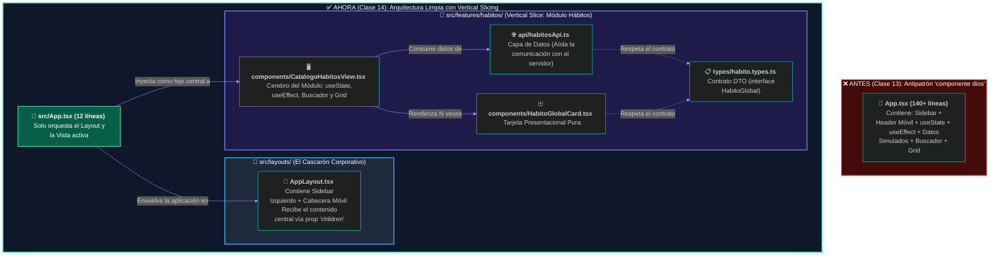

# 🏗️ Clase 14: Simetría Arquitectónica Aplicada y Vertical Slicing en React

## 📖 Teoría: El Antipatrón del "componente dios" y la Separación de Responsabilidades

Si observamos cómo quedó nuestro archivo `src/App.tsx` al finalizar la Clase 13, notaremos una señal de alerta arquitectónica (Code Smell): tiene más de 130 líneas y hace demasiadas cosas a la vez. Dibuja el menú lateral, controla la cabecera móvil, administra el almacén de estados (`useState`), ejecuta efectos de red (`useEffect`), filtra búsquedas y renderiza la cuadrícula de tarjetas.

En el análisis y diseño de sistemas, a este error se le conoce como el antipatrón del "componente dios" (god component), el cual viola directamente el Principio de Responsabilidad Única (La 'S' de SOLID). ¿Qué pasaría cuando en la Unidad 3 agreguemos el módulo de Mis Hábitos, la pantalla de Estadísticas y el Inicio de Sesión (JWT)? Si seguimos programando todo dentro de `App.tsx`, tendremos un archivo monstruoso de 3,000 líneas imposible de mantener en un entorno ágil.

### 1. Simetría Arquitectónica: `Program.cs` (.NET) vs. `App.tsx` (React)
En la Unidad 1 aprendimos que en Clean Architecture (.NET), el archivo `Program.cs` no contiene lógica de negocio ni consultas SQL; es simplemente un Orquestador que conecta las piezas. En el Frontend profesional aplica exactamente la misma regla de Simetría Arquitectónica:

| Concepto de Ingeniería | En nuestro Backend (.NET 9) | En nuestro Frontend (React + TS) |
| :--- | :--- | :--- |
| **Punto de Entrada / Orquestador** | `Program.cs` (Limpio, ~20 líneas) | `App.tsx` (Limpio, ~15 líneas) |
| **Contratos de Datos** | DTOs (Data Transfer Objects) | Interfaces en carpeta `/types` |
| **Acceso a Datos Externos** | Repositories (`HabitoRepository.cs`) | Servicios HTTP en carpeta `/api` |
| **Vistas / Endpoints de Módulo** | Controllers (`HabitosController.cs`) | Vistas de Módulo (`CatalogoHabitosView.tsx`) |

### 2. De Carpetas Técnicas a Vertical Slicing (Arquitectura por Módulos / Features)
Antiguamente, los proyectos de React se organizaban por "tipo de archivo" (todas las tarjetas de todo el sistema en `/components`, todas las llamadas al servidor en `/services`). En sistemas empresariales grandes, eso obliga al programador a saltar entre 10 carpetas distintas para modificar una sola pantalla.

Hoy en día, la industria utiliza Feature-Driven Architecture (Vertical Slicing): agrupamos el código por Módulos de Negocio (features). Todo lo que pertenece al módulo de Hábitos (sus componentes, sus contratos TypeScript y sus llamadas a la API) vive junto dentro de `src/features/habitos/`, mientras que el cascarón visual de la empresa vive en `src/layouts/`.

**Diagrama 1: Evolución hacia Vertical Slicing y Limpieza de App.tsx**



### 3. El Concepto de Composición y la Prop Especial `children`
Para sacar el Menú Lateral Izquierdo (`aside`) y la Cabecera Móvil de `App.tsx` y llevarlos a una plantilla maestra llamada `AppLayout.tsx`, React utiliza una propiedad reservada llamada `children` (Hijos).

💡 **Importante: La Analogía del Marco de Fotografía (`children`)**
Imagina que compras un marco de madera tallada (`<AppLayout>`). El marco siempre es el mismo (nuestro Sidebar izquierdo y barra móvil), pero la fotografía que metes en el centro puede cambiar (hoy es `<CatalogoHabitosView/>`, mañana en la Unidad 3 será `<MisHabitosView/>`). En React, todo lo que coloques en medio de las etiquetas de apertura y cierre `<AppLayout> ... </AppLayout>` es inyectado automáticamente en el hueco central a través de la prop `{children}`.

## 📚 Lectura:
* Bulletproof React (Alan2207) — Guía de Estándares de Arquitectura para Aplicaciones React de Nivel Empresarial (Sección: Project Structure & Feature-based folders).

## 💻 Desarrollo Práctico: Refactorización Estructural de HabitForge

Vamos a organizar nuestro directorio `frontend/src` aplicando Vertical Slicing. Al terminar este laboratorio, nuestra aplicación se verá y funcionará exactamente igual en el navegador, pero por dentro tendrá una arquitectura limpia y modular.

### Paso 1: Creación del Árbol de Directorios en `src/`
En el panel de proyecto de tu IDE, crea las siguientes carpetas dentro de `frontend/src/` (puedes eliminar la antigua carpeta `src/components` cuando hayamos movido los archivos):

```plaintext
frontend/src/
├── features/
│   └── habitos/
│       ├── api/          <-- Aquí vivirán las llamadas HTTP hacia .NET
│       ├── components/   <-- Componentes exclusivos del módulo de Hábitos
│       └── types/        <-- Contratos TypeScript (Espejo de los DTOs de C#)
├── layouts/              <-- Plantillas estructurales (Sidebar, Navbar)
├── App.tsx               <-- Orquestador raíz (Limpio)
├── main.tsx
└── index.css
```

### Paso 2: Aislar el Contrato de Datos (`src/features/habitos/types/habito.types.ts`)
Sacamos la interfaz que antes teníamos pegada a la tarjeta y la colocamos en su propia capa de contratos. De esta forma, tanto la capa `api` como los `components` pueden importarla limpiamente:

```typescript
// src/features/habitos/types/habito.types.ts

// Espejo exacto de nuestro HabitoGlobalDto del Backend en C#
export interface HabitoGlobal {
    id: number;
    nombre: string;
}
```

### Paso 3: Crear la Capa de Servicio de Datos (`src/features/habitos/api/habitosApi.ts`)
En la Clase 13 teníamos los 6 hábitos quemados dentro del `useEffect` de nuestro componente visual. Un componente visual jamás debe saber de dónde vienen los datos (Principio de Inversión/Aislamiento).

Creamos este archivo que simula ser nuestro repositorio de datos asíncrono (Promise). En la Clase 15, este será el único archivo que tocaremos para cambiar los datos simulados por la llamada real a PostgreSQL:

```typescript
// src/features/habitos/api/habitosApi.ts
import type { HabitoGlobal } from '../types/habito.types'

// Función asíncrona que retorna una Promesa con el arreglo de hábitos
export const obtenerHabitosGlobalesAsync = (): Promise<HabitoGlobal[]> => {
    return new Promise((resolve) => {
        setTimeout(() => {
            const datosCatalogo: HabitoGlobal[] = [
                { id: 1, nombre: 'Beber 2 Litros de Agua' },
                { id: 2, nombre: 'Hacer 30 minutos de ejercicio cardiovascular' },
                { id: 3, nombre: 'Leer 10 páginas de arquitectura de software' },
                { id: 4, nombre: 'Practicar algoritmos en C# durante 45 minutos' },
                { id: 5, nombre: 'Dormir 8 horas completas sin pantallas' },
                { id: 6, nombre: 'Documentar avances del sprint en el repositorio' },
            ]
            resolve(datosCatalogo)
        }, 1000)
    })
}
```

### Paso 4: Mover la Tarjeta al Módulo (`src/features/habitos/components/HabitoGlobalCard.tsx`)
Colocamos nuestra tarjeta dentro de la carpeta del módulo e importamos el contrato desde `../types/habito.types`:

```tsx
// src/features/habitos/components/HabitoGlobalCard.tsx
import type { HabitoGlobal } from '../types/habito.types'

export function HabitoGlobalCard({ id, nombre }: HabitoGlobal) {
    return (
        <article className="bg-slate-800 border border-slate-700 rounded-xl p-5 flex flex-col justify-between hover:border-indigo-500 transition-colors shadow-sm">
            <div>
                <div className="flex items-center justify-between mb-3">
                    <span className="bg-indigo-500/10 text-indigo-400 text-xs font-semibold px-2.5 py-1 rounded-md border border-indigo-500/20">
                        ID Catálogo #{id}
                    </span>
                    <span className="text-xs text-slate-400 font-medium">Catálogo Base</span>
                </div>
                
                <h3 className="text-lg font-bold text-white mb-5">
                    {nombre}
                </h3>
            </div>

            <button 
                disabled 
                className="w-full bg-slate-900/80 text-slate-400 text-sm font-medium py-2.5 px-4 rounded-lg cursor-not-allowed border border-slate-700"
            >
                🔒 Adoptar Hábito (Requiere Sesión)
            </button>
        </article>
    );
}
```

### Paso 5: Crear la Vista Principal del Módulo (`src/features/habitos/components/CatalogoHabitosView.tsx`)
Aquí trasladamos únicamente el estado (`useState`), el ciclo de vida (`useEffect`), el buscador y la cuadrícula que pertenecen al Catálogo de Hábitos. Observa que ya no tiene código del menú lateral ni de la cabecera móvil:

```tsx
// src/features/habitos/components/CatalogoHabitosView.tsx
import { useState, useEffect } from 'react'
import type { HabitoGlobal } from '../types/habito.types'
import { obtenerHabitosGlobalesAsync } from '../api/habitosApi'
import { HabitoGlobalCard } from './HabitoGlobalCard'

export function CatalogoHabitosView() {
  // --- ZONA 3: CEREBRO DEL MÓDULO ---
  const [habitos, setHabitos] = useState<HabitoGlobal[]>([])
  const [cargando, setCargando] = useState<boolean>(true)
  const [busqueda, setBusqueda] = useState<string>('')

  useEffect(() => {
    // Consumimos nuestra capa de servicio (api/habitosApi.ts)
    obtenerHabitosGlobalesAsync().then((datos) => {
      setHabitos(datos)
      setCargando(false)
    })
  }, [])

  const habitosFiltrados = habitos.filter((habito) =>
    habito.nombre.toLowerCase().includes(busqueda.toLowerCase())
  )

  // --- ZONA 4: RENDERIZADO EXCLUSIVO DEL CATÁLOGO ---
  return (
    <div>
      {/* Barra Superior de Título y Acción Principal */}
      <div className="flex flex-col sm:flex-row sm:items-center sm:justify-between gap-4 pb-6 mb-6 border-b border-slate-800">
        <div>
          <h1 className="text-2xl md:text-3xl font-bold text-white">Catálogo Global de Hábitos</h1>
          <p className="text-slate-400 text-sm mt-1">
            Módulo desacoplado bajo arquitectura <code className="text-indigo-400 font-mono">Vertical Slicing</code>.
          </p>
        </div>

        <button className="bg-indigo-600 hover:bg-indigo-500 text-white font-medium text-sm px-4 py-2.5 rounded-lg transition-colors shadow-sm self-start sm:self-auto cursor-pointer">
          + Nuevo Hábito Global
        </button>
      </div>

      {/* Buscador Reactivo */}
      <div className="mb-6 flex flex-col sm:flex-row sm:items-center justify-between gap-4">
        <input
          type="text"
          placeholder="🔍 Filtrar hábitos en el catálogo..."
          value={busqueda}
          onChange={(e) => setBusqueda(e.target.value)}
          className="w-full sm:max-w-md bg-slate-950 border border-slate-800 rounded-lg px-4 py-2.5 text-sm text-white placeholder-slate-500 focus:outline-none focus:border-indigo-500 transition-colors"
        />
        <span className="text-xs text-slate-400">
          Mostrando <strong className="text-white">{habitosFiltrados.length}</strong> de {habitos.length} registros
        </span>
      </div>

      {/* Renderizado Condicional y Rejilla */}
      {cargando ? (
        <div className="bg-slate-800/50 border border-slate-800 rounded-xl p-12 text-center">
          <p className="text-indigo-400 font-semibold animate-pulse text-lg">
            ⏳ Consultando capa de servicios (habitosApi.ts)...
          </p>
        </div>
      ) : (
        <section className="grid grid-cols-1 sm:grid-cols-2 lg:grid-cols-3 gap-5">
          {habitosFiltrados.map((habito) => (
            <HabitoGlobalCard 
              key={habito.id} 
              id={habito.id} 
              nombre={habito.nombre} 
            />
          ))}
        </section>
      )}
    </div>
  )
}
```

### Paso 6: Extraer el Cascarón Corporativo (`src/layouts/AppLayout.tsx`)
Creamos la plantilla maestra que contiene la Columna Izquierda (Sidebar) y la Cabecera Móvil. Usamos el tipo `ReactNode` de React para indicar que este componente recibe cualquier vista hija a través de `{children}` y la coloca en el `<main>` central:

```tsx
// src/layouts/AppLayout.tsx
import type { ReactNode } from 'react'

interface AppLayoutProps {
  children: ReactNode; // Representa la vista que se inyectará en el área de trabajo central
}

export function AppLayout({ children }: AppLayoutProps) {
  return (
    <div className="min-h-screen bg-slate-900 text-slate-100 flex flex-col md:flex-row">
      
      {/* 1. COLUMNA IZQUIERDA: MENÚ CORPORATIVO (SIDEBAR) */}
      <aside className="hidden md:flex md:w-64 md:flex-col bg-slate-950 border-r border-slate-800 justify-between p-5 shrink-0">
        <div>
          <div className="flex items-center gap-3 mb-8 px-2">
            <div className="w-8 h-8 rounded-lg bg-indigo-600 flex items-center justify-center font-bold text-white shadow">
              HF
            </div>
            <span className="text-xl font-bold tracking-tight text-white">HabitForge</span>
          </div>

          <nav className="space-y-2">
            <a href="#" className="flex items-center gap-3 px-3 py-2.5 bg-indigo-600/15 text-indigo-400 rounded-lg font-medium text-sm border border-indigo-500/20">
              <span>🌐</span> Catálogo Global
            </a>
            <a href="#" className="flex items-center gap-3 px-3 py-2.5 text-slate-500 rounded-lg font-medium text-sm cursor-not-allowed">
              <span>📈</span> Mis Hábitos (Unidad 3)
            </a>
            <a href="#" className="flex items-center gap-3 px-3 py-2.5 text-slate-500 rounded-lg font-medium text-sm cursor-not-allowed">
              <span>📊</span> Progreso (Unidad 3)
            </a>
          </nav>
        </div>

        <div className="p-3.5 bg-slate-900 rounded-xl border border-slate-800">
          <p className="text-xs text-slate-400 mb-1">Estado de Seguridad</p>
          <p className="text-sm font-semibold text-amber-400">👤 Modo Invitado</p>
        </div>
      </aside>

      {/* 2. CABECERA MÓVIL */}
      <header className="md:hidden bg-slate-950 border-b border-slate-800 p-4 flex items-center justify-between">
        <div className="flex items-center gap-2.5">
          <div className="w-7 h-7 rounded-md bg-indigo-600 flex items-center justify-center font-bold text-sm text-white">
            HF
          </div>
          <span className="font-bold text-lg text-white">HabitForge</span>
        </div>
        <span className="text-xs bg-amber-500/10 text-amber-400 px-2.5 py-1 rounded-md border border-amber-500/20 font-medium">
          👤 Invitado
        </span>
      </header>

      {/* 3. ÁREA CENTRAL DE CONTENIDO (Aquí se inyecta cualquier módulo hijo) */}
      <main className="flex-1 p-6 md:p-10 overflow-y-auto">
        {children}
      </main>
    </div>
  )
}
```

### Paso 7: El Punto de Entrada Limpio (`src/App.tsx`)
¡Mira ahora cómo queda nuestro archivo `src/App.tsx`! Pasamos de tener un archivo recargado de 140 líneas a tener un Orquestador Limpio de 12 líneas, exactamente igual de elegante que nuestro `Program.cs` en el Backend:

```tsx
// src/App.tsx
import { AppLayout } from './layouts/AppLayout'
import { CatalogoHabitosView } from './features/habitos/components/CatalogoHabitosView'

function App() {
  return (
    <AppLayout>
      <CatalogoHabitosView />
    </AppLayout>
  )
}

export default App
```
*(Nota: Recuerda borrar la carpeta vieja `src/components/HabitoGlobalCard.tsx` para no dejar código huérfano en el repositorio).*

## 🔬 Ventaja Arquitectónica Lograda
* **Aislamiento de Fallos y Trabajo en Equipo (Git):** En un equipo Scrum de 4 estudiantes, el Estudiante A puede modificar el menú lateral en `AppLayout.tsx`, mientras el Estudiante B programa la conexión HTTP en `habitosApi.ts` y el Estudiante C mejora el diseño de `HabitoGlobalCard.tsx`, sin generar un solo conflicto de Merge en Git sobre `App.tsx`.
* **Terreno Listo para la Clase 15 (CORS y Consumo de API Real):** Ahora que existe el archivo `src/features/habitos/api/habitosApi.ts`, en la próxima clase ni siquiera tendremos que tocar los componentes visuales para conectarnos a PostgreSQL; simplemente cambiaremos el `setTimeout` de ese archivo por un `fetch` / `axios` apuntando a nuestro servidor .NET.

---
[⬅️ Volver al índice de la fase](./index.md)

© 2026 ConsDev | Constantino Sorto — Ingeniería & Educación - UNAH
