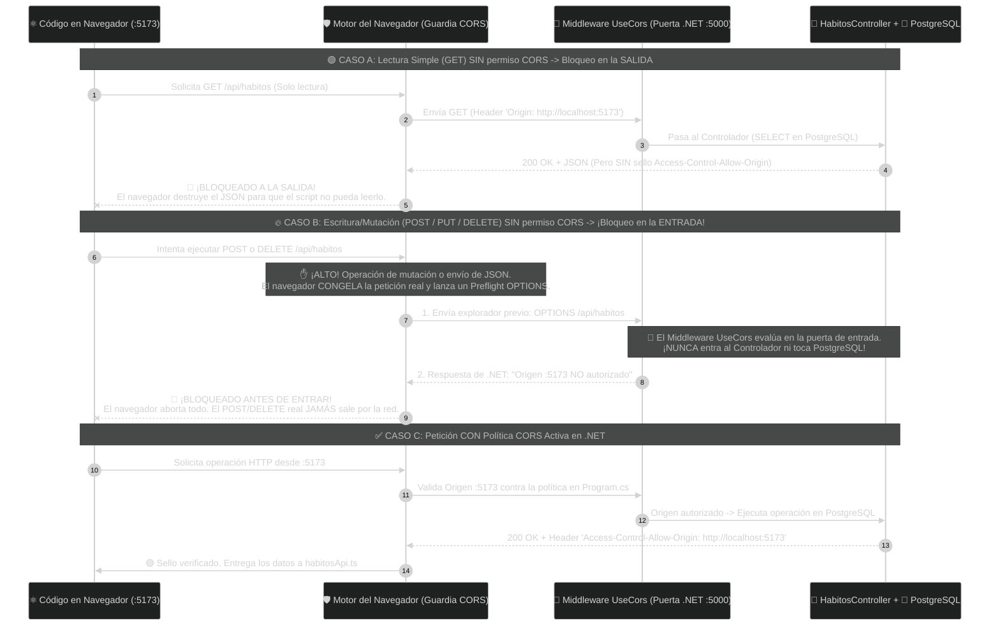
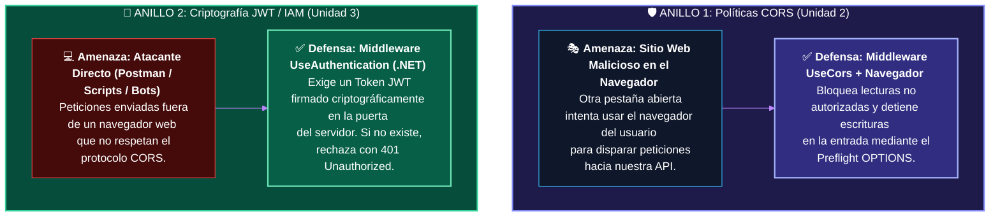
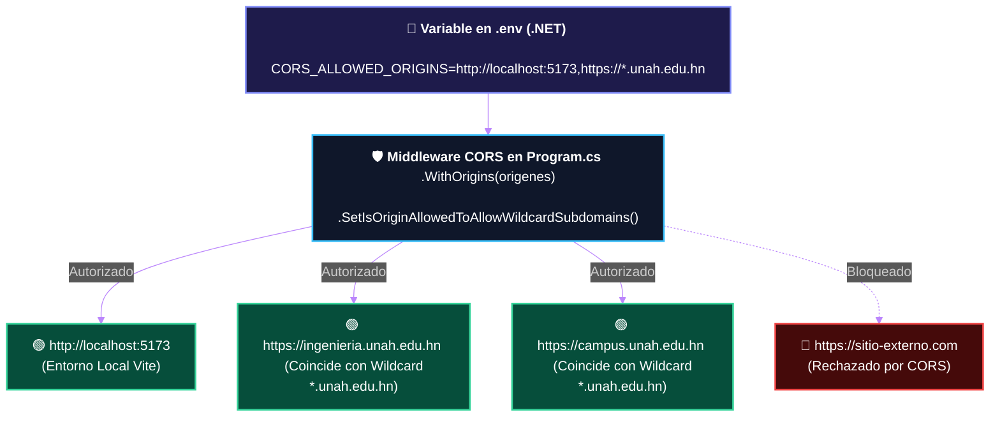

# 🔐 Clase 15: Seguridad Web (Políticas CORS) y Consumo de API REST con Axios

## 📖 Teoría: El Muro de Seguridad del Navegador y la Comunicación Entre Orígenes

Hasta la Clase 14 hemos construido dos sistemas bajo estándares industriales dentro de nuestro monorepo, pero aún viven desconectados:
* **El Backend (.NET + PostgreSQL):** Corre escuchando peticiones en su propio puerto (ej. `http://localhost:5000`).
* **El Frontend (React + Vite):** Corre sirviendo la interfaz gráfica en el puerto `http://localhost:5173`.

Llegó el momento de conectar ambos mundos. Sin embargo, al intentar disparar una petición HTTP desde React hacia .NET, nos toparemos con el mecanismo de defensa más estricto de los navegadores modernos: **La Política del Mismo Origen (Same-Origin Policy) y el protocolo CORS.**

### 1. ¿Qué es un "Origen" (Origin) en Ingeniería de Redes y Web?
Para un navegador web (Chrome, Firefox, Safari, Edge), un Origen es la combinación exacta de tres elementos en una dirección URL:
$$\text{Origen} = \text{Protocolo (Esquema)} + \text{Dominio (Host)} + \text{Puerto}$$

Si auditamos las direcciones de nuestro entorno de desarrollo local:

| Componente del Sistema | Protocolo | Dominio | Puerto | ¿Son el mismo Origen? |
| :--- | :--- | :--- | :--- | :--- |
| **Cliente React (Vite)** | `http://` | `localhost` | `:5173` | ❌ NO. Aunque comparten máquina (`localhost`), el puerto es distinto, por lo tanto son Orígenes Cruzados (Cross-Origin). |
| **Servidor API (.NET)** | `http://` | `localhost` | `:5000` | ❌ NO. |

Por defecto, los navegadores aplican la **Política del Mismo Origen (Same-Origin Policy)**: un script descargado desde el Origen A (`:5173`) tiene prohibido interactuar libremente con recursos del Origen B (`:5000`). Esto evita que, si tienes abierta una pestaña con una página maliciosa, ese sitio pueda enviar peticiones silenciosas en segundo plano hacia otros servidores usando tu navegador.

Para autorizar a nuestro Frontend legítimo (`:5173`) a comunicarse con nuestro Backend (`:5000`), debemos configurar **CORS** (Cross-Origin Resource Sharing o Intercambio de Recursos de Origen Cruzado) en el servidor .NET.

### 2. ¿CORS bloquea en la Entrada o en la Salida? La Arquitectura Real (GET vs. POST/DELETE)
Una de las dudas más importantes en arquitectura de software y bases de datos es: *¿Si CORS bloquea una petición, el servidor .NET llega a ejecutar el código y tocar PostgreSQL, o se detiene antes de entrar?*
La respuesta de ingeniería es que el estándar CORS divide las peticiones en **dos mecanismos distintos** según el peligro de la operación:

**Mecanismo A: Lecturas Simples (GET) $\rightarrow$ Bloqueo en la SALIDA**
Cuando hacemos una consulta `GET`, por definición arquitectónica no estamos modificando datos en PostgreSQL (es un simple `SELECT`). Por ello:
* El navegador **deja salir** la petición `GET` hacia .NET.
* El servidor responde con el JSON, **pero** si .NET no incluyó el sello de autorización (`Access-Control-Allow-Origin: http://localhost:5173`), el navegador **destruye** la respuesta en la puerta de salida antes de entregársela a React. El script no puede leer ni un solo byte, y en la base de datos no ocurrió ningún cambio.

**Mecanismo B: Mutaciones y Escrituras (POST JSON, PUT, DELETE) $\rightarrow$ ¡Bloqueo Previo en la ENTRADA! (Preflight OPTIONS)**
¿Qué pasaría si un script malicioso enviara un `POST` o un `DELETE` y el bloqueo ocurriera recién a la salida? ¡Sería catastrófico, porque el registro ya se habría insertado o borrado en PostgreSQL!
Para impedir que una operación de escritura no autorizada toque siquiera tu controlador de C#, el navegador ejecuta un protocolo de seguridad llamado **Petición de Vuelo Previo (Preflight Request)**:
1. Cuando tu código intenta hacer un `POST` (con JSON), un `PUT` o un `DELETE`, el navegador congela la petición y NO la envía.
2. En su lugar, el navegador envía automáticamente un paquete explorador usando el verbo HTTP `OPTIONS` hacia .NET preguntando en la entrada: *"El origen :5173 quiere hacer un POST o DELETE. ¿Tiene permiso para entrar?"*.
3. El Middleware `app.UseCors()` de .NET intercepta ese `OPTIONS` en la puerta de entrada del servidor (el `HabitosController` jamás es invocado y PostgreSQL no se toca).
4. Si el origen no tiene permiso, .NET rechaza el `OPTIONS` en la entrada y el navegador aborta la operación sin enviar jamás el `POST` ni el `DELETE`.

**Diagrama 1: Arquitectura de Bloqueo en Salida (GET) vs. Bloqueo en Entrada (POST/DELETE)**



### 3. Frontera de Seguridad: ¿Por qué necesitamos CORS (Unidad 2) y también JWT (Unidad 3)?
Como futuros arquitectos de software, debemos tener clara una regla de oro de ciberseguridad: **CORS protege al navegador del usuario, pero NO reemplaza a la autenticación del servidor (JWT).**
¿Qué sucede si un atacante no utiliza un navegador web (Chrome/Edge), sino que utiliza una herramienta directa como Postman, `curl` o un script en Python para lanzar peticiones contra nuestra API? Esas herramientas no son navegadores, por lo que ignoran las reglas de CORS y no envían la consulta previa `OPTIONS`.

Por ello, una arquitectura empresarial completa implementa dos anillos de defensa:



### 4. El Cliente HTTP en React: `fetch` Nativo vs. Axios
Para disparar nuestras peticiones HTTP desde la capa `src/features/habitos/api/habitosApi.ts`, utilizaremos **Axios**, el cliente HTTP estándar en aplicaciones corporativas de React:

| Característica | `fetch()` (Nativo del Navegador) | Axios (Estándar Empresarial) |
| :--- | :--- | :--- |
| **Transformación y Tipado JSON** | Manual: obliga a un doble await (`await res.json()`). | Automática: deserializa el JSON y lo valida contra nuestra interfaz TypeScript en un solo paso (`axios.get<HabitoGlobal[]>`). |
| **Manejo de Errores HTTP** | Si el servidor responde error 404 o 500, fetch no entra al `catch` automáticamente. | Automático: cualquier código de error del servidor o bloqueo de red dispara inmediatamente el bloque `catch`. |
| **Interceptores (Preparación U3)** | No posee soporte nativo de interceptores. | Permite configurar Interceptores centrales (donde inyectaremos nuestro Token JWT en la Unidad 3). |

## 📚 Lectura:
* MDN Web Docs (Mozilla) — Cross-Origin Resource Sharing (CORS) & Preflight Requests (OPTIONS).

## 💻 Desarrollo Práctico: Del Bloqueo de Seguridad a la Integración Full-Stack

En este laboratorio aplicaremos un flujo de ingeniería real: primero programaremos el cliente HTTP en React, intentaremos consumir nuestro Backend actual para provocar y auditar en vivo el bloqueo de seguridad CORS, y finalmente configuraremos la política en .NET para abrir el canal de comunicación con PostgreSQL.

### Paso 1: Variables de Entorno en el Frontend (`frontend/.env`)
Así como en el Backend jamás quemamos cadenas de conexión dentro del código C#, en el Frontend nunca debemos quemar la URL del servidor (`http://localhost:5000`) dentro de los archivos TypeScript, ya que en entornos de producción esa dirección cambiará.

En proyectos con Vite, toda variable de entorno expuesta al cliente debe iniciar con el prefijo `VITE_`.
Crea un archivo llamado `.env` en la raíz de la carpeta `frontend/` (al mismo nivel que `package.json`):

```env
# frontend/.env
# Verifica en tu terminal de .NET en qué puerto está escuchando tu API (ej. 5000, 5150 o 5200)
VITE_API_BASE_URL=http://localhost:5000/api
```

### Paso 2: Instalación de Axios y Conexión Real en `habitosApi.ts`
Abre una terminal dentro de la carpeta `frontend` e instala Axios usando `pnpm`:

```bash
pnpm add axios
```

Ahora abrimos `frontend/src/features/habitos/api/habitosApi.ts`. Gracias a que en la Clase 14 aplicamos Vertical Slicing, solo debemos reemplazar la simulación `setTimeout` de este archivo por la llamada HTTP real hacia nuestro endpoint de .NET:

```typescript
// frontend/src/features/habitos/api/habitosApi.ts
import axios from 'axios'
import type { HabitoGlobal } from '../types/habito.types'

// 1. Instancia centralizada de Axios configurada con la variable de entorno (.env)
export const apiClient = axios.create({
    baseURL: import.meta.env.VITE_API_BASE_URL,
    headers: {
        'Content-Type': 'application/json',
    },
})

// 2. Petición HTTP GET Real hacia el Backend (.NET -> PostgreSQL)
// axios.get<HabitoGlobal[]> garantiza que el JSON recibido cumpla nuestro contrato TypeScript
export const obtenerHabitosGlobalesAsync = async (): Promise<HabitoGlobal[]> => {
    const respuesta = await apiClient.get<HabitoGlobal[]>('/habitos')
    return respuesta.data
}
```

### Paso 3: Manejo Resiliente de Errores de Red en la Vista (`CatalogoHabitosView.tsx`)
En sistemas distribuidos reales, la red puede caer o el navegador puede bloquear la respuesta por políticas de seguridad. Actualizamos nuestra vista `frontend/src/features/habitos/components/CatalogoHabitosView.tsx` agregando un estado `errorRed` para capturar cualquier fallo mediante `.catch()` y mostrarlo en la interfaz:

```tsx
// frontend/src/features/habitos/components/CatalogoHabitosView.tsx
import { useState, useEffect } from 'react'
import type { HabitoGlobal } from '../types/habito.types'
import { obtenerHabitosGlobalesAsync } from '../api/habitosApi'
import { HabitoGlobalCard } from './HabitoGlobalCard'

export function CatalogoHabitosView() {
  // --- ZONA 3: CEREBRO DEL MÓDULO (ALMACÉN DE ESTADOS) ---
  const [habitos, setHabitos] = useState<HabitoGlobal[]>([])
  const [cargando, setCargando] = useState<boolean>(true)
  const [errorRed, setErrorRed] = useState<string | null>(null)
  const [busqueda, setBusqueda] = useState<string>('')

  useEffect(() => {
    // Disparamos la petición HTTP GET real hacia .NET al montar el componente
    obtenerHabitosGlobalesAsync()
      .then((datosDesdePostgres) => {
        setHabitos(datosDesdePostgres)
        setErrorRed(null)
      })
      .catch((error) => {
        console.error('Fallo en la comunicación HTTP con .NET:', error)
        setErrorRed('La comunicación fue rechazada o bloqueada por políticas de seguridad (CORS). Revisa la consola del navegador (F12) y verifica que el Backend autorice al origen http://localhost:5173.')
      })
      .finally(() => {
        // Apaga el estado de carga tanto si hubo éxito como si ocurrió un error
        setCargando(false)
      })
  }, [])

  const habitosFiltrados = habitos.filter((habito) =>
    habito.nombre.toLowerCase().includes(busqueda.toLowerCase())
  )

  // --- ZONA 4: RENDERIZADO DECLARATIVO ---
  return (
    <div>
      {/* Barra Superior de Título y Acción Principal */}
      <div className="flex flex-col sm:flex-row sm:items-center sm:justify-between gap-4 pb-6 mb-6 border-b border-slate-800">
        <div>
          <h1 className="text-2xl md:text-3xl font-bold text-white">Catálogo Global de Hábitos</h1>
          <p className="text-slate-400 text-sm mt-1">
            Conectado en tiempo real vía HTTP/CORS con <code className="text-indigo-400 font-mono">PostgreSQL</code>.
          </p>
        </div>

        <button className="bg-indigo-600 hover:bg-indigo-500 text-white font-medium text-sm px-4 py-2.5 rounded-lg transition-colors shadow-sm self-start sm:self-auto cursor-pointer">
          + Nuevo Hábito Global
        </button>
      </div>

      {/* Buscador Reactivo */}
      <div className="mb-6 flex flex-col sm:flex-row sm:items-center justify-between gap-4">
        <input
          type="text"
          placeholder="🔍 Filtrar hábitos provenientes de PostgreSQL..."
          value={busqueda}
          onChange={(e) => setBusqueda(e.target.value)}
          className="w-full sm:max-w-md bg-slate-950 border border-slate-800 rounded-lg px-4 py-2.5 text-sm text-white placeholder-slate-500 focus:outline-none focus:border-indigo-500 transition-colors"
        />
        <span className="text-xs text-slate-400">
          Mostrando <strong className="text-white">{habitosFiltrados.length}</strong> de {habitos.length} registros en BD
        </span>
      </div>

      {/* 1. Estado de Carga */}
      {cargando && (
        <div className="bg-slate-800/50 border border-slate-800 rounded-xl p-12 text-center">
          <p className="text-indigo-400 font-semibold animate-pulse text-lg">
            ⏳ Consultando endpoint GET /api/habitos en .NET...
          </p>
        </div>
      )}

      {/* 2. Estado de Error de Red o Bloqueo CORS */}
      {!cargando && errorRed && (
        <div className="bg-red-950/40 border border-red-500/40 rounded-xl p-6 text-center">
          <p className="text-red-400 font-bold text-base mb-1">🚨 Error de Comunicación Full-Stack</p>
          <p className="text-slate-300 text-sm">{errorRed}</p>
        </div>
      )}

      {/* 3. Estado de Éxito: Renderizado de las filas reales de PostgreSQL */}
      {!cargando && !errorRed && (
        <section className="grid grid-cols-1 sm:grid-cols-2 lg:grid-cols-3 gap-5">
          {habitosFiltrados.map((habito) => (
            <HabitoGlobalCard 
              key={habito.id} 
              id={habito.id} 
              nombre={habito.nombre} 
            />
          ))}
        </section>
      )}
    </div>
  )
}
```

### Paso 4: 🛑 El Choque Contra el Muro (Auditando el Bloqueo CORS en Vivo)
Antes de tocar nuestro Backend, comprobemos qué sucede cuando intentamos comunicar dos orígenes distintos (`:5173` y `:5000`) sin autorización expresa:
1. Asegúrate de que tu contenedor Docker de PostgreSQL esté encendido y levanta el Backend (.NET) en una terminal (`dotnet run` dentro de `backend/HabitForge.API`).
2. En otra terminal, levanta el Frontend (React) (`pnpm run dev` dentro de `frontend`) y abre `http://localhost:5173`.
3. **Observa el fenómeno en pantalla:** Verás aparecer inmediatamente nuestra tarjeta roja: "🚨 Error de Comunicación Full-Stack".
4. **Auditoría Forense (F12):** Presiona F12 en el navegador y ve a la pestaña *Console*. Encontrarás la evidencia exacta del Caso A que estudiamos en la teoría:

> `Access to XMLHttpRequest at 'http://localhost:5000/api/habitos' from origin 'http://localhost:5173' has been blocked by CORS policy: No 'Access-Control-Allow-Origin' header is present on the requested resource.`

*(Nota de Cátedra: Si observas la terminal de .NET, notarás que Entity Framework sí ejecutó el `SELECT` en PostgreSQL, pero al no llevar el sello `Access-Control-Allow-Origin`, el guardia del navegador destruyó el JSON en la puerta de salida y disparó el bloque `.catch()` de Axios).*

### Paso 5: 🔓 Configurando la Política CORS Dinámica en el Backend (.env y Wildcards de Subdominio)
Como arquitectos de software, aplicamos la misma regla de oro tanto en el Frontend como en el Backend: cero URLs quemadas (hardcoded) en el código fuente.

En un entorno institucional o corporativo real, necesitamos que nuestra variable de entorno soporte Wildcards de Subdominio (por ejemplo, `https://*.unah.edu.hn`). Esto permite que cualquier portal o micro-frontend institucional (`https://ingenieria.unah.edu.hn`, `https://registro.unah.edu.hn`, `https://habitforge.unah.edu.hn`) pueda consumir nuestra API sin tener que editar ni recompilar el Backend cada vez que nace un nuevo subdominio, manteniendo bloqueado cualquier sitio externo ajeno a la institución.



#### 1. Agregar la variable en el archivo .env del Backend
Abre el archivo `.env` de tu proyecto Backend (`backend/HabitForge.API/.env`) y agrega la variable `CORS_ALLOWED_ORIGINS`. Puedes combinar tu entorno local de desarrollo con un wildcard de subdominio institucional separados por coma:

```env
# backend/HabitForge.API/.env
ConnectionStrings__PostgresConnection=Host=localhost;Port=5432;Database=HabitForgeDb;Username=postgres;Password=tu_password

# Orígenes permitidos (Soporta URLs explícitas y Wildcards de subdominio como https://*.dominio.com)
CORS_ALLOWED_ORIGINS=http://localhost:5173,https://*.unah.edu.hn
```

#### 2. Lectura Dinámica y Activación de Subdominios Wildcard en Program.cs
Abre `backend/HabitForge.API/Program.cs`.

⚠️ **Regla de Arquitectura en ASP.NET Core:**
Por defecto, el método `.WithOrigins()` compara las URLs como texto plano (si le pasas `https://*.unah.edu.hn`, buscará literalmente un asterisco en la URL y fallará). Para ordenarle al motor de .NET que interprete el comodín `*.` como cualquier subdominio válido de tercer o cuarto nivel, es obligatorio encadenar el método `.SetIsOriginAllowedToAllowWildcardSubdomains()`.

```csharp
// backend/HabitForge.API/Program.cs
using DotNetEnv;
using HabitForge.Application;
using HabitForge.Infrastructure;

var builder = WebApplication.CreateBuilder(args);
Env.Load();

var connectionString = Environment.GetEnvironmentVariable("ConnectionStrings__PostgresConnection") 
                       ?? throw new InvalidOperationException("Falta la cadena de conexión a PostgreSQL.");

// Leemos los orígenes permitidos desde el archivo .env del Backend
var corsAllowedOrigins = Environment.GetEnvironmentVariable("CORS_ALLOWED_ORIGINS") 
                         ?? throw new InvalidOperationException("Falta la variable CORS_ALLOWED_ORIGINS en el archivo .env.");

// Inyección de nuestras capas de Clean Architecture (Unidad 1)
builder.Services.AddInfrastructure(connectionString);
builder.Services.AddApplication();

// =========================================================================
// 1. DEFINICIÓN DE LA POLÍTICA DE SEGURIDAD CORS DINÁMICA (.env + Wildcards)
// =========================================================================
builder.Services.AddCors(options =>
{
    options.AddPolicy("PoliticaCorsHabitForge", policy =>
    {
        // Separamos por coma por si existen múltiples orígenes (ej. localhost + https://*.unah.edu.hn)
        var origenes = corsAllowedOrigins.Split(',', StringSplitOptions.RemoveEmptyEntries | StringSplitOptions.TrimEntries);

        policy.WithOrigins(origenes)
              .SetIsOriginAllowedToAllowWildcardSubdomains() // Habilita comodines de subdominio (ej. https://*.unah.edu.hn)
              .AllowAnyHeader()                              // Autoriza encabezados JSON y futuros Tokens JWT
              .AllowAnyMethod();                             // Autoriza verbos GET y Preflights (POST, PUT, DELETE)
    });
});

builder.Services.AddControllers();

var app = builder.Build();

// =========================================================================
// 2. ACTIVACIÓN DEL MIDDLEWARE CORS EN LA PUERTA DE ENTRADA HTTP
// Regla crítica: Siempre debe ubicarse ANTES de MapControllers()
// =========================================================================
app.UseCors("PoliticaCorsHabitForge");

app.MapControllers();
app.Run();
```

### Paso 6: Verificación Final de la Integración Full-Stack
En la terminal de tu Backend .NET, detén el servidor (`Ctrl + C`) y vuélvelo a iniciar (`dotnet run`) para que cargue la variable `CORS_ALLOWED_ORIGINS` desde su archivo `.env`.

Sin modificar absolutamente nada en React, regresa al navegador en `http://localhost:5173` y presiona `F5`.

¡Conexión establecida! En la pestaña *Network* (F12) podrás verificar el encabezado `Access-Control-Allow-Origin: http://localhost:5173` estampado dinámicamente por .NET, y verás renderizarse en tus tarjetas de Tailwind los registros reales almacenados en tu base de datos PostgreSQL.

---
[⬅️ Volver al índice de la fase](./index.md)
