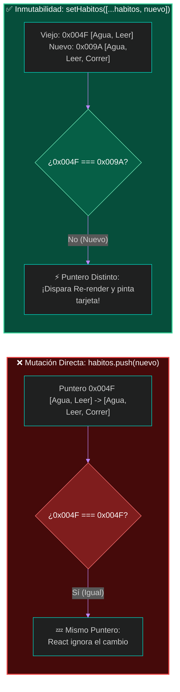

# 🚀 Clase 16: Mutaciones HTTP (POST), Defensa del Backend y Artefactos de Validación Reactiva (Zod)

## 📖 Teoría (Parte 1): El Ciclo de Escritura Full-Stack y la Inmutabilidad en Memoria

En la Clase 15 logramos leer registros reales desde PostgreSQL mediante una petición GET. Sin embargo, un sistema transaccional requiere Mutaciones de Datos (inserciones, actualizaciones y eliminaciones). En esta sesión conectaremos el botón `+ Nuevo Hábito Global` con el endpoint `POST /api/habitos` de nuestro Backend en .NET.

### 1. Asimetría de Contratos: ¿Por qué necesitamos un DTO de Creación?

En el diseño de nuestra base de datos relacional (PostgreSQL), la llave primaria `Id` de la tabla `HabitosGlobales` es auto-incremental (`GENERATED BY DEFAULT AS IDENTITY`). El Frontend jamás inventa llaves primarias; esa responsabilidad es exclusiva del motor relacional.

Por ello, aplicamos **Asimetría de Contratos**:
*   📤 **Contrato de Entrada (`CrearHabitoGlobalDto`)**: Viaja desde React hacia .NET en el cuerpo (Body) del POST. Contiene únicamente `{ nombre: string }`.
*   📥 **Contrato de Salida (`HabitoGlobal`)**: Cuando PostgreSQL inserta la fila y genera el nuevo Id, .NET responde `201 Created` con la entidad completa `{ id: 7, nombre: "..." }`.

### 2. El Problema del `<form>` Tradicional y la Inmutabilidad en el Heap

Para ejecutar una inserción en una Single Page Application (SPA) sin destruir el estado en memoria RAM, debemos dominar dos mecanismos:

*   **Intercepción del Envío (`e.preventDefault()`)**: Por defecto, un `<form>` de HTML recarga toda la página web al enviarse, lo que borraría nuestro Almacén Global de React (Heap). Invocar `e.preventDefault()` detiene la recarga del navegador para enviar el JSON silenciosamente vía Axios.
*   **Inmutabilidad del Puntero en Memoria (`[...]` vs `.push()`)**: Cuando .NET nos devuelve el hábito recién creado en PostgreSQL, queremos agregarlo a la cuadrícula en pantalla sin hacer otro GET. Si hiciéramos `habitos.push(nuevo)` y luego `setHabitos(habitos)`, le pasaríamos a React la misma dirección de memoria (puntero), por lo que React asumiría que nada cambió y no refrescaría la pantalla. Debemos usar el **Operador Spread** (`setHabitos([...habitos, nuevo])`), el cual crea un nuevo arreglo en una nueva dirección del Heap con los elementos anteriores más el nuevo, disparando inmediatamente el Re-render.



## 💻 Desarrollo Práctico (Fase 1): El POST sin Validaciones y la Autodefensa del Backend

Siguiendo nuestra metodología de laboratorio, primero construiremos el formulario sin ninguna validación en el Frontend. Nuestro objetivo es enviar "data sucia" a propósito hacia .NET para observar en vivo el Vuelo Previo (OPTIONS) de CORS y comprobar cómo nuestro Backend se protege antes de tocar PostgreSQL.

### Paso 1: Definir el DTO de Entrada (`src/features/habitos/types/habito.types.ts`)

Abrimos nuestra capa de contratos y agregamos `CrearHabitoGlobalDto`:

```typescript
// frontend/src/features/habitos/types/habito.types.ts

// 1. Contrato de Lectura / Salida (Entidad que viene desde PostgreSQL con su Primary Key)
export interface HabitoGlobal {
    id: number;
    nombre: string;
}

// 2. Contrato de Escritura / Entrada (Payload que enviamos en el POST hacia .NET)
export interface CrearHabitoGlobalDto {
    nombre: string;
}
```

### Paso 2: Agregar el Método POST en la Capa API (`src/features/habitos/api/habitosApi.ts`)

Abrimos `habitosApi.ts` y añadimos la función `crearHabitoGlobalAsync`:

```typescript
// frontend/src/features/habitos/api/habitosApi.ts
import axios from 'axios'
import type { HabitoGlobal, CrearHabitoGlobalDto } from '../types/habito.types'

const API_BASE_URL = import.meta.env.VITE_API_BASE_URL

if (!API_BASE_URL) {
    console.error('🚨 ERROR CRÍTICO: No se detectó VITE_API_BASE_URL en frontend/.env')
}

export const apiClient = axios.create({
    baseURL: API_BASE_URL,
    headers: {
        'Content-Type': 'application/json',
    },
})

// 1. Endpoint GET: Obtener todo el catálogo
export const obtenerHabitosGlobalesAsync = async (): Promise<HabitoGlobal[]> => {
    const respuesta = await apiClient.get<HabitoGlobal[]>('/habitos')

    if (!Array.isArray(respuesta.data)) {
        throw new Error('La respuesta recibida no es un arreglo JSON válido.')
    }

    return respuesta.data
}

// 2. Endpoint POST: Insertar un nuevo hábito global en PostgreSQL
export const crearHabitoGlobalAsync = async (nuevoHabito: CrearHabitoGlobalDto): Promise<HabitoGlobal> => {
    const respuesta = await apiClient.post<HabitoGlobal>('/habitos', nuevoHabito)
    return respuesta.data
}
```

### Paso 3: Crear el Formulario Inicial Sin Validaciones (`src/features/habitos/components/CrearHabitoForm.tsx`)

Crea el archivo `CrearHabitoForm.tsx`. Observa que no incluimos ningún `if` de validación: el formulario toma literalmente lo que haya en el `<input>` (incluso si está vacío) y lo dispara por la red hacia .NET:

```tsx
// frontend/src/features/habitos/components/CrearHabitoForm.tsx
import { useState, type FormEvent } from 'react'
import type { HabitoGlobal } from '../types/habito.types'
import { crearHabitoGlobalAsync } from '../api/habitosApi'

interface CrearHabitoFormProps {
    onHabitoCreado: (nuevoHabito: HabitoGlobal) => void;
    onCancelar: () => void;
}

export function CrearHabitoForm({ onHabitoCreado, onCancelar }: CrearHabitoFormProps) {
    const [nombre, setNombre] = useState<string>('')
    const [guardando, setGuardando] = useState<boolean>(false)
    const [errorServidor, setErrorServidor] = useState<string | null>(null)

    const manejarEnvio = async (e: FormEvent<HTMLFormElement>) => {
        e.preventDefault() // Evita el F5 nativo del navegador

        try {
            setGuardando(true)
            setErrorServidor(null)

            // ⚠️️ FASE 1: Enviamos el dato crudo sin validar en el Frontend
            const habitoCreado = await crearHabitoGlobalAsync({ nombre })

            setNombre('')
            onHabitoCreado(habitoCreado)
        } catch (error) {
            console.error('🚨 El Backend .NET rechazó la petición POST:', error)
            setErrorServidor('El servidor .NET rechazó la operación (400 Bad Request). El Backend protegió la base de datos ante datos inválidos.')
        } finally {
            setGuardando(false)
        }
    }

    return (
        <form onSubmit={manejarEnvio} className="bg-slate-800/90 border border-indigo-500/40 rounded-xl p-5 mb-8 shadow-lg">
            <div className="flex items-center justify-between mb-4">
                <h2 className="text-base font-bold text-white">✨ Registrar Nuevo Hábito Global</h2>
                <span className="text-xs font-mono text-slate-400 bg-slate-900 px-2 py-1 rounded border border-slate-700">
                    POST /api/habitos
                </span>
            </div>

            <div className="flex flex-col sm:flex-row gap-3">
                <input
                    type="text"
                    placeholder="Escribe un nuevo hábito..."
                    value={nombre}
                    onChange={(e) => setNombre(e.target.value)}
                    disabled={guardando}
                    className="flex-1 bg-slate-950 border border-slate-700 rounded-lg px-4 py-2.5 text-sm text-white"
                />
                <button type="submit" disabled={guardando} className="bg-indigo-600 hover:bg-indigo-500 text-white font-medium text-sm px-5 py-2.5 rounded-lg cursor-pointer">
                    {guardando ? '⏳ Enviando...' : '💾 Guardar en PostgreSQL'}
                </button>
                <button type="button" onClick={onCancelar} className="bg-slate-700 text-slate-200 text-sm px-4 py-2.5 rounded-lg cursor-pointer">
                    Cancelar
                </button>
            </div>

            {errorServidor && (
                <p className="text-red-400 text-xs mt-3 font-medium">🛡️ {errorServidor}</p>
            )}
        </form>
    )
}
```

### Paso 4: Conectar el Formulario en `CatalogoHabitosView.tsx` y Ejecutar el Experimento de "Data Sucia"

Abre `src/features/habitos/components/CatalogoHabitosView.tsx`, agrega el estado `mostrarFormulario` y conecta el componente:

```tsx
// frontend/src/features/habitos/components/CatalogoHabitosView.tsx
import { useState, useEffect } from 'react'
import type { HabitoGlobal } from '../types/habito.types'
import { obtenerHabitosGlobalesAsync } from '../api/habitosApi'
import { HabitoGlobalCard } from './HabitoGlobalCard'
import { CrearHabitoForm } from './CrearHabitoForm'

export function CatalogoHabitosView() {
  const [habitos, setHabitos] = useState<HabitoGlobal[]>([])
  const [cargando, setCargando] = useState<boolean>(true)
  const [errorRed, setErrorRed] = useState<string | null>(null)
  const [busqueda, setBusqueda] = useState<string>('')
  const [mostrarFormulario, setMostrarFormulario] = useState<boolean>(false)

  useEffect(() => {
    obtenerHabitosGlobalesAsync()
      .then((datosDesdePostgres) => {
        setHabitos(datosDesdePostgres)
        setErrorRed(null)
      })
      .catch((error) => {
        console.error('Auditoría de Error en la Petición HTTP:', error)
        setErrorRed('La comunicación con el servidor API (.NET) fue bloqueada o rechazada.')
      })
      .finally(() => {
        setCargando(false)
      })
  }, [])

  // Actualización Inmutable en el Heap usando Spread Operator [...]
  const manejarHabitoCreado = (nuevoHabitoDesdeBD: HabitoGlobal) => {
    setHabitos((habitosActuales) => [...habitosActuales, nuevoHabitoDesdeBD])
    setMostrarFormulario(false)
  }

  const habitosFiltrados = habitos.filter((habito) =>
    habito.nombre.toLowerCase().includes(busqueda.toLowerCase())
  )

  return (
    <div>
      <div className="flex flex-col sm:flex-row sm:items-center sm:justify-between gap-4 pb-6 mb-6 border-b border-slate-800">
        <div>
          <h1 className="text-2xl md:text-3xl font-bold text-white">Catálogo Global de Hábitos</h1>
          <p className="text-slate-400 text-sm mt-1">
            Conectado en tiempo real vía HTTP/CORS con <code className="text-indigo-400 font-mono">PostgreSQL</code>.
          </p>
        </div>

        {!mostrarFormulario && (
          <button 
            onClick={() => setMostrarFormulario(true)}
            className="bg-indigo-600 hover:bg-indigo-500 text-white font-medium text-sm px-4 py-2.5 rounded-lg transition-colors shadow-sm self-start sm:self-auto cursor-pointer"
          >
            + Nuevo Hábito Global
          </button>
        )}
      </div>

      {/* Renderizado condicional del Formulario POST */}
      {mostrarFormulario && (
        <CrearHabitoForm 
          onHabitoCreado={manejarHabitoCreado}
          onCancelar={() => setMostrarFormulario(false)}
        />
      )}

      <div className="mb-6 flex flex-col sm:flex-row sm:items-center justify-between gap-4">
        <input
          type="text"
          placeholder="🔍 Filtrar hábitos provenientes de PostgreSQL..."
          value={busqueda}
          onChange={(e) => setBusqueda(e.target.value)}
          className="w-full sm:max-w-md bg-slate-950 border border-slate-800 rounded-lg px-4 py-2.5 text-sm text-white placeholder-slate-500 focus:outline-none focus:border-indigo-500 transition-colors"
        />
        <span className="text-xs text-slate-400">
          Mostrando <strong className="text-white">{habitosFiltrados.length}</strong> de {habitos.length} registros en BD
        </span>
      </div>

      {cargando && (
        <div className="bg-slate-800/50 border border-slate-800 rounded-xl p-12 text-center">
          <p className="text-indigo-400 font-semibold animate-pulse text-lg">
            ⏳ Consultando endpoint GET /api/habitos en .NET...
          </p>
        </div>
      )}

      {!cargando && errorRed && (
        <div className="bg-red-950/40 border border-red-500/40 rounded-xl p-6 text-center">
          <p className="text-red-400 font-bold text-base mb-1">🚨 Error de Comunicación Full-Stack</p>
          <p className="text-slate-300 text-sm">{errorRed}</p>
        </div>
      )}

      {!cargando && !errorRed && (
        <section className="grid grid-cols-1 sm:grid-cols-2 lg:grid-cols-3 gap-5">
          {habitosFiltrados.map((habito) => (
            <HabitoGlobalCard 
              key={habito.id} 
              id={habito.id} 
              nombre={habito.nombre} 
            />
          ))}
        </section>
      )}
    </div>
  )
}
```

### 🔬 Experimento en Vivo (La Autodefensa del Backend):
1. Abre las Herramientas de Desarrollador (`F12` $\rightarrow$ pestaña Network).
2. Haz clic en `+ Nuevo Hábito Global`, deja la caja de texto completamente vacía y presiona `💾 Guardar en PostgreSQL`.
3. Observa qué ocurrió en la red:
    * Primero se disparó el Preflight `OPTIONS` (`204 No Content`).
    * Luego salió el `POST` llevando "data sucia" (`{ "nombre": "" }`).
    * ¡El Backend .NET se defendió! Antes de permitir que una cadena vacía llegara a PostgreSQL, las reglas de dominio de nuestro Backend rechazaron la petición devolviendo un error HTTP (`400 Bad Request`), mostrando en pantalla el aviso: *"🛡️ El servidor .NET rechazó la operación"*.

## 📖 Teoría (Parte 2): ¿Por qué es un Error Arquitectónico Enviar "Data Sucia" o Validar "A Pie"?

Aunque comprobamos que nuestro Backend en .NET es capaz de defender a PostgreSQL, dejar el Frontend sin validaciones —o intentar validar con `if`/`else` manuales dentro del componente— presenta tres graves problemas de ingeniería:

1. **Desperdicio de Red y Procesamiento en el Servidor (Data Sucia)**: Cada vez que el Frontend permite enviar un dato vacío o inválido, obligamos al navegador a realizar dos viajes de red por internet (OPTIONS + POST), consumimos ancho de banda, ocupamos un hilo de ejecución (Thread Pool) en el servidor Kestrel de .NET y gastamos memoria deserializando un JSON que sabíamos de antemano que era inválido. El Frontend debe actuar como un filtro de primera línea que solo deje viajar datos limpios hacia el Backend.
2. **Experiencia de Usuario Tardía (Después del Evento vs. Mientras Escribe)**: En la Fase 1, el usuario solo descubre que cometió un error después de hacer clic en el botón de envío y esperar a que el servidor le responda. En el diseño de interfaces modernas, la validación debe ser reactiva y en tiempo real (`onChange`): el usuario debe recibir retroalimentación visual mientras está escribiendo, y el botón de envío debe permanecer bloqueado hasta que el contrato se cumpla.
3. **El Antipatrón de Validar "A Pie" (`if`/`else` acoplados en la Vista)**: Un error común es meter validaciones manuales dentro de la función del componente:

```typescript
// ❌ ANTIPATRÓN: Mezclar reglas de validación imperativas dentro de la lógica del componente UI
if (nombre.trim().length < 3) { setError("Muy corto"); return; }
if (nombre.trim().length > 100) { setError("Muy largo"); return; }
```
Si un formulario tiene 15 campos (como un registro de clientes o facturación), el componente se llena de decenas de `if`/`else` y múltiples `useState` para errores, violando el Principio de Responsabilidad Única (SRP).

### 4. La Solución de Grado Industrial: Esquemas Declarativos con Zod + React Hook Form

Así como en PostgreSQL usamos restricciones declarativas (`NOT NULL`, `VARCHAR(100)`) y en .NET usamos `DataAnnotations` o `FluentValidation`, en el ecosistema React + TypeScript delegamos esta responsabilidad a un **Artefacto de Validación de Esquemas** compuesto por dos librerías estándar:

| Artefacto | Rol en nuestra Arquitectura (Vertical Slicing) | Equivalente en Backend (.NET / BD) |
| :--- | :--- | :--- |
| **1. Zod (`schemas/habito.schema.ts`)** | Define las reglas de negocio y formato de los datos en un archivo aislado fuera del componente visual. | FluentValidation / Restricciones CHECK y VARCHAR en SQL. |

```mermaid
%%{init: {'theme': 'dark', 'themeVariables': { 'lineColor': '#BB86FC', 'primaryColor': '#3700B3', 'nodeBorder': '#03DAC6' }}}%%
sequenceDiagram
    autonumber
    participant User as 👤 Usuario (Teclado)
    participant RHF as 🎛️ React Hook Form (mode: onChange)
    participant Zod as 📜 Artefacto Zod (habito.schema.ts)
    participant API as 🌐 Axios -> .NET -> PostgreSQL

    User->>RHF: 1. Escribe la letra "A" en el <input>
    RHF->>Zod: 2. Evalúa en tiempo real contra el Esquema Declarativo
    Zod-->>RHF: 3. ❌ Falla regla .min(3): "Debe tener al menos 3 caracteres"
    RHF-->>User: 4. Muestra alerta instantánea MIENTRAS ESCRIBE y bloquea botón Guardar
    Note over RHF,API: 🛡️ CERO tráfico de red: La data sucia jamás sale hacia .NET

    User->>RHF: 5. Completa el texto: "Aprender índices B-Tree en PostgreSQL"
    RHF->>Zod: 6. Evalúa en tiempo real contra el Esquema
    Zod-->>RHF: 7. ✅ Cumple todas las reglas (.trim, .min(3), .max(100))
    RHF-->>User: 8. Limpia alertas en vivo y habilita botón Guardar
    User->>RHF: 9. Clic en Guardar (Submit)
    RHF->>API: 10. Envía DTO 100% limpio y sanitizado a .NET -> 201 Created
```

| **2. React Hook Form + `@hookform/resolvers`** | Conecta el esquema de Zod con los `<input>` del DOM, evaluando cada tecla en tiempo real (`mode: 'onChange'`) sin escribir un solo `if`. | El Model Binder y ModelState automático de ASP.NET Core. |



### 📚 Lectura:
* Documentación Oficial de Zod (zod.dev) & React Hook Form: Schema Validation with Zod Resolver.

## 💻 Desarrollo Práctico (Fase 2): Implementación del Artefacto de Validación en Tiempo Real

Vamos a refactorizar nuestro módulo `src/features/habitos/` agregando una nueva capa `schemas/` para separar completamente las reglas de validación de nuestro componente visual.

### Paso 1: Instalación de Zod y React Hook Form
Detén o abre una nueva terminal dentro de la carpeta `frontend` e instala los tres paquetes con `pnpm`:

```bash
pnpm add zod react-hook-form @hookform/resolvers
```

### Paso 2: Crear el Artefacto de Validación (`src/features/habitos/schemas/habito.schema.ts`)
Dentro de `src/features/habitos/`, crea una nueva carpeta llamada `schemas` y dentro de ella el archivo `habito.schema.ts`.
Observa cómo este artefacto refleja con exactitud las restricciones físicas de nuestra tabla `HabitosGlobales` en PostgreSQL y limpia automáticamente los espacios en blanco laterales con `.trim()`:

```typescript
// frontend/src/features/habitos/schemas/habito.schema.ts
import { z } from 'zod'

// Artefacto Declarativo de Validación (Espejo de las restricciones de Dominio y Base de Datos)
export const crearHabitoGlobalSchema = z.object({
    nombre: z
        .string()
        .trim() // Sanitiza el dato eliminando espacios vacíos al inicio y al final
        .min(3, 'El nombre del hábito debe contener al menos 3 caracteres válidos.')
        .max(100, 'El nombre no puede superar los 100 caracteres permitidos en PostgreSQL.')
        .regex(
            /^[a-zA-ZáéíóúÁÉÍÓÚñÑ0-9\s.,()-]+$/,
            'El hábito contiene caracteres especiales no permitidos.'
        ),
})

// Zod infiere automáticamente el tipo TypeScript a partir del esquema
export type CrearHabitoGlobalSchemaType = z.infer<typeof crearHabitoGlobalSchema>
```

### Paso 3: Refactorizar `CrearHabitoForm.tsx` (Cero Validaciones "A Pie" y Feedback Mientras Escribe)
Ahora reemplazamos el código de `src/features/habitos/components/CrearHabitoForm.tsx`.
Observa la limpieza arquitectónica que logramos:
* **Desapareció `useState` para el input**: React Hook Form administra el valor mediante `{...register('nombre')}`.
* **Cero `if`/`else` de validación**: El `zodResolver` ejecuta el artefacto `crearHabitoGlobalSchema` automáticamente.
* **Validación Durante la Escritura (`mode: 'onChange'`)**: Apenas el estudiante escribe la primera letra, el esquema evalúa el campo en vivo, muestra si falta longitud y mantiene deshabilitado el botón de envío (`!isValid`) hasta que el dato esté 100% limpio.

```tsx
// frontend/src/features/habitos/components/CrearHabitoForm.tsx
import { useState } from 'react'
import { useForm } from 'react-hook-form'
import { zodResolver } from '@hookform/resolvers/zod'
import type { HabitoGlobal } from '../types/habito.types'
import { crearHabitoGlobalAsync } from '../api/habitosApi'
import { crearHabitoGlobalSchema, type CrearHabitoGlobalSchemaType } from '../schemas/habito.schema'

interface CrearHabitoFormProps {
    onHabitoCreado: (nuevoHabito: HabitoGlobal) => void;
    onCancelar: () => void;
}

export function CrearHabitoForm({ onHabitoCreado, onCancelar }: CrearHabitoFormProps) {
    // Estado exclusivo para errores inesperados de red/servidor
    const [errorServidor, setErrorServidor] = useState<string | null>(null)

    // --- CONEXIÓN DEL ARTEFACTO DE VALIDACIÓN EN TIEMPO REAL ---
    const {
        register,
        handleSubmit,
        reset,
        formState: { errors, isValid, isSubmitting },
    } = useForm<CrearHabitoGlobalSchemaType>({
        resolver: zodResolver(crearHabitoGlobalSchema),
        mode: 'onChange', // 🔥 Clave UX: Valida MIENTRAS el usuario escribe, no después del clic
        defaultValues: {
            nombre: '',
        },
    })

    // Esta función SOLO llega a ejecutarse si el Artefacto Zod aprobó el 100% de las reglas
    const procesarEnvioLimpio = async (datosValidados: CrearHabitoGlobalSchemaType) => {
        try {
            setErrorServidor(null)

            // Enviamos data 100% limpia y sanitizada hacia .NET y PostgreSQL
            const habitoCreadoEnBd = await crearHabitoGlobalAsync(datosValidados)

            reset() // Limpia el formulario
            onHabitoCreado(habitoCreadoEnBd)
        } catch (error) {
            console.error('Error al comunicarse con el servidor .NET:', error)
            setErrorServidor('No se pudo guardar el hábito. Verifica la conexión con el servidor.')
        }
    }

    return (
        <form 
            onSubmit={handleSubmit(procesarEnvioLimpio)} 
            className="bg-slate-800/90 border border-indigo-500/40 rounded-xl p-5 mb-8 shadow-lg"
        >
            <div className="flex items-center justify-between mb-4">
                <h2 className="text-base font-bold text-white flex items-center gap-2">
                    <span className="text-indigo-400">✨</span> Registrar Nuevo Hábito en el Catálogo Global
                </h2>
                <span className="text-xs font-mono text-emerald-400 bg-emerald-950/60 px-2.5 py-1 rounded border border-emerald-500/30">
                    🛡️ Protegido por Esquema Zod (onChange)
                </span>
            </div>

            <div className="flex flex-col sm:flex-row gap-3">
                <div className="flex-1">
                    <input
                        type="text"
                        placeholder="Ej. Diseñar diagramas Entidad-Relación en 3FN..."
                        disabled={isSubmitting}
                        autoFocus
                        {...register('nombre')}
                        className={`w-full bg-slate-950 border rounded-lg px-4 py-2.5 text-sm text-white placeholder-slate-500 focus:outline-none transition-colors ${
                            errors.nombre 
                                ? 'border-amber-500 focus:border-amber-400' 
                                : 'border-slate-700 focus:border-indigo-500'
                        }`}
                    />
                </div>

                <div className="flex items-center gap-2 self-start">
                    <button
                        type="submit"
                        disabled={!isValid || isSubmitting}
                        className="bg-indigo-600 hover:bg-indigo-500 disabled:bg-slate-800 disabled:text-slate-500 disabled:border disabled:border-slate-700 text-white font-medium text-sm px-5 py-2.5 rounded-lg transition-colors cursor-pointer disabled:cursor-not-allowed"
                    >
                        {isSubmitting ? '⏳ Guardando en BD...' : '💾 Guardar en PostgreSQL'}
                    </button>

                    <button
                        type="button"
                        onClick={onCancelar}
                        disabled={isSubmitting}
                        className="bg-slate-700 hover:bg-slate-600 text-slate-200 font-medium text-sm px-4 py-2.5 rounded-lg transition-colors cursor-pointer"
                    >
                        Cancelar
                    </button>
                </div>
            </div>

            {/* Retroalimentación instantánea MIENTRAS el usuario escribe */}
            {errors.nombre && (
                <p className="text-amber-400 text-xs mt-2.5 font-medium flex items-center gap-1.5">
                    <span>⚡</span> {errors.nombre.message}
                </p>
            )}

            {/* Alerta en caso de caída de red */}
            {errorServidor && (
                <p className="text-red-400 text-xs mt-2.5 font-medium">
                    🚨 {errorServidor}
                </p>
            )}
        </form>
    )
}
```

### 🔬 Verificación Final de nuestro Vertical Slice Completo

Mira cómo ha evolucionado la estructura de nuestra carpeta `src/features/habitos/`, manteniendo cada responsabilidad en su propio artefacto:

```plaintext
frontend/src/features/habitos/
├── api/
│   └── habitosApi.ts             <-- Transporte HTTP (Axios GET y POST)
├── components/
│   ├── CatalogoHabitosView.tsx   <-- Vista Orquestadora del Módulo
│   ├── CrearHabitoForm.tsx       <-- Formulario Reactivo (Sin if/else de validación)
│   └── HabitoGlobalCard.tsx      <-- Tarjeta Presentacional Pura
├── schemas/
│   └── habito.schema.ts          <-- ¡NUEVO ARTEFACTO! Reglas de Validación (Zod)
└── types/
    └── habito.types.ts           <-- Contratos DTO (Espejo de C#)
```

**Prueba:** 
1. Abre el formulario en el navegador y escribe una sola letra (ej. "A"): observarás cómo en ese mismo milisegundo (sin tocar ningún botón y sin disparar peticiones por la red) el borde del input cambia a ámbar, aparece el mensaje "⚡ El nombre del hábito debe contener al menos 3 caracteres válidos" y el botón de guardado permanece bloqueado.
2. Intenta escribir un símbolo inválido como `@` o `$`: el esquema regex de `habito.schema.ts` lo detectará al instante mientras escribes.
3. Escribe un hábito válido (ej. "Optimizar consultas SQL con EXPLAIN ANALYZE") y presiona `💾 Guardar en PostgreSQL`: el botón se habilita, viaja el OPTIONS + POST limpio hacia .NET, PostgreSQL le asigna su Id y la nueva tarjeta aparece instantáneamente al final de la cuadrícula.

---
[⬅️ Volver al índice de la fase](./index.md)
