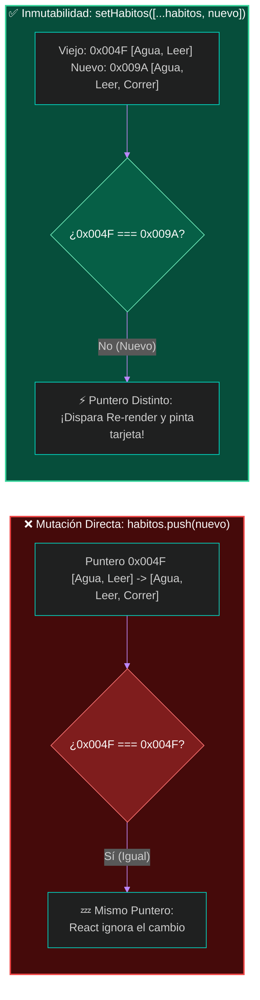
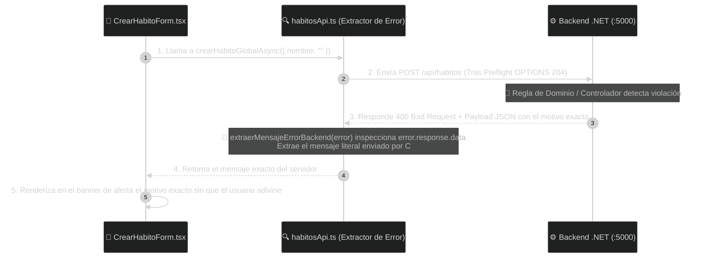
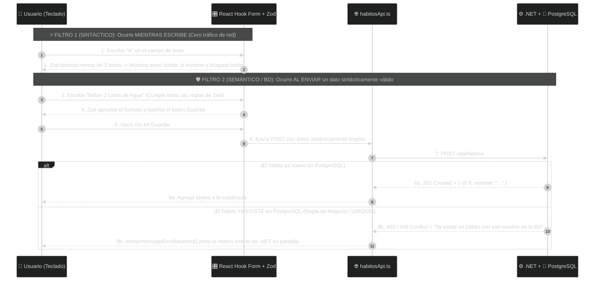

# 🚀 Clase 16: Mutaciones HTTP (POST), Propagación de Errores del Backend y Validación Reactiva (Zod)

## 📖 Teoría (Parte 1): El Ciclo de Escritura Full-Stack, Inmutabilidad y Contratos de Error

En la Clase 15 logramos leer registros reales desde PostgreSQL mediante una petición GET. Sin embargo, un sistema transaccional requiere Mutaciones de Datos (inserciones, actualizaciones y eliminaciones). En esta sesión conectaremos el botón `+ Nuevo Hábito Global` con el endpoint `POST /api/habitos` de nuestro Backend en .NET.

### 1. Asimetría de Contratos: ¿Por qué necesitamos un DTO de Creación?

En el diseño de nuestra base de datos relacional (PostgreSQL), la llave primaria `Id` de la tabla `HabitosGlobales` es auto-incremental (`GENERATED BY DEFAULT AS IDENTITY`). El Frontend jamás inventa llaves primarias; esa responsabilidad es exclusiva del motor relacional.

Por ello, aplicamos **Asimetría de Contratos**:
*   📤 **Contrato de Entrada (`CrearHabitoGlobalDto`)**: Viaja desde React hacia .NET en el cuerpo (Body) del POST. Contiene únicamente `{ nombre: string }`.
*   📥 **Contrato de Salida (`HabitoGlobal`)**: Cuando PostgreSQL inserta la fila y genera el nuevo Id, .NET responde `201 Created` con la entidad completa `{ id: 7, nombre: "..." }`.

### 2. Intercepción del Envío e Inmutabilidad del Puntero en el Heap

Para ejecutar una inserción en una Single Page Application (SPA) sin destruir el estado en memoria RAM, debemos dominar dos mecanismos:

*   **Intercepción del Envío (`e.preventDefault()`)**: Por defecto, un formulario nativo de HTML recarga toda la página web al enviarse, lo que borraría nuestro Almacén Global de React (Heap). Invocar `e.preventDefault()` detiene la recarga del navegador para enviar el JSON silenciosamente vía Axios.
*   **Inmutabilidad del Puntero en Memoria (`[...]` vs `.push()`)**: Cuando .NET nos devuelve el hábito recién creado en PostgreSQL, queremos agregarlo a la cuadrícula en pantalla sin hacer otro GET. Si hiciéramos `habitos.push(nuevo)` y luego `setHabitos(habitos)`, le pasaríamos a React la misma dirección de memoria (puntero), por lo que React asumiría que nada cambió y no refrescaría la pantalla. Debemos usar el **Operador Spread** (`setHabitos([...habitos, nuevo])`), el cual crea un nuevo arreglo en una nueva dirección del Heap con los elementos anteriores más el nuevo, disparando inmediatamente el Re-render.



### 3. Transparencia de Errores Full-Stack: Prohibido "Adivinar" en el Frontend

Cuando el servidor .NET rechaza una petición (por ejemplo, con un código `400 Bad Request` o `409 Conflict`), envía dentro del cuerpo de la respuesta (`error.response.data`) la causa exacta del rechazo.

Un error grave de programación es ignorar ese mensaje en el bloque `catch` y mostrarle al usuario un texto genérico inventado en el Frontend como *"Ocurrió un error al guardar"*. Eso obliga al usuario (y al desarrollador) a adivinar qué falló. Nuestra capa `habitosApi.ts` tiene la responsabilidad de extraer el mensaje exacto que emitió .NET y entregárselo limpio a la interfaz gráfica:



## 💻 Desarrollo Práctico (Fase 1): El POST sin Validaciones y Lectura Real del Rechazo de .NET

En esta primera fase construiremos el formulario sin validaciones en el Frontend, pero con un **Extractor de Errores de .NET** en nuestra capa API. Así enviaremos "data sucia" a propósito y veremos aparecer en nuestra interfaz de React el mensaje exacto de defensa que nos responde nuestro Backend en C#.

### Paso 1: Definir el DTO de Entrada (`src/features/habitos/types/habito.types.ts`)

Abrimos nuestra capa de contratos y agregamos `CrearHabitoGlobalDto`:

```typescript
// frontend/src/features/habitos/types/habito.types.ts

// 1. Contrato de Lectura / Salida (Entidad que viene desde PostgreSQL con su Primary Key)
export interface HabitoGlobal {
    id: number;
    nombre: string;
}

// 2. Contrato de Escritura / Entrada (Payload que enviamos en el POST hacia .NET)
export interface CrearHabitoGlobalDto {
    nombre: string;
}
```

### Paso 2: Agregar el Método POST y el Extractor de Errores de .NET (`src/features/habitos/api/habitosApi.ts`)

Abrimos `habitosApi.ts`. Además de agregar `crearHabitoGlobalAsync`, implementamos la función utilitaria `extraerMensajeErrorBackend`.
Observa cómo esta función inspecciona el objeto `error.response.data` de Axios y es capaz de traducir cualquiera de los 3 formatos en los que un servidor ASP.NET Core devuelve errores:
*   Un texto directo (`BadRequest("El nombre no puede estar vacío")`).
*   Un objeto personalizado (`BadRequest(new { mensaje = "..." })` o `ProblemDetails`).
*   El diccionario estándar `ValidationProblemDetails` de .NET (`errors: { Nombre: ["..."] }`).

```typescript
// frontend/src/features/habitos/api/habitosApi.ts
import axios from 'axios'
import type { HabitoGlobal, CrearHabitoGlobalDto } from '../types/habito.types'

const API_BASE_URL = import.meta.env.VITE_API_BASE_URL

if (!API_BASE_URL) {
    console.error('🚨 ERROR CRÍTICO: No se detectó VITE_API_BASE_URL en frontend/.env')
}

export const apiClient = axios.create({
    baseURL: API_BASE_URL,
    headers: {
        'Content-Type': 'application/json',
    },
})

// 1. Endpoint GET: Obtener todo el catálogo
export const obtenerHabitosGlobalesAsync = async (): Promise<HabitoGlobal[]> => {
    const respuesta = await apiClient.get<HabitoGlobal[]>('/habitos')

    if (!Array.isArray(respuesta.data)) {
        throw new Error('La respuesta recibida no es un arreglo JSON válido.')
    }

    return respuesta.data
}

// 2. Endpoint POST: Insertar un nuevo hábito global en PostgreSQL
export const crearHabitoGlobalAsync = async (nuevoHabito: CrearHabitoGlobalDto): Promise<HabitoGlobal> => {
    const respuesta = await apiClient.post<HabitoGlobal>('/habitos', nuevoHabito)
    return respuesta.data
}

// 3. Artefacto Extractor de Errores HTTP de .NET (Evita que el usuario adivine qué falló)
export const extraerMensajeErrorBackend = (error: unknown): string => {
    if (axios.isAxiosError(error)) {
        // Caso A: El servidor .NET está apagado o el navegador bloqueó por CORS (No hay respuesta HTTP)
        if (!error.response) {
            return 'Sin respuesta del servidor (.NET apagado o bloqueo de seguridad CORS en el navegador).'
        }

        const status = error.response.status
        const data = error.response.data

        // Caso B: El controlador de .NET devolvió un string directo -> BadRequest("Mensaje...")
        if (typeof data === 'string' && data.trim().length > 0) {
            return `[HTTP ${status}] Respuesta de .NET: ${data}`
        }

        // Caso C: El servidor devolvió un objeto JSON (ProblemDetails o DTO de error personalizado)
        if (data && typeof data === 'object') {
            // 1. Si viene el diccionario de validaciones estándar de ASP.NET Core (errors: { Campo: ["Error 1"] })
            if ('errors' in data && data.errors && typeof data.errors === 'object') {
                const listaErrores = Object.values(data.errors as Record<string, string[]>).flat()
                if (listaErrores.length > 0) {
                    return `[HTTP ${status}] Validación de .NET: ${listaErrores.join(' | ')}`
                }
            }

            // 2. Si viene en propiedades comunes de APIs en C# (mensaje, message, detail o title)
            const mensajeExplicito =
                (data as Record<string, unknown>).mensaje ||
                (data as Record<string, unknown>).message ||
                (data as Record<string, unknown>).detail ||
                (data as Record<string, unknown>).title

            if (typeof mensajeExplicito === 'string' && mensajeExplicito.trim().length > 0) {
                return `[HTTP ${status}] Respuesta de .NET: ${mensajeExplicito}`
            }
        }

        return `[HTTP ${status}] El servidor .NET rechazó la operación sin detallar el motivo.`
    }

    return error instanceof Error ? error.message : 'Error inesperado en la aplicación.'
}
```

### Paso 3: Crear el Formulario Inicial Mostrando el Error Real del Backend (`src/features/habitos/components/CrearHabitoForm.tsx`)

Crea el archivo `CrearHabitoForm.tsx`. En esta Fase 1 no ponemos validaciones en el Frontend, pero en el bloque `catch` utilizamos `extraerMensajeErrorBackend(error)` para pintar en la interfaz exactamente lo que nos responda .NET:

```tsx
// frontend/src/features/habitos/components/CrearHabitoForm.tsx
import { useState, type FormEvent } from 'react'
import type { HabitoGlobal } from '../types/habito.types'
import { crearHabitoGlobalAsync, extraerMensajeErrorBackend } from '../api/habitosApi'

interface CrearHabitoFormProps {
    onHabitoCreado: (nuevoHabito: HabitoGlobal) => void;
    onCancelar: () => void;
}

export function CrearHabitoForm({ onHabitoCreado, onCancelar }: CrearHabitoFormProps) {
    const [nombre, setNombre] = useState<string>('')
    const [guardando, setGuardando] = useState<boolean>(false)
    const [errorServidor, setErrorServidor] = useState<string | null>(null)

    const manejarEnvio = async (e: FormEvent<HTMLFormElement>) => {
        e.preventDefault() // Evita el F5 nativo del navegador

        try {
            setGuardando(true)
            setErrorServidor(null)

            // ⚠ FASE 1: Enviamos el dato crudo sin validar en el Frontend para poner a prueba el Backend
            const habitoCreado = await crearHabitoGlobalAsync({ nombre })

            setNombre('')
            onHabitoCreado(habitoCreado)
        } catch (error) {
            // Extraemos el mensaje REAL que devolvió el Backend en C#
            const mensajeRealDeNet = extraerMensajeErrorBackend(error)
            console.error('🚨 Auditoría del rechazo de .NET:', error)
            setErrorServidor(mensajeRealDeNet)
        } finally {
            setGuardando(false)
        }
    }

    return (
        <form onSubmit={manejarEnvio} className="bg-slate-800/90 border border-indigo-500/40 rounded-xl p-5 mb-8 shadow-lg">
            <div className="flex items-center justify-between mb-4">
                <h2 className="text-base font-bold text-white">✨ Registrar Nuevo Hábito Global</h2>
                <span className="text-xs font-mono text-slate-400 bg-slate-900 px-2 py-1 rounded border border-slate-700">
                    POST /api/habitos
                </span>
            </div>

            <div className="flex flex-col sm:flex-row gap-3">
                <input
                    type="text"
                    placeholder="Escribe un nuevo hábito..."
                    value={nombre}
                    onChange={(e) => setNombre(e.target.value)}
                    disabled={guardando}
                    className="flex-1 bg-slate-950 border border-slate-700 rounded-lg px-4 py-2.5 text-sm text-white"
                />
                <button type="submit" disabled={guardando} className="bg-indigo-600 hover:bg-indigo-500 text-white font-medium text-sm px-5 py-2.5 rounded-lg cursor-pointer">
                    {guardando ? '⏳ Enviando...' : '💾 Guardar en PostgreSQL'}
                </button>
                <button type="button" onClick={onCancelar} className="bg-slate-700 text-slate-200 text-sm px-4 py-2.5 rounded-lg cursor-pointer">
                    Cancelar
                </button>
            </div>

            {/* Banner que muestra literalmente la respuesta de error que envió .NET */}
            {errorServidor && (
                <div className="mt-4 bg-red-950/60 border border-red-500/40 rounded-lg p-3 text-xs text-red-300 flex items-center gap-2">
                    <span className="text-base">🛡️</span>
                    <span><strong>Rechazo del Servidor:</strong> {errorServidor}</span>
                </div>
            )}
        </form>
    )
}
```

### Paso 4: Conectar el Formulario en `CatalogoHabitosView.tsx` y Auditar la Respuesta de .NET

Abre `src/features/habitos/components/CatalogoHabitosView.tsx`, agrega el estado `mostrarFormulario` y utiliza también `extraerMensajeErrorBackend` en la carga inicial:

```tsx
// frontend/src/features/habitos/components/CatalogoHabitosView.tsx
import { useState, useEffect } from 'react'
import type { HabitoGlobal } from '../types/habito.types'
import { obtenerHabitosGlobalesAsync, extraerMensajeErrorBackend } from '../api/habitosApi'
import { HabitoGlobalCard } from './HabitoGlobalCard'
import { CrearHabitoForm } from './CrearHabitoForm'

export function CatalogoHabitosView() {
  const [habitos, setHabitos] = useState<HabitoGlobal[]>([])
  const [cargando, setCargando] = useState<boolean>(true)
  const [errorRed, setErrorRed] = useState<string | null>(null)
  const [busqueda, setBusqueda] = useState<string>('')
  const [mostrarFormulario, setMostrarFormulario] = useState<boolean>(false)

  useEffect(() => {
    obtenerHabitosGlobalesAsync()
      .then((datosDesdePostgres) => {
        setHabitos(datosDesdePostgres)
        setErrorRed(null)
      })
      .catch((error) => {
        console.error('Auditoría de Error en la Petición HTTP:', error)
        setErrorRed(extraerMensajeErrorBackend(error))
      })
      .finally(() => {
        setCargando(false)
      })
  }, [])

  // Actualización Inmutable en el Heap usando Spread Operator [...]
  const manejarHabitoCreado = (nuevoHabitoDesdeBD: HabitoGlobal) => {
    setHabitos((habitosActuales) => [...habitosActuales, nuevoHabitoDesdeBD])
    setMostrarFormulario(false)
  }

  const habitosFiltrados = habitos.filter((habito) =>
    habito.nombre.toLowerCase().includes(busqueda.toLowerCase())
  )

  return (
    <div>
      <div className="flex flex-col sm:flex-row sm:items-center sm:justify-between gap-4 pb-6 mb-6 border-b border-slate-800">
        <div>
          <h1 className="text-2xl md:text-3xl font-bold text-white">Catálogo Global de Hábitos</h1>
          <p className="text-slate-400 text-sm mt-1">
            Conectado en tiempo real vía HTTP/CORS con <code className="text-indigo-400 font-mono">PostgreSQL</code>.
          </p>
        </div>

        {!mostrarFormulario && (
          <button 
            onClick={() => setMostrarFormulario(true)}
            className="bg-indigo-600 hover:bg-indigo-500 text-white font-medium text-sm px-4 py-2.5 rounded-lg transition-colors shadow-sm self-start sm:self-auto cursor-pointer"
          >
            + Nuevo Hábito Global
          </button>
        )}
      </div>

      {/* Renderizado condicional del Formulario POST */}
      {mostrarFormulario && (
        <CrearHabitoForm 
          onHabitoCreado={manejarHabitoCreado}
          onCancelar={() => setMostrarFormulario(false)}
        />
      )}

      <div className="mb-6 flex flex-col sm:flex-row sm:items-center justify-between gap-4">
        <input
          type="text"
          placeholder="🔍 Filtrar hábitos provenientes de PostgreSQL..."
          value={busqueda}
          onChange={(e) => setBusqueda(e.target.value)}
          className="w-full sm:max-w-md bg-slate-950 border border-slate-800 rounded-lg px-4 py-2.5 text-sm text-white placeholder-slate-500 focus:outline-none focus:border-indigo-500 transition-colors"
        />
        <span className="text-xs text-slate-400">
          Mostrando <strong className="text-white">{habitosFiltrados.length}</strong> de {habitos.length} registros en BD
        </span>
      </div>

      {cargando && (
        <div className="bg-slate-800/50 border border-slate-800 rounded-xl p-12 text-center">
          <p className="text-indigo-400 font-semibold animate-pulse text-lg">
            ⏳ Consultando endpoint GET /api/habitos en .NET...
          </p>
        </div>
      )}

      {!cargando && errorRed && (
        <div className="bg-red-950/40 border border-red-500/40 rounded-xl p-6 text-center">
          <p className="text-red-400 font-bold text-base mb-1">🚨 Error de Comunicación Full-Stack</p>
          <p className="text-slate-300 text-sm">{errorRed}</p>
        </div>
      )}

      {!cargando && !errorRed && (
        <section className="grid grid-cols-1 sm:grid-cols-2 lg:grid-cols-3 gap-5">
          {habitosFiltrados.map((habito) => (
            <HabitoGlobalCard 
              key={habito.id} 
              id={habito.id} 
              nombre={habito.nombre} 
            />
          ))}
        </section>
      )}
    </div>
  )
}
```

### 🔬 Experimento en Vivo (Viendo el Mensaje Exacto del Backend en Pantalla):
1. Abre las Herramientas de Desarrollador (`F12` $\rightarrow$ pestaña Network).
2. Haz clic en `+ Nuevo Hábito Global`, deja la caja de texto vacía y presiona `💾 Guardar en PostgreSQL`.
3. Observa qué ocurre en la red y en tu interfaz:
    * En la pestaña Network verás los dos viajes de red: primero el `OPTIONS` (`204 No Content`) del Preflight CORS y luego el `POST` (`400 Bad Request`).
    * En tu pantalla de React aparecerá el recuadro rojo mostrando literalmente el código HTTP y el mensaje que emitió tu Backend en C# (por ejemplo: *🛡️ Rechazo del Servidor: [HTTP 400] Respuesta de .NET: El nombre del hábito es obligatorio*). ¡El usuario ya no tiene que adivinar qué pasó!

## 📖 Teoría (Parte 2): ¿Por qué no basta con que el Backend valide y por qué jamás debemos validar "A Pie"?

En el experimento anterior comprobamos dos cosas: que nuestro Backend en .NET protege a PostgreSQL y que nuestro Frontend sabe mostrar el error exacto del servidor. Sin embargo, dejar que una simple caja de texto vacía viaje hasta el servidor —o intentar validarla con bloques `if`/`else` manuales en el componente— presenta tres problemas graves de ingeniería:

1. **Desperdicio de Infraestructura por Enviar "Data Sucia"**: Para que el servidor nos dijera que el campo estaba vacío, hicimos viajar dos paquetes HTTP por la red (OPTIONS + POST), consumimos ancho de banda, despertamos un hilo de ejecución en el servidor Kestrel de .NET y ejecutamos el deserializador JSON para nada.
2. **Retroalimentación Tardía (Después del Evento vs. Mientras Escribe)**: Confiar únicamente en el Backend obliga al usuario a llenar todo el formulario, hacer clic en Guardar y esperar la respuesta de red para recién enterarse de que cometió un error tipográfico. Una interfaz de grado industrial valida mientras el usuario escribe (`onChange`).
3. **Separación de Responsabilidades: Validación Sintáctica (Zod) vs. Semántica (.NET + BD)**: En lugar de ensuciar `CrearHabitoForm.tsx` con bloques `if (nombre.length < 3)` hechos "a pie" (lo cual viola el Principio de Responsabilidad Única), implementamos una Arquitectura de Validación en Dos Capas:

| Capa de Validación | Artefacto Responsable | ¿Cuándo actúa? | ¿Qué tipo de errores atrapa? |
| :--- | :--- | :--- | :--- |
| **1. Validación Sintáctica y de Formato (Frontend)** | Zod + React Hook Form (`schemas/habito.schema.ts`) | Mientras el usuario escribe (`onChange`, en 0 ms y sin usar la red). | Campos vacíos, longitudes mínimas/máximas (`VARCHAR(100)`), caracteres prohibidos (Regex), formatos de correo o fechas. |
| **2. Validación Semántica y de Negocio (Backend / BD)** | .NET + PostgreSQL + `extraerMensajeErrorBackend` | Al presionar Guardar (Cuando el dato ya pasó por Zod y llega al servidor). | Reglas que requieren consultar la Base de Datos: Nombres duplicados (violación de UNIQUE), llaves foráneas inexistentes o reglas transaccionales complejas. |



### 📚 Lectura:
* Documentación Oficial de Zod (zod.dev) & React Hook Form: Server-Side Errors and Schema Validation.

## 💻 Desarrollo Práctico (Fase 2): Implementación del Artefacto Zod Conservando el Diagnóstico del Backend

Vamos a incorporar Zod y React Hook Form en una nueva carpeta `schemas/`, manteniendo intacta nuestra función `extraerMensajeErrorBackend` para que el usuario tenga lo mejor de ambos mundos: validación instantánea mientras escribe y mensajes claros del Backend si falla una regla de base de datos.

### Paso 1: Instalación de Zod y React Hook Form
En la terminal ubicada dentro de la carpeta `frontend`, instala los paquetes con pnpm:

```bash
pnpm add zod react-hook-form @hookform/resolvers
```

### Paso 2: Crear el Artefacto de Validación (`src/features/habitos/schemas/habito.schema.ts`)
Dentro de `src/features/habitos/`, crea la carpeta `schemas` y el archivo `habito.schema.ts`:

```typescript
// frontend/src/features/habitos/schemas/habito.schema.ts
import { z } from 'zod'

// Artefacto Declarativo de Validación Sintáctica (Protege al Backend de recibir data sucia)
export const crearHabitoGlobalSchema = z.object({
    nombre: z
        .string()
        .trim() // Sanitiza espacios en blanco al inicio y al final
        .min(3, 'El nombre del hábito debe contener al menos 3 caracteres válidos.')
        .max(100, 'El nombre no puede superar los 100 caracteres permitidos en PostgreSQL.')
        .regex(
            /^[a-zA-ZáéíóúÁÉÍÓÚñÑ0-9\s.,()-]+$/,
            'El hábito contiene caracteres especiales no permitidos.'
        ),
})

export type CrearHabitoGlobalSchemaType = z.infer<typeof crearHabitoGlobalSchema>
```

### Paso 3: Refactorización Final de `CrearHabitoForm.tsx` (Zod en Vivo + Errores Exactos de .NET)
Reemplaza el contenido de `src/features/habitos/components/CrearHabitoForm.tsx`.
Observa cómo trabajan en equipo ambas defensas:
*   **Mientras el usuario escribe (`errors.nombre`)**: Si viola una regla sintáctica de Zod, aparece un aviso color ámbar (⚡ Validación en vivo) debajo del campo y el botón se bloquea para no gastar red.
*   **Cuando el usuario envía (`errorServidor`)**: Si el dato pasó Zod, viaja a .NET. Si el Backend lo rechaza (por ejemplo, por duplicidad en PostgreSQL o caída del servicio), `extraerMensajeErrorBackend(error)` captura el mensaje exacto de C# y lo pinta en el banner rojo (🛡️ Rechazo del Servidor .NET); además, se limpia automáticamente apenas el usuario vuelve a teclear para corregir su entrada.

```tsx
// frontend/src/features/habitos/components/CrearHabitoForm.tsx
import { useState } from 'react'
import { useForm } from 'react-hook-form'
import { zodResolver } from '@hookform/resolvers/zod'
import type { HabitoGlobal } from '../types/habito.types'
import { crearHabitoGlobalAsync, extraerMensajeErrorBackend } from '../api/habitosApi'
import { crearHabitoGlobalSchema, type CrearHabitoGlobalSchemaType } from '../schemas/habito.schema'

interface CrearHabitoFormProps {
    onHabitoCreado: (nuevoHabito: HabitoGlobal) => void;
    onCancelar: () => void;
}

export function CrearHabitoForm({ onHabitoCreado, onCancelar }: CrearHabitoFormProps) {
    // Estado para almacenar el mensaje exacto que devuelva .NET si rechaza la petición
    const [errorServidor, setErrorServidor] = useState<string | null>(null)

    // --- CONEXIÓN DEL ARTEFACTO DE VALIDACIÓN SINTÁCTICA EN TIEMPO REAL ---
    const {
        register,
        handleSubmit,
        reset,
        formState: { errors, isValid, isSubmitting },
    } = useForm<CrearHabitoGlobalSchemaType>({
        resolver: zodResolver(crearHabitoGlobalSchema),
        mode: 'onChange', // Evalúa cada tecla mientras el usuario escribe
        defaultValues: {
            nombre: '',
        },
    })

    // Solo se ejecuta cuando el Artefacto Zod garantiza que el dato está 100% limpio
    const procesarEnvioLimpio = async (datosValidados: CrearHabitoGlobalSchemaType) => {
        try {
            setErrorServidor(null)

            const habitoCreadoEnBd = await crearHabitoGlobalAsync(datosValidados)

            reset()
            onHabitoCreado(habitoCreadoEnBd)
        } catch (error) {
            // Si .NET rechaza la operación (ej. Hábito duplicado en BD, 400 o 500),
            // extraemos y mostramos el mensaje exacto enviado por el Backend
            const mensajeExactoDeNet = extraerMensajeErrorBackend(error)
            console.error('🚨 Rechazo reportado por el Backend .NET:', error)
            setErrorServidor(mensajeExactoDeNet)
        }
    }

    return (
        <form 
            onSubmit={handleSubmit(procesarEnvioLimpio)} 
            className="bg-slate-800/90 border border-indigo-500/40 rounded-xl p-5 mb-8 shadow-lg"
        >
            <div className="flex items-center justify-between mb-4">
                <h2 className="text-base font-bold text-white flex items-center gap-2">
                    <span className="text-indigo-400">✨</span> Registrar Nuevo Hábito en el Catálogo Global
                </h2>
                <span className="text-xs font-mono text-emerald-400 bg-emerald-950/60 px-2.5 py-1 rounded border border-emerald-500/30">
                    🛡️ Esquema Zod + Diagnóstico .NET
                </span>
            </div>

            <div className="flex flex-col sm:flex-row gap-3">
                <div className="flex-1">
                    <input
                        type="text"
                        placeholder="Ej. Diseñar diagramas Entidad-Relación en 3FN..."
                        disabled={isSubmitting}
                        autoFocus
                        {...register('nombre', {
                            // Si había un error previo del servidor, lo limpiamos apenas el usuario edita el texto
                            onChange: () => {
                                if (errorServidor) setErrorServidor(null)
                            },
                        })}
                        className={`w-full bg-slate-950 border rounded-lg px-4 py-2.5 text-sm text-white placeholder-slate-500 focus:outline-none transition-colors ${
                            errors.nombre 
                                ? 'border-amber-500 focus:border-amber-400' 
                                : errorServidor
                                ? 'border-red-500 focus:border-red-400'
                                : 'border-slate-700 focus:border-indigo-500'
                        }`}
                    />
                </div>

                <div className="flex items-center gap-2 self-start">
                    <button
                        type="submit"
                        disabled={!isValid || isSubmitting}
                        className="bg-indigo-600 hover:bg-indigo-500 disabled:bg-slate-800 disabled:text-slate-500 disabled:border disabled:border-slate-700 text-white font-medium text-sm px-5 py-2.5 rounded-lg transition-colors cursor-pointer disabled:cursor-not-allowed"
                    >
                        {isSubmitting ? '⏳ Guardando en BD...' : '💾 Guardar en PostgreSQL'}
                    </button>

                    <button
                        type="button"
                        onClick={onCancelar}
                        disabled={isSubmitting}
                        className="bg-slate-700 hover:bg-slate-600 text-slate-200 font-medium text-sm px-4 py-2.5 rounded-lg transition-colors cursor-pointer"
                    >
                        Cancelar
                    </button>
                </div>
            </div>

            {/* 1. Retroalimentación Sintáctica Instantánea (Zod MIENTRAS ESCRIBE) */}
            {errors.nombre && (
                <p className="text-amber-400 text-xs mt-2.5 font-medium flex items-center gap-1.5">
                    <span>⚡</span> <strong>Validación en vivo:</strong> {errors.nombre.message}
                </p>
            )}

            {/* 2. Retroalimentación Semántica / Reglas de Negocio (Mensaje EXACTO devuelto por .NET) */}
            {errorServidor && (
                <div className="mt-3 bg-red-950/60 border border-red-500/40 rounded-lg p-3 text-xs text-red-300 flex items-center gap-2">
                    <span className="text-base">🛡️</span>
                    <span><strong>Respuesta del Backend (.NET):</strong> {errorServidor}</span>
                </div>
            )}
        </form>
    )
}
```

### 🔬 Resumen de la Arquitectura Final del Módulo (`src/features/habitos/`)

```plaintext
frontend/src/features/habitos/
├── api/
│   └── habitosApi.ts             <-- Cliente Axios (GET, POST) + extraerMensajeErrorBackend()
├── components/
│   ├── CatalogoHabitosView.tsx   <-- Vista Orquestadora del Módulo
│   ├── CrearHabitoForm.tsx       <-- Formulario Reactivo (Zod en vivo + Banner de Error de .NET)
│   └── HabitoGlobalCard.tsx      <-- Tarjeta Presentacional Pura
├── schemas/
│   └── habito.schema.ts          <-- Artefacto de Validación Sintáctica (Zod)
└── types/
    └── habito.types.ts           <-- Contratos DTO (HabitoGlobal y CrearHabitoGlobalDto)
```

---
[⬅️ Volver al índice de la fase](./index.md)
