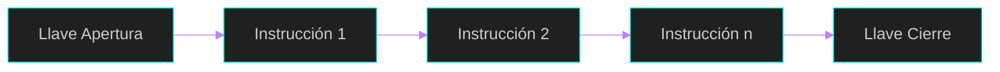
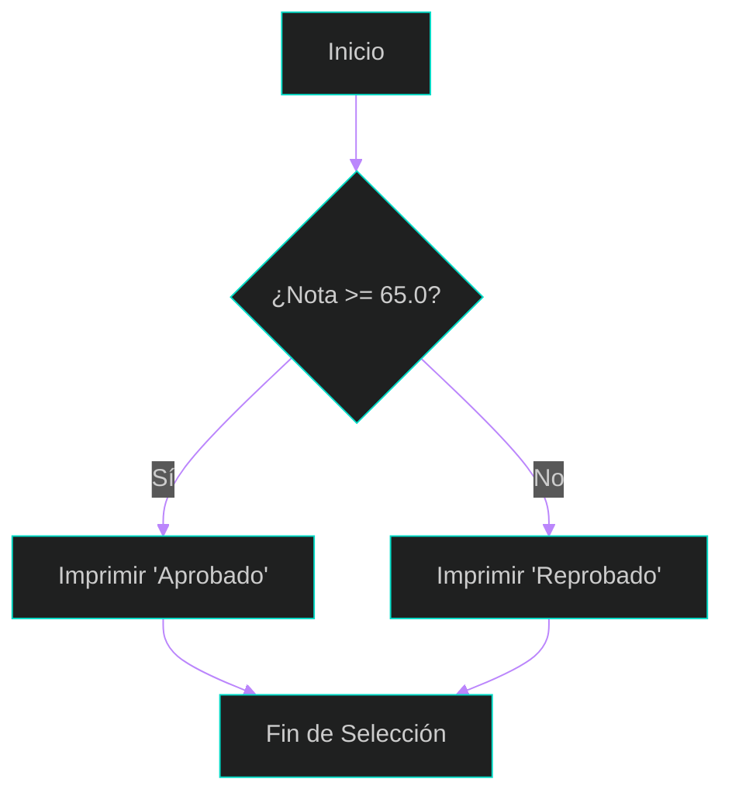
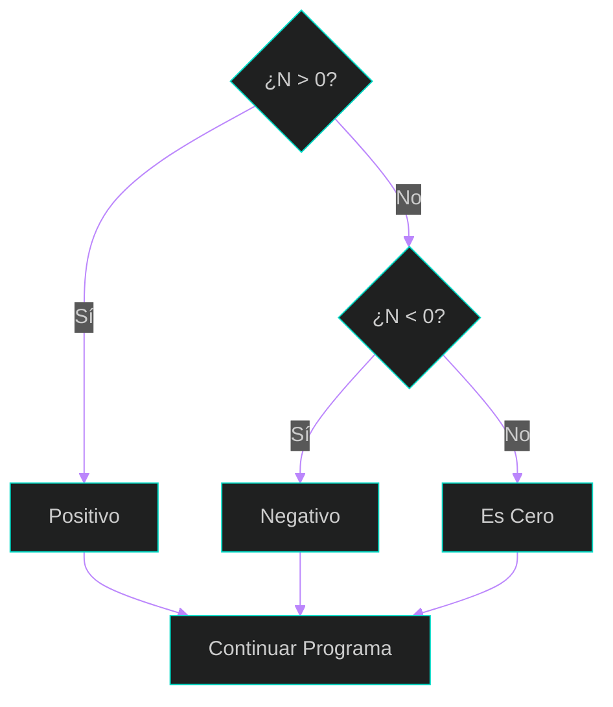
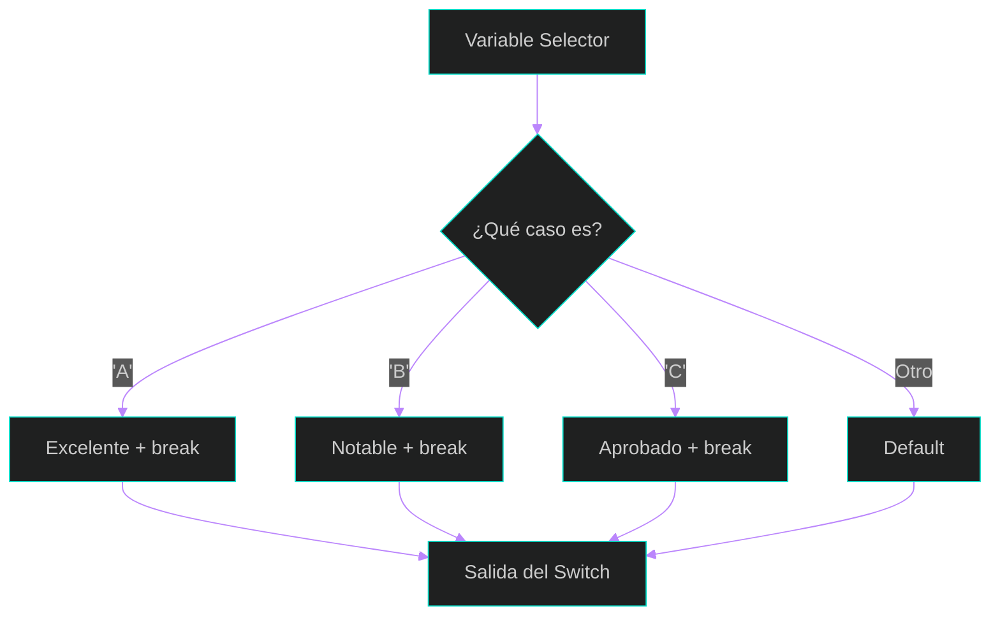
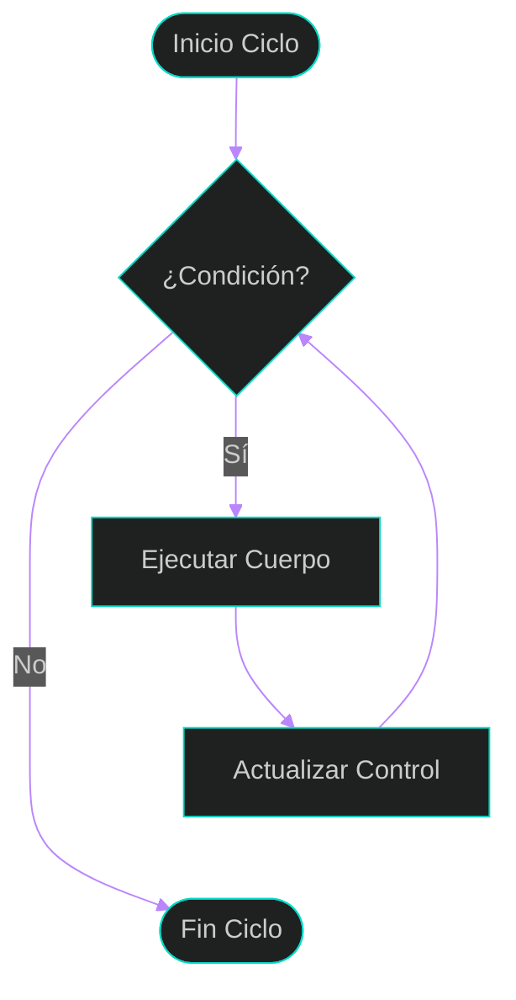
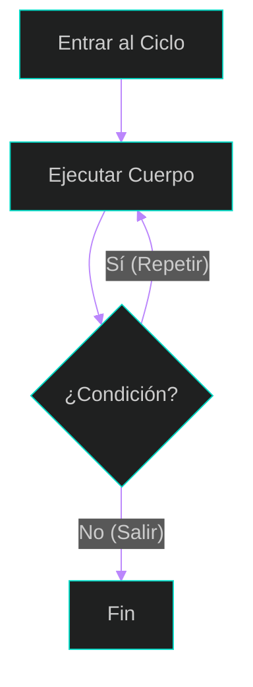

## 3: Control de Flujo del Programa

El **control de flujo** es la capacidad de un programa para alterar el orden en que se ejecutan sus instrucciones. Sin estas estructuras, una computadora solo podría ejecutar tareas de forma secuencial (una tras otra). 

Gracias a la **programación estructurada**, podemos combinar estas instrucciones en unidades lógicas con un solo punto de entrada y uno de salida (Capítulo 5, Sección 5.1).

### 1. Declaraciones y Bloques
En C, una sentencia compuesta o **bloque** es un grupo de declaraciones y sentencias encerradas entre llaves `{ }`. El programa trata a este conjunto como una única unidad (Capítulo 5, Sección 5.1).

**Ejemplo en C:**
```c
{
    int base = 10;
    int altura = 5;
    int area = (base * altura) / 2;
    printf("El área es: %d", area);
} // Aquí termina el bloque 
```



### 2. Bloque if-else (Selección Doble)
Esta estructura permite al programa elegir entre dos alternativas. Si la condición lógica es verdadera, se ejecuta una acción; si es falsa, se ejecuta la acción que sigue a la palabra reservada `else` (Capítulo 5, Sección 5.3).

**Ejemplo en C:**
```c
float nota;
printf("Ingrese la nota: ");
scanf("%f", &nota);

if (nota >= 65.0) {
    puts("Aprobado");
} else {
    puts("Reprobado");
}
```



### 3. Bloque else-if (Sentencias Anidadas)
Cuando existen más de dos alternativas posibles, utilizamos sentencias `if-else` anidadas. Esto permite evaluar múltiples condiciones en cadena hasta encontrar una que se cumpla (Capítulo 5, Sección 5.4).

**Ejemplo en C:**
```c
int numero;
printf("Ingrese un número: ");
scanf("%d", &numero);

if (numero > 0) {
    printf("Es positivo\n");
} else if (numero < 0) {
    printf("Es negativo\n");
} else {
    printf("Es cero\n");
}
```



### 4. Bloque switch (Selección Múltiple)
Es una estructura más clara que el `else-if` cuando se desea elegir una opción entre múltiples valores constantes de una variable (selector), que debe ser de tipo `int` o `char` (Capítulo 5, Sección 5.5).

**Ejemplo en C:**
```c
char nota;
printf("Ingrese su calificación (A-F): ");
scanf(" %c", &nota);

switch (nota) {
    case 'A': puts("Excelente"); break;
    case 'B': puts("Notable"); break;
    case 'C': puts("Aprobado"); break;
    default:  puts("Calificación no válida");
}
```


    
### 5. Ciclos while y for (Repetición)
Los bucles permiten repetir un bloque de código mientras se cumpla una condición específica.

*   **Ciclo while:** Es un bucle *pre-test*. Evalúa la condición antes de ejecutar el cuerpo del bucle. Si la condición es falsa desde el principio, el código nunca se ejecuta (Capítulo 6, Sección 6.1).
*   **Ciclo for:** Es ideal cuando conocemos de antemano cuántas veces queremos repetir una tarea. Agrupa la inicialización, la condición y el incremento en su cabecera (Capítulo 6, Sección 6.2).

**Ejemplo de while (Contador):**
```c
int contador = 1;
while (contador <= 5) {
    printf("%d ", contador);
    contador++;
}
```

**Ejemplo de for (Suma de pares):**
```c
int suma = 0;
for (int i = 2; i <= 10; i += 2) {
    suma += i;
}
printf("La suma de pares hasta 10 es: %d", suma);
```



### 6. Ciclo do-while
A diferencia de los anteriores, este es un bucle **post-test**. La condición se evalúa al final, lo que garantiza que el cuerpo del bucle se ejecute **al menos una vez** (Capítulo 6, Sección 6.4). Es muy utilizado para validar datos ingresados por el usuario.

**Ejemplo en C:**
```c
int numero;
do {
    printf("Ingrese un número positivo: ");
    scanf("%d", &numero);
} while (numero <= 0); // Repite si el número es negativo o cero
```



---
⬅️ Volver al índice de la clase
