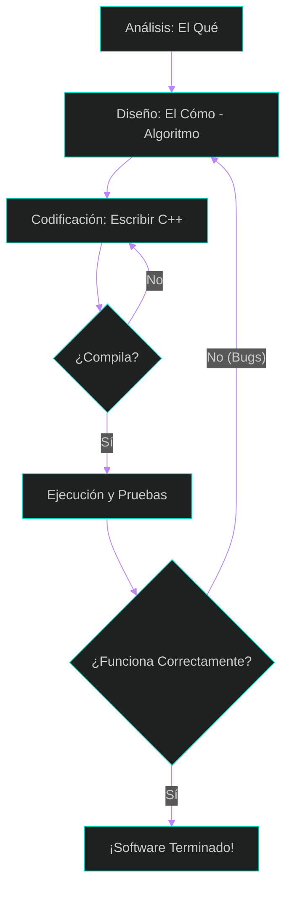

## 0: Dominando el Arte de Resolver Problemas

# ¡Hola, Mundo! Guía Esencial para Iniciar en la Programación

¿Alguna vez te has preguntado cómo las computadoras realizan tareas tan complejas? La respuesta no es magia, es **programación**. Si estás dando tus primeros pasos en este mundo, esta guía te ayudará a entender los fundamentos que todo ingeniero debe conocer.

## 1. ¿Qué es realmente programar?
En esencia, la programación es un **proceso de resolución de problemas**. Consiste en diseñar una serie de instrucciones detalladas que el **hardware** (los componentes físicos como el monitor o el CPU) ejecuta para realizar tareas específicas a través del **software** (el conjunto de instrucciones lógicas). 

Para entender cómo interactúan estos elementos, es vital conocer el **ciclo EPSA** (Entrada, Procesamiento, Salida y Almacenamiento), que describe cómo los datos se convierten en información útil (puedes ver el esquema en el **Capítulo 1, Figura 1.2** del libro de Joyanes).



## 2. El lenguaje de las máquinas vs. el nuestro
Las computadoras no entienden el español o el inglés; ellas operan con **lenguaje máquina**, una secuencia de ceros y unos. Para facilitarnos la tarea, los programadores usamos **lenguajes de alto nivel**, como el lenguaje **C**.
Como la computadora no entiende "C" directamente, necesitamos una herramienta llamada **compilador**, que traduce nuestro "código fuente" a un "programa ejecutable" que la máquina sí comprende (este flujo se detalla en el **Capítulo 2, Figura 2.5**).



## 3. El corazón de la programación: El Algoritmo
Antes de tocar el teclado, necesitas un plan. Ese plan se llama **algoritmo**: un método preciso, definido y finito para resolver un problema paso a paso. 

Para planificar esta lógica antes de codificar, los programadores usamos dos herramientas principales:
*   **Pseudocódigo:** Instrucciones escritas en lenguaje natural enriquecidas con términos técnicos.
*   **Diagramas de Flujo:** Representaciones gráficas que utilizan símbolos estandarizados para visualizar la ruta de la solución (consulta el significado de los símbolos en el **Capítulo 2, Figura 2.2**).



## 4. ¿Cómo se programa? Las fases del éxito
Crear software de calidad requiere seguir una metodología profesional:
1.  **Análisis:** Definir exactamente qué debe hacer el programa.
2.  **Diseño:** Determinar el "cómo" mediante un algoritmo.
3.  **Codificación:** Traducir el diseño a un lenguaje (como C).
4.  **Compilación y Ejecución:** Traducir y poner en marcha el código.
5.  **Verificación y Depuración:** Probar el programa y eliminar los **"bugs"** o errores.

## 5. Paradigmas de Programación: Nuestro Enfoque
Un **paradigma** es un enfoque o estilo de programación que determina cómo el programador ve la ejecución del programa. Los principales paradigmas mencionados en el libro de Joyanes (Capítulo 1.16) son:

*   **Paradigma Imperativo (Procedimental):** Es el enfoque tradicional donde el programa es una secuencia de órdenes que manipulan datos (ejemplos: Pascal, C).
*   **Paradigma Declarativo:** El programador describe el problema en lugar de la solución algorítmica, basándose en lógica formal (ejemplo: Prolog).
*   **Paradigma Funcional:** Se centra en la evaluación de funciones matemáticas (ejemplo: LISP).
*   **Paradigma Orientado a Objetos (POO):** Organiza el software en "objetos" que combinan datos y operaciones (ejemplos: Java, C++).

### **Énfasis en la Programación Estructurada**
Es fundamental aclarar que esta asignatura, **ISC-102**, se centra exclusivamente en la **Programación Estructurada**. Este es un enfoque específico dentro del paradigma procedimental que busca crear programas legibles y eficientes mediante el uso de solo tres estructuras de control:

1.  **Secuencia:** Las instrucciones se ejecutan una tras otra en el orden en que aparecen.
2.  **Selección (Decisión):** El programa elige un camino u otro basándose en una condición (utilizando sentencias como `if` y `switch`).
3.  **Repetición (Bucles):** Se repiten bloques de instrucciones mediante sentencias como `while`, `for` y `do-while`.

Aprender programación estructurada es el paso inicial y vital en tu formación, ya que constituye la "espina dorsal" de la ingeniería. Te permitirá desarrollar un razonamiento lógico sólido antes de avanzar a modelos más complejos como la orientación a objetos.

## Conclusión
Programar no es solo aprender reglas de escritura, sino desarrollar un **razonamiento lógico y estructurado**. Es la capacidad de "dialogar" con la máquina para construir soluciones innovadoras. 

**¿Estás listo para escribir tu primer programa?**
---
[⬅️ Volver al índice de la clase](./index.md)