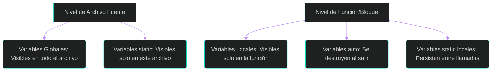
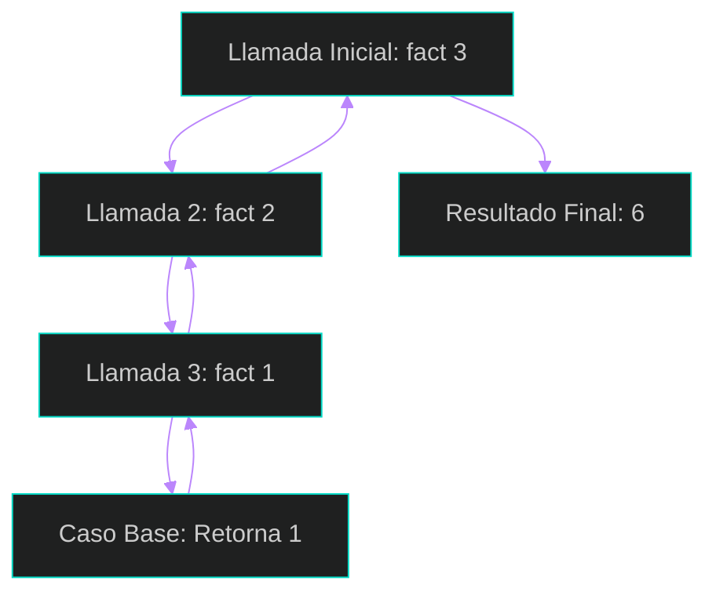
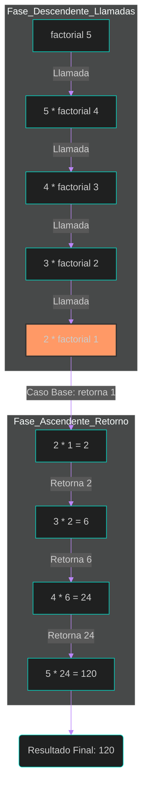

## 1. Funciones y Estructura de un Programa

Una **función** es un grupo de sentencias diseñadas para realizar una tarea específica. La programación estructurada se basa en dividir un problema grande en módulos pequeños y manejables (Capítulo 7, Sección 7.1).

### 1. Elementos Básicos y Retorno de Valores
Toda función consta de una **cabecera** y un **cuerpo**. La cabecera define el tipo de retorno, el nombre y la lista de parámetros (Capítulo 7, Sección 7.2).

*   **Retorno de valores:** Se utiliza la sentencia `return` para enviar un resultado de vuelta a la función llamadora. Si la función no devuelve nada, se marca como `void` (Capítulo 7, Sección 7.2).

**Ejemplo de Función en C:**

<div style="margin: 25px 0; border: 2px solid #BB86FC; border-radius: 12px; overflow: hidden; box-shadow: 0 8px 24px rgba(0,0,0,0.3);">
    <iframe 
        src="{{ site.baseurl }}/compilerc.html?file=https://raw.githubusercontent.com/ConsSorto/ConsSorto.github.io/main/isc-102/unidad-2/code/ejemplo1-1.c" 
        width="100%" 
        height="600px" 
        frameborder="0">
    </iframe>
</div>

### 2. Reglas de Ámbito (Alcance) y Clases de Almacenamiento
El ámbito o alcance es la zona del programa en la que una variable es visible para las funciones. Según su posición y modificadores, una variable puede tener un ámbito de programa, de archivo fuente, de función o de bloque.

#### Variables Externas (Globales)
Se declaran fuera de cualquier función, normalmente al principio del archivo fuente. Son visibles para cualquier función del resto del programa. Si se desea usar una variable definida en otro archivo fuente, se utiliza la palabra reservada `extern`.

**Ejemplo de Ámbito de Programa (Capítulo 7, Sección 7.6):**

<div style="margin: 25px 0; border: 2px solid #BB86FC; border-radius: 12px; overflow: hidden; box-shadow: 0 8px 24px rgba(0,0,0,0.3);">
    <iframe 
        src="{{ site.baseurl }}/compilerc.html?file=https://raw.githubusercontent.com/ConsSorto/ConsSorto.github.io/main/isc-102/unidad-2/code/ejemplo1-1.c" 
        width="100%" 
        height="600px" 
        frameborder="0">
    </iframe>
</div>

#### Variables Estáticas (`static`)
A diferencia de las variables automáticas, las estáticas no se borran al terminar la función; retienen su valor entre llamadas sucesivas y se inicializan solo una vez.

**Ejemplo de Acumulación (Capítulo 7, Sección 7.7):**
```c
float ResultadosTotales(float valor) {
    static float suma = 0; // Retiene su valor entre llamadas [10]
    suma = suma + valor;
    return suma;
}
```

#### Variables de Registro (`register`)
Es una sugerencia al compilador para que intente almacenar la variable en un registro de la CPU en lugar de la memoria RAM, buscando un acceso ultrarrápido. Solo puede aplicarse a variables locales.

**Ejemplo en un Bucle (Capítulo 7, Sección 7.7):**
```c
void proceso_rapido() {
    // Aplicación típica como variable de control de un bucle [8, 11]
    register int indice; 
    for (indice = 0; indice < 1000; indice++) {
        // Operaciones repetitivas
    }
}
```

#### Estructura de Bloques
Un bloque está delimitado por llaves `{ }`. Una variable declarada dentro de un bloque es invisible fuera de él.

**Ejemplo de Ámbito de Bloque (Capítulo 7, Sección 7.6):**
```c
void funcion_con_bloques(int j) {
    if (j > 3) {
        int i; // i solo es visible dentro de este bloque if [12, 13]
        for (i = 0; i < 10; i++) {
            printf("%d", i);
        }
    } 
    // Aquí i ya no es visible [13]
}
```

#### Archivos de Cabecera
Los archivos de cabecera (.h) contienen código fuente C, como prototipos de funciones o definiciones de macros, que se insertan en otros archivos mediante la directiva `#include`. El preprocesador mezcla el contenido del archivo antes de la compilación.

**Ejemplo de Inclusión (Capítulo 3, Sección 3.1):**
```c
// Uso de biblioteca estándar [15, 17]
#include <stdio.h> 

// Uso de cabecera personalizada del usuario [15, 18]
#include "mis_definiciones.h" 

int main() {
    printf("Uso de funciones definidas en cabeceras\n");
    return 0;
}
```

**Resumen de Visibilidad (Basado en Figura 7.5):**


### 3. Recursividad
Una función es **recursiva** si se invoca a sí misma. Es vital incluir un **caso base** para evitar que las llamadas sean infinitas y agoten la memoria (Capítulo 7, Sección 7.14).

**Flujo de llamadas recursivas (Esquema conceptual):**



En el caso del factorial de un número ($n!$), la definición recursiva establece que el factorial de 0 o 1 es 1 (**caso base**), y para cualquier otro número es $n \times (n-1)!$.

**Ejemplo de Factorial en C (Recursivo):**

<div style="margin: 25px 0; border: 2px solid #BB86FC; border-radius: 12px; overflow: hidden; box-shadow: 0 8px 24px rgba(0,0,0,0.3);">
    <iframe 
        src="{{ site.baseurl }}/compilerc.html?file=https://raw.githubusercontent.com/ConsSorto/ConsSorto.github.io/main/isc-102/unidad-2/code/ejemplo3-1.c" 
        width="100%" 
        height="600px" 
        frameborder="0">
    </iframe>
</div>


**Comportamiento del flujo recursivo:**
Cuando ejecutamos `factorial(5)`, el programa realiza una serie de llamadas descendentes hasta alcanzar el caso base y luego "rebota" devolviendo los resultados hacia arriba.



*   **Condición de terminación:** Es vital para evitar una recursión infinita que agotaría la pila (*stack*) de la computadora.
*   **Eficiencia:** Aunque la recursividad es más natural para ciertos problemas, consume más tiempo y memoria que una solución iterativa debido a la sobrecarga de múltiples llamadas.


### 4. El Preprocesador de C
Antes de la compilación real, el preprocesador actúa como un "editor inteligente". Sus directivas más comunes son `#include` (insertar archivos) y `#define` (sustitución de macros) (Capítulo 3, Sección 3.1).

El preprocesador es una fase previa a la compilación real que prepara el código fuente antes de ser analizado sintácticamente.

#### A. Directiva `#include` (Inserción de archivos)
Indica al compilador que inserte el contenido íntegro de un archivo de cabecera en esa posición.

*   `#include <nombre.h>`: Busca el archivo en el directorio estándar del sistema.
*   `#include "nombre.h"`: Busca el archivo primero en el directorio actual del proyecto.

**Ejemplo:**
```c
#include <stdio.h>     // Biblioteca estándar
#include "mis_mates.h" // Cabecera propia
```

#### B. Directiva `#define` y el concepto de "Replace"
Se utiliza para crear macros o constantes simbólicas. No ocupa espacio en memoria RAM; el preprocesador realiza una **sustitución de texto pura** (Capítulo 3, Sección 3.9).

**Ejemplo de Sustitución:**
```c
#define PI 3.141592 
int main() {
    float radio = 5.0;
    float area = PI * (radio * radio); // El compilador verá el valor directamente
    return 0;
}
```

#### C. El "if" del Preprocesador (Procesamiento Condicional)
Permite decidir qué partes del código se compilan y cuáles se ignoran. Es vital para evitar que un archivo se incluya más de una vez mediante **guardas de cabecera** (Capítulo 19, Sección 19.3).


**Ejemplo de Guardas de Cabecera:**
```c
#ifndef _MI_CABECERA_H
#define _MI_CABECERA_H

// Definiciones...

#endif 
```

**Ejemplo de If para activar depuración:**
```c
#define DEBUG 1

#if DEBUG
    printf("Modo depuración activado\n");
#else
    printf("Modo producción\n");
#endif
```

**Ejemplo de If para activar caclulos condicionales:**
<div style="margin: 25px 0; border: 2px solid #BB86FC; border-radius: 12px; overflow: hidden; box-shadow: 0 8px 24px rgba(0,0,0,0.3);">
    <iframe 
        src="{{ site.baseurl }}/compilerc.html?file=https://raw.githubusercontent.com/ConsSorto/ConsSorto.github.io/main/isc-102/unidad-2/code/ejemplo4-1.c" 
        width="100%" 
        height="600px" 
        frameborder="0">
    </iframe>
</div>

**Resumen de Ventajas:**
*   **Velocidad:** Las macros son rápidas porque evitan la sobrecarga de una llamada a función.
*   **Eficiencia:** El procesamiento condicional evita errores de duplicidad en proyectos grandes.

[⬅️ Volver al índice de la clase](./index.md)