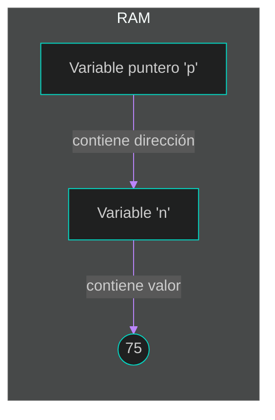
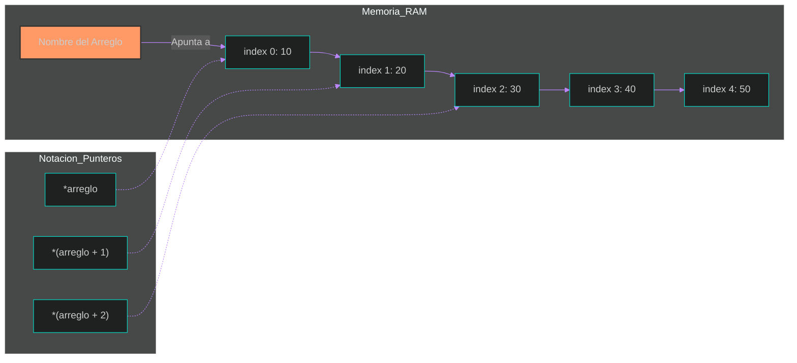
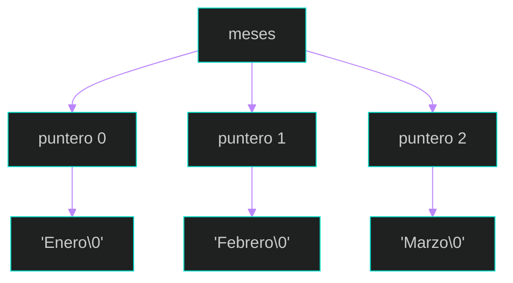
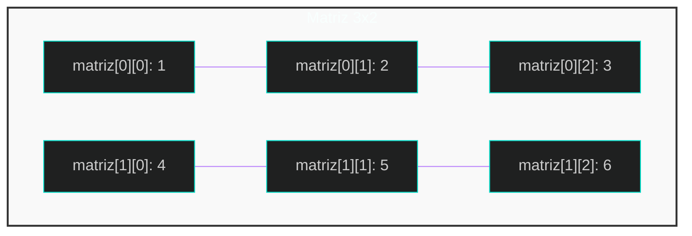
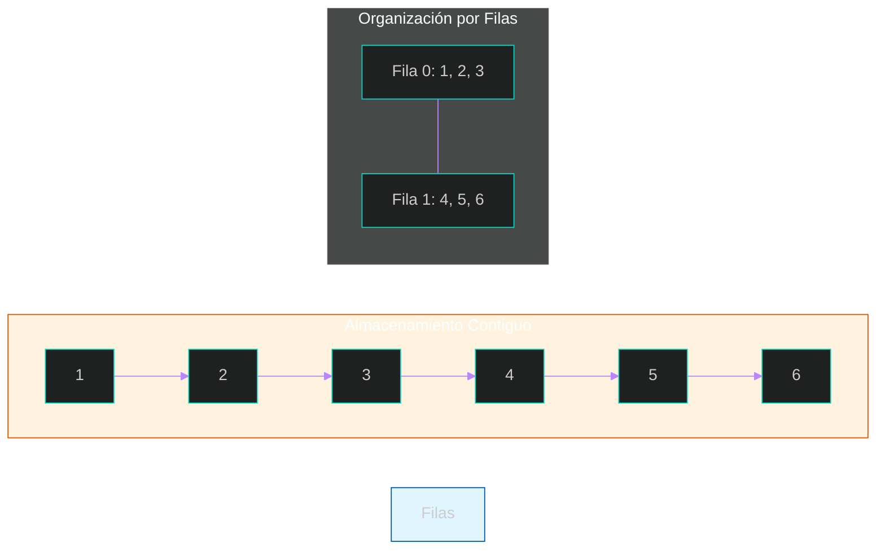
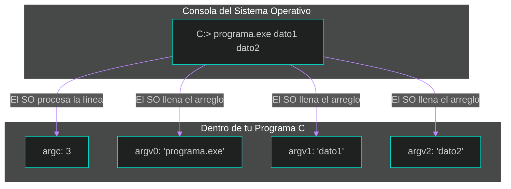

## 2. Arreglos y Punteros

En esta sección de la Unidad II, exploraremos el que posiblemente es el tema más potente y distintivo del lenguaje C: los punteros. Dominar el manejo de la memoria y su relación con los arreglos es lo que permite crear programas altamente eficientes y manipular datos de forma avanzada (Capítulo 11, Introducción).

### 1. Punteros y Direccionamiento de Memoria
Un puntero es una variable que, en lugar de contener un dato (como un número o un carácter), contiene la dirección de memoria donde se almacena dicho dato (Capítulo 11, Sección 11.2).
*   **Operador `&` (Dirección):** Devuelve la dirección de memoria de una variable.
*   **Operador `*` (Indirección):** Accede al valor almacenado en la dirección a la que apunta el puntero (Capítulo 11, Sección 11.2).

**Ejemplo en C:**
```c
int n = 75;
int *p = &n; // p guarda la dirección de n

printf("Valor de n: %d\n", n);    // Salida: 75
printf("Dirección de n: %p\n", (void*)&n); // Se usa (void*) para imprimir direcciones de forma estándar
printf("Valor apuntado por p: %d\n", *p); // Salida: 75
```

**Visualización de Memoria:**


### 2. Punteros como Argumentos de Funciones
En C, de forma predeterminada, los parámetros se pasan por valor (una copia). 
Para que una función modifique una variable original de la función llamadora, debemos pasar su dirección mediante un puntero (Capítulo 11, Sección 11.10).

**Ejemplo de Intercambio (Swap):**
```c
void intercambio(int *a, int *b) {
    int aux = *a;
    *a = *b;
    *b = aux;
}
```

### 3. Punteros y Arreglos

#### Arreglos

Un arreglo (también conocido por el término inglés **array**, o como lista o tabla) se define como una secuencia de datos del mismo tipo. Es una estructura de datos homogénea donde los elementos se almacenan en posiciones de memoria contiguas y se numeran consecutivamente (0, 1, 2, 3, etc.).

**Características fundamentales:**
*   **Elementos:** Son los datos individuales almacenados, que pueden ser de cualquier tipo (`char`, `int`, `float`, o incluso estructuras definidas por el usuario).
*   **Índice o subíndice:** Es el número que localiza la posición del elemento dentro del arreglo. En el lenguaje C, los índices siempre comienzan en 0 (límite inferior) y llegan hasta el tamaño del arreglo menos 1 (límite superior).
*   **Dimensiones:** Pueden ser unidimensionales (listas de un solo índice) o multidimensionales (tablas o matrices con dos o más índices).

**Ejemplos de uso y sintaxis:**

##### 1. Arreglos Unidimensionales (Vectores)
Se utilizan para almacenar colecciones simples como notas, edades o temperaturas.

**Declaración e Inicialización:**
```c
// Declaración de un arreglo de 7 enteros (Capítulo 8, Sección 8.1)
int edad[7]; 

// Inicialización en una sola sentencia (Capítulo 8, Sección 8.2)
int numeros[8] = {10, 20, 30, 40, 50, 60}; 
```

**Ejemplo de acceso y lectura:**
```c
#define NUM 8
int nums[NUM];

// Llenar el arreglo con datos del teclado (Capítulo 8, Ejemplo 8.2)
for (int i = 0; i < NUM; i++) {
    printf("Introduzca el número: ");
    scanf("%d", &nums[i]);
}
```

##### 2. Arreglos Multidimensionales (Matrices)
Son útiles para representar estructuras como tablas con filas y columnas.

**Declaración:**
```c
// Matriz de 10 filas y 11 columnas (Capítulo 8, Sección 8.3)
int matriz[10][11]; 

// Inicialización "amigable" por filas
int tabla[2][3] = { 
    {51, 52, 53}, 
    {54, 55, 56} 
};
```

##### 3. Cadenas de caracteres
En C, una cadena de texto es técnicamente un arreglo unidimensional de tipo `char` que termina siempre con el carácter nulo (`\0`).

```c
// Arreglo de caracteres que contiene "ABC" (Capítulo 8, Sección 8.5)
char mensaje[10] = "ABC"; 
// Internamente contiene: 'A', 'B', 'C', '\0'
```

**Relación con los Punteros:**
Es importante recordar que el nombre de un arreglo es un apuntador constante a la dirección de memoria de su primer elemento. Por esta razón, cuando pasas un arreglo a una función, este se pasa automáticamente por referencia (dirección), permitiendo que la función modifique los elementos originales.

#### Punteros y Arreglos

El nombre de un arreglo no es solo una etiqueta; técnicamente es un puntero constante que contiene la dirección de memoria del primer elemento del arreglo (índice 0) (Capítulo 11, Sección 11.5). Al ser constante, no puedes reasignarlo para que apunte a otra parte después de su declaración.

**Ejemplo en C: Acceso Dual (Índices y Punteros)**
Este código muestra cómo podemos acceder a la misma información usando la notación tradicional de corchetes o la aritmética de punteros:
```c
#include <stdio.h>

int main() {
    int arreglo[] = {10, 20, 30, 40, 50}; // Tamaño ajustado automáticamente a 5 elementos

    // 1. Acceso al primer elemento (índice 0)
    printf("Dirección del arreglo: %p\n", (void*)arreglo);
    printf("Valor del primer elemento (usando *arreglo): %d\n", *arreglo); // Equivalente a arreglo[0]

    // 2. Acceso al tercer elemento (índice 2)
    printf("Valor en arreglo[2]: %d\n", arreglo[2]);
    printf("Valor usando *(arreglo + 2): %d\n", *(arreglo + 2)); 

    return 0;
}
```

**Visualización de la equivalencia en memoria**
Cuando escribes `arreglo[i]`, el compilador lo traduce internamente a `*(arreglo + i)`. El valor de `i` actúa como un desplazamiento (offset) desde la dirección base (Capítulo 11, Sección 11.5).


**Conceptos Clave de la Relación:**
*   `arreglo` es equivalente a `*arreglo`: Al usar el nombre del arreglo solo, obtienes la dirección del primer elemento. Al ponerle el asterisco (indirección), obtienes el valor almacenado en esa dirección (Capítulo 11, Sección 11.5).
*   `arreglo[i]` es equivalente a `*(arreglo + i)`: El índice `i` le indica a la computadora cuántos "pasos" debe saltar desde el inicio. Si el arreglo es de enteros (`int`), cada paso saltará automáticamente el número de bytes que ocupe un `int` en ese sistema (Capítulo 11, Sección 11.8).
*   **Aritmética de direcciones:** Sumar 1 al nombre del arreglo (`arreglo + 1`) no suma un byte, sino que mueve el puntero a la dirección del siguiente elemento del tipo de dato declarado (Capítulo 11, Sección 11.8).

### 4. Aritmética de Direcciones (Apuntadores)
C permite realizar operaciones matemáticas sobre punteros para navegar por la memoria. Al sumar `n` a un puntero, este no se mueve `n` bytes, sino que se desplaza `n` posiciones del tipo de dato al que apunta (Capítulo 11, Sección 11.8).

**Ejemplo de Recorrido:**
```c
int v[] = {10, 20, 30, 40, 50}; // Tamaño ajustado automáticamente
int *p = v; // Apunta al inicio

for(int i = 0; i < 5; i++) {
    printf("%d ", *(p++)); // Imprime el valor y mueve el puntero al siguiente int
}
printf("\n");
```

### 5. Punteros a Caracteres y Cadenas
Las cadenas en C son arreglos de caracteres que terminan con un carácter nulo `\0`. Un puntero `char*` puede usarse para manejar estas cadenas de forma dinámica (Capítulo 11, Sección 11.7).

**Ejemplo:**
```c
#include <stdio.h> // Necesario para putchar

int main() {
    char *saludo = "Hola Mundo";
    while (*saludo) {
        putchar(*saludo++); // Recorre hasta encontrar el \0
    }
    printf("\n");
    return 0;
}
```

### 6. Arreglos de Punteros e Inicialización
Un arreglo puede contener punteros como elementos. Esto es extremadamente útil para manejar listas de cadenas de longitudes diferentes (Capítulo 11, Sección 11.6).

**Ejemplo e Inicialización:**
```c
char *meses[] = {"Enero", "Febrero", "Marzo"}; // Inicialización directa, tamaño ajustado
```

**Esquema de Arreglo de Punteros:**


### 7. Arreglos Multidimensionales
Conocidos como tablas o matrices, se declaran con múltiples índices. En memoria, se almacenan como bloques contiguos, fila tras fila (Capítulo 8, Sección 8.3).

**Ejemplo:**
```c
int matriz[2][3] = { {1, 2, 3}, {4, 5, 6} }; // Matriz de 2 filas y 3 columnas
// 'matriz' es un puntero al primer elemento (la primera fila)
```

Para visualizar cómo se organiza una matriz en el lenguaje C, es fundamental entender que, aunque lógicamente la vemos como una tabla (filas y columnas), la computadora la almacena de forma lineal y contigua en la memoria RAM, colocando una fila inmediatamente después de la otra (Capítulo 8, Sección 8.3).

**A. Vista Lógica (Cómo la pensamos)**
Representa la estructura de tabla con índices de fila y columna (Capítulo 8, Figura 8.5).


**B. Vista Física (Cómo se guarda en RAM)**
En memoria, los elementos se almacenan en bloques contiguos, "fila tras fila" (Capítulo 8, Tabla 8.1).


**Conceptos clave según el libro de texto:**
*   **Arreglo de arreglos:** En C, una matriz bidimensional se considera técnicamente como un arreglo unidimensional donde cada uno de sus elementos es, a su vez, otro arreglo (Capítulo 8, Sección 8.3).
*   **Acceso por subíndices:** Para localizar un elemento, se deben especificar siempre las coordenadas de fila y columna: `matriz[fila][columna]` (Capítulo 8, Sección 8.3).
*   **Inicialización:** Los valores se encierran entre llaves externas, y opcionalmente se usan llaves internas para separar visualmente cada fila (Capítulo 8, Sección 8.3).

### 8. Argumentos en Línea de Comando
La función `main` puede recibir datos externos al momento de ejecutar el programa a través de dos parámetros (Capítulo 12, Sección 12.7):
*   `argc` (Argument Count): Cantidad de argumentos recibidos.
*   `argv` (Argument Vector): Arreglo de punteros a las cadenas de texto que son los argumentos.

```c
#include <stdio.h>

int main(int argc, char *argv[]) {
    // argv[0] siempre contiene el nombre del ejecutable
    printf("Nombre del programa: %s\n", argv[0]); 
    
    if (argc > 1) {
        printf("El primer argumento extra es: %s\n", argv[1]); // Acceso al primer argumento adicional
    }
    
    return 0;
}
```

**¿Desde dónde se pasan los argumentos?**
Los argumentos se pasan desde la línea de comandos (la terminal, consola o CMD) de tu sistema operativo.
Cuando tú compilas un programa (por ejemplo, uno llamado `programa.exe`), para ejecutarlo normalmente escribirías su nombre. Pero, si quieres pasarle datos externos, escribes el nombre seguido de los datos que quieras, separados por espacios.

**Ejemplo de ejecución en la consola:**
```bash
C:\> programa.exe  archivo1.txt  25  "Hola Mundo"
```
En este caso, tú le estás enviando 3 datos adicionales al programa en el momento justo de abrirlo.

**¿Cómo los obtiene la función `main`?**
El sistema operativo toma esa línea de texto que escribiste, la "rompe" en pedazos usando los espacios como separadores y llena automáticamente las dos variables del `main`:
*   `argc` (Argument Count): Cuenta cuántos pedazos hay. Siempre cuenta el nombre del programa como el primero (en el ejemplo de arriba, `argc` sería 4).
*   `argv` (Argument Vector): Es un arreglo de cadenas de texto (strings) donde cada posición guarda uno de los pedazos.
    *   `argv[0]` → `"programa.exe"` (Nombre del programa)
    *   `argv[1]` → `"archivo1.txt"`
    *   `argv[2]` → `"25"`
    *   `argv[3]` → `"Hola Mundo"` (Se usaron comillas para que el espacio no lo separara)

**Representación visual del proceso:**
Aquí puedes ver cómo lo que escribes en la terminal se traduce al arreglo que usa tu código:


### 9. Punteros a Funciones
Al igual que los datos, las funciones tienen una dirección inicial en memoria. Podemos guardar esta dirección en un puntero para llamar a la función de forma indirecta o pasarla como argumento a otra función (Capítulo 11, Sección 11.11).

**Sintaxis:** `tipo_retorno (*nombre_puntero)(parametros);`
```c
int suma(int a, int b) { return a + b; }
int (*ptr_func)(int, int) = suma; // Asigna la dirección de la función
int res = ptr_func(5, 10);        // Llamada indirecta
```

### 10. Resumen Punteros 

<div style="margin: 25px 0; border: 2px solid #BB86FC; border-radius: 12px; overflow: hidden; box-shadow: 0 8px 24px rgba(0,0,0,0.3);">
    <iframe 
        src="{{ site.baseurl }}/compilerc.html?file=https://raw.githubusercontent.com/ConsSorto/ConsSorto.github.io/main/isc-102/unidad-2/code/resumenpunteros.c" 
        width="100%" 
        height="600px" 
        frameborder="0">
    </iframe>
</div>

### 11. Punteros Referencia

<div style="margin: 25px 0; border: 2px solid #BB86FC; border-radius: 12px; overflow: hidden; box-shadow: 0 8px 24px rgba(0,0,0,0.3);">
    <iframe 
        src="{{ site.baseurl }}/compilerc.html?file=https://raw.githubusercontent.com/ConsSorto/ConsSorto.github.io/main/isc-102/unidad-2/code/punterosreferencia.c" 
        width="100%" 
        height="600px" 
        frameborder="0">
    </iframe>
</div>

[⬅️ Volver al índice de la unidad](./index.md)