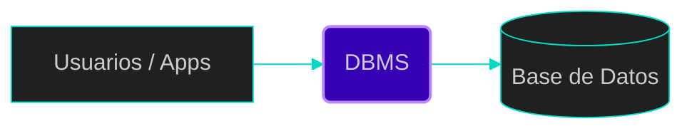
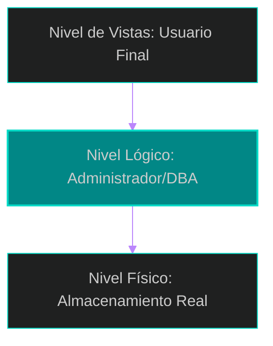
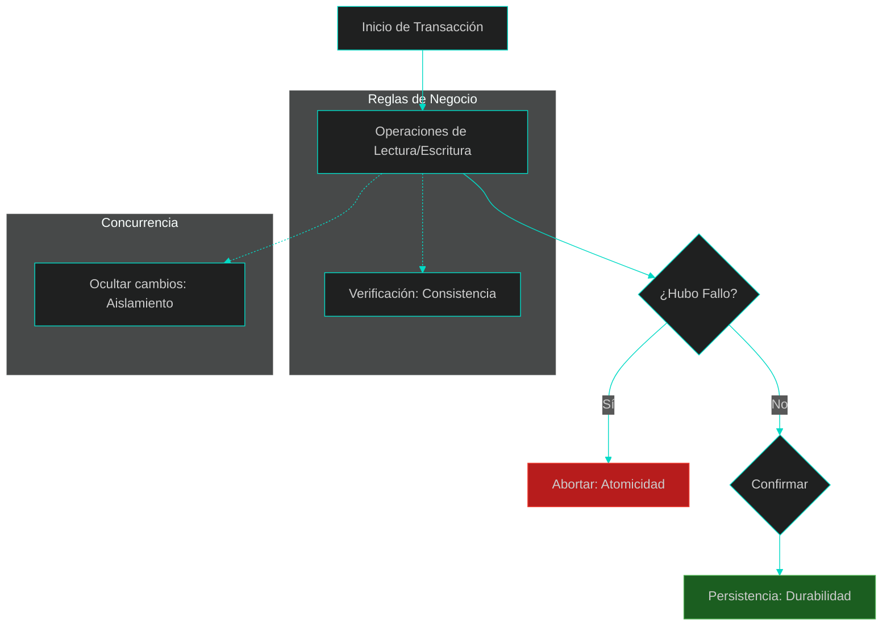

# 📘 Tema 1: Introducción y Conceptos Básicos

Este tema sienta las bases sobre qué es una base de datos y por qué los sistemas de gestión son piezas de software críticas para garantizar que la información sea un activo y no una carga para las organizaciones.

---

## 1. ¿Qué es una Base de Datos y un DBMS?
Una base de datos es una colección de datos interrelacionados que representan información relevante para una empresa o entidad. Por otro lado, un **DBMS (Database Management System)** es el conjunto de programas que permite a los usuarios acceder, mantener y utilizar esa colección de datos de manera conveniente y eficiente. 

> **Concepto clave:** Mientras que la base de datos es el "almacén" de bits, el DBMS es la inteligencia que gestiona ese almacén.



---

## 2. El Propósito: Superando al Sistema de Archivos
Los sistemas de bases de datos surgieron para solucionar los graves problemas de los antiguos sistemas de procesamiento de archivos, donde cada aplicación guardaba sus datos en archivos planos independientes. 

**Ventajas principales:**
*   **Reducción de redundancia e inconsistencia:** Evita que el mismo dato esté duplicado en varios archivos, previniendo que las copias dejen de coincidir.
*   **Facilidad de acceso:** Permite realizar consultas no anticipadas sin necesidad de escribir código nuevo desde cero.
*   **Integridad de los datos:** Facilita el cumplimiento de reglas de consistencia (ej: saldos no negativos) de forma centralizada.
*   **Control de concurrencia:** Evita anomalías cuando múltiples usuarios actualizan el mismo dato simultáneamente.

---

## 3. Modelos de Datos y Ecosistema Actual
Un modelo de datos es una colección de herramientas conceptuales para describir datos, sus relaciones y restricciones de consistencia. A lo largo de la historia, han evolucionado para adaptarse a diferentes necesidades:

### Tipos de Modelos
*   **Modelo Relacional:** Es el estándar actual. Utiliza tablas (relaciones) para representar datos y sus vínculos. Es valorado por su simplicidad y elegancia.
*   **Modelos No Relacionales (NoSQL):**
    *   **Documental (XML/JSON):** Permite que elementos del mismo tipo tengan diferentes atributos. Las etiquetas definen el significado.
    *   **Clave-Valor / Columnares:** Diseñados para escalabilidad masiva en la nube (ej: Bigtable, Dynamo, Cassandra), priorizando disponibilidad sobre consistencia rígida.
*   **Modelo de Objetos:** Integra conceptos de POO como encapsulamiento y herencia.
*   **Modelos Heredados:** El modelo **Jerárquico** y el de **Red**, predecesores del relacional, hoy considerados legados.

### Sistemas (DBMS) Líderes del Mercado
| Categoría | Ejemplos |
| :--- | :--- |
| **Comerciales** | Oracle, IBM DB2, Microsoft SQL Server, Sybase |
| **Open Source** | PostgreSQL, MySQL, MariaDB |

---

## 4. Niveles de Abstracción y Dependencia de Datos
Para que un sistema sea útil, debe ocultar la complejidad técnica a los usuarios. Esto se logra mediante tres niveles:

1.  **Nivel Físico:** Describe detalladamente cómo se almacenan los datos (estructuras de datos complejas en disco).
2.  **Nivel Lógico:** Qué datos se almacenan y sus relaciones (el esquema global).
3.  **Nivel de Vistas:** Partes específicas de la BD para usuarios finales, mejorando simplicidad y seguridad.



---

## 5. Las Propiedades ACID: Pilares de la Fiabilidad
Para que una **transacción** (unidad lógica de trabajo) sea fiable, el DBMS debe garantizar cuatro propiedades fundamentales:

*   **A - Atomicidad (Atomicity):** La regla del **"todo o nada"**. Si una transacción se interrumpe, cualquier cambio parcial se deshace (*rollback*). 
    *   *Ejemplo:* En una transferencia bancaria, si el sistema falla tras restar el dinero de A pero antes de sumarlo a B, la atomicidad asegura que el dinero regrese a A.
*   **C - Consistencia (Consistency):** La ejecución de una transacción debe llevar a la BD de un estado válido a otro, preservando las reglas de integridad (ej: que un saldo no sea negativo).
*   **I - Aislamiento (Isolation):** Las transacciones simultáneas no interfieren entre sí. Los cambios intermedios no son visibles para otros hasta que la transacción termine.
    *   *Ejemplo:* Si dos personas retiran de la misma cuenta a la vez, el sistema las aísla para que no retiren más del saldo disponible.
*   **D - Durabilidad (Durability):** Una vez confirmada (*commit*), los cambios son permanentes en disco, incluso si hay un fallo de energía inmediato.

### Ciclo de Vida de una Transacción



---

## 💡 Puntos clave para recordar
*   **DBMS != Base de Datos:** El primero es el software, el segundo es el conjunto de datos.
*   **Independencia de Datos:** Los niveles de abstracción nos permiten cambiar el hardware o almacenamiento sin romper las aplicaciones.
*   **Transacción:** Es la unidad mínima de trabajo. Si falla un paso, falla toda la unidad (Atomicidad).

---

## 📚 Bibliografía de la Lección
*   **Ramakrishnan, R., & Gehrke, J. (2003):** *Database Management Systems*. Cap. 1.
*   **Silberschatz, A., Korth, H., & Sudarshan, S. (2010):** *Database System Concepts*. Cap. 1 y 14.

---

[⬅️ Volver al índice de la unidad](./index.md)