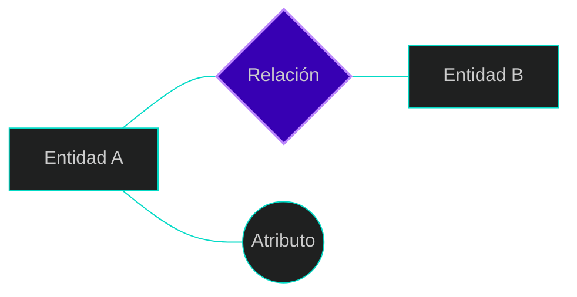
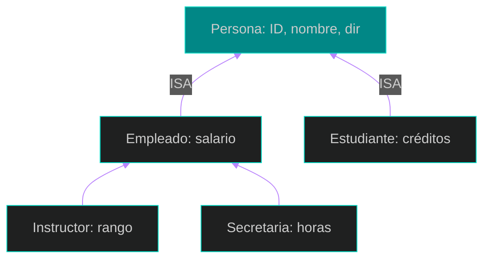

# 📘 Tema 2: Modelado Entidad-Relación (E-R) y Extendido (EER)

El modelado conceptual es el "plano arquitectónico" de la base de datos. Permite traducir los requisitos de un negocio en una estructura lógica que define qué datos se capturarán y cómo se relacionan entre sí.

---

## 1. Introducción: Los Pilares del Modelo E-R
El mundo real se percibe como una colección de objetos básicos y sus vínculos:
*   **Entidad:** Un objeto del mundo real que es distinguible de los demás (ej. un instructor específico o un estudiante).
*   **Atributo:** Una propiedad descriptiva que posee cada miembro de un conjunto de entidades (ej. el nombre o el salario de un instructor).
*   **Relación:** Una asociación entre varias entidades (ej. la relación que asocia a un instructor con un departamento).



---

## 2. Atributos: El detalle de las Entidades
Los atributos permiten caracterizar a las entidades y relaciones. Existen varios tipos dependiendo de su estructura y los valores que pueden tomar:
*   **Simples vs. Compuestos:** Los atributos simples son atómicos. Los compuestos se dividen en subpartes con significado independiente (ej. una Dirección que se desglosa en Calle, Ciudad y Estado).



*   **Monovalorados vs. Multivalorados:** Los monovalorados tienen un solo valor por entidad. Los multivalorados pueden tener un conjunto de valores para una misma instancia (ej. una entidad Coche con varios valores para el atributo Color).

*   **Almacenados vs. Derivados:** El valor de un atributo derivado no se guarda físicamente, sino que se calcula a partir de otros (ej. la Edad derivada de la Fecha_Nacimiento).

---

## 3. Llaves (Primary Keys): Garantizando la Unicidad
Las llaves son restricciones que permiten identificar de forma única a cada entidad dentro de su conjunto, evitando duplicidades.
*   **Superllave:** Conjunto de uno o más atributos que identifican unívocamente a una entidad.
*   **Llave Primaria (PK):** Es la llave candidata elegida por el diseñador para identificar a las entidades. Se representa subrayando el nombre del atributo.



---

## 4. Conjuntos de Relaciones y su Estructura
Las asociaciones entre entidades tienen propiedades que definen la lógica del negocio:
*   **Atributos descriptivos:** Las relaciones pueden tener atributos propios para registrar datos de la asociación (ej. la fecha en que un instructor empezó a asesorar a un alumno).

*   **Cardinalidad de mapeo:** Indica el número de entidades con las que otra puede asociarse (1:1, 1:N, N:M).


*   **Participación:** Es total si cada entidad debe participar en al menos una relación del conjunto (indicado con doble línea), o parcial en caso contrario.

---

## 5. Modelo Entidad-Relación Extendido (EER)
Añade semántica para aplicaciones complejas mediante jerarquías:
*   **Especialización/Generalización:** Procesos para definir subclases (subgrupos) a partir de una superclase basándose en características distintivas.
*   **Herencia de Atributos:** Una subclase hereda automáticamente todos los atributos y relaciones de su superclase.



---

## 6. Ejemplos Prácticos para Clase
**Ejemplo E-R: El Caso de la Librería**
Una tienda en línea necesita registrar Clientes (email, nombre) que realizan Órdenes de compra de Libros (ISBN, título, precio). La orden debe incluir la fecha y la cantidad.



---

## 📚 Bibliografía de la Lección
*   **Ramakrishnan, R., & Gehrke, J. (2003):** *Database Management Systems*. Capítulo 2.
*   **Silberschatz, A., Korth, H., & Sudarshan, S. (2010):** *Database System Concepts*. Capítulos 1, 7 y 8.

---

[⬅️ Volver al índice de la unidad](./index.md)