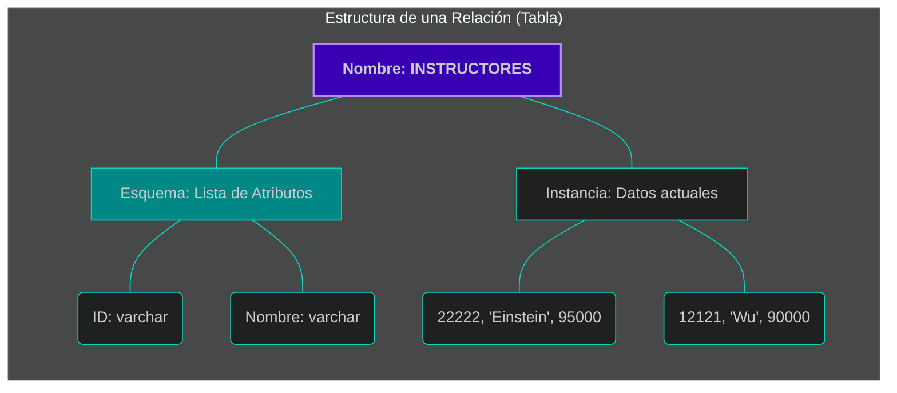

# 📘 Tema 3: El Modelo Relacional

El modelo relacional, propuesto por **E.F. Codd en 1970**, revolucionó la informática al separar la forma en que los datos se representan lógicamente de cómo se almacenan físicamente en el disco. Es el modelo más utilizado hoy en día por su simplicidad y rigor matemático.

---

## 1. Estructura: Tablas, Tuplas y Dominios
En este modelo, una base de datos se percibe como una colección de **relaciones**, que visualmente representamos como tablas.

*   **Atributos (Campos):** Son las columnas de la tabla. Cada una tiene un nombre único y representa una característica de los datos.
*   **Tuplas (Registros):** Son las filas de la tabla. Cada tupla representa un hecho u objeto específico.
*   **Dominios:** Es el conjunto de valores permitidos para cada atributo. Estos deben ser **atómicos**, es decir, valores simples e indivisibles.
*   **Esquema vs. Instancia:** El esquema es el diseño lógico (la definición de las columnas), mientras que la instancia es el contenido real de la tabla en un momento exacto.



---

## 2. Propiedades de las Relaciones
Para que una tabla sea una "relación" válida en términos formales, debe cumplir:
*   **Unicidad:** No existen dos tuplas idénticas en la misma tabla.
*   **Orden Irrelevante:** El significado de los datos no cambia si se mueven de lugar las filas o las columnas.
*   **Grado (Aridad):** Se refiere al número total de atributos (columnas).

---

## 3. Integridad: Llaves y Restricciones
Las restricciones de integridad (ICs) son reglas que el DBMS obliga a cumplir para que los datos sean confiables.

*   **Llave Primaria (Primary Key - PK):** Atributo elegido para identificar de forma única cada fila. No puede contener valores nulos (**NOT NULL**).
*   **Restricción Unique:** Identifica *candidate keys* alternativas. A diferencia de la PK, estas pueden permitir valores nulos.
*   **Llave Foránea (Foreign Key - FK):** Es un atributo que referencia a una Primary Key o Valor Unique en otra tabla, creando un vínculo entre ellas.
*   **Integridad Referencial:** Garantiza que el vínculo sea válido; si una tabla referencia a otra, la fila referenciada debe existir.

    <iframe 
        src="{{ site.baseurl }}/sql-viewer.html?file=https://raw.githubusercontent.com/ConsSorto/ConsSorto.github.io/main/isc-321/unidad-1/code/1.sql" 
        width="100%" 
        height="600px" 
        frameborder="0">
    </iframe>



---

## 4. Representación de Cardinalidades (Lógica Dueño-Pertenencia)
En el diseño relacional, las asociaciones entre tablas se resuelven propagando llaves según el tipo de relación para establecer quién es el Dueño (D) de la información y quién es la Pertenencia (P).

1. **A. Relación 1-1 (Propagación con Unicidad)**
Cada fila en la Tabla A se asocia con máximo una en la Tabla B (ej. un empleado asignado a una sola oficina exclusiva).
- El Dueño propaga su PK a la tabla de Pertenencia. Para garantizar que la pertenencia sea única, la FK propagada debe tener una restricción UNIQUE.
    - Ejemplo: 1 Persona (D) solo puede tener 1 Cuenta de Estudiante (P).
2. **B. Relación 1-M (Propagación Simple)**
Una fila en A se asocia con muchas en B, pero B solo con una en A (ej. un departamento tiene muchos instructores)
- El Dueño propaga su PK a la tabla de Pertenencia. En este caso, la FK no es única, permitiendo que un dueño tenga múltiples registros asociados.
    - Ejemplo: 1 Estudiante (D) puede tener muchos Correos y Celulares (P).

3. **C. Relación M-M (Tabla Intermedia)**
Filas en ambas tablas pueden tener múltiples asociaciones. En el modelo relacional, esto requiere una tabla intermedia para implementarse correctamente
- Se requiere una tabla intermedia que actúe como pertenencia de ambos dueños. Esta tabla tiene su propia PK y recibe las llaves de ambas tablas relacionadas como FKs.
    - Ejemplo: 1 Estudiante (D) pertenece a muchas Carreras (D), y una Carrera tiene muchos Estudiantes.

---

## 5. Ejemplo Práctico Completo: Sistema de Gestión Universitaria

Enunciado del Problema: La Universidad requiere un sistema para gestionar su comunidad. Se debe registrar a cada Persona con su nombre y DNI. Cada persona puede poseer, a lo sumo, una Cuenta de Estudiante (identificada por un número de cuenta). Para efectos de comunicación, un Estudiante puede registrar múltiples Medios de Contacto (correos electrónicos y celulares). Finalmente, el sistema debe permitir que un estudiante se inscriba en una o más Carreras, considerando que cada carrera alberga a múltiples estudiantes.
Solución Relacional (Esquema de Tablas):

Referencia Visual: Figura 2.8: Schema Diagram for the university organization (inspiración para la interconectividad), pág. 47, libro: Database System Concepts (Silberschatz).
---

## 💡 Puntos clave para recordar
*   **Atocimidad:** Los valores en las celdas no pueden ser listas o grupos de datos.
*   **Integridad Referencial:** Es el "pegamento" que evita que existan registros huérfanos (ej. un instructor en un departamento que no existe).

---

## 📚 Bibliografía de la Lección
*   **Ramakrishnan, R., & Gehrke, J. (2003):** *Database Management Systems*. Capítulos 2 y 3.
*   **Silberschatz, A., Korth, H., & Sudarshan, S. (2010):** *Database System Concepts*. Capítulos 1 y 2.

---

[⬅️ Volver al índice de la unidad](./index.md)

--------------------------------------------------------------------------------
Bibliografía para esta sección:
Ramakrishnan, R., & Gehrke, J. (2003). Database Management Systems. Capítulos 1 (Sección: 1.5.1), 2 (Sección: 2.2, 2.3, 2.4.1) y 3 (Secciones: 3.1, 3.2).
Silberschatz, A., Korth, H., & Sudarshan, S. (2010). Database System Concepts. Capítulos 1 (Secciones: 1.3, 1.5, 1.6), 2 (Secciones: 2.1, 2.2, 2.3, 2.4, 2.7) y 7 (Secciones: 7.2, 7.3, 7.5, 7.6).